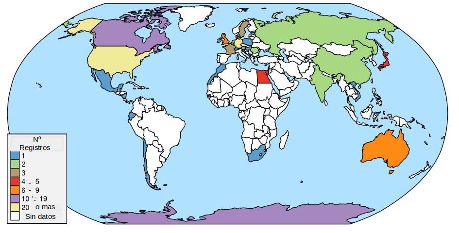

---
output:
  html_document:
    df_print: paged
  pdf_document:
    latex_engine: xelatex
    keep_tex: true
bibliography: trophic.bib

documentclass: article
geometry:
- vmargin=1in
- hmargin=1in
header-includes:
- \usepackage{pdflscape,booktabs}
- \newcommand{\blandscape}{\begin{landscape}}
- \newcommand{\elandscape}{\end{landscape}}
- \usepackage[running]{lineno}
- \linenumbers
---

# Recursos tróficos de los microartrópodos edáficos: un revisión global de la evidencia empírica

## Introduction

En las últimas décadas, el uso sostenible del suelo se ha convertido en el centro de atención. El informe sobre Biodiversidad Global y Servicios Ecosistémicos [@IPBES2019], y el reciente Estado del Conocimiento de la Biodiversidad del Suelo [@FAO2020] indican claramente la importancia del ecosistema del suelo y el papel central que la biodiversidad del suelo desempeña en los servicios ecosistémicos. Sin embargo, falta información crítica sobre la biodiversidad edáfica y las redes de interacción de la mayoría de los suelos.

La visión sobre la biota edáfica ha cambiado en los últimos años. La mayoría de los trabajos sobre descripciones taxonómicas, riqueza, estimación de la biodiversidad y microambientes [@Anderson1978; @Petersen1982], destacan la fragilidad y necesidad de conservación de los suelos y de la biodiversidad edáfica [@FAO2020; @Walker1992]. El enfoque se ha desplazado gradualmente hacia el estudio del funcionamiento del ecosistema edáfico, en el que las interacciones entre la biota y el medio edáfico afectan jerárquicamente a su estructura y funcionamiento [@Barrios2007; @Behan-Pelletier1999; @Brussaard1997; @Lavelle2006]. Las relaciones de la riqueza de especies con la dinámica de los ecosistemas permiten establecer relaciones causales entre las características de los organismos presentes y los procesos y servicios del ecosistema [@Hooper2005; @Martin-Lopez2007] tanto en ambientes naturales como controlados [@Wall2012].

Los microartrópodos del suelo están formados principalmente por microartrópodos pertenecientes a las subclases Acari y Collembola (siguiendo a @Krantz2009 y @Hopkin1997) que habitan en los horizontes superiores del suelo [@Martinez2009], donde se desarrollan y mantienen comunidades complejas. Estas comunidades están influenciadas por una elevada heterogeneidad de microhábitats y el número de recursos alimenticios disponibles [@Anderson1977; @Anderson1978; @Lavelle2001], que proporcionan un amplio y variado conjunto de nichos ecológicos [@Nielsen2010; @Wallwork1958]. Los microartrópodos, a través de sus relaciones tróficas, contribuyen al funcionamiento edáfico mediante la fragmentación de la materia orgánica, la dinámica del ciclo de nutrientes, el transporte de propágulos de microflora y la regulación de las poblaciones de microflora y microfauna que afectan a la producción primaria [@Brussaard1997; @Cragg2001; @Lavelle1996; @Wall2012; @FAO2020].

```{=html}
<!-- ESTE PARRAFO SOBRE LA IMPORTANCIA DE LAS REDES ES UN POCO REDUNDANTE quizas moverlo hacia abajo

 Los estudios sobre el flujo de energía y materia en el ecosistema edáfico, agrupan a los organismos edáficos en gremios funcionales para comprender las relaciones entre la estructura de la biota del suelo y el funcionamiento del ecosistema. Sin embargo, este enfoque deja de lado la comprensión de cómo los cambios en la comunidad influyen en el funcionamiento del ecosistema (Thompson et al., 2012; Wall y Moore, 1999). Thompson et. al. (2012) sugieren abordar este problema desde el punto de vista de las redes tróficas, que podrían vincular el flujo de materia y energía y la diversidad de una comunidad. Así, estudiando la estructura de las redes tróficas, podemos comprender mejor el papel de la biodiversidad en el funcionamiento del ecosistema.

-->
```
Determinar los recursos alimentarios utilizados por los grupos de microartrópodos es difícil debido a su tamaño y a su entorno críptico. El reconocimiento de su dieta debe basarse en pruebas empíricas, lo que constituye el primer paso para establecer las interacciones entre las especies tróficas y los recursos que describen las redes tróficas. [@Briand1984; @vanStraalen1998; @Walter1991].

La información sobre las relaciones tróficas de los diferentes grupos taxonómicos de microartrópodos es todavía bastante escasa. Estos datos son necesarios para construir y analizar redes tróficas que, a su vez, puedan ser utilizadas para evaluar la estabilidad y el estado de conservación de estos ecosistemas [@Barrios2007; @Briones2014; @Thakur2020].

Esta revisión recoge la información actualmente disponible sobre el uso de los recursos tróficos por parte de los microartrópodos edáficos. Esta información, junto con otros rasgos característicos de los microartrópodos edáficos, permitirá construir una red de interacciones tróficas que podría resultar en una mejor comprensión de la estructura y funcionamiento de la biota edáfica [@FAO2020]. Las redes tróficas permitirán, a su vez, comparar el estado de diferentes suelos, o de los mismos suelos bajo diferentes intensidades de impacto antrópico [@Thompson2012].

La caracterización empírica de las interacciones tróficas es un reto debido a la complejidad espacial y temporal de los patrones de alimentación, y a las limitaciones de los métodos para identificar y cuantificar los componentes de la dieta [@Nielsen2018; @Pankhurst1997; @Walter1991].

Así, los objetivos de esta revisión son: 1) recopilar toda la información actualmente disponible sobre los recursos tróficos utilizados por los microartrópodos del suelo, 2) describir las relaciones tróficas conocidas y las dietas potenciales de estos microartrópodos del suelo a diferentes niveles taxonómicos (de familia a especie), y 3) establecer el estado actual de los sesgos de conocimiento en la información disponible.

## Materiales y métodos

### Pruebas empíricas

Las pruebas empíricas aportadas mediante estudios realizados en condiciones de laboratorio (A) pueden basarse en **observaciones** del comportamiento alimentario de los animales estudiados, en el estudio de las **preferencias alimentarias** o en **pruebas** para estudiar otras interacciones o fenómenos biológicos relacionados con la dieta. En general, las pruebas se realizan en microcosmos [@Saur1988; @Hubert2001; @Schneider2005; @Schneider2009]. La observación del **contenido intestinal** (B) se basa en considerar que lo que se encuentra en el tracto es evidencia de lo que realmente se consume [@Hartenstein1962; @Schneider2004; @Wallwork1958a]. Este método requiere la preparación de especímenes para su observación mediante técnicas de microscopía. La morfología y el funcionamiento de las **piezas bucales** (C) están relacionados con la manipulación, adquisición y procesamiento que los microartrópodos realizan del alimento y podrían utilizarse para determinar gremios tróficos [@Buryn1992; @Kaneko1988; @Macnamara1924]. Estas pruebas también requieren técnicas de microscopía para obtener información.

Las herramientas **moleculares** (D), como el código de barras, podrían utilizarse para determinar la presencia de una especie o un grupo taxonómico dentro del tracto intestinal y permite establecer relaciones tróficas u otros tipos de interacciones [@Heidemann2014; @King2008; @Read2006]. El estudio de las **enzimas digestivas** (E) en invertebrados puede explicar las porciones de alimento digeridas [@Siepel1993; @Berg2004], y aquellas enzimas que hidrolizan polisacáridos estructurales están relacionadas con la dieta [@Nielsen1962]. Permiten la diferenciación de gremios tróficos [@Berg2004; @Siepel1993].

El uso de la variación natural de los **isótopos estables** (F) como evidencia empírica del uso de los recursos tróficos se basa en el estudio de las firmas isotópicas; la firma isotópica de $\delta\text{15N}$ informa sobre el nivel trófico del invertebrado y la de $\delta\text{13C}$ indicará la proporción de recursos tróficos consumidos, pero los recursos tróficos potenciales necesitan ser elegidos previamente al análisis isotópico [@Tiunov2007; @Maraun2011; @Potapov2019]. Además, esta herramienta tiene el potencial de inferir las rutas metabólicas de las biomoléculas [@Pollierer2019; @Chamberlain2006].

Por último, el estudio del **perfil lipídico** (G) se basa en utilizar los ácidos grasos del tejido de los recursos como marcadores biológicos a través de la identificación de ácidos grasos en el animal. Esto se debe a que el animal o bien no puede sintetizarlos (marcadores absolutos) o bien su síntesis supone un alto coste metabólico (marcadores relativos) [@Kuhn2019; @Ruess2010; @Sechi2014; @Chamberlain2005; @Pollierer2010].

### Búsqueda bibliográfica

Se realizó una búsqueda sistemática de evidencias empíricas relacionadas con el uso de al menos un recurso trófico por parte de los microartrópodos del suelo. Nos basamos en publicaciones con palabras clave relacionadas con los grupos taxonómicos de interés, las relaciones tróficas y los métodos que proporcionan evidencia del consumo. A partir de estas palabras clave, formulamos cadenas de búsqueda y las aplicamos a bibliografías científicas en los motores de búsqueda de las bases de datos Scopus y Google Scholar.

Utilizamos la siguiente cadena de búsqueda en Scopus:

"ALL((microarthropods OR springtails OR mites OR oribatida OR mesostigmata OR prostigmata OR astigmata) AND (trophic OR diet OR feeding) AND soil AND ("gut content" OR "stable isotope" OR "food preference" OR "fatty acid" OR lipids OR metabarcoding) AND (family OR genus OR species)) AND (LIMIT-TO (SUBJAREA, "AGRI") OR LIMIT-TO (SUBJAREA, "ENVI") OR LIMIT-TO (SUBJAREA, "MULT") OR LIMIT-TO (SUBJAREA, "EART")) AND (LIMIT-TO (EXACTKEYWORD, "Collembola") OR LIMIT-TO (EXACTKEYWORD, "Acari") OR LIMIT-TO (EXACTKEYWORD, "Soil Fauna")) AND (LIMIT-TO (LANGUAGE, "English") OR LIMIT-TO (LANGUAGE, "Spanish"))", que devolvió 838 títulos (Septiembre 3, 2021).

Para la búsqueda en Google Scholar se utilizó:

"(microarthropods OR springtails OR mites) AND ("oribatida" OR "mesostigmata" OR "prostigmata" OR "astigmata") AND (trophic OR diet OR feeding) AND soil AND ("gut content" OR "stable isotope" OR "food preference" OR "fatty acid" OR metabarcoding)". Esta búsqueda arrojó 2170 títulos (Septiembre 3, 2021).

También se incluyeron publicaciones de revisión general y libros de texto para proporcionar información sobre el uso de los recursos tróficos a partir de fuentes que pueden no estar fácilmente disponibles, lo que dio como resultado 97 títulos más.

El primer criterio de elegibilidad para reducir el número de registros fue seleccionar aquellos trabajos cuyos títulos o resúmenes relacionaran los microartrópodos del suelo con los recursos tróficos (425 títulos). De ellos, seleccionamos los trabajos que mencionaban efectivamente familias, géneros o especies de ácaros y colémbolos del suelo y los relacionaban con al menos un recurso trófico. El resultado fueron 200 publicaciones, que pueden consultarse en el Material Suplementario Electrónico I (ESM I). Todos los microartrópodos registrados en las 200 publicaciones citadas pueden consultarse en el Material Suplementario Electrónico II, que contiene referencias cruzadas con el Material Suplementario Electrónico I. En el Material Suplementario Electrónico III también figura un diagrama de flujo del procedimiento de búsqueda y selección de bibliografía.

### Construcción de la base de datos

La evidencia empírica proporciona información sobre las relaciones tróficas de estos animales de diferentes maneras: algunas publicaciones relacionan los taxones con los elementos alimenticios y otras los agrupan en gremios o categorías tróficas. Para hacer frente a esta heterogeneidad, fue necesario definir los recursos tróficos (Tabla 1) que resumen sus características tróficas y ecológicas en el ecosistema edáfico [@Berg2008; @Clark1971; @Warcup1971; @Ponge1991; @Persson1980; @Krantz2009; @Chernova2007; @Rusek1998; @Schneider2005].

Asociamos los taxones y esos recursos de modo que: a) si la publicación indicaba un ítem alimenticio, se asignó a un recurso trófico en el que está definido, b) o si los taxones están agrupados en algún gremio o categoría trófica, entonces a cada taxón se le asignaron los recursos típicos consumidos por esa categoría.

A partir de esta estrategia de asignación, desarrollamos una base de datos que se presenta en el material suplementario II. La información taxonómica y los recursos tróficos se obtuvieron de las diferentes secciones de las publicaciones y sus apéndices [@Thakur2020]. De forma complementaria, cada taxón encontrado tiene todos los niveles de clasificación según @Krantz2009 y @Hopkin1997, para ácaros y colémbolos respectivamente. La base de datos también está disponible en el repositorio de GitHub <https://github.com/EcoComplex/TrophicResources> y Zenodo <https://doi.org/10.5281/zenodo.6508661>.

| **Recurso trófico**          |                                               **Descrición**                                               | **Total de consumidores registrados (%)** | Familia | Genero  | Especie |
|:-----------------------------|:----------------------------------------------------------------------------------------------------------:|:-----------------------------------------:|:-------:|:-------:|:-------:|
| **Hongos saprófitos**        |                   Son hongos ubicuos en el suelo que descomponen la materia orgánica.^c^                   |              **599 (19.8)**               | **16**  | **105** | **478** |
| **Microfauna**               |     Nemátodos de vida libre del suelo, protozoos, tardígrados, rotíferos y otra microfauna edáfica.^e^     |              **468 (15.5)**               | **34**  | **140** | **294** |
| **Bacteria**                 |                  Incluyen bacterias con enormes capacidades heterótrofas y autótrofas.^b^                  |              **325 (10.7)**               |  **7**  | **63**  | **255** |
| **Hojarasca**                |  Tejido vegetal muerto acumulado en el suelo con diferentes grados de fragmentación y descomposición.^a^   |              **311 (10.3)**               |  **4**  | **30**  | **277** |
| **Colémbolos**               |                                      Colémbolos juveniles y adultos.                                       |               **246 (8.1)**               | **50**  | **58**  | **138** |
| **Tejidos vegetales**        |             Incluye plantas no vasculares (musgos, líquenes, etc.), raíces vivas y plántulas.              |               **200 (6.6)**               |  **2**  | **25**  | **173** |
| **Ácaros**                   |                                       Ácaros juveniles y adultos.^f^                                       |               **193 (6.4)**               | **40**  | **37**  | **116** |
| **Hongos micorrícicos**      |                           Hifas fúngicas simbióticas con raíces de plantas. ^i^                            |               **156 (5.2)**               |  **6**  | **19**  | **131** |
| **Humus**                    | Materia orgánica compleja y amorfa con un alto grado de descomposición: detritos, pellets fecales, etc.^d^ |                **121 (4)**                |  **2**  |  **8**  | **111** |
| **Carroña de invertebrados** |                       Tejidos animales, mudas, cadáveres de invertebrados, etc..^h^                        |               **119 (3.9)**               | **10**  | **13**  | **96**  |
| **Huevos de invertebrados**  |                           Huevos de invertebrados consumidos por predadores.^g^                            |               **103 (3.4)**               | **13**  | **24**  | **66**  |
| **Enquitreidos**             |                    Anélidos oligoquetos de cuerpo blando anatómicamente homogéneos.^c^                     |               **97 (3.2)**                | **11**  | **30**  | **56**  |
| **Larvas**                   |                                 Larvas de invertebrados de cuerpo blando.                                  |               **86 (2.9)**                | **15**  | **20**  | **51**  |

: Descripción básica de los recursos tróficos. Registros totales de consumidores por recurso trófico con valores absolutos y porcentajes; y número de registros por resolución taxonómica. ^a^Berg & McClaugherty 2008 ^b^Clark 1971 ^c^Warcup 1971 ^d^Ponge 1991 ^e^Persson et al. 1980 ^f^Krantz & Walter 2009 ^g^Chernova et al. 2007 ^h^Rusek 1998 ^i^Schneider et al. 2005

### Análisis de datos

A continuación, se analizaron los registros contabilizando las asociaciones entre los taxones, los métodos utilizados y los recursos tróficos identificados. Se identificaron los recursos tróficos, el número de registros y su relación con los diferentes niveles taxonómicos. A continuación, se realizó el desglose de cada taxón dentro de las categorías taxonómicas y su relación con los recursos tróficos. Se calcularon las proporciones de los distintos métodos y su relación con el nivel taxonómico y los recursos tróficos.

Por último, estimamos la importancia potencial de los recursos en la dieta para los principales órdenes de ácaros (Acari) y colémbolos (Collembola) utilizando la proporción de menciones entre recursos tróficos y taxones incluidos en dichos órdenes. Por ejemplo, si una especie tiene diez registros sobre el consumo del mismo recurso trófico, es probable que la selección de este alimento sea un reflejo del uso del recurso. Entonces, si reuniéramos la información disponible de distintas especies del mismo género y los alimentos consumidos por ellas, podríamos asignarla a la dieta potencial del género. Del mismo modo, el uso de los recursos de los géneros de una familia puede considerarse un reflejo de la dieta potencial de la familia.

Es decir, la dieta de las jerarquías taxonómicas superiores estará constituida por la suma de los recursos utilizados por los niveles taxonómicos inferiores.

Los cálculos, gráficos y tablas se prepararon utilizando Microsoft Excel y el software estadístico R versión 4.1.2 [@RCoreTeam2021]. El código fuente está disponible en GitHub <https://github.com/EcoComplex/TrophicResources> y Zenodo <https://doi.org/10.5281/zenodo.6508661>.

## Resultados

De los 3208 documentos de investigación recuperados inicialmente, 200 cumplían nuestros criterios (véase ESM III). Un total de 133 artículos de las 200 publicaciones seleccionadas (ESM I) mencionan los países en los que se realizaron los estudios. De ellos, 1 artículo pertenece a la región etíope, 3 a la región neotropical, 3 a la región oriental, 7 a la región australiana, 34 a la región neártica, 75 se sitúan en la región paleártica y los 10 restantes son de la región antártica. (Figura 1). Esto es importante destacarlo porque las especies varían mucho en función de la región biogeográfica. Hay 106 publicaciones que mencionan los ambientes en los que se realizaron los estudios; de ellos 59 eran bosques templados, 3 bosques tropicales, 21 praderas, 23 agroecosistemas y 11 desiertos.

{width="5.0in" height="2.5194444444444444in"}

Obtuvimos un total de 3024 registros sobre relaciones tróficas (ESM II), aportando Acari 2218 registros (73,34%), y dentro de este número, la mayoría (50,86%) corresponde a Sarcoptiformes. Según la resolución taxonómica, se obtuvieron datos de 170 especies, 30 géneros y 2 familias de Collembola y 412 especies, 131 géneros y 49 familias de Acari.

### Métodos utilizados para la identificación de recursos tróficos

#### Métodos de asignación de recursos

El método de observaciones en pruebas de laboratorio proporciona la principal prueba empírica, con 706 registros (Figura 2).

![Métodos utilizados en la literatura para asignar recursos tróficos a los taxones de microartrópodos del suelo. Los colores dentro de las columnas se refieren al número de niveles taxonómicos diferentes para los que cada método asignó al menos un recurso. Assay: ensayos y observaciones de laboratorio. Isotopes: isotopos estables. Gut: contenido intestinal. Enzymes: enzimas digestivas. Mouth: morfología de las partes bucales. Lipid: perfíl lipídico. Mo. det: detección molecular del contenido intestinal, f.p.: ensayos de preferencias alimenticias. Obs.: observaciones directas del comportamiento alimenticio. Reviews: revisiones realizadas por otros autores.](Figures/Metodo_ByTaxLevel.png){width="4.920138888888889in" height="4.920138888888889in"}

Los microartrópodos a nivel de familia constituyen el 9,3 por ciento de las observaciones en pruebas de laboratorio, correspondiendo el 63,6 por ciento del total al suborden Prostigmata, dentro del cual se mencionan 10 familias diferentes. Las pruebas ofrecidas por las observaciones en pruebas de laboratorio suman un 90,7 por ciento en el caso de las especies y los géneros. Los órdenes Mesostigmata (62,5%), Sarcoptiformes (23,8%), Trombidiformes (9%) y Arthropleona (4%) son los de mayor presencia en la bibliografía.

El método de contenido intestinal alcanza el 21,3% de los registros, en el que el nivel taxonómico de especie corresponde al 89,9% del total de registros y el de género al 9,5%.

Le siguen en importancia los isótopos estables. De ellos, el 76,9% de los registros mencionan especies. Los géneros y familias suman el 23,1% de los registros.

La actividad de las enzimas digestivas (178 registros) informa en todos los casos hasta el nivel de especie. Para esta evidencia empírica, los autores trabajaron con el orden Sarcoptiforme (Acari) con 38 especies diferentes y Arthropleona y Symphypleona (Collembola) con 17 especies diferentes.

Otros tres métodos acumulan el 9,75 por ciento de los registros, siendo éstos las pruebas de preferencia alimentaria (131 registros), el estudio de ácidos grasos (99 registros) y el uso de estructuras bucales (64 registros).

El análisis del contenido intestinal con técnicas moleculares para la detección de ADN es una herramienta de reciente desarrollo y representa el 2 por ciento del total de registros.

#### Recursos tróficos identificados por la evidencia empírica

El principal recurso mencionado corresponde a hongos saprofitos (19,8%) seguido de microfauna (15,5%), bacterias (10,7%), y hojarasca (10,3%), los registros de ácaros, colémbolos, enquitreidos, larvas y huevos acumulan 725 menciones (24%) (Tabla 1). Cabe destacar que un mayor número de registros se han llevado al nivel de especie. Por ejemplo, 592 registros tróficos están asociados al consumo de hongos saprofitos, de los cuales 16 se asociaron al nivel taxonómico de familia, 105 al de género y 474 al de especie.

![El número de registros en la literatura que asignan cada uno de los 13 recursos tróficos a un taxón de microartrópodos, como se muestra en la Tabla 1. Los colores en las columnas se refieren al método utilizado para asignar esos recursos tróficos a un taxón en particular, como se muestra en la Fig. 2. Las abreviaturas de los recursos son: hongos saprófitos (sap. fun.), microfauna (m. fau), bacterias (bac), hojarasca, colémbolos (coll), tejido vegetal (plant), ácaros, hongos micorrícicos (myco), humus, carroña de invertebrados (carrion), huevos de invertebrados (eggs), enquitreidos (enchy) y larvas.](Figures/Recursos_ByMetodo.png){width="5.116666666666666in" height="5.116666666666666in"}

Las observaciones de laboratorio (el método más utilizado), mencionan la utilización de los trece recursos tróficos (Figura 3) en los que el orden de importancia según el número de menciones es microfauna \> colémbolos \> ácaros \> hongos saprofitos \> huevos de invertebrados \> enquitreidos \> larvas de invertebrados que acumulan el 82,3%. Para este método empírico, los principales recursos corresponden a recursos típicos de animales depredadores excepto para los hongos saprofitos, el principal taxón mencionado es Mesostigmata. Las barras apiladas (Figura 3) muestran las diferentes proporciones en que los métodos aportan pruebas del uso de un recurso, si se considera la contribución de cada método según el número de citas en la bibliografía, se cuentan en orden decreciente: observaciones directas (706 registros) \> contenido intestinal (639) \> isótopos (591) \> pruebas de laboratorio (503) \> enzimas (178) \> pruebas de preferencia alimentaria (140 registros).

Las metodologías utilizadas en los estudios de laboratorio, es decir, las pruebas de laboratorio, las observaciones de laboratorio y las pruebas de preferencia alimentaria, aportan pruebas directas de la utilización de los recursos tróficos, constituyendo en conjunto el 44,5% de las pruebas empíricas analizadas. (ESM II) Estos métodos de laboratorio son los que mencionan con mayor frecuencia el uso de recursos animales, colémbolos - ácaros - larvas de invertebrados - huevos de invertebrados - enquitreidos, como recursos alimentarios. Estos métodos mencionan raramente el consumo de hongos micorrícicos y raramente el uso de humus.

\newpage

```{=tex}
\scriptsize
\begin{longtable}[]{@{}lccccccccccccccccccccc@{}}
\caption{Número de familias, géneros y especies asociados a los recursos tróficos. Las letras representan los principales órdenes de Acari y Collembola: M, Mesostigmata; S, Sarcoptiformes; T, Trombidiformes; O, Opilioacarida; A, Arthropleona; N, Neelipleona; Sy, Symphypleona. Dado que la dieta se presenta a distintos niveles taxonómicos, en algunos casos puede haber más familias o géneros que especies. Por ejemplo, hay 10 familias de Trombidiformes (T) que consumen huevos de invertebrados, pero sólo hay 2 géneros y 1 especie. }\\
\toprule
\textbf{Trophic Resource} & \multicolumn{7}{l}{FAMILY} & \multicolumn{7}{l}{GENERA} & \multicolumn{7}{l}{SPECIES} \\ \addlinespace
& M & S & T & O & A & N & Sy & M & S & T & O & A & N & Sy & M & S & T & O & A & N &
Sy \\ \addlinespace
\midrule \endhead 
\textbf{Total} & 34 & 82 & 32 & 5 & 9 & 1 & 3 & 89 & 157 & 28 & 1 & 58 & 2 & 10 & 136 & 264 & 22 & 0 & 154 & 1 & 13 \\ \addlinespace 
\textbf{Saprophytic fungi} & 7 & 68 & 10 & 0 & 9 & 1 & 2 & 11 & 120 & 10 & 1 & 54 & 1 & 7 & 7 & 160 & 3 & 0 & 119 & 1 & 8 \\ \addlinespace 
\textbf{Microfauna} & 32 & 26 & 23 & 1 & 8 & 0 & 0 & 80 & 40 & 4 & 0& 33& 0& 0& 106& 47& 0& 0 & 39& 0& 0 \\ \addlinespace 
\textbf{Bacteria} & 4& 55& 6& 0& 9& 1& 2& 4& 91& 7& 0& 38& 2& 5& 3& 109& 7& 0 &67& 1& 5 \\ \addlinespace 
\textbf{Litter} & 0& 43& 0& 0& 8& 1& 3& 0& 79& 0& 0& 35& 1& 6& 0& 124& 0& 0 &59& 1& 5 \\ \addlinespace 
\textbf{Mycorrhizal fungi} & 2& 31& 3& 0& 7& 0& 1& 1& 44& 0& 0& 28& 0& 2& 0& 54& 0& 0 &46& 0& 2 \\ \addlinespace 
\textbf{Plant tissue} & 0& 42& 5& 0& 7& 0& 2& 0& 72& 4& 0& 20& 0& 7& 0& 100& 3& 0&26& 0& 7 \\ \addlinespace 
\textbf{Springtails} & 24& 0& 27& 3 & 2& 0& 0& 53& 0& 13& 0& 3& 0& 0& 80& 0& 9& 0 &4& 0& 0 \\ \addlinespace 
\textbf{Mites} & 21 & 0 & 26 & 2 & 0 & 0 & 0 & 54 & 0 & 10 & 0 & 0 & 0 & 0 & 81 & 0 & 7 & 0 &0 & 0 & 0  \\ \addlinespace 
\textbf{Larvae} & 12 & 0 & 9 & 2 & 0 & 0 & 0 & 32 & 0 & 0 & 0 & 0 & 0 & 0 & 41 & 0 & 0 & 0 &0 & 0 & 0 \\ \addlinespace
\textbf{Humus}             & 0  & 24 & 2 & 0 & 8 & 1 & 2 & 0 & 27 & 0 & 0 & 26 & 1 & 3 & 0 & 28 & 0 & 0 &49 & 1 & 3 \\ \addlinespace
\textbf{Invertebrate eggs} & 15 & 0 & 10 & 2 & 3 & 0 & 0 & 33 & 0 & 2 & 0 & 5 & 0 & 0 & 52 & 0 & 1 & 0 &4 & 0 & 0 \\ \addlinespace
\textbf{Enchytraeids}        & 17 & 0 & 7  & 2 & 4 & 0 & 0 & 41 & 0 & 0 & 0 & 4 & 0 & 0 & 46 & 0 & 0 & 0 &3 & 0 & 0 \\ \addlinespace
\textbf{Invertebrate carrion} & 5 & 22 & 2 & 0 & 6 & 1 & 2 & 9 & 30 & 0 & 0 & 28 & 1 & 3 & 11 & 31 & 0 & 0 &40 & 1 & 4 \\ \addlinespace
\bottomrule
\end{longtable}
\normalsize
```
<!--En esta tabla (Tabla 2), al no haber especies nuevas queda igual, solo agregue la columna opilioacarida en la que corresponde a especies, para que quede similar a las demas -->

### Use of trophic resources by soil microarthropods

It is interesting to note that at the family level, the most numerous records correspond to trophic resources such as springtail, mites, microfauna, larvae, invertebrate eggs, and enchytraeids, typical resources of predatory microarthropods (Table 2). Similarly, at the genus level, the typical resources of predators represent 54 percent of the records. At the species level, the main resource mentioned is saprophytic fungi.

The use of trophic resources in the seven main orders mentioned in the literature (3 orders of Collembola and 4 orders of Acari) are divided into their families, genera, and species in a nested way (Table 2). For example, for the order Symphypleona (Sy), the empirical evidence studies 13 species included in 10 genera within 3 families. In this way, Table 2 shows also for Symphypleona (Sy), that 8 of the 13 species mentioned, within 7 of the 10 genera, within 2 of the 3 families in the available bibliography, are mentioned consuming Saprophytic fungi. For additional identity and information on families, genera and species see ESM II.

In all the taxonomic hierarchies considered, the order Sarcoptiformes (Acari) consumes mainly saprophytic fungi, bacteria, litter, plant tissues, and Mycorrhizal fungi. The order Trombidiformes (Acari), are presented mainly as predators.

For Collembola, the diversity of species addressed by empirical evidence is grouped into only 13 families, 3 of which belong to Symphypleona and a family of Neelipleona.

The empirical evidence that addresses the trophic study of Arthropleona (Collembola) is represented by 154 different species, these were mainly associated with saprophytic fungi (119 species), followed in importance by bacteria, litter and humus. The microfauna is mentioned as a resource for 39 species.

![Bipartite graph showing the use of trophic resources by the main orders of Acari and Collembola. Upper nodes: Acari and Collembola orders as in Table 2. Lower nodes: trophic resources. The thickness and intensity of the lines give an idea of the proportion of mentions in the available literature about their use of trophic resources. The resource abbreviations are: saprophytic fungi (sap. fun.), microfauna (m. fau), bacteria (bac), litter, springtail (coll), plant tissue (plant), mites, mycorrhizal fungi (myco), humus, invertebrate carrion (carrion), invertebrate eggs (eggs), enchytraeids (enchy), and larvae.](Figures/Bi_Orden_Recurso.png){width="5.4125in" height="3.6083333333333334in"}

Figure 4 presents the proportion of resources used by the main 4 mite orders and 3 Collembola orders, as found in the literature. For instance, the resource of saprophytic fungi is the main constituent of the diet of the Arthropleona, being the bacteria, the litter, the humus, and the microfauna mentioned resources in lesser proportion. Trombidiformes have a diet based mainly on microarthropods and nematodes and to a lesser extent saprophytic fungi and bacteria.

## Discussion

Until the 1960s, soil fauna was considered mainly earthworms, and terrestrial ecologists considered most of the soil fauna as a "black box" of decomposers and detritivores [@Briones2014]. The information gradually collected over the following decades regarding edaphic microarthropods has reached the point where there is a need to focus on integrative works [@Pautasso2013]. However, the available information is still scarce and mostly restricted to the most numerous or conspicuous groups of the soil microarthropods, and mainly from European soils.

For soil microarthropods, the evidence provided by laboratory work results in the most straightforward traditional method to know how these animals use trophic resources, their feeding behavior, their food preferences, and their development and growth in controlled environments, but feeding links observed in the laboratory do not necessarily relevant for the field [@Nielsen2018; @Potapov2022]. The method used to relate the isotopic signature of organisms and their resources is a recently developed tool that is useful for detecting the importance and the changes in time or space of assumed trophic relationships, which means that we have to know in advance if the trophic relationship exists. The main drawback of the method is that if we erroneously assign a trophic relationship, the proportions of the diets could be greatly distorted from the real trophic relationships. On the other side, this method has several advantages: 1) it can analyze a large number of species and an important variety of resources [@Potapov2019], 2) it can provide field evidence of real interactions, 3) it can provide quantitative data, accounting for interaction strength, 4) it can provide information on assimilation and not only ingestion [@Nielsen2018].

The different methods have different sources of errors, so it will be desirable that trophic resources used by soil microarthropods can be determined in a complementary way with several methods [@Potapov2020; @Walter1991].

The most used resources are saprophytic fungi, microfauna, and bacteria. If we associate them with their nutritional characteristics, these trophic resources are rich in molecules with great nutritional value as determined in the dietary routes labelled by fatty acids, stable isotopes, or the enzymatic methods [@Nielsen1962; @Potapov2019; @Ruess2010].

It is also to be noted that the information available for Acari and Collembola is strongly asymmetric, corresponding mainly to the order Sarcoptiformes in Acari and to Arthropleona in Collembola.

Despite the increasing amount of descriptive works and lists of taxonomic groups, the information available worldwide is still largely fragmentary and incomplete, and taxonomic resolution varies considerably between and within published works.

We found that a large proportion of the resources are defined as taxonomic categories of species, genera, and families, which would be important to estimate the diets of higher taxonomic groups. The available information for low taxonomic levels could be used as a reference to address the problem of what the use of soil resources will be alike by higher-level taxonomic groups [@Bedano2007; @Potapov2020].

However, this information must be interpreted with caution, because within a taxonomic category, each species could apply different strategies when exploiting food resources [@Lavelle2001; @Moore1988]. Although the taxa treated here are considered generalist consumers, recently the term "choosy generalist" was suggested as the behavior that characterizes consumers that inhabit soils [@Potapov2022].

The results presented here provide valuable new information about the different feeding strategies of the main groups of the soil microarthropods, and also on the quality and usefulness of the different methods used to assign trophic resource use to different taxa. It also presents the current status of knowledge about soil microarthropods' trophic resources usage. Moreover, it highlights the still meagre information available in this regard.

Finally, it is necessary to call attention to the need for more studies on the trophic relationships of the soil microarthropods. Out of a total of approximately 9000 described species of Collembola [@Bellinger2023], it was only possible to find trophic information for just 127 soil inhabitant species. In the case of Acari, with more than 58 thousand species described so far [@Schmidt2020], but so far only find references of trophic relationships for 307 soil species.

It is clear that big gaps in the available information must be filled to advance our knowledge on the structure and functioning of soil food webs. Not only are there several microarthropods groups hardly explored, but also the geographical coverage is still quite narrow. Almost 52 percent of the published studies about the trophic resources of Acari and Collembola were developed in European countries. Further deepening on the knowledge of functional and trophic relationships of the soil the fauna would allow for a better and more precise evaluation of the functioning of the edaphic ecosystem, the protection of the ecosystem services that the soil microarthropods provide, and the sustainable use of the soil.

## Acknowledgements

The authors wish to thank the help of Dr. Fernando Momo for his useful comments to previous versions of this work. To Dr. Mark Breidenbaugh for his help in reviewing the English language usage and grammar.

## Declarations

This work was partially funded by a scholarship to Victor N. Velazco from Consejo Nacional de Ciencia y Tecnología (CONICET). This research did not receive any other specific grant from funding agencies in the public, commercial, or not-for-profit sectors. The authors declare no conflicts of interest. All the data for this work not shown here are available as Electronic Supplementary Material and referred to in the text when appropriate.

**Conflict of Interest:** The authors declare they have no conflict of interest.

## Bibliography

::: {#refs}
:::

\newpage

**[Supplementary Material Captions]**

Electronic Supplementary Material I (ESM I): Complete list of bibliographic sources that relate specific taxa to a particular trophic resource.

Electronic Supplementary Material II (ESM II): Complete list of 2717 taxa for which a particular trophic resource has been assigned.

Electronic Supplementary Material III (ESM III): Flowchart showing the criteria used in the bibliographic search and selection.
