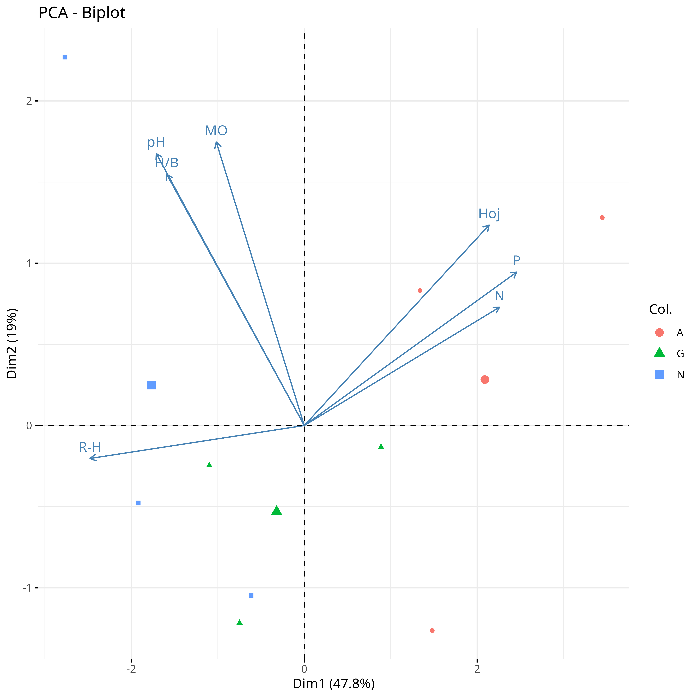
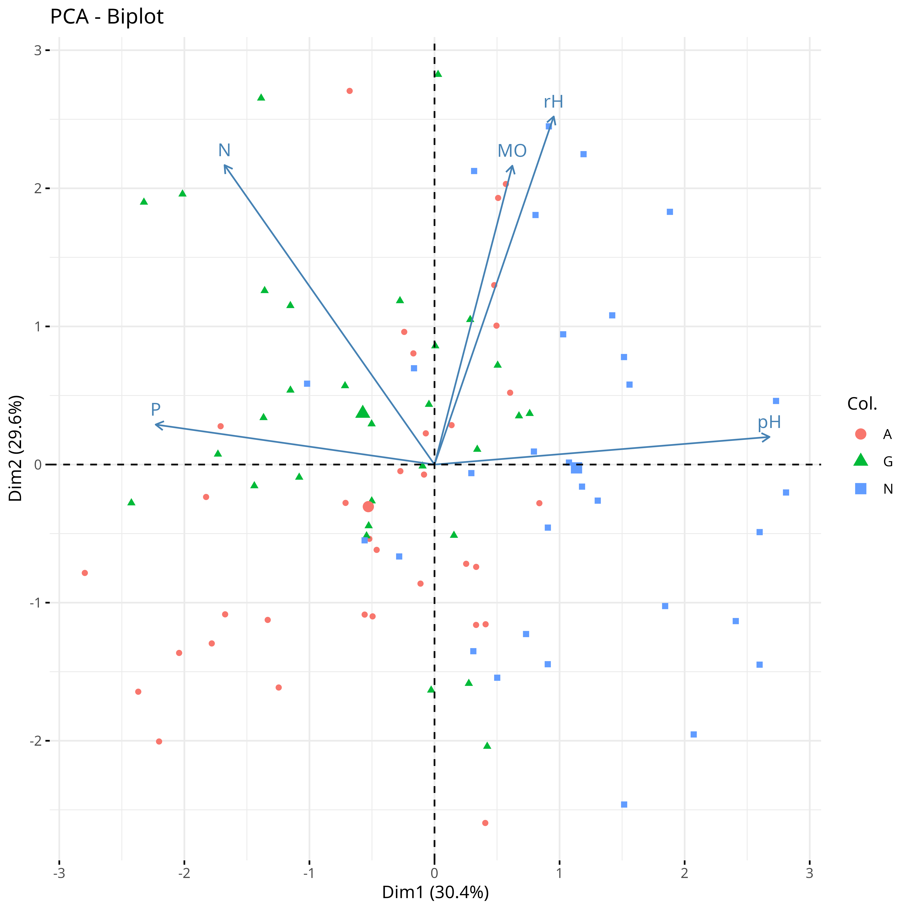
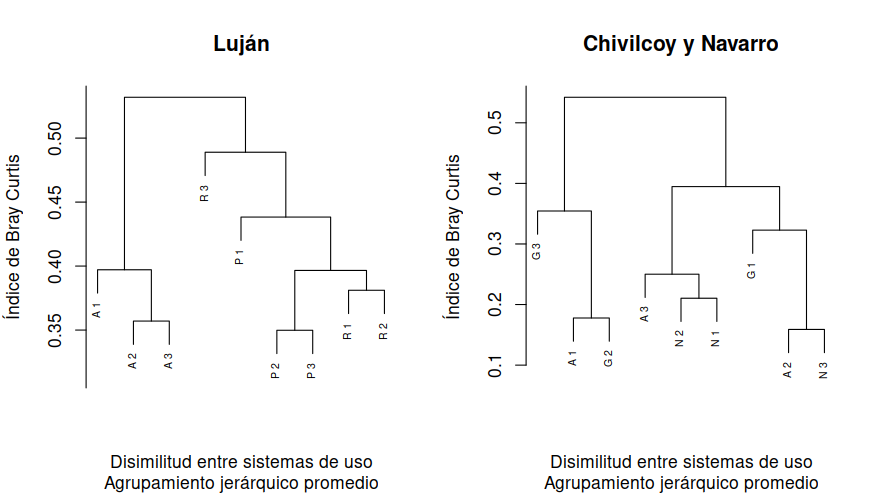
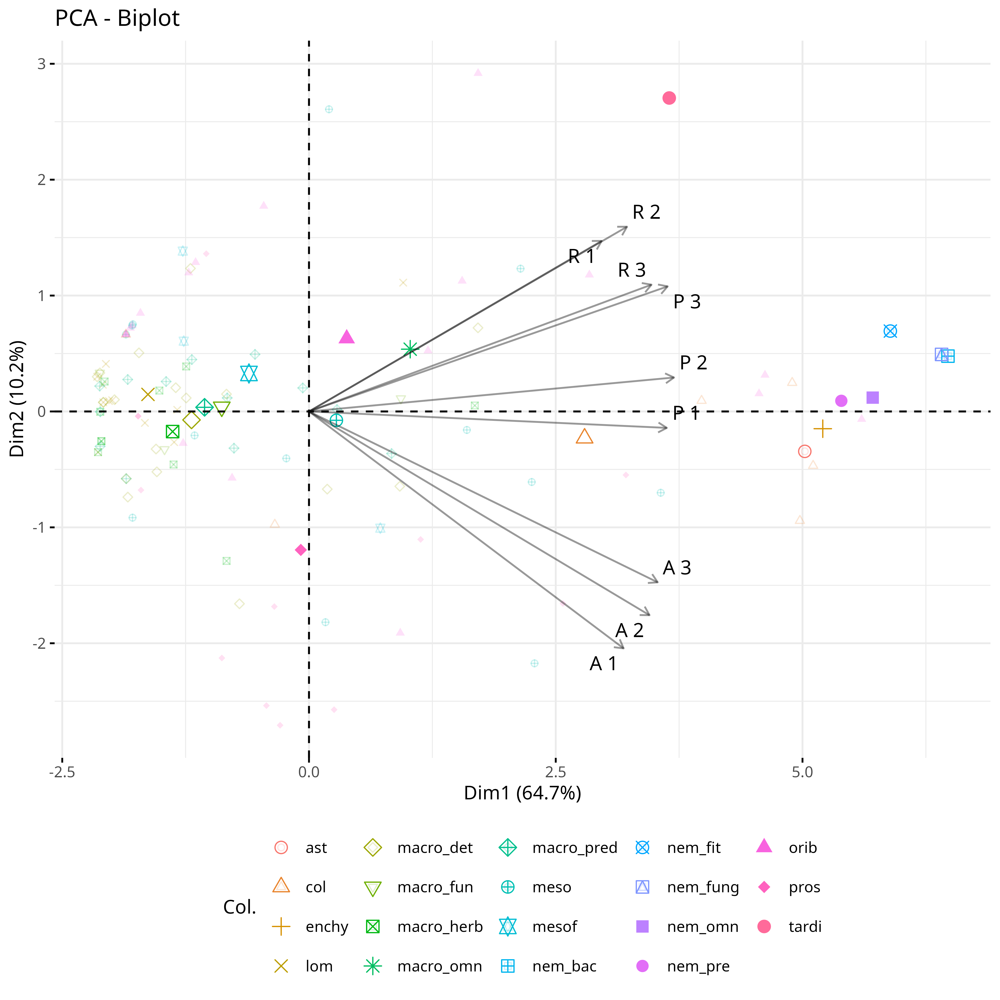
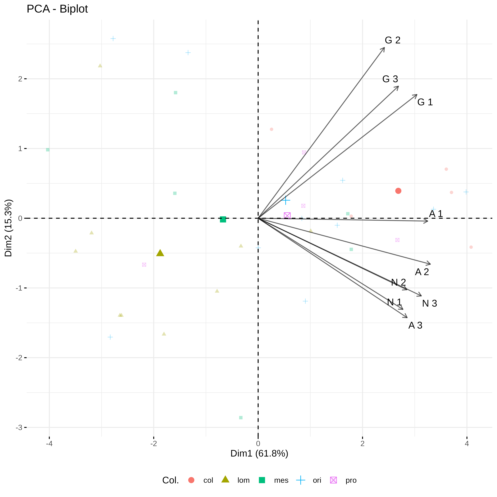

```{r setup, include=FALSE}
knitr::opts_chunk$set(echo = TRUE)
knitr::opts_chunk$set(comment = NA)
loadNamespace('printr')
set.seed(167)
options("digits"=3)
```

```{r lib, include=FALSE, warning=FALSE}
#Carga paquetes
{library("tidyverse");library("readxl");library("ade4");library("Hmisc");
library("vegan");library("cluster");library("BiodiversityR") 
library("FactoMineR");library("factoextra"); library("kableExtra")}
set.seed(167)

```

## Introducción

La Pampa argentina (Fig. 3.1) es una amplia llanura con una extensión de más de 450 mil km^2^, de las cuales se estima que la Pampa Ondulada ocupa 4,4 millones de hectáreas, esta ocupa la parte centro-oriental de la provincia de Córdoba, el suroeste de Santa Fé y el norte de Buenos Aires
[@morello2000].

Fitogeográficamente, la Pampa Ondulada, se ubica en la Región Neotropical, dominio Chaqueño, distrito Oriental de la provincia Pampeana y en ella la vegetación dominante es la estepa o pseudoestepa de gramíneas [@cabrera1973; @oyarzabal2018]. El clima es templado cuyo rango de precipitaciones varía entre los 850 a 1000 mm anuales y una temperatura media anual alrededor de los 17 ºC, la distribución de las lluvias es casi uniforme, interrumpida periódicamente por sequías derivadas de los fenómenos meteorogicos El Niño y La Niña.

La Pampa Ondulada es la zona más fértil y productiva de la región Pampeana, donde más del 80% de la tierra se dedica a la producción de cultivos agrícolas. Los suelos de la Pampa tienen relativamente pocas limitaciones para la producción de cultivos y son aptos para la ganadería. Son suelos profundos, bien drenados, no ofrecen limitaciones para el crecimiento de las raíces y tienen un buen contenido de materia orgánica [@cabrera1973] la topografía es plana y extensa, además cuenta con importantes acuíferos cuya explotación se realiza para proporcionar riego a los cultivos, sumando a estas bondadosas características para la producción agrícola, el estrecho periodo de probabilidad de heladas y los inviernos sin nieve permiten el cultivo de especies invernales de manera que al año pueden realizarse hasta tres cosechas [@morello2000].

<p align="center">

</p>
<p align="left">
<em>Figura 3.1. La Pampa Argentina y sus principales divisiones [@morello1997]</em>
</p>

Urricariet y Lavado en [-@urricariet1999] ya mencionaban que la Pampa Ondulada estaba siendo sometida a la pérdida de fertilidad debidas a las prácticas intensivas de manejo, ellos basaron sus conjeturas en estudios regionales realizados en la Pampa Ondulada y mencionan que la erosión de los suelos y los efectos de las prácticas agrícolas intensivas sobre estos, alteran la fertilidad física y estructural del suelo, la fertilidad química principalmente por la disminución de nutrientes extraidos por los cultivos y la fertilidad biológica debida a las alteraciones sobre los procesos biológicos que tienen la perdida de la materia orgánica en los suelos. Podemos decir que las practicas agrícolas intensivas estaban motivadas por las grandes bondades productivas provistas por las características del ecosistema ante descrita.

Es importante conocer como es afectada la vida "bajo nuestros pies" [@orgiazzi2016], es decir la vida del suelo, ya que la diversidad biológica puede ser afectada por los diferentes impactos relacionados con las diferentes prácticas de manejo, tales como, el establecimiento estructuras vegetales diferente a la vegetación original, el fraccionamiento del hábitat, el cambio de uso del suelo, la compactación de los suelos, el uso de insumos como fertilizantes y biocidas, etc.; estos factores alteran los fenómenos funcionales y estructurales que conforman los procesos ecologicos de los ecosistemas terrestres [@colombo2014; @bedano2006b; @hooper2005; @brussaard2007; @barrios2007].

La fauna edáfica refleja el efecto de las perturbaciones naturales y antrópicas mediante respuestas en la composición de especies o cambios en la abundancia, ya que, las perturbaciones según su intensidad podrían llevar a la disminuciones de las abundancias o a la desaparición de especies, lo que se traducirá en efectos sobre estabilidad y fertilidad de los suelos.

La fauna edáfica está íntimamente vinculada con la descomposición de la materia orgánica y la dinámica del ciclo de los nutrientes, además la diversidad trófica y la dinámica de los diferentes taxones de la fauna edáfica se relacionan con el control de las poblaciones, la distribución y el transporte de esporas y propágulos de la microflora del suelo, la deposición de sus extretas líquidas o sólidas que contribuyen a la formación de microagregados y son almacen de carbono en el suelo y también sus actividades de búsqueda de alimento o movimientos en búsqueda de mejores condiciones ambientales los tornan organismos que contribuyen, a diferentes escalas, a la formación del suelo [@wall1999; @barrios2007; @bardgett2002; @potapov2022; @zotero-1438; @creamer2022].

Por ello es que Socarras [-@socarras2013] menciona que conocer el número de los diferentes taxones, su abundancia y el balance entre estos permite evaluar y predecir el impacto de los diferentes métodos de producción ocurridos en sistemas con condiciones edáficas y climáticas particulares; tambíen Cruz y colaboradores [-@cruz2004] mencionan en su síntesis sobre los indicadores que dan cuenta sobre la calidad del suelo, entendida como *"la utilidad del suelo para un propósito específico en una escala amplia de tiempo"*, que los indicadores biológicos integran a la gran cantidad de factores que podrían estar afectando al suelo y su "calidad".

Dado que el suelo es el hábitat de estos organismos y la fauna edáfica es rectora sobre los procesos biológicos que afectan al funcionamiento del ecosistema edáfico, la diversidad biológica en los suelos se vincula estrechamente con el mantenimiento de la fertilidad, la estabilidad física y biológica y con la productividad ecológica (productividad primaria) y económica (rendimiento de los cultivos y producción de proteina animal) de los suelos.

En esta sección se pretende describir las diferencias ambientales y las diferencias en 
la diversidad biológica de las comunidades edáficas halladas en suelos argiudoles 
de la Pampa Ondulada bajo diferentes sistemas de uso.
Esta instancia será de puntapié en la construcción de la red de interacciones tróficas
ya que permitirá la caracterización ambiental de los suelos en los que habita la fauna y permitirá 
además conocer la diversidad y la similitud en las comunidades de la fauna edáfica que habitan los 
suelos con diferentes sistemas de uso.

## Materiales y métodos

**Sitios de estudio y diseño de muestreo**

Las comunidades de la fauna del suelo ocurren en suelos Argiudoles típicos de la Pampa Ondulada. Estas comunidades provienen de dos conjuntos de datos, a saber, fauna edáfica tomada en suelos del partido de Luján y fauna edáfica pertenecientes a suelos de los partidos de Chivilcoy y Navarro (Tabla 3.1), estas distancias en la Pampa Ondulada implican características similares en términos de clima y elevación. En ambos casos se tomaron muestras en suelos con diferentes formas de uso y se consideraron estos como diferentes grados en la intensidad de perturbación sobre el suelo.

Los suelos de argiudoles típicos de Luján fueron muestreados en el año 2022. El muestreo se llevó 
adelante en el campo experimental de la Universidad Nacional de Luján [@sfeir1998], con la intención de colectar la fauna edáfica que pasa todo su ciclo de vida en el suelo [@momo2009; @wallwork1970] denominados como **geobiontes**. Los geobiontes incluyen tres rangos de tamaño [@swift1979]: la **microfauna** constituida por los nemátodos (ancho corporal menor a 200 μm), la **mesofauna** en el que se incluyen los microartrópodos y otros invertebrados cuyo diametro corporal es menor a 2 mm y la **macrofauna**. 

 <!--con respecto al hecho de tmar reeticiones en un mismo lugar: En cada lote se tomaron varias muestras distantes entre sí al menos diez metros por lo que pueden considerarse estadísticamente independientes (es decir que no presentan pseudorreplicación) ya que, como está ampliamente demostrado en el caso de estos suelos, las distancias entre muestras exceden ampliamente las distancias de autocorrelación, con lo cual los datos son estadísticamente independientes aunque estén tomados en el mismo campo (Conti et al. 1980; Giuffré et al. 1998; M. Massobrio, comunicación personal, tomado del paper de monica | Artrópodos del suelo: Relaciones entre la composición faunística y la intensificación agropecuaria-->


**Tabla 3.1.** Ubicación de los puntos de muestreo en los sitios con diferentes intensidades de uso en suelos argiudoles de la Pampa Ondulada. Coordenadas geográficas en el sistema de referencia WGS84 expresadas en grados, minutos y segundos.

| Sitio                     | Latitud     | Longitud    | Localidad           |
|---------------------------|-------------|-------------|---------------------|
| Reserva (R)               | 34°35'34"S  | 59°04'16"O  | Luján               |
|                           | 34°35'35"S  | 59°04'18"O  |                     |
|                           | 34°35'36"S  | 59°04'20"O  |                     |
| Pastizal (P)              | 34°35'38"S  | 59°04'22"O  |                     |
|                           | 34°35'38"S  | 59°04'23"O  |                     |
|                           | 34°35'38"S  | 59°04'25"O  |                     |
| Agrícola (A)              | 34°35'22"S  | 59°04'05"O  |                     |
|                           | 34°35'22"S  | 59°04'09"O  |                     |
|                           | 34°35'22"S  | 59°04'12"O  |                     |
| Pastizal naturalizado (N) | 35°03'28''S | 59°41'03''O | Chivilcoy y Navarro |
|                           | 35°03'31''S | 59°41'03''O |                     |
|                           | 34°51'05''S | 60°01'74''O |                     |
| Agrícola-ganadero (G)     | 34°17'17''S | 59°10'31''O |                     |
|                           | 34°49'25''S | 59°10'25''O |                     |
|                           | 34°49'30''S | 59°10'16''O |                     |
| Agrícola Intensivo (A)    | 35°03'20''S | 59°41'18''O |                     |
|                           | 35°03'15''S | 59°41'09''O |                     |
|                           | 35°05'22''S | 59°38'70''O |                     |


Se eligieron 3 sitios (Tabla 3.1) con diferentes usos del suelo: a) un lote agrícola (A) sobre el cuál se practica la agricultura convencional con labranza para la producción forrajera de alfalfa *Medicago sativa* para pastoreo de bovinos en producción lechera; b) un área de pastizal (P) con dominancia de Sorgo de Alepo *Sorghum halepense* y Cardo mariano *Silybum marianum*, áreas que reciben baja presión de pastoreo por los bovinos lecheros con descanso semanales entre pastoreos, y; c) un área clausurada por más de 30 años considerada como Reserva (R) cuya vegetación característica es de tipo arbórea dominada por Ligustro *Ligustrum lucidum* y Acacia *Acacia melanoxylon*.


<!--El trabajo de extracción, separación y clasificación de los taxones fué realizado por el autor y colaboradores.

De manera complementaria se estimaron la respiración heterotrófica, la proporción de procariotas y eucariotas esto es la relación entre bacterias y hongos y variables químicas que caracterizan estos ambientes edáficos.-->

** Métodos de extracción de la fauna edáfica**

En cada sitio se ubicaron 3 réplicas de un metro cuadrado de superficie separadas 50 metros entre sí 
y separadas 10 metros de los bordes de parcelas [@moreira2012; @potapov2022a].

Para muestrear los <u>nemátodos de vida libre del suelo</u> se tomaron 4 submuestras por cada réplica 
muestral, en puntos al azar dentro de un área muestral de un metro cuadrado previamente delimitada, con 
sacadocados de 5 cm diámetro y 10 cm de profundidad. Las submuestras fueron almacenadas evitando la 
compactación, la pérdida de humedad y el sobrecalentamiento para luego llevarlas al laboratorio donde 
fueron mecladas, homogeneizadas y pesadas, luego se procedió a la extracción de los nemátodos
mediante método de flotación y tamizado [@jenkins1964; @moreira2012; @mondino2010]. Para ello,
la muestra de suelo se desagrega suavemente con la mano y se mezcla con agua en relación 1:6 suelo:agua 
p/p se agita la solución enérgicamente durante 2 minutos aproximadamente y se deja reposar entre 1 y 2 
minutos hasta que la fracción más pesada del suelo decante, la solución se pasa a través de tamices con 
diferente diámetro de apertura de malla y los nemátodos se colectan en las mallas con diámetro de apertura
de 170 y 53 micrones; seguidamente se colecta los nemátodos atrapados por las mallas y se conservan en 
formalina 4% [@moreira2012] o alcohol 96º [@potapov2022a] hasta el conteo bajo lupa binocular e 
identificación en grupos tróficos siguiendo la morfología del aparato bucal [@momo2009; @yeates1971; 
@mondino2010] con ayuda de montajes temporales y observación bajo microscopio óptico.

Para muestrear la <u>macrofauna del suelo</u> se trabajó en 2 etapas una a campo y otra en el laboratorio, en ambos casos los animales se capturaban directamente utilizando pinzas y pinceles y se los almacenaba directamente en alcohol de 96º (*"a ojo desnudo"* o en inglés: *"Hand shorting"*), hasta su posterior conteo e identificación [@potapov2022a]). En el campo se delimitó dentro del área de muestreo de un metro cuadrado una sub-parcela, ubicada al azar, de 25 x 25 cm y se excavó el suelo hasta los 20 cm de profundidad, esta muestra se trabajó de manera estratificada para facilitar la exploración y captura de 
la fauna, separando en hojarasca, suelo hasta los 10 cm y suelo hasta los 20 cm de profundidad. Luego,
las muestras de suelo fueron trasladadas al laboratorio, manteniendo el suelo intacto y cuidando que no pierda la humedad natural para evitar la deshidratación de la macrofauna hasta que el culmine el proceso de exploración y extracción de los animales, proceso que llevo aproximadamente una semana. Cada muestra de suelo fue desagregada minusiosamente, sobre un fondo blanco bajo luz blanca y con el apoyo de lupa, prestando atención al movimiento de los animales de la macrofauna, lo que permite capturar más animales que los que permite la exploración a campo donde solo es factible observar aquellos animales ágiles o de gran tamaño, tales como, lombrices de tierra, arañas lobo, bichos bolita, milpies, cienpies, entre otros [@moreira2012; @potapov2022a]. Los animales capturados son almacenados en alcohol 96º hasta su identificación taxonómica, para la identificación se utilizaron claves taxonómicas que separan en grandes grupos taxonómicos [@vargas2014]. Las lombrices de tierra (Oligochaeta: Crassiclitellata) fueron identificadas hasta especies [@reynolds1996; @satchell1983; @demichis1999] y la macrofauna restante fué separada en diferentes rangos taxonómicos desde órdenes hasta familias [@choate1999; @claps2020; @klimaszewiski1997; @dindal1990; @zhang2011; @vargas2014].

 <!--anexo tal vez:(Fig 3.x)[Fig 3.x colocar mosaico de imágenes donde estamos suelo lupa y balanza]-->

Para muestrear la <u>mesofauna del suelo</u>, se tomaron la hojarasca y el suelo hasta la profundidad de 10 cm. Se tomó toda la hojarasca que se encontraba sobre la superficie que cubría el monolito de 625 cm^2^, para luego extraer la mesofauna, además el suelo del monolito de los primeros 10 centímetros de profundidad fue desagregado, mezclado y homogeneizado para tomar tres submuestras de suelo con un volumen de 100 cm³, previo a la toma de muestras el suelo fue disminuido en volumen mediante la técnica del cuarteo, lo que asegura la representatividad de las fracciones submuestreadas. Las submuestras de la mesofauna edáfica fueron sometidas al método de flotación y tamizado [@vargas2007], estas se desagregan en agua en relación 1:6 de suelo:agua, se agita enérgicamente durante 2 min, se deja reposar la solución durante unos minutos y luego se vuelca la mezcal a través del juego de tamices de 4 mm, 2mm, 1mm, 500 μm, 250 μm y 170 μm; la mesofauna se colecta de lo que queda atrapado en los tamices desde los 1000 μm hasta las 170 μm. Los animales colectados se almacenaron en alcohol 96º, luego se contaron e identificaron los taxones en diferentes rangos taxonómicos hasta familias utilizando claves taxonómicas de: @krantz2009; @momo2009; @janssens; @balogh1988; @burges1967; @evans1979; @dindal1990.


Con el suelo de los primeros 10 cm de profundidad se llevó adelante la técnica para estimar la respiración heterotófica [@frioni1999], en esta profundidad se desarrolla la mayor actividad 
respiratoria de la microbiota [@pankhurst1997] que es el constituyente principal de la respiración heterotrófica del suelo. Esta técnica consiste en homogeneizar y pesar 10 g de suelo por submuestra, ubicar cada muestra en frascos de incubación, humedecer el suelo con agua destilada, colocar la trampa de álcali (NaOH 0,1 M), llevar a estufa el frasco bien cerrado a incubar durante 7 a 10 días a temperatura de 30ºC, pasado el tiempo se titula la trampa de álcali con una solución ácida (HCl 0,1M) apoyado con fenolftaleína como indicador de la reacción de neutralización, mismo procedimiento para frascos de incubación sin suelo que serán "blancos" y dan cuenta del CO~2~ contenido en el aire, por lo tanto la diferencia en mililitros de ácido consumido entre blancos y muestras refiere a la respiración heterotrófica en mg CO~2~.g suelo^-1^.día^-1^.

Además se realizó la técnica de respiración inducida por sustrato en conjunto con el uso de antibióticos para determinar la proporción de procariotas y eucariotas halladas por gramo de suelo, cuyo resultado es la aproximación del total de bacterias y hongos hallados en el suelo [@west1986; @zabala2010; @beare1990].
El procedimiento consiste en aplicar diferente soluciones con tratamientos antibioticos, a razón 1:1 suelo:solución, para estimular la respiración del grupo de interés. Las soluciónes utilizadas fueron
*a)* solo el sustrato no discrimina entre grupos contiene 150 mg glucosa / mm solución y su valor estima la respiración heterotrófica inducida total; la solución que *b)* inhibe la respiración de procariotas y que por lo tanto mide la respiración de los *eucariotas* contiene 11 mg cloranfenicol + 150 mg glucosa / mm sn.; *c)* la respiración de *procariotas* se mide con la solución de 2,3 mg cicloheximia + 150 mg glucosa / mm y finalmente la solución que contiene *d)* ambos antibióticos, en las mismas concentraciones, estima la respiración *residual*, es decir, la respiración de aquellos organismos que respiran a pesar de la presencia de los antibióticos en el medio líquido. 
Se coloca un gramo de suelo / réplica / muestra en recipientes que se cierran herméticamente y que funcionan como cámaras de incubación, luego el suelo es embebido con alguna de las soluciones descrita arriba y se coloca en el interior del recipiente la trampa de álcali, un frasco de menor volumen con 5 ml de solución de hidróxido de sodio NaOH O,1 M. Los recipientes se colocaron en estufa a 30ºC durante 48h para incubar el suelo y estimular la actividad biológica. Como controles (blancos) de la reacción se utilizaron frascos sin suelo con la trampa de álcali para medir el contenido de CO~2~ presente en la aire al momento del procedimiento. El CO~2~ liberado por la respiración biológica se recupera en la trampa de NaOH y se determina por titulación con ácido clorhídrico HCl 0,1 M y fenolftaleína como indicador [@frioni1999; @coleman2004]. Luego para la determinación de las proporciones de los grupos involucrados en la respiración se consideran las diferencias observadas entre los grupos tratados con antibioticos en relación con la respiración total [@zabala2010].

De manera complementaria se obtuvieron, a través del servicio del Laboratorio del Campo de la Universidad Nacional de Luján, los valores para el porcentaje de materia orgánica, el porcentaje de nitrógeno, la cantidad de fósforo extratable en partes por millón y el valor del potencial de hidrogeniones en escala de pH.

Los suelos ubicados en los partidos de Chivilcoy y Navarro fueron muestreados 
por Sandler [-@sandler2019]. Los sitios de muestreo se corresponden con 
suelos argiudoles con intervención agrícola intensiva (A) 
durante más de 50 años, suelos con sistema de producción mixto con actividad agrícola y ganadera (G)
y suelos con pastizales naturalizados (N) sin intervención antrópica por más de 50 años. Este 
conjunto de datos incluye a) el contéo y la clasificación de los taxas de Arachnida: Acari, Hexapoda: Collembola, extraidas mediante la técnica de tamizado y flotación y conteo, b) la clasificación de
Oligochaetta: Crassiclitelata colectadas a campo a ojo desnudo, c) la respiración heterotrófica en mg CO~2~.g suelo^-1^.día^-1^ y d) la determinación de variables ambientales [@duhour2023; @velazco2023a]. 


**Análisis de datos**

Las variables químicas y biológicas se abordaron con estadística descriptiva, para ello se calcularon las correlaciones de Spearman entre variables, las medidas de tendencia central y de dispersión para cada sitio, para conocer si existen diferencias estadísticas se recurrió a la prueba no paramétrica de Kruskal-Walis asumiendo un nivel de significacia con el valor de probabilidad del estadístico H:p~valor~ menor al 0,1 y la prueba de a pares de rangos del signo de Wilcoxon con los valores de probabilidad corregidas con <u>Benjamini-Hochberg</u>. Luego se procede al análisis multivariado mediante el uso de componentes principales (PCA) para identificar las relaciones existentes entre las variables ambientales y los sistemas de uso bajo estudio [@legendre2012].

Para describir la estructura de las comunidades edáficas se realizó el análisis de la diversidad, 
contabilizando el número de unidades taxonómicas 
y calculando el índice de diversidad de Shanon-Wiener (**H'**).

$$
H' = -\sum_{i=1}^{S} p_i \ln(p_i)
$$

-   $H'$ es el índice de Shannon-Wiener.
-   $S$ es el número total de unidades taxonómicas en la comunidad.
-   $p_i$ es la proporción del i-ésima unidad taxonómica en la comunidad.

Se utilizó el análisis multivariado de las similitudes (ANOSIM) para determinar las
diferencias en la similitud de las comunidades halladas en los diferentes sistemas de uso del suelo. Para este análisis el valor p de probabilidad indica que las comunidades entre sitios son diferentes entre sí cuando el p~valor~ \< 0,1.  Además el valor del estadístico R nos indica el grado de separación que existe entre las comunidades comparadas entendiendo que si este se aproxima al valor 1 el grado de separación es mayor entre comunidades. A la vez, el análisis de la similitudes se complementó con 
el cálculo del agrupamiento jerárquico con el método de enlace promedio que permitió describir 
las similitudes entre sitios mediante el dendograma. Para ambos análisis se utilizó el coeficiente de <u>disimilitud de Bray-Curtis</u> cuyo valor indica mayor disimilitud (separación) cuando el valor es más cercano a uno [@legendre2012; @koleff2003].

$$ BC = \frac{\sum |x_i - y_i|}{\sum (x_i + y_i)} $$

-   $BC$ es el coeficiente de distancia de Bray-Curtis.
-   $x_i$ y $y_i$ son los valores de las unidades taxonómicas en los sitios $i$.

Para describir las relación entre los taxones y los sitios de muestreo se realizó el análisis de los componentes principales (PCA) de las comunidades en modo R (esto es, los sitios muestrales como columnas en la matriz de entrada de datos) con los valores de la abundancia de los taxones previamente transformados con $\log_bx + 1$ [@legendre2012], el modo de análisis R permite observar en el <u>gráfico biplot</u> a los sitios como vectores y a los taxones como puntos en el espacio de ordenamiento de las coordenadas principales resumidos através de centroides. Los centroides para este análisis resumen de manera arbitraria el agrupamiento taxones con características taxonómicas y biológicas similares, 
por ej. macrofauna (clasificación por tamaño corporal) detritivora (dieta principal basada en el consumo de materia orgánica en descomposición) ó enquitreidos que incluye una sola unidad taxonómica
pero con características biológicas específicas del taxón.

## Resultados


### Caracterización química - biológica de los suelos Argiudoles típicos de la Pampa Ondulada bajo diferentes formas de uso

**Correlaciones de Spearman entre pares de variables en suelos Argiudoles típicos**

En los suelos de Luján la matriz de correlaciones de a pares (Tabla 3.2) nos muestran que las variables están poco correlacionadas entre si con excepción del nitrógeno que se correlaciona negativamente con la respiración heterotrófica ($\rho$: p~valor~ \< 0,1).

También el fósforo se correlaciona negatvamente con la respiración heterotrófica aunque representa una situación marginal (p-valor igual a $\rho$: p~valor~ = 0,1). Existe correlación positiva entre el fośforo y nitrógeno $\rho$ = 0,57 pero el nivel de significancia esta un punto por arriba de la situación marginal $\rho$: p~valor~ = 0,11. 

La correlación entre el fósforo y el nitrógeno podría vincularse 
con el aporte de la fertilización exógena con compuestos que poseen ambos componentes. 
La relación inversa de estos nutrientes con la respiración heterotrófica 
podría estar reflejando un mecanismo de retroalimentacion negativa ya que 
si consideramos que el papel de la microbiota esta ligada a la descomposición y mineralización de 
esos macro-nutrientes la disponibilidad de nutrientes disminuiría la actividad respiratoria de los descomponedores.


**Tabla 3.2.** Matriz de correlaciones de Spearman en suelos Argiudoles. A) Argiudoles de Luján, B) Argiudoles de Chivilcoy y Navarro. Significatividades en el triángulo superior, valor de correlación $\rho$ de Spearman en triángulo inferior de la matriz.

**A)**


```{r tab3.2A, echo=FALSE, message=FALSE,warning=FALSE}
tab3.2A <- read.csv("scripts/database/corr_unlu.txt", sep="")
colnames(tab3.2A)<-c("pH", "% MO", "% N", "P (ppm)", "Resp. Heterotrófica", "Hongos/Bacterias", "Hojarasca")
tab3.2A%>% kbl() %>%kable_classic(full_width = F, html_font = "Times New Roman")
```


**B)**


```{r tab3.2B, echo=FALSE, message=FALSE,warning=FALSE}
tab3.2B <- read.csv("scripts/database/corr_ro.txt", sep="")
colnames(tab3.2B)<-c("pH", "% MO", "% N", "P (ppm)", "Resp. Heterotrófica")
tab3.2B%>% kbl() %>%kable_classic(full_width = F, html_font = "Times New Roman")

```


En los suelos Argiudoles de Chivilcoy y Navarro (Tabla 3.2) el pH se correlacionó significativamente con el nitrógeno, el fósforo y la respiración heterotrófica, las correlaciones fueron negativas entre el pH y el nitrógeno y el fósforo. Entonces si el aumento en la cantidad de Nitrógeno se relaciona con la disminución del pH, esta disminución del pH favorece el aumento del fósforo disponible. En cambio, la correlación fué positiva entre el pH y la respiración heterotrófica, por lo que la actividad biológica aumenta cuando el medio es más alcalino.

La materia orgánica, se relacionó significativamente con el nitrógeno, el fósforo y la respiración heterotrófica. Con el fósforo extractable la correlación es negativa lo que 
puede relacionarse con el hecho de que la materia orgánica humificada forma complejos con el fósforo. 
En cambio con la respiración heterotrófica y el nitrógeno las correlaciones fueron positivas.

El nitrógeno se correlacionó además con el fósforo y la respiración heterotrófica en ambos casos de manera positiva, con la respiración heterotrófica la correlación es mayor.

El fósforo no muestra correlación significativa con la respiración heterotrófica, con las demás variables mostró relaciones significativas pero con ninguna de las variables las correlaciones fueron fuertes $\rho$ \> 0,75.

**Relaciones de las variables químicas y biológicas en los diferentes sistemas de uso en suelos Argiudoles típicos**

Los valores del pH (Tabla 3.3), en los suelos argiudoles de Luján, no mostraron diferencias significativas (K-W p:H\<0.1) entre los sitios. En los suelos de Chivilcoy y Navarro existió diferencias significativas entre grupos (K-W p:H\<0.1) en los cuáles, es el pastizal naturalizado el suelo más alcalino quién se diferencia de los demás sistemas de usos, siendo los sistemas mixto y agrícola intensivo similares en valores de acidez.

**Tabla 3.3.** Variables químicas de suelos Argiudoles típicos. Valores promedio y desvío estandar del pH, el porcentaje de materia orgánica (MO), el porcentaje de nitrógeno (N) y el fósforo asimilable (p.p.m.). Las letras representan diferencias significativas evaluadas mediante la prueba de Kruskall-Wallis. Los sitios se corresponden con los sistemas de uso del suelo, en Luján: R = Reserva, P = pastizal, A = agrícola; en Chivilcoy y Navarro: N = pastizal naturalizado, G = sistema mixto agrícola ganadero, A = agrícola intensivo.

```{r Tab3.3,,echo=FALSE,message=FALSE,warning=FALSE}
tab3.3 <- read.csv("scripts/database/Tab3-3.txt", sep="")

tab3.3%>% kbl() %>%kable_classic(full_width = F, html_font = "Times New Roman")
```


El patrón general muestra que en sistemas agrícolas los suelos son más ácidos y su valor de pH 
varía menos en estos usos, esto podría explicarse con el hecho de que la aplicación de 
fertilizantes, que podrían disminuir el pH, se distribuyen de manera homogénea sobre 
el lote con el objetivo de aumentar la disponibilidad de los nutrientes en la superficie agrícola.

En los suelos argiudoles los porcentajes de materia orgánica y de nitrógeno no fueron
diferente significativamente (K-W H:p\<0.1), <u>entre</u> sitios dentro de una misma localidad, 
aunque si se reportan valores diferentes para cada zona de estudio. 

En los suelos argiudoles de Luján con respecto al fósforo solo el sistema agrícola difirió
significativamente (K-W H: p\<0.1) la amplitud en la variación del valor del fósforo puede ser 
debidas al efecto de la fertilización, ya que como este nutriente es poco móvil lugares con mayores cantidades de fósforo reflejan puntos de fertilización con el nutriente. 
Por su parte, en los suelos argiudoles de Chivilcoy y Navarro, la variación del fósforo entre los sistemas de uso del suelo no mostraron diferencias significativas (K-W H:p\>0.05).


**Tabla 3.4** Variables biológicas de suelos Argiudoles típicos. Valores promedio y desvío estandar de la respiración heterotrófica edáfica en mg C-CO~2~/gr~suelo~.día, la relación hongos:bacterias, biomasa de hojarasca en gramos. Las letras representan diferencias significativas evaluadas mediante la prueba de Kruskall-Wallis. Los sitios se corresponden con los sistemas de uso del suelo, en Luján: R = Reserva, P = Pastizal, A = Agrícola; en Chivilcoy y Navarro: N = pastizal naturalizado, G = mixto agrícola ganadero, A = agrícola intensivo.

```{r Tab3.4,,echo=FALSE,message=FALSE,warning=FALSE}
tab3.4 <- read.csv("scripts/database/Tab3-4.txt", sep="")
colnames(tab3.4)<-c("Sitio", "Respiración heterotrófica", "Hongo/Bacteria", "Hojarasca")
tab3.4%>% kbl() %>%kable_classic(full_width = F, html_font = "Times New Roman")
```
Se observan diferencias significativas (K-W H:p\<0.1) en la respiración heterotrófica en los diferentes sistemas de uso del suelo. En suelos de Luján, en el sistema de la Reserva muestra una mayor actividad respiratoria, en estos suelos la disponibilidad de materia orgánica suceptible a la descomposición (broza u hojarasca) se distribuye sobre la superficie con un gran volumen y es más constante a lo largo del año, en cambio en suelos agrícola donde la  actividad respiratoria fué menor la hojarasca sobre el suelo es puntual y estacional 

En los argiudoles de Chivilcoy y Navarro, la respiración heterotrófica fué menor en el sistema agrícola y en los sistemas pastizal naturalizado y mixto fueron similares entre sí.

En suelos de Luján no se encontraron diferencias entre los sistemas de uso del suelo, ni en la relación de hongos/bacterias ni en la cantidad de hojarasca en superficie.

**Análisis de Componentes Principales (PCA) de las variables químicas y biológicas de los suelos Argiudoles típicos bajo diferentes formas de uso**

El análisis multidimensional entre las variables químicas y biológicas observadas en
los sitios de estudios en los suelos argiudoles de Luján indica que las primeras tres dimensiones 
poseen autovalores mayores a 1 y a la vez estas dimensiones acumulan el 80% de la variabilidad 
ocurrida entre variables.


<p style="text-align: center;">
  
  <br>
  **Figura 3.2.** Biplot de coordenadas principales de las variables químicas y biológicas en suelos Argiudoles típicos de Luján. Los vectores representan las variables químicas y biológicas. pH = potencial de hidrogeniones. MO = porcentaje de materia orgánica. N = porcentaje de nitrógeno. P = fósforo asimilable en partes por millón. R-H = respiración heterotrófica en mg C-CO~2~/gr~suelo~.día. H/B = relación hongos/bacterias. Hoj = biomasa de hojarasca en g/m^2^. Los puntos indican los sitios de muestreos, los puntos de mayor tamaño indican el centroide que resume las características de los sistemas de uso del suelo. R: Reserva, P: Pastizal, L: Agrícola.
</p>


Las primeras 2 dimensiones del ordenamiento de componentes principales (Fig. 3.2) 
resume el 64,77 % de la variabilidad entre las variables ambientales abordadas y los sitios de estudio.

Sobre la dimensión 1 el centroide del sistema Agrícola se separa claramente de los centroides de los sistemas del Pastizal y la Reserva. Sobre la dimensión 2 se separa el centroide del sistema del Pastizal que se relaiona con lado negativo del eje del centroide de la Reserva.

El fósforo, el nitrógeno y la cantidad de hojarasca estas variables tienen fuertes correlacines positivas con la primera dimensión con r \> 0,7, con la segunda dimensión las correlaciones son positivas pero de menor importancia (r \< 0,5), por otra parte se observa a los vectores relacionados con el centroide del sistema Agrícola,

El pH y la relación de Hongos:Bacterias se observan superpuestas indicando relaciones similares de sus vectores, se correlacionan positivamente con la segunda dimensión con una importancia media (r \< 0,6) y negativamente con la primera dimensión con una gran importancia (r= -0.85) para la relación de hongos:bacterias y una importancia media para el pH, en ambos casos estos se inclinan levemente 
hacia el centride del sistema de la Reserva.

La materia orgánica, aunque ubicado en el mismo cuadrante,
se separa del centroide de la Reserva y de los vectores de las variables 
pH y relación Hongos:Bacterias, su correlación es medianamente fuerte (r \< 0,7) con la dimensiones 3 y 2 y con la primera dimensión la correlación es negativa pero más baja (r \< \|-0,4\|).

La respiración heterotrófica tiene una fuerte correlación negativa con la primera dimensión (r \< \|-0,9\|) y una correlacion mediana (r \< 0,5) con la tercera dimensión, el vector de esta variable se encuentra entre los centroides del sistema de la Reserva y del Pastizal aunque más cercano con el centroide de la Reserva. 


<p style="text-align: center;">
  
  <br>
  **Figura 3.3.** Biplot de coordenadas principales de las variables químicas y biológicas en suelos Argiudoles típicos de Chivilcoy y Navarro. Los vectores representan las variables químicas y biológicas. pH = potencial de hidrogeniones. MO = porcentaje de materia orgánica. N = porcentaje de nitrógeno. P = fósforo asimilable en partes por millón. rH = respiración heterotrófica en mg C-CO~2~/gr~suelo~.día. Los puntos indican los sitios de muestreos, los puntos de mayor tamaño indican que centroide que resume las características de los sistemas de uso del suelo. N: Pastizal naturalizado, G: Mixto agrícola ganadero, A: Agrícola intensivo.
</p>

Para los suelos argiudoles de Chivilcoy y Navarro las primeras dos dimensiones de los componentes 
principales tienen autovalores mayores a 1 a la vez que resumen el 60% de la variabilidad 
multidimensional.

En el biplot (Fig. 3.2) se observa una clara separación a lo largo de la primera dimensión del centroide del sistema del pastizal naturalizado sobre el lado positivo del eje de coordenadas. Los centroides de los sistemas antropizados se ubican hacia el lado opuesto y en posiciones similares sobre primer eje dimensional, estos se diferencian por su ubicación con relación al segundo eje de coordenadas
ya que el centroide del sistema mixto agrícola ganadero se ubica sobre el lado positivo 
y el sistema de uso agrícola intensivo se ubica sobre el sentido negativo del segundo eje dimensional.

El pH tiene una alta correlación con la primera dimension (r \> 0,8) y una correlación media con la 3 ra. dimension, en el biplot elvector se dirige hacia el centroide del sistema pastizal naturalizado. El fósforo asimilable se dirige en sentido opuesto al pH con una importante relación con la primera dimensión
y su vector se posiciona entre los centroides de los sistemas antropizados. El porcentaje de nitrógeno
presentó correlaciones medianamente fuertes con las dimensiones 1 y 2 (r \< \|0,65\|) y se relaciona con el centroide del sistema mixto.

Los vectores que resumen la variabilidad de la materia orgánica y la respiración heterotrófica corren cercanos entre sí en el plano de coordenadas principales, sus correlaciones son más fuertes con el segundo eje de coordenadas (r \< \|0,8\|) y más bajas con el primer eje (r \< \|0,3\|), establecen relaciones con puntos muestrales en los diferentes sistemas de uso del suelo no siendo específicos con los alguno de los centroides de los sistemas de uso el suelo.

### Diversidad de las comunidades de la fauna edáfica que habitan los suelos Argiudoles típicos de la Pampa Ondulada bajo diferente formas de uso


**Diversidad alfa (α) en suelos Argiudoles: Riqueza de unidades taxonómicas**


En los suelos de la Luján el máximo valor de la riqueza (Tabla 3.5) en unidades taxonómicas se halló en suelos del pastizal, en suelos de Chivilcoy y Navarro la máxima riqueza de unidades taxonómicas es similar en los sistemas agrícola intensivo y mixto agrícola-ganadero.

El número de taxones de colémbolos (Hexapoda: Collembolla) en los suelos argiudoles de Luján fué menor que la hallada en suelos de Chivilcoy y Navarro.

Las lombrices de tierra (Oligochaeta: Crassiclitellata) expresan una mayor riqueza en los suelos de Chivilcoy y Navarro, con el valor máximo en el sistema del pastizal naturalizado. En suelos de Luján, el sistema agrícola presenta la menor riqueza de lombrices.

**Tabla 3.5.** Número de unidades taxonómicas ocurridas en suelos Argiudoles típicos en suelos con diferentes formas de uso. Sitios: argiudoles de Luján R = Reserva, P = pastizal, A = agrícola; argiudoles de Chivilcoy y Navarro N = pastizal naturalizado, G = mixto agrícola ganadero, A = agrícola intensivo. Las columnas indican el número de taxones diferentes como riqueza total (S) y por grupo taxonómico.


```{r Tab3.5,echo=FALSE, warning=FALSE}
Tab3.5 <- read.csv("scripts/database/Tab3-5.txt", sep="")
colnames(Tab3.5)<-c("Sitios", "S", "Lombrices", "Colémbolos", "Sarcoptiformes", "Mesostigmatas", "Prostigmatas",
               "Mesofauna, otra", "Macrofauna")
Tab3.5%>% kbl() %>%kable_classic(full_width = F, html_font = "Times New Roman")
```


Observando el número de unidades taxonómicas de ácaros oribátidos (Acari: Sarcoptiformes) los mayores valores se observaron en suelos de Luján con una riqueza máxima de 12 en el sistema del pastizal. En los suelos de Chivilcoy y Navarro la presencia de más taxones se observó en los sistemas antropizados.

En los suelos de Luján, el número de unidades taxonómicas de ácaros mesostigmatas (Acari: Mesostigmata) fué más alto, se observan el mayor valor tanto en el sistema de la Reserva como en el sistema del Pastizal. En Chivilcoy y Navarro se hallaron hasta 5 taxones en los sistemas con uso de suelo antropizado.

En los suelos de Luján se observó un mayor número de taxones de ácaros prostigmatas (Acari: Prostigmata),
en estos suelos el sistema del Pastizal muestra el mayor número de taxones en suelos de Luján.
En los suelos de Chivilcoy y Navarro el número de taxones fue el mismo entre sistemas.

En suelos de la Reserva se observaron más taxones de macrofauna, luego el pastizal y el sistema Agrícola.

**Diversidad alfa (α) en suelos Argiudoles: Índice de Shannon-Wiener**

El índice de diversidad de Shanon-Wiener (Tabla 3.5) no mostró diferencias significativas ($H : p_{_{valor}} < 0.1$) entre las comunidades en los diferentes sistemas de uso del suelo, ni en suelos de Luján ni en suelos de Chivilcoy y Navarro.


**Tabla 3.6.** Índice de Diversidad de Shannon (H') en suelos Argiudoles típicos con diferentes formas de uso. Sitios: argiudoles de Luján R = Reserva, P = pastizal, A = agrícola; argiudoles de Chivilcoy y Navarro N = pastizal naturalizado, G = mixto agrícola ganadero, A = agrícola intensivo. Total: refiere al índice de diversidad de toda la comunidad de la fauna edáfica; Lombrices, Mesofauna, Macrofauna, Microfauna, refiere a la diversidad calculada para grupos de la fauna edáfica clasificados según su rango de tamaños. X̅ ± σ: valor promedio más el desvío estandar de la diversidad del componente, X̂: valor de la mediana de la diversidad del componente.


```{r Tab3.6,echo=FALSE, warning=FALSE}
Tab3.6 <- read.csv("scripts/database/Tab3-6.txt", sep="")
colnames(Tab3.6)<-c("Sitios", "Total"," ", "Lombrices"," ", "Mesofauna"," ", "Macrofauna"," ","Microfauna"," ")
Tab3.6%>% kbl() %>%kable_classic(full_width = F, html_font = "Times New Roman")
```

El índice de diversidad observado a través de la composición de los taxones según su clasificación en diferentes clases de tamaño (microfauna, mesofauna, macrofauna) en comparación con los diferentes sistemas de uso del suelo, no mostró diferencias significativas ($H : p_{_{valor}} < 0.1$), ni en suelos argiudoles de Luján ni en suelos argiudoles de Chivilcoy y Navarro.

**Análisis de similitudes de las comunidades que ocurren en suelos argiudoles típicos suelos con diferentes sistemas de uso**

El análisis de similitudes (ANOSIM) nos indica que existen disimilaridades estadísticamente significativas ($R: p_{valor}<0.05$) entre las comunidades que pertenecen a diferentes sistemas de uso del suelo, tanto en los suelos de Luján como en los suelos de Chivilcoy y Navarro.


Respectivamente, 0,786 (Luján) y 0,11 (Chivilcoy y Navarro), , son los valores del estadístico que indican la proporción de disimilitud existente entre los grupos, es decir, la separación de las comunidades halladas en los diferentes sistemas de uso del suelo en cada región de estudio. En los suelos de Luján las comunidades de la fauna edáfica muestran importantes separaciones entre los sistemas de uso del suelo, por su parte, las comunidades de microartrópodos y lombrices de suelos de Chivilcoy y Navarro también se separan entre los diferentes sistemas de uso del suelo aunque con menos fuerza.

La diferencia en el grado del estadístico R del análisis de similitudes entre las zonas de estudio puede deberse a los diferentes grupos estudiados, por ejemplo, en los suelos de Luján la composición taxonómica del grupo de la macrofauna puede ser más heterogéneo debido a diferentes unidades taxonómicas en cada sistema de uso del suelo y con abundancias bajas de estos taxones. Las comunidades en ambos sitios de estudios muestran diferencias significativas que indican que los sistemas de uso de suelo en términos de composición de la comunidad son diferentes.


<p style="text-align: center;">
  
  <br>
  **Figura 3.4.** Dendrogramas de similitud entre sistemas de usos de suelos que ocurren en suelos Argiudoles típicos. En el eje vertical se indica el valor del índice de Bray-Curtis, valores altos indican sitios más disímiles en contra parte valores bajos del índice expresan una mayor similitud entre grupos. Las letras representan a los sistemas de uso: argiudoles de Luján R = Reserva, P = pastizal, A = agrícola; argiudoles de Chivilcoy y Navarro N = pastizal naturalizado, G = mixto agrícola ganadero, A = agrícola intensivo. Los números que acompañan a las letras indican la réplica dentro de un mismo sistema de uso del suelo.
</p>

Los dendrogramas (Fig 3.4) muestran la similitud de las comunidades de cada sistema de uso del suelo en cada localidad según Bray Curtis, se observa que: **a)** en los suelos de Luján existe un claro agrupamiento entre los sitios que corresponden al sistema de uso Agrícola, a la vez, se forman dos grupos separados entre el sistema del Pastizal y el sistema de la Reserva y una situación de proximidad entre sitios del Pastizal y la Reserva; **b)** en los suelos de Chivilcoy y Navarro no se observan claras asociaciones vinculadas con los sistemas de uso el suelo, lo que explicaría el bajo valor del estadístico R del análisis de similitudes (0,11), un cierto grado de similitud existe entre dos de los sitios del sistema del pastizal naturalizado, por otra parte, en valor del grado de similitud el sistema agrícola intensivo muestra menores valores del índice de Bray-Curtis y aunque estos no se agrupen jerárquicamente resultan en comunidades más similares que aquellas que se encuentran en el sistema mixto agrícola ganadero.

**Análisis de Componentes Principales (PCA) de las comunidades que ocurren en suelos argiudoles típicos bajo diferentes sistemas de uso**

Las primeras dos dimensiones del análisis de coordenadas principales resumen el 74,8 y el 77,1 por ciento de la multivariabilidad entre los diferentes sistemas de uso del suelo en relación a los taxones que conforman las comunidades edáficas, tanto en suelos de Luján como en suelos de Chivilcoy y Navarro respectivamente.

Para ambas zonas de estudio, a lo largo del primer eje se resume la diversidad de taxones que se hallan en las comunidades edáficas por lo que se observa que este eje relaciona la abundancia de los taxones ubicándo más hacia la izquierda los taxones menos abundantes y más hacia la derecha los taxones abundantes, por ej, en suelos Argiudoles de Luján la macrofauna se ubica en el extremo izquierdo 
y hacia el extremo derecho los nemátodos. A través del segundo eje de las coordenadas se explican la similitud, en términos de la composición de la comunidad, que se encuentra entre los sistemas de uso del suelo.


<p style="text-align: center;">
  
  <br>
  **Figura 3.5.** Biplot de coordenadas principales de las unidades taxonómicas de la comunidad de la fauna edáfica ocurridas en suelos Argiudoles típicos de Luján bajo diferentes sistemas de uso del suelo. Los vectores representan los sistemas de uso del suelo R = Reserva, P = pastizal, A = agrícola, los números que los acompañan indican la réplica. Los puntos claros indican cada uno de los diferentes taxones hallados en estos suelos, los puntos fuertes representa el centroide de los grupos taxonómicos cuyo símbolo y color representa a un grupo particular en función de una clasificación que refiere al tamaño, al taxón y a hábitos tróficos característicos. ast = astigmatas, col = colémbolos, enchy= enquitreidos, lom= lombrices de tierra, macro_det= macrofauna detritívora, macro_fun= macrofauna microfitófaga, macro_herb= macrofauna herbívora, macro_omn= macrofauna omnívora, macro_pred= macrofauna predadora, meso= mesostigmatas, mesof= mesofauna diferente de ácaros o colémbolos, nem_bac= nemátodos bacterívoros, nem_fit= nemátodos fitófagos, nem_fung= nemátdos fungívoros, nem_omn= nemátodos omnívoros, nem_pre= nemátodos predadores, orib= sarcoptiformes, pros= prostigmatas, tardi= tardígrados.
</p>


En los suelos de Luján (Fig 3.5) la separación del sistema agrícola de los demás sistemas de uso del suelo es clara dirigiéndose hacia el lado negativo del segundo eje de coordenadas. El sistema de la reserva se posiciona en el nivel superior del segundo eje y el sistema del pastizal se muestra entre ambos. Por lo que podría interpretarse una situación de gradiente con respecto a la composición de las comunidades del suelo.

Al observar los principales grupos taxonómicos, se forma un agrupamiento entre los nemátodos, los enquitreidos y los astigmatas en el extremo positivo de la primera dimensión de las coordenadas principales. En el extremo opuesto, se agrupan los taxones que corresponden principalmente a la macrofauna, de mayor a menor serían las lombrices de tierra, herbívoros, detritívoros, predadores y fungívoros.

Entre los dos grupos conformados en los extremos del primer eje de coordenadas, descritos anteriormente, se dan situaciones particulares, los ácaros prostigmatas se ubican sobre el brazo negativo del segundo eje correlacionandose con los sistemas de uso del suelo agrícola. Los ácaros mesostigmatas, ácaros predadores del suelo, se encuentran en una situación cercana al centro de coordenadas (0,0) lo que indica que su variabilidad no se encuentra bien representada por estas dimensiones. Los ácaros oribátidos muestran con una leve relación con los vectores de los sitios que corresponden al suelo de la Reserva, en esta situación también se hallan los macroartrópodos omnívoros con una mayor relación con el suelo de la Reserva, los tardígrados se hallan fuertemente relacionados con el sistema de la Reserva indicando la presencia de retención y saturación de humedad en el suelo. Los colémbolos se relacionan con los argiudoles del sistema del pastizal.

En los suelos argiudoles de Chivilcoy y Navarro (Fig 3.6) se observa una clara separación del sistema de uso del suelo mixto agrícola ganadero ubicándose en el nivel superior de la mitad derecha del plano de componentes principales, en el nivel inferior se ubica al sistema del pastizal naturalizado, el sistema agrícola intensivo se ubica entre ambos sitios pero con una proximidad aparente con el sistema del pastizal naturalizado en una situación intermedia.


<p style="text-align: center;">
  
  <br>
  **Figura 3.6.** Biplot de coordenadas principales de las unidades taxonómicas de la comunidad de la fauna edáfica ocurridas en suelos Argiudoles típicos de Chivilcoy y Navarro bajo diferentes sistemas de uso del suelo. Los vectores representan los sistemas de uso del suelo N = Pastizal naturalizado, G = mixto agrícola-ganadero, A = agrícola intensivo, los números que los acompañan marcan la réplica. Los puntos claros indican cada uno de los taxones diferentes hallados en estos suelos, los puntos fuertes representa el centroide de los grupos taxonómicos cuyo símbolo y color representa a un grupo particular en función de una clasificación que refiere al tamaño, al taxón y a hábitos tróficos característicos. col = colémbolos, lom = lombrices de tierra, mes = mesostigmatas, ori = sarcoptiformes, pros = prostigmatas.

</p>


Observando los centroides de los taxones estudiados en los suelos de Chivilcoy y Navarro de menor a mayor a lo largo de la primera dimensión, observamos a las lombrices de tierra, estas a la vez se correlacionan levemente con el lado negativo del segundo eje de coordenadas lado que explica el agrupamiento del pastizal naturalizado. Luego se ubican los ácaros predadores del suelo (Acari: Mesostigmata) sin una relación aparente con algún sistema de uso del suelo. Los ácaros prostigmatas y los ácaros oribátidos se ubican cercanos en un valor similar del primer eje de coordenadas pero separándose levemente sobre el sentido positivo del segundo eje de coordenadas, a la vez se encuentran relacionandose a los ácaros Prostigmata con los sitios del sistema agrícola intensivo y a los ácaros Oribatida con el sistema mixto agrícola ganadero. Más alejado se ubica el centroide que corresponde a los colémbolos, en una situación cercana al sistema agrícola.

# Conclusión

Las correlaciones entre variables ambientales refleja la complejidad de relaciones 
que ocurren en el ecosistema del suelo. Sin embargo, los sistemas de uso del suelo en 
ambos sitios de estudio se enmarcaron dentro de ciertos valores en
cuanto a su composición química - biológica. Es así que, resulta clara la separación 
de los sitios cuyas prácticas de manejo conyevan objetivos de uso agrícola,
en particular en estos sistemas se aportan macronutrientes (nitrógeno y fósforo)
y el medio ambiente resulta más ácido, por otra parte, la actividad respiratoria del suelo en 
ambientes con objetivos agrícolas fué más baja esto refleja ya sea una respuesta fisiológica por 
parte de la microbiota del suelo al aumento de la acidez o es el resultado de 
un mecanismo de retroalimentación negativa en el que el aumento de la 
disponibilidad de nutrientes implica la disminución de la actividad de los descomponedores y 
mineralizadores de esos macronutrientes. 

<!-- In a virtuous circle, low levels of nitrogen and phosphorus stimulate biological activity in order to recirculate more organic matter. Therefore, care must be taken when providing "easy nutrition" with fertilizers, because they can inhibit interactions. Soil health ultimately determines the quality of food generated from plants. "Men, therefore, is responsible for recovering, caring for and managing the resource with intensification, crop diversification and monitoring its biology along the way," he summarized. Luis Wall en un blog de Apresid https://www.aapresid.org.ar/blog/soil-biology-why-is-it-important-and-how-do-we-take-care-of-it --> 

La diversidad de las comunidades edáficas halladas en estos suelos Argiudoles típicos se 
mantuvo similar a pesar de los efectos que la actividad antrópica pudiera tener sobre 
las caracterísiticas del ambiente edáfico. El hecho de que no existan diferencias claras 
en la diversidad del índice de Shannon 
puede estar relacionado con la redundancia funcional 
que caracteriza al sistema edáfico [@anderson1978], la redundancia funcional 
implica que para diferentes funciones ecológicas tales como, el control de poblaciones de la microflora, 
la fragmentación de la hojarasca, la herbivoría, la formación de canales a través del suelo, entre otros, 
existe un número de taxones que ocuparían el lugar ecológico de los taxones perdidos por 
el efecto de las perturbaciones recibidas, por ej. el reemplazo de una
especie de colémbolo que consume hongos que infestan raices de plantas por otro que utilice el recurso de 
manera similar. Esto confiere al ecosistema edáfico una importante resistencia a los cambios 
en el ambiente preservando las funciones ecológicas.

Entre los diferentes sistemas de manejo las comunidades fueron disímiles entre sí, es decir 
que existen diferentes taxones que conforman las diferentes comunidades o variaciones en 
las abundancias de un mismo taxón entre comunidades. Esta diferencia se vinculan con las prácticas de manejo 
que se aplica sobre el suelo.
Por otra parte, la separación entre las comunidades refuerza la idea planteada anteriormente 
sobre la redundancia funcional que existe en la comunidad de la fauna edáfica, es más, 
en comunidades donde 
solo se colectaron microartrópodos y lombrices, el grado de disimilitud entre comunidades fué menor, lo
contrario se expresa en las comunidades que incluyen la macrofauna edáfica. 

En resumen, los suelos Argiudoles típicos de la Pampa Ondulada en el marco de su composición química y 
biológica dan cuenta de las diferencias entre los diferentes sistemas de uso del suelo. Las comunidades de la 
fauna edáfica en estos suelos Argiudoles aunque separadas por grandes distancias en la Pampa Ondulada mantienen
valores de diversidad similares entre los diferentes usos del suelo por lo que podemos hipotetizar que 
su resistencia a la antropización es importante. A su vez las comunidades son diferentes en su
composición y esto es el reflejo de las variaciones a las que se someten los suelos
con diferentes grado de antropización tales como el tiempo de uso y la forma en la 
que se utilizan los servicios ecosistémicos provistos por el suelo. Desde el punto de vista de las redes de 
interacciones tróficas la comunidad de la fauna edáfica al diferir en su composición pero no en su diversidad mantendría las funciones ecológicas pero a la vez podría observarse diferencias relacionadas con la estrutura de la red trófica como con las vías por las cuales discurre la materia y la energía, que en última instancia podría relacionarse a los diferentes procesos ecológicos vinculados con el ecosistema del suelo, es decir, cambios en los ciclos de los nutrientes y la energía.


En esta sección se pretende describir las diferencias ambientales y las diferencias en 
la diversidad biológica de las comunidades edáficas halladas en suelos argiudoles 
de la Pampa Ondulada bajo diferentes sistemas de uso.
Esta instancia será de puntapié en la construcción de la red de interacciones tróficas
ya que permitirá la caracterización ambiental de los suelos en los que habita la fauna y permitirá 
además conocer la diversidad y la similitud en las comunidades de la fauna edáfica que habitan los 
suelos con diferentes sistemas de uso.


# Referencias
