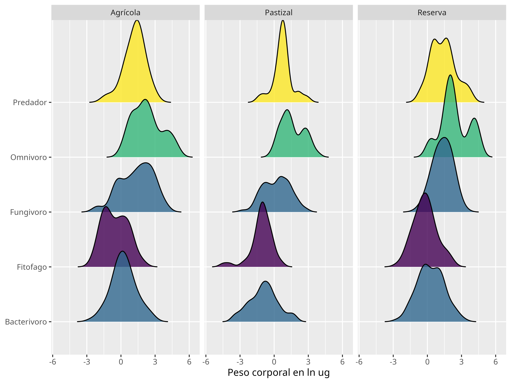
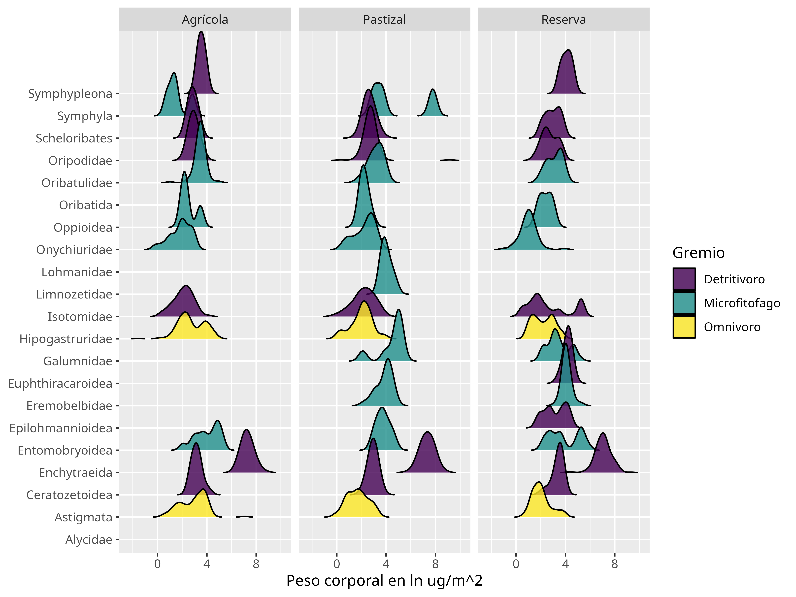
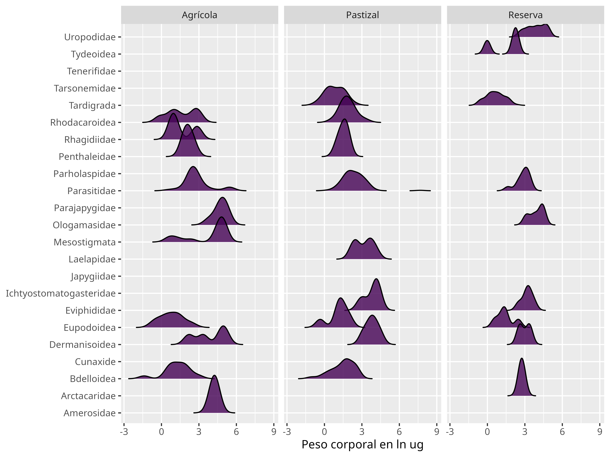
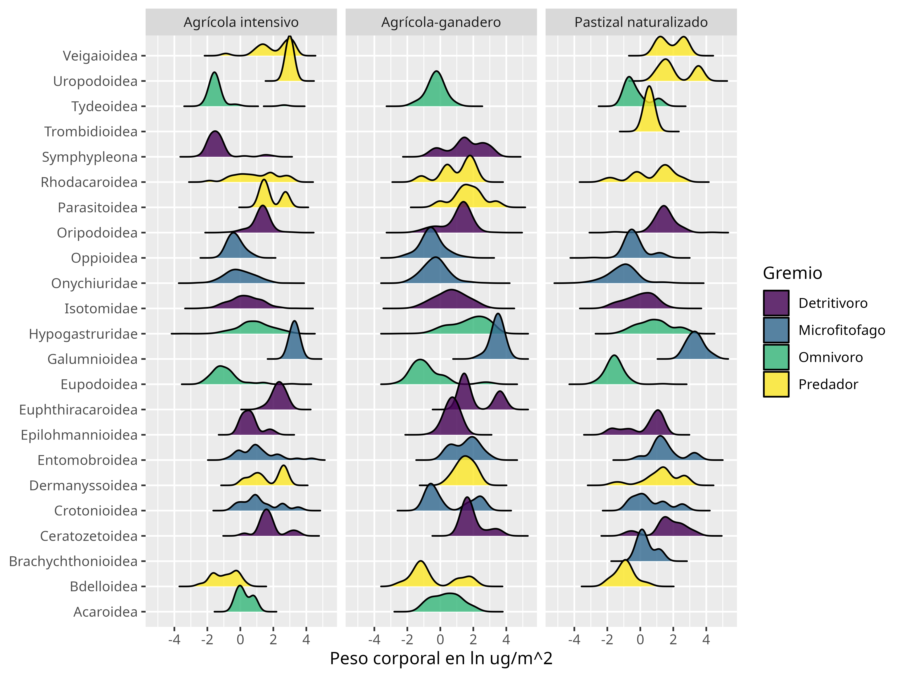
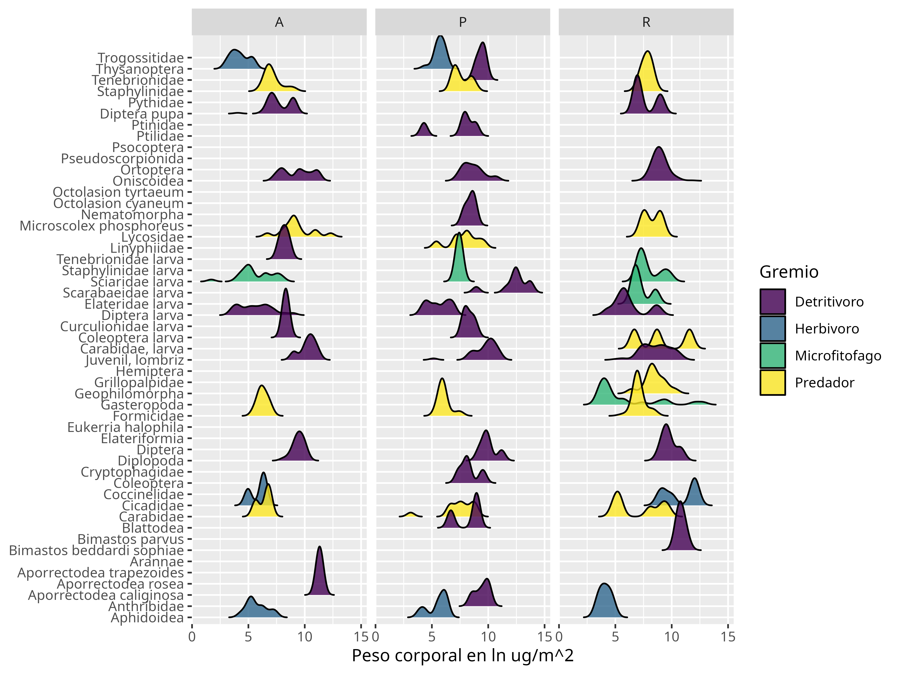
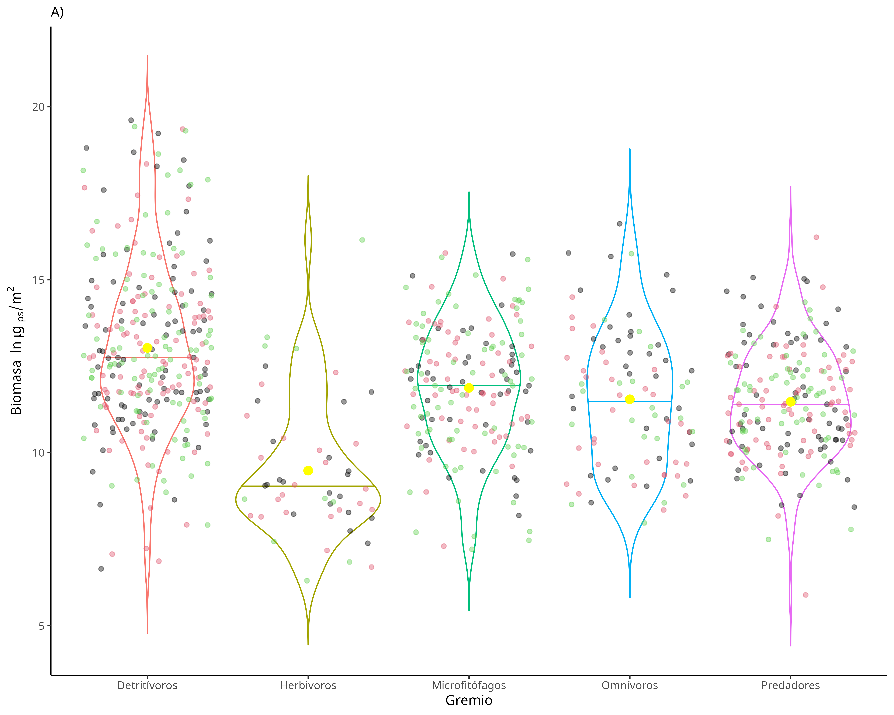
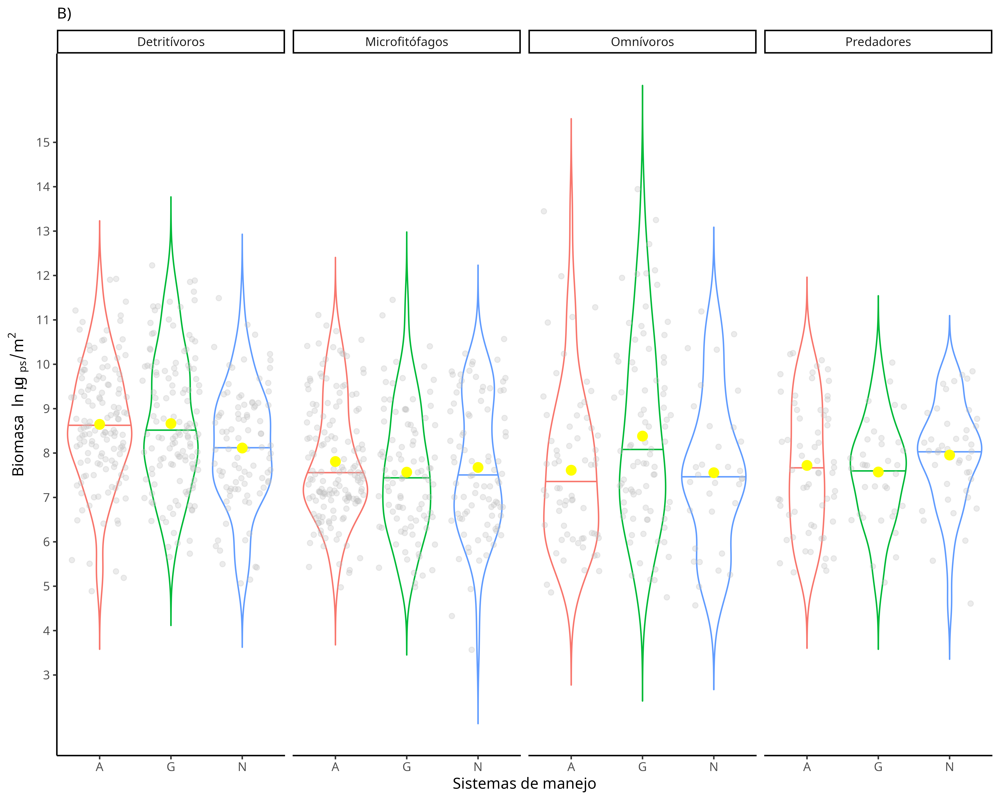
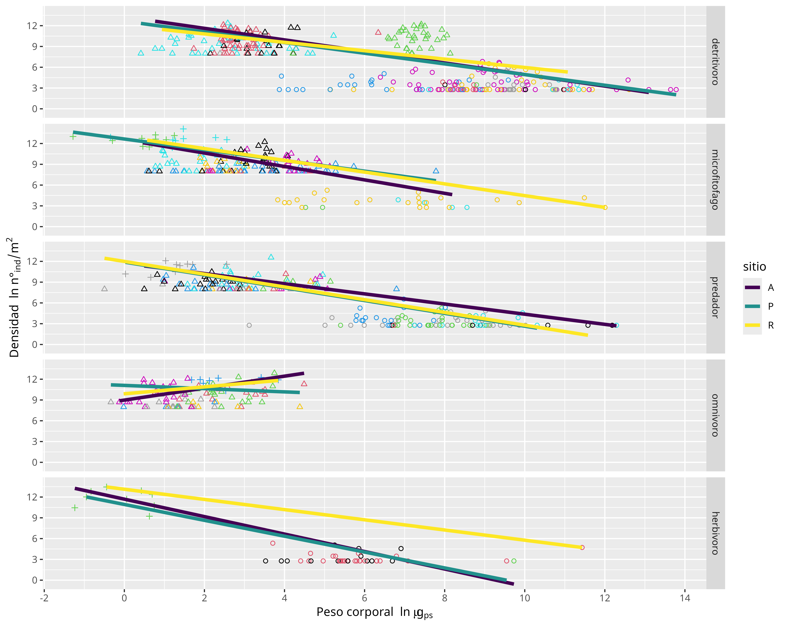
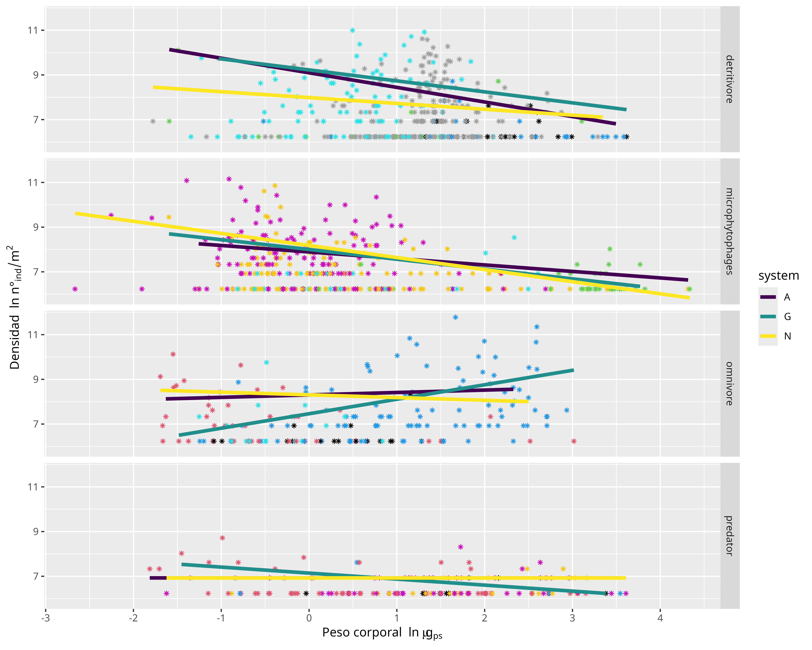

```{r setup, include=FALSE}
knitr::opts_chunk$set(echo = TRUE)
knitr::opts_chunk$set(comment = NA)
loadNamespace('printr')
set.seed(167)
options("digits"=3)
```

```{r lib, include=FALSE}
{require(tidyverse); require(kableExtra); require(quantreg);require(lubridate);
  require(kSamples);require(ggridges);require(gridExtra);require(emmeans)}
```

# Introducción

Los organismos que viven en el suelo ocupan los espacios formados entre la hojarasca 
que se acumula sobre la superficie del suelo y los poros de la matriz 
organo-mineral del suelo [@wallwork1971; @ritz2012].

La fauna edáfica desempeña un papel fundamental en el funcionamiento edáfico a través 
del consumo de materia orgánica, el transporte de propágulos de bacterias y hongos, 
el control de poblaciones, además son los recursos alimenticios de los
organismos <u>zoofagos</u> a lo largo de la red trófica y la fauna edáfica media 
transformaciones biológicas sobre la 
estructura organomineral del suelo (**bioturbación o biotransformación**). 

Estas funciones, a su vez, contribuyen a 
servicios ecosistémicos más amplios afectando la dinámica del ciclo del carbono, 
de los nutrientes y el agua, la regulación de la materia 
orgánica del suelo y la fertilidad química y física del suelo [@brussaard2012; @wurst2012].

El estudio de la biodiversidad de la fauna del suelo mediante la identificación taxonómica 
de las comunidades que habitan la red de poros del suelo 
se dificulta debido a la gran diversidad taxonómica, en constante actualización y revisión, 
y al pequeño tamaño corporal de la criptofauna [@briones2014], 
sumado a esto, la fauna edáfica se caracteriza por formar una comunidad 
con una importante redundancia funcional debido a su gran abundancia y 
sus hábitos alimenticios generalistas [@hattenschwiler2005; @walker1992].

Para avanzar en la compresión de las comunidades crípticas del suelo, los ecólogos del suelo, 
han tomando en cuenta el uso de clasificaciones para agrupar a la criptofauna [@wallwork1970;@brussaard1998]
y saltar de momento la dificil tarea de la identificación a nivel especie específico,
tal como, la clasificación en **gremios tróficos** que agrupa diferentes unidades taxonómicas
con estrategias de alimentación similares, por ejemplo, taxones de "microfitófagos" que serían aquellos
animales que se alimentan de bacterias e hifas de hongos.

Todos los organismos responden a las presiones ambientales, estas respuestas pueden observarse como cambios en los rasgos
morfológicos, fisiológicos, fenológicos o de comportamiento. Las presiones que modifican las características del medio 
también se reflejan como cambios en la estructura poblacional de los diferentes taxones en la comunidad [@sechi2017; 
@mittelbach2019]. 

Por lo tanto, el efecto de las interacciones de los organismos con su ambiente queda reflejado en las 
variaciones poblacionales y en las variaciones de los rasgos individuales. Por ello se puede utilizar 
las variaciones de **rasgos** de los individuos, como respuestas que integran los cambios ocurridos 
en las condiciones del nicho y que en conjunto dpermiten resumir las respuesta de la comunidad 
sin considerar necesariamente la identificación hasta el nivel de especie. Esta estrategia permite 
comprender como es el efecto de los cambios en el ambiente sobre los procesos 
que ocurren en las comunidades ecológicas [@moretti2017; @leguillarme2023; @brussaard2012; @petchey2010].


La fauna edáfica es sensible a las perturbaciones que ocurren sobre el suelo, las actividades de manejo pueden alterar el hábitat y la fuente de los recursos que estos organismos utilizan [@lavelle2006]. Por ejemplo, las perturbaciones pueden alterar los ingresos y salidas de materia orgánica y nutrientes debido a los pulsos derivados de la aplicación de fertilizantes y pesticidas, o pueden alterarse las condiciones del microclima poroso cuando se expone el suelo a factores ambientales en periodos de barbecho (p.e. cuando el cultivo no se encuentra presente), o, en sistemas ganaderos, el efecto de la compactación por el pisoteo sobre la estructura física del suelo que afecta la distribución y el tamaño de los poros.

La estimación del tamaño corporal de los organismos edáficos, medida a partir del peso corporal, 
permite relacionar una respuesta fisiológica como una adaptación a los cambios en el ambiente [@pey2014; @white2007; @turnbull2014]. Las variaciones del tamaño corporal 
en las comunidades ecológicas se analizan mediante las distribuciones del peso corporal 
que configura el espectro de tamaños, esta variable puede relacionarse 
con diferentes aspectos de importancia ecológica, tales como, variaciones 
de espectro de tamaños en los gremios tróficos o grupos funcionales, o cambios en el espectro 
que ocurren en diferentes habitats o variaciones del espectro en función de las posiciones de los taxones en la 
red trófica, entre otras [@edwards2020]. 
También es factible establecer relaciones con la abundancia de los taxones que componen la comunidad
de modo que se tenga encuenta también la importancia numérica de los taxones presentes en el ecosistema,
es así qué, los cambios en ambos parámetros permite relacionar la redundancia funcional y el 
funcionamiento ecosistémico [@briones2014].

Los cambios en la distribución del tamaño corporal de los organismos en una comunidad reflejan cambios en los procesos ecológicos relacionados con variaciones en el ambiente o con variaciones en la red de interaciones biológicas [@pey2014; @white2007], a su vez, la relación directa de ambos parámetros constituye la biomasa media que mide la cantidad de materia orgánica retenida por los nodos en la red de interacciones y se vincula con el metabolismo y el flujo de energía que atraviesa los nodos [@potapov2019, @gauzens2019].

De esta manera, los cambios que ocurren en la biomasa, en el espectro de tamaños o en ambos, enlazan la historia de vida de los organismos y la respuesta individual con las presiones ambientales, con la estructura y dinámica de las comunidades, con los efectos subsecuentes sobre los procesos ecológicos y con el funcionamiento del ecosistema [@sechi2017; @moretti2017; @blanchard2017; @jonsson2005; @peters1986] y pueden dar cuenta de efectos diferenciales debidas a las intensidades de las perturbaciones sobre el ecosistema del suelo asociadas con el uso antrópico.

Mediante el análisis de la biomasa y del espectro de tamaños de la fauna edáfica que habitan 
suelos Argiudoles típicos de
la Pampa Ondulada sometidos a diferentes sistemas de manejo se pretende conocer la respuesta diferencial de 
las comunidades edáficas y determinar cuáles son los efectos del manejo antrópico sobre el espectro de 
tamaño de la edafofauna;
por lo que se espera que la fauna responda con cambios en la biomasa y en el espectro de tamaños 
debido a los efectos que tienen el uso del suelo sobre las comunidades y que los efectos se vean 
reflejados sobre los gremios tróficos de la fauna edáfica.


# Metodología

## Estimación del peso corporal individual de los organismos de la fauna edáfica

El peso corporal de los organismos de la fauna edáfica se estimó a partir de la organismos 
colectados en suelos argiudoles de Luján durante el año 2022 en el cuál se incluyen microfauna, mesofauna y macrofauna.
También se cuantificó el peso corporal de los microartrópodos edáficos ocurridos en suelos de Chivilcoy y Navarro 
[@velazco2023;@velazco2023a]. La fauna edádica fue separada e identificada en taxones y posteriormente fué estimado 
el peso corporal en base seca de las diferentes unidades taxonómicas.

La macrofauna edáfica con tamaños mayores a 1 cm de longitud, 
fue llevada a estufa a 60ºC hasta pesada constante para estimar el peso seco mediante 
balanza analítica con precisión de 1 mg.

Para la fauna edáfica con longitudes corporales menores a 1 cm se tomaron fotografías de cada individuo colectado,
que fueron montados temporalmente. La fauna edáfica fotografiada proveniente de los suelos de 
Luján fué de 4260 de los cuáles 775 fueron nemátodos y 3485 fueron mesofauna. La fauna edáfica fotografiada 
proveniente de suelos de Chivilcoy y Navarro fué de 7208 ácaros y colémbolos. 

Las fotografías se realizaron con un esteroscopio Leica (S8AP0) 
con cámara fotográfica incluida y escala de referencia integrada (Leica 
Application Suite V4.4). 

Mediante el software ImageJ se tomaron las longitudes del largo y ancho corporal que permite estimar el 
peso corporal corporal utilizando ecuaciones morfométricas [@rasband2018; @newton2013] estas son ecuaciones lineales que 
consideran la forma general del taxa y su relaciones con el largo y el ancho corporal [@velazco2023]. Las ecuaciones 
utilizadas son presentadas en el Apéndice 4.1.


A partir de los pesos corporales, expresados en logarimo natural del peso seco en $\mu g_ {\;p.s.}$, 
se graficó el espectro de tamaños del taxón, esto es la distribución de los pesos corporales individuales 
registrados para los organismos dentro de un taxón.

Se calculó el valor del peso corporal medio para el taxón ($\mu g_{\;p.s.}$).

Se calcularon los valores de densidad de cada taxón ($no. ind/m^{2}$) extrapolando a partir las abundancias
absolutas en función del marco de muestreo.

Se calculó la biomasa total media expresada en ($\mu g_{p.s.}/m^{2}$), a partir de
la suma de los pesos corporales individuales del taxón y 
en función del marco de muestreo se llevó su valor a la 
unidad de superficie. 

Además cada taxón se ubicó en una categoría de gremio trófico en función del uso que hacen de los
recursos tróficos [@velazco2023b; @simberloff2022a] tema que fué desarrollado en la sección 
correspondiente al capítulo 2 de la tesis. 
En resumen los gremios tróficos son: **detritívoros** animales cuya dieta se basa principalemente en el consumo de 
la hojarasca que se acumula sobre el suelo (tejido vegetal en descomposición), **microfitófagos** animales 
que consumen preferentemente bacterias y hongos del suelo, **predadores** que son los animales que 
se alimentan de otros animales de la fauna edáfica denominados también como "<u>zoofagos</u>", **omnívoros** 
son los animales de la fauna edáfica que consumen tanto animales como microflora, materia orgánica, etc. 
y los **herbívoros** que basan su dieta en el tejido vegetal vivo que se encuentra en el suelo, es decir, las 
raices y sus exudados.

## Análisis estadístico

Se muestran las distribuciones del espectro de tamaño para cada taxón de la fauna edáfica en comparación
con los sistemas de uso del suelo.

Se resumen los valores medio del peso corporal, de la densidad y de la biomasa media para cada taxon
en relación con cada sistema de manejo.

Esto permite ver las diferencias de estas variables para cada taxón de la fauna edáfica 
y relacionarlas con el impacto del uso del suelo en los diferentes sistemas de manejo. 
Por ejemplo un taxón podría tener 
los valores más altos (o más bajos) de estas variables en un mismo uso del suelo o 
también mostrar heterogeneidad en la reación entre estas variables tal como 
un mayor peso corporal medio en un sistema con bajo impacto pero con 
la mayor densidad y biomasa media en un sistema con mayor impacto en el uso del suelo.

Se analizó la distribución de los pesos corporales mediante la curva de acumulación empírica inversa (Apéndice 4.2) 
en comparación con distribuciones teóricas provenientes de la familia de distribuciones potenciales 
y mediante el criterio de Akaike se determinó que los pesos corporales individuales 
tienen una distribución de tipo logarímica normal [@gillespie2015; @koch1966; @koch1969; @potapov2021], 
lo que permite realizar modelos lineales.

Para cada comunidad se analizó la respuesta de la **biomasa media** de cada gremio trófico 
vinculado con el efecto de los sistemas de manejo. El análisis se realizó utilizando un modelo 
lineal multifactorial: 1) se utilizó el algoritmo "step" para reducir el modelo completo (Apéndice 4.3),
este va quitando interacciones hasta lograr un modelo parsimonioso, para ello se selecciona el modelo con el menor valor 
según el criterio Akaike (AIC), 2) se contrastaron las interacciones relevantes, es decir, aquellas de un mismo gremio 
entre diferentes sistemas de uso por ej. cambios en la biomasa de los detritívoros en el sistema con mayor intensidad de 
uso en comparación con la biomasa de los detritívoros en el sistema sin uso, 3) mediante pruebas de a pares 
corregidas por <u>Benjamini-Hochberg</u> para determinar el nivel de significancia de las interacciones considerando 
p~valor~ menores a 0.1

Las relaciones entre los pesos corporales medios y las abundancias se abordó mediante el uso 
de la **regresión sobre el tercer cuartil** [@white2007], que permite, obtener una relacion de regresión sin realizar 
supuestos sobre la distribución de las variables, por otra parte la regresión sobre el tercer cuartil ($\tau$ = 0,75) 
disminuye el efecto de las especies raras y permite centrarse en los valores más probables del peso adulto de los 
invertebrados edáficos [@cade2003; @turnbull2014].

Mediante la regresión sobre el tercer cuartil se realizaron <u>comparaciones entre los interceptos y las pendientes</u> 
para evaluar la existencia de diferencias, las relaciones de estas con las características ecológicas y 
el impacto de las actividades antrópicas sobre las comunidades de los microartrópodos edáficos [@cade2003]; para ello se 
hizo uso del paquete ["quantreg"](https://cran.r-project.org/package=quantreg) [@koenker2024] que permite realizar 
modelos de regresión de cuartiles y utilizar técnicas de remuestreo (en inglés:*"bootstraping"*) no paramétricas para 
evaluar las diferencias, además, se contrastaron las interacciones relevantes, mediante pruebas de a pares 
corregidas por <u>Benjamini-Hochberg</u> para determinar el nivel de 
significancia de las interacciones considerando p~valor~ menores a 0.1 (Apéndice 4.5)

Se relacionó el peso corporal medio (eje x) versus la densidad (eje y) bajo el efecto de dos factores: los gremios 
tróficos y los sistemas de uso del suelo; este enfoque es conocido en inglés 
como *"Local Size-Density Relationships (**LSDR**)"* , es decir, 
las relaciones entre la densidad y el peso corporal a nivel local.

Se redujo el modelo completo de regresión de cuartiles mediante el algoritmo "step" (Apéndice 4.5), 
el cuál va quitando interacciones hasta lograr un modelo parsimonioso, para ello se selecciona el modelo con el menor 
valor según el criterio Akaike (AIC).

Para el modelo **LSDR** valores de pendientes más pronunciadas, es decir valores de 
pendiente más alejados de cero, se relacionan con impactos fuertes sobre los taxones 
y en este análisis se relaciona con un determinado ambiente, uso del suelo, 
o dentro de un mismo gremio trófico un impacto debida a la competencia por los recursos [@white2007].

Las variables fueron transformadas con logaritmos naturales, 
debido a que la distribución de cada uno de los pesos corporales en conjunto y 
por cada sistema de uso (Apéndice 4.1) ajustan a la distribución logarítmica normal [@koch1966]. 
Todos los análisis se realizaron R 4.2.1 [@clauset2009; @crawley2013].

# Resultados

## Espectro de tamaños, pesos corporales, densidad y biomasa de los taxones de la fauna edáfica en suelos argiudoles típicos de la Pampa Ondulada.

**Nemátodos edáficos de vida libre de suelos Argiudoles de Luján**

Los nemátodos de vida libre del suelo, hallados en los suelos Argiudoles de Luján, mostraron un rango de pesos corporales (Fig 4.1) de 9 órdenes de magnitud, estos van desde pesos mínimos de $e^{-3}\,= 5\;\,10^{-2}\mu g$ hasta pesos máximos de $e^{5,7}\,= 299\,\mu g$.

<p style="text-align: center;">
  
  <br>
  **Figura 4.1.** Espectro de tamaños de nemátodos edáficos de vida libre ocurridos en suelos Argiudoles de Luján, en cada sistema de uso del suelo. Se muestra sobre el eje horizontal la escala en logaritmo natural del peso corporal en microgramos de peso seco. Sobre el eje vertical se indica el gremio trófico.
</p>

Los nemátodos omnívoros y los nemátodos predadores muestran modas del peso corporal mayores que en las demás categorías tróficas, siguen de cerca a los predadores las modas de los nemátodos fungívoros, luego los bacterívoros y los nemátodos fitófagos que en general son más pequeños debido a sus hábitos de vida. Se observan distribuciones bimodales en los nemátodos omnívoros de la reserva y el pastizal, lo que implica dos grupos de tamaños en la misma categoría trófica. La distribución de tamaños de los predadores está menos dispersa que la distribuciones de los demás gremios tróficos.

**Tabla 4.1.** Valores de peso corporal promedio ($ug_{p.s.}$), densidad ($no. ind/m^2$) y biomasa total media ($mg_{p.s.}/m^2$) para las categorías tróficas de nematodos edáficos de vida libre hallados en suelos Argiudoles de Luján

```{r Tab.4.1,echo=FALSE,warning=FALSE,message=FALSE}
Tab4.1 <- read.csv("scripts/database/Tab4-1.txt", sep="")
colnames(Tab4.1)<-c("Taxón", "Sistema", "Peso corporal medio", "Densidad", "Biomasa")
Tab4.1%>% kbl() %>%kable_classic(full_width = F, html_font = "Times New Roman")
```
Los nemátodos omnívoros de la Reserva (Tabla 4.1) muestran el mayor valor de peso corporal promedio y la mayor biomasa media, con relación a todas las categorías tróficas de nemátodos. La mayor abundancia de nemátodos omnívoros se observó en el sistema del pastizal.

En la Reserva se observan los nemátodos predadores (Tabla 4.1) más pesados y con la mayor biomasa media, la mayor abundancia de estos se observa en el sistema del pastizal.

Los nemátodos fungívoros (Tabla 4.1) fueron de bajo peso en promedio en el sistema del pastizal distanciandose del mayor peso promedio observado en el sistema agrícola en 5,2 microgramos, la mayor densidad y la mayor biomasa se registraron en el sistema de la Reserva.

Los nemátodos bacterívoros (Tabla 4.1) muestran valores medios máximos para cada parámetro en el sistema de la Reserva de manera similar se observan valores máximos de cada parámetro para los nemátodos fitófagos en el sistema de la Reserva.

**Mesofauna edáfica no depredadora de suelos Argiudoles de Luján**

La mesofauna del suelo no predadora de los suelos argiudoles de Luján (Fig 4.2) se 
distribuyeron entre los $0,4\mu g$ hasta los $4 \;mg$ de peso corporal.

La distribución de pesos corporales (Fig 4.2) de la mayoría de los taxones son unimodales 
y con una forma en general de tipo campana.

Entre los detritivoros, por la distribución de pesos corporales, destacan los enquitreidos por ser los de mayor tamaño con un rango de distribución entre los 350 y los 4400 $\mu g$ de peso corporal.


<p style="text-align: center;">
  
  <br>
  **Figura 4.2.** Espectro de tamaños de la mesofauna edáfica excluyendo a predadores ocurridos en suelos Argiudoles de Luján. Se muestra sobre el eje horizontal la escala en logaritmo natural del peso corporal en microgramos de peso seco. Sobre el eje vertical se indica el taxón. Los colores de las distribuciones indican el gremio al que pertenecen.
</p>


Los enquitreidos son animales con función ecológica similar a la de las lombrices de tierra 
pero debido a su tamaño corporal tienen un efecto sobre que opera a menor escala, 
tanto en la modificación de la estructura del suelo como en la cantidad de 
hojarasca que ellos procesan. Este taxón muestra (Tabla 4.2) el mayor peso corporal medio, 
la mayor densidad y la mayor biomasa media en el suelo agrícola.

**Tabla 4.2.** Valores de peso corporal medio ($ug_{p.s.}$), densidad ($no. ind/m^2$) y biomasa total media ($mg_{p.s.}/m^2$) para la mesofauna no depredadora de suelos Argiudoles de Luján.


```{r Tab4.2,echo=FALSE,warning=FALSE,message=FALSE}
Tab4.2 <- read.csv("scripts/database/Tab4-2.txt", sep="")
colnames(Tab4.2)<-c("Taxón", "Sistema", "Peso corporal medio", "Densidad", "Biomasa")
Tab4.2%>% kbl() %>%kable_classic(full_width = F, html_font = "Times New Roman")
```

Los ácaros <u>Astigmatas</u> tuvieron el mayor peso corporal medio, la mayor densidad y biomasa en 
el suelo con uso agrícola (Tabla 4.2), estos ácaros por sus estrategias de vida y 
modos de alimentación son considerado ácaros oportunistas que ocurren en ambientes 
perturbados con alta disponibilidad de recursos.

Entre los ácaros oribátidos detritívoros (Tabla 4.2), aquellos con una preferencia por 
recursos como la hojarasca y tallos con un mayor contenido de compuestos estructurales, 
los <u>Oripodidae</u> fueron más pesados, más abundantes y con mayor biomasa en el sistema del pastizal; los <u>Ceratozetoidea</u> tuvieron la mayor biomasa en el suelo de la reserva pero
con el mayor peso corporal en el suelo agrícola y la mayor densidad en el sistema del Pastizal; la familia <u>Scheloribates</u> registra el mayor peso en la Reserva pero la mayor abundancia y biomasa en el pastizal; <u>Eupthiracaroidea y Epilomannioidea</u> ocurrienron solo 
en suelos del pastizal y la reserva, ambos taxones se alimentan dentro de los haces vasculares, los mayores pesos medios, densidad y biomasa se observaron en los suelos de la Reserva.

Dentro de los ácaros oribátidos microfitófagos (Tabla 4.2), aquellos que consumen hifas de hongos, bacterias y otra microbiota, los <u>Oppioidea</u> son la familia con la estructura corporal más pequeña, en los tres sistemas de uso su peso fue de aprox. 12 $\mu g$ y la mayor biomasa se dio en el suelo de la Reserva; la familia <u>Oribatulidae</u> muestra el mayor peso corporal y la mayor biomasa en los suelos agrícolas; la familia <u>Galumnidae</u> posee una estructura corporal en compración con los demás oribátidos de mayor tamaño, estos fueron más pesados en el suelo de pastizal pero más abundantes en el suelo de la reserva; la familia <u>Eremobelbidae</u> no se observó en el sistema agrícola, su peso corporal promedio fué mayor en la reserva donde también muestra la mayor biomasa media.

Entre los colémbolos (Tabla 4.2) destaca la familia <u>Hipogastruridae</u> 
que por consumir nemátodos y carroña de invertebrados a demás de la microflora son omnívoros. 
Para esta familia se observó el mayor peso medio y la mayor densidad en el sistema agrícola.

Los colémbolos <u>Isotomidae</u> fueron más pesados en el suelo de la Reserva y muestran también la mayor biomasa, aunque en el suelo agrícola fueron más abundantes; los <u>Symphypleona</u> no se observaron en el sistema del pastizal, fueron más abundantes en el sistema agrícola donde registra la mayor biomasa pero registraron el mayor peso corporal medio en la Reserva. Estos dos últimos taxones de colémbolos se consideran de hábitos alimenticios detritívoros. 

Los </u>entomóbridos y los oniquiüridos</u> son taxones microfitófagos. La superfamilia </u>Entomobryoidea</u> son colémbolos de gran tamaño, en los suelos de la Reserva estos fueron más pesados y abundantes. Los </u>Onychiuridae</u> son colémbolos **euedáficos** y de pequeño tamaño, en el suelo del pastizal se observó el mayor peso corporal medio y la mayor biomasa aunque en los suelos de la reserva estos fueron más abundantes.

**Mesofauna edáfica depredadora de suelos Argiudoles de Luján**


<p style="text-align: center;">
  
  <br>
  **Figura 4.3.** Espectro de tamaños de los predadores de la mesofauna edáfica ocurridos en suelos Argiudoles de Luján. Se muestra sobre el eje horizontal la escala en logaritmo natural del peso corporal en microgramos de peso seco. Sobre el eje vertical se indica el taxón.

</p>


La mesofauna predadora (Fig 4.3) muestra un rango de pesos corporales entre 0,7 $\mu g$ hasta los 
250 $\mu g$. La mesofauna predadora de los suelos argiudoles de Luján se conforma de ácaros 
mesostigmatas, ácaros prostigmatas, de dipluros y tardígrados.

Estos animales con excepción de los tardígrados son poco abundantes en comparación con la mesofauna "no-predadora", por ello la distribución de sus pesos corporales se observa en muchos casos multimodal (Fig. 4.3), esto podría deberse tanto a las diferencias en tamaños que ocurren 
dentro de la jerarquía taxonómica considerada aquí, es decir, el nivel taxonómico de "Familias"
como a la ocurrencia de individuos en diferentes etapas de vida, es decir, ninfas y adultos.

**Tabla 4.3.** Valores de peso corporal promedio ($ug_{p.s.}$), densidad ($no. ind/m^2$) y biomasa total media ($mg_{p.s.}/m^2$) para la mesofauna predadora de suelos Argiudoles de Luján.


```{r Tab4.3,echo=FALSE,warning=FALSE,message=FALSE}
Tab4.3 <- read.csv("scripts/database/Tab4-3.txt", sep="")
colnames(Tab4.3)<-c("Taxón", "Sistema", "Peso corporal medio", "Densidad", "Biomasa")
Tab4.3%>% kbl() %>%kable_classic(full_width = F, html_font = "Times New Roman")
```

Entre los ácaros mesostigmata (Tabla 4.3) el taxón de mayor peso corporal fué la familia <u>Ichtyostomatogasteridae</u> aunque solo se observaron en el suelo del pastizal; la familia <u>Ologamasidae</u> tuvo la mayor abundancia en los suelos de la reserva pero el mayor peso corporal y biomasa media se observó en el suelo agrícola; los <u>Parasitidae</u> 
tuvieron un mayor peso corporal en el suelo agrícola pero fueron 
más abundantes y con mayor biomasa en el pastizal; los mesostigmatas <u>Dermanisoidea</u> en el sistema agrícola tienen la mayor biomasa y peso corporal; la superfamilia <u>Rhodacaroidea</u> son mesostigmatas **euedáficos**, son predadores de pequeño tamaño, muestran la mayor densidad y biomasa en el pastizal pero el mayor peso corporal promedio en el sistema agrícola.

Entre los ácaros prostigmatas (Tabla 4.3) destaca <u>Cunaxidae</u> con el mayor peso corporal que solo fué registrado en el sistema agrícola. Los <u>Bdelloidea</u> en el sistema del pastizal muestran los mayores valores de peso, densidad y biomasa; los <u>Eupodoidea</u> mostraron biomasas medias similares en los tres sistemas y fueron más abundantes en el sistema agrícola; los <u>pentalidos</u> de la reserva fueron los más pesados y los <u>rhagididos</u> del pastizal fueron los más pesados; los <u>tydeidos</u> en el suelo de la reserva fueron los de mayor peso y biomasa.

**Microartrópodos edáficos de suelos Argiudoles de Chivilcoy y Navarro**

En los suelos de Chivilcoy y Navarro (Fig 4.4) los microartrópodos tienen un espectro de tamaños corporales de 8 órdenes de magnitud, con pesos corporales desde $e^{-3} = 0,05 \mu g$ hasta $e^{4} \approx 60 \mu g$.


<p style="text-align: center;">
  
  <br>
  **Figura 4.4.** Espectro de tamaños de los microartrópodos edáficos ocurridos en suelos Argiudoles de Chyvilcoy y Navarro. Se muestra sobre el eje horizontal la escala en logaritmo natural del peso corporal en microgramos de peso seco. Sobre el eje vertical se indica el taxón. Los colores representan al gremio trófico al cual pertenece el taxón

</p>


Los microartrópodos predadores (Fig 4.4) muestran distribuciones de tamaños con más de una moda. 
También se observa este fenómeno en algunos taxones de detritívoros y microfitófagos.

Los ácaros astigmatas (Tabla 4.4) de la familia <u>Acaroidea</u> no se observaron en el sistema del pastizal naturalizado, esta familia muestra la mayor biomasa en el sistema mixto agrícola ganadero.

Entre los ácaros oribátidos detritívoros (Tabla 4.4) la superfamilia <u>Euphtiracaroidea</u> fué más abundante en el sistema agrícola donde participan con la mayor biomasa aunque el mayor peso en medio se observa en el sistema mixto; los <u>Epilohmannioidea</u> tienen la mayor biomasa en el sistema agrícola ganadero, en los tres sistemas de uso su peso corporal fué de $\approx 2 \;\mu g$; los <u>ceratozétidos</u> fueron más pesados y más abundantes en el sistema mixto; la superfamilia <u>Oripodoidea</u> en el pastizal naturalizado muestra el mayor peso corporal medio aunque 
fueron poco abundantes por lo que las mayores biomasas medias se observan en el sistema agrícola 
intensivo y en el sistema mixto.

**Tabla 4.4.** Valores de peso corporal promedio ($ug_{p.s.}$), densidad ($no. ind/m^2$) y biomasa total media ($mg_{p.s.}/m^2$) para los microartrópodos de suelos Argiudoles de Chivilcoy y Navarro.


```{r Tab4.4,echo=FALSE,warning=FALSE,message=FALSE}
Tab4.4 <- read.csv("scripts/database/Tab4-4.txt", sep="")
colnames(Tab4.4)<-c("Taxón", "Sistema", "Peso corporal medio", "Densidad", "Biomasa")
Tab4.4%>% kbl() %>%kable_classic(full_width = F, html_font = "Times New Roman")
```

De los ácaros oribátidos microfitófagos (Tabla 4.4) los <u>galumnidos</u> por su estructura corporal son los de mayor tamaño, estos pesaron $\approx 31 \;\mu g$ tanto en el pastizal naturalizado como en el suelo agrícola ganadero; la superfamilia <u>Crotonioidea</u> en el sistema agrícola intensivo tiene la mayor biomasa; los oribátidos <u>oppididos</u> son oribátidos **euedáficos** con una estructura corporal pequeña, estos muestran el mayor peso corporal medio
en el pastizal naturalizado pero la mayor densidad y biomasa media en el sistema agrícola intensivo.

Los colémbolos (Tabla 4.4) omnívoros <u>Hipogastruridae</u> muestran los mayores valores de biomasa
en los sistemas con uso antrópico del suelo. Los <u>Symphypleona</u>, colémbolos detritívoros,
fueron muy abundantes en el sistema agrícola pero con el menor peso corporal medio. 
En el sistema mixto los colémbolos 
detritívoros de la familia <u>Isotomidae</u> muestran la mayor biomasa media; los colémbolos 
microfitófagos de la superfamilia <u>Entomobroidea</u> muestran la mayor biomasa media 
en el sistema mixto agrícola ganadero aunque el mayor peso corporal medio se observó
en el sistema del pastizal naturalizado; los <u>Onychiuridae</u> son colémbolos microfitófagos
**euedáficos**, estos colémbolos muestran el mayor peso corporal medio y biomasa media en el 
sistema agrícola intensivo.

La superfamilia de ácaros mesostigmata (Tabla 4.4) <u>Dermanyssoidea</u> 
tuvieron el mayor peso corporal medio y la mayor biomasa media en el sistema agrícola intensivo.
La superfamilia <u>Parasitoidea</u> no se observó en el pastizal naturalizado, 
en los demás sistemas es poco abundante y tuvo el mayor peso corporal medio en el sistema mixto.
Los mesostigmata <u>rhodacaridos</u>, son **euedáficos** en general de pequeño tamaño, 
tuvieron el mayor peso corporal medio en el sistema agrícola intensivo y la 
mayor densidad ocurrió en el pastizal naturalizado; los <u>uropodidos y vegaioideos</u> son importantes en términos de biomasa en el sistema agrícola intensivo.

Los ácaros prostigmatas (Tabla 4.4) <u>Bdelloidea</u> tuvieron el mayor peso corporal medio
en el sistema mixto. Los prostigmatas <u>Eupodoideas</u> tuvieron el mayor peso corporal medio en 
el sistema mixto, muestran la mayor densidad en el pastizal naturalizado y la mayor biomasa media 
en el sistema agrícola intensivo. Los prostigmatas <u>trombidioidea</u> en el sistema agrícola intensivo registran la mayor biomasa y los prostigmatas <u>tydeidos</u> con pesos corporales 
medios de $\approx 1 \;\mu g$ son más abundantes en el sistema agrícola intensivo.

**Macrofauna edáfica de suelos Argiudoles de Luján**

La macrofauna edáfica (Fig 4.5) en suelos argiuoles de Luján tiene una distribución de tamaños de 
10 órdenes de magnitud con pesos corporales en un rango entre los $12 \mu g$ hasta los $270 \;mg$, 
la forma del espectro de tamaños de este grupo de la fauna edáfica en general no es unimodal
y esto está relacionado con la baja abundancia de la mayoría de los taxones observados.

<p style="text-align: center;">
  
  <br>
**Figura 4.5.** Espectro de tamaños de la macrofauna edáfica ocurridos en suelos Argiudoles de Luján. Se muestra sobre el eje horizontal la escala en logaritmo natural del peso corporal en microgramos de peso seco. Sobre el eje vertical se indica el taxón. Los colores representan al gremio trófico al cual pertenece el taxón.

</p>


Las lombrices de tierra del género <u>Aporrectodea</u> tienen pesos corporales medios (Tabla 4.5) en un rango de 22,5 mg hasta los 119 mg, *A. trapezoides* muestra el mayor peso corporal medio 
y este ocurrió en el sistema agrícola. La mayor biomasa media del género ocurre en el sistema agrícola con la especie *A. caliginosa*, por otra parte, la especie con la mayor densidad 
en este género se observa en la Reserva y corresponde a la especie *A. trapezoides*. 

El género *Bimastus sp*. solo se observó en la reserva; *Eukerria sp.*, *Microscolex sp.* y *Octolasion tyrtaeum* solo se observaron en el pastizal; *Octolasion cyaneum* solo estuvo presente en el sistema agrícola.

Fué importante la contribución numérica de las lombrices juveniles en los tres sistemas de uso del suelo, la mayor densidad de estas se observó en la reserva donde también se observó la mayor biomasa pero con el menor peso corporal en promedio.

**Tabla 4.5.** Valores de peso corporal promedio ($ug_{p.s.}$), densidad ($no. ind/m^2$) y biomasa total media ($mg_{p.s.}/m^2$) de la macrofauna de suelos Argiudoles de Luján.


```{r Tab4.5,echo=FALSE,warning=FALSE,message=FALSE}
Tab4.5 <- read.csv("scripts/database/Tab4-5.txt", sep="")
colnames(Tab4.5)<-c("Taxón", "Sistema", "Peso corporal medio", "Densidad", "Biomasa")
Tab4.5%>% kbl() %>%kable_classic(full_width = F, html_font = "Times New Roman")
```

Los detritívoros <u>Blattodeos</u> (Tabla 4.5) fueron de menor peso corporal en el sistema agrícola. Los detritívoros <u>Diplópodos</u> ("milpies") fueron impotantes en términos de biomasa en el sistema agrícola aunque los animales con mayor peso corporal medio se observaron en el pastizal. Las <u>larvas de los dípteros</u> son detritívoros con una importante abundancia numérica en comparación a otros detritívoros de la macrofauna. En el suelo estos animales ocurren con mayor densidad en el sistema agrícola donde tambien se observaron las larvas más pesadas. Las <u>larvas de scarabeidos</u> ("gusanos blancos") son detritívoros fácilmente identificables al momento de
explorar un monolito de suelo, la mayor biomasa media se observó en el sistema del pastizal y
el mayor peso corporal medio se observó en el sistema agrícola donde pesaron 490 mg. Los <u>Oniscoidea</u> ("Bichos bolita") muestran la menor densidad en suelos bajo sistema agricola, mayor biomasa media se observó en la Reserva. Las <u>larvas de los dípteros Sciaridae</u> forman parte de la macrofauna **microfitófaga** estos ocurrieron en los tres sistemas de uso del suelo y su biomasa fue mayor en la reserva donde el peso corporal medio fué el más alto.

Los <u>carábidos</u>, son coleópteros predadores, su biomasa fue similar en la reserva y en el pastizal y en promedio los carábidos más pesados ocurrieron en la reserva. Los <u>staphylinidos</u>, son coleópteros predadores, tuvieron una mayor biomasa y un mayor peso corporal en el pastizal. Los miriapodos <u>Geophilomorpha</u> ("cienpies") fueron importantes en biomasa y peso corporal en los suelos de la reserva. Entre las arañas se observaron <u>Lycosidae</u> con mayores biomasas en el sistema agrícola y <u>Linyphiidae</u> con la mayor biomasa en el suelo del pastizal. Los <u>formicidos</u>, en los suelos actúan como predadores generalistas, estos tuvieron la mayor biomasa y el mayor peso corporal en la reserva.

En los suelos también se observaron macrofauna con hábitos alimenticios hervíboros, entre estos: 
los <u>áfidos</u> importantes en términos de biomasa en el sistema agrícola, los 
<u>Thysanoptera</u> ("trips") con los pesos corporales y la biomasa más altos en el pastizal y los 
caracoles *geófilos* que solo se observaron en la reserva.


## Análisis de la Biomasa Media de los gremios tróficos de las comunidades de la fauna edáfica de suelos Argiudoles típicos de la Pampa Ondulada

En los suelos de Luján las diferencias de la biomasa media en la comunidad de la fauna edáfica
se explicaron por las diferencias que ocurren debidas al efecto de cada gremio
trófico. 

Los sistemas de uso del suelo, sin embargo, no son relevantes para el modelo 
por lo que entre sistemas de uso del suelo los valores de biomasas medias son similares.

$$B_i = \mu_0 +  \text{G}_i + \epsilon_i$$

Donde:

-   $B_i$ representa el logaritmo natural de la Biomasa total media.
-   $\mu_0$ representa el promedio de Biomasa total media.
-   $\text{G}$ captura el efecto del i-esimo gremio trófico en la biomasa.
-   $\epsilon$ error aleatorio.


<p style="text-align: center;">
  
  <br>
  **Figura 4.6.** Diagrama de violines de la distribución de la biomasa media de los gremios tróficos de la fauna edáfica hallados en suelos Argiudoles típicos de Luján. El eje vertical expresa el valor de biomasa media en logaritmo natural. Sobre los violines se dibuja el promedio como un punto amarillo y la mediana como una linea horizontal. Los puntos pequeños representan el puntual de biomasa media de los taxones hallados en diferentes muestras, los colores de los puntos indican los sistemas de uso del suelo. La distribución de los puntos es aleatoria (tipo ruido blanco, en inglés: *"jitter"*) no indica frecuencia y su valor solo expresa la biomasa media ubicada sobre el eje vertical.

</p>

Los gremios tróficos (Fig 4.6) fueron diferentes significativamente entre sí ($q :p_{valor}<0.05$).
El gremios de omnívoros, microfitófagos y predadores no se diferencian entre sí por lo que 
comparten valores de biomasas medias similares (Apéndice 4.3). Entonces los detritívoros son el 
gremio con la mayor biomasa media (≈4,6x10^5^ µg~p.s.~.m^-2^), luego los microfitófagos, omnívoros 
y predadores con su valor de biomasa (≈1,1x10^5^ µg~p.s.~.m^-2^) similar entre sí y por último los herbívoros (≈1,4x10^4^ µg~p.s.~.m^-2^) con el menor valor de biomasa media.

Por otra parte, la biomasa media de la comunidad de la fauna edáfica que ocurre en suelos 
argiudoles de Luján se mantiene alrededor de ≈163 mg~p.s.~.m^-2^ aunque 
la comunidad de la fauna edáfica se encuentre bajo diferentes formas de uso del suelo. 

En los suelos argiudoles de Chivilcoy y Navarro la biomasa media de los microartrópodos edáficos 
se explicaron por los efectos del sistema de uso del suelo, por el efecto de 
los gremios tróficos y por interacciones entre los gremios tróficos y los sistemas de uso.

$$B_{ij} = \mu_0 + \text{S}_i + \text{G}_j + \text({S x G})_{ij} + \epsilon_i$$

Donde:

-   $B_{ij}$ representa el logaritmo natural de la Biomasa total media.
-   $\text{S}$ representa el efecto del i-esimo sistema de uso del suelo.
-   $\text{G}$ captura el efecto del j-esimo gremio trófico en la biomasa.
-   $\text{S x G}$ representan las interacciones entre sistema de uso y gremios tróficos.
-   $\epsilon$ error aleatorio.

Al nivel de las interacciones (Fig 4.7), analizando las diferencias <u>dentro</u> de un mismo gremio trófico en comparación con diferentes sistemas de uso del suelo (Apendice 4.3), se observa que la biomasa media de los detritívoros de los sistemas agrícola intensivo y mixto agrícola ganadero no se diferenciaron entre sí (≈5,4x10^4^ µg~p.s.~.m^-2^), se observaron diferencias significativas ($q :p_{valor}<0.1$) de estos dos grupos en comparación con los detritivoros del sistema del pastizal naturalizado siendo los detritívoros del pastizal naturalizado 
(≈3,6x10^4^ µg~p.s.~.m^-2^) aquellos con una menor biomasa media.

Los omnívoros fueron similares en los sistemas del pastizal naturalizado y el sistema agrícola 
(≈1,6x10^4^ µg~p.s.~.m^-2^) y difirieron significativamente ($q :p_{valor}<0.05$) de la biomasa media de los omnívoros que fué mayor (≈3,6x10^4^ µg~p.s.~.m^-2^) en el sistema mixto agrícola ganadero.

El gremio de los microfitófagos fué similar en todos los sistemas de uso del suelo al igual que lo 
fué la biomasa media del gremio de los predadores, ambos con biomasas medias al rededor de 
2,4x10^4^ µg~p.s.~.m^-2^.

Además, existen diferencias significativas ($q :p_{valor}<0.1$) en otras combinaciones dadas <u>entre</u> diferentes gremios tróficos y diferentes sistemas de uso del suelo.


<p style="text-align: center;">
  
  <br>
  **Figura 4.7.** Diagrama de violines de la distribución de la biomasa media de los gremios tróficos de microartrópodos edáficos hallados en los diferentes sistemas de uso del suelo en los suelos Argiudoles típicos de Chyvilcoy y Navarro. El eje vertical expresa el valor de biomasa media en logaritmo natural. Sobre los violines se dibuja el promedio como un punto amarillo y la mediana como una linea horizontal. Los puntos pequeños representan el valor puntual de biomasa media de diferentes taxones en diferentes muestras. La distribución de los puntos es aleatoria (tipo ruido blanco, en inglés: *"jitter"*) no indica frecuencia y su valor solo expresa la biomasa media ubicada sobre el eje vertical.
</p>

Las biomasas medias del gremio de los detritívoros fué mayor significativamente 
que los microfitófagos, predadores y omnívoros gremios tróficos que comparten un valor de biomasa media similar.

Entre los sistemas de uso del suelo la biomasa media de la comunidad de microartrópodos edáficos
no mostró diferencias significativas, es decir, la biomasa media en los diferentes 
sistemas de uso del suelo se mantienen alrededor de 3,1x10^4^ µg~p.s.~.m^-2^.


## Relaciones entre el pesos corporales medio y la densidad de los taxones de los gremios tróficos de las comunidades edáficas que habitan suelos con diferentes intensidades de uso en suelos Argiudoles típicos de la Pampa Ondulada

La regresión de cuartiles (Apéndice 4.4) permitió establecer relaciones 
entre el peso corporal medio y la densidad de los taxones y 
entre los gremios tróficos y los sistemas de uso del suelo.

En los suelos Argiudoles de Luján el modelo indica que existen efectos 
entre los gremios tróficos y el sistema de uso del suelo sobre el intercepto. 
También indica que existe efecto de los gremios tróficos sobre la variación de las 
pendientes de regresión. En cambio los sistemas de uso del suelo 
no tuvieron efecto sobre cambios en la pendiente.

$$ D_{ijk}^{\;\;\tau} = \beta_0^{\;\;\tau} + \beta_i^{\;\;\tau} + \beta_0S_j^{\;\;\tau} + \beta_0G_k^{\;\;\tau} + \beta_0\text(SxG)_{jk}^{\;\;\tau}  + \beta_iG_j^{\;\;\tau} + \epsilon^{\;\;\tau} $$

Donde:

-   $\tau$: refiere al quartil ($\tau \; = 0.75$) sobre el cual se realiza la regresión lineal no paramétrica.

-   $D_{ijk}$: Es la densidad del taxón del gremio j-esimo en el sistema k-esimo de uso del suelo.

-   $\beta_0^{\;\;\tau}$: Intercepto sobre el tercer cuartil del modelo.

-   $\beta_i^{\;\;\tau}$: Pendiente de regresión del modelo.

-   $\beta_0S_j^{\;\;\tau}$: Efecto del j-ésimo sistema de uso del suelo sobre el intercepto del modelo.

-   $\beta_0G_k^{\;\;\tau}$: Efecto del k-ésimo gremio trófico sobre el intercepto del modelo.

-   $\beta_0\text(SxG)_{jk}^{\;\;\tau}$: Efecto de las interacciones entre el j-ésimo sistema de uso del suelo y del k-ésimo gremio sobre el intercepto del modelo.

-   $\beta_iG_j^{\;\;\tau}$: Efecto del k-ésimo gremio trófico sobre la pendiente de regresión del modelo.

-   $\epsilon^{\;\;\tau}$: error aleatorio del modelo de regresión de cuartiles.

En la figura 4.8 se observan los diferentes gremios tróficos con las regresiones sobre 
cada sistema de uso del suelo.

Se observan (Fig 4.8) diferentes rangos de distribución de los 
pesos corporales medios (<u>eje x</u>).
Los omnívoros son la categoría trófica con el menor rango de distribución del 
peso corporal medio. Los taxones de mayor peso ocurrieron en la categoría de los detritívoros 
en el que se encuentran las lombrices de tierra y los coleópteros scarabeidos, 
los gremios tróficos con los taxones de menor peso son microfitófagos y herbívoros 
ya que aquellos incluyen a los nemátodos (microfauna).

Se observa (Fig 4.8) que tanto los nemátodos omnívoros como los microartrópodos omnívoros tienen relaciones de densidad y de pesos corporales solapadas entre sí.


<p style="text-align: center;">
  
  <br>
  **Figura 4.8.** Regresión de cuartiles ($\tau = 0,75$) entre el peso corporal y la densidad de los taxones de gremios tróficos ocurridos en diferentes sistemas de uso en suelos Argiudoles de Luján. Los ejes de coordenadas expresan los valores de peso corporal (µg~peso seco~) y de la densidad (nº individuos/m^2^) en logaritmo natural. Se dibuja un plano de coordenadas (cada subdivisión del gráfico) para cada gremio trófico. Se dibuja una linea de regresión por cada sistema de uso del suelo. La forma de los puntos indica la categoría de tamaños al que pertenece el taxón: cruces = microfauna, triángulos = mesofauna, círculos = macrofauna. Los colores de los puntos indican diferentes taxas.

</p>


El gremio de los detritívoros (Fig 4.8) no tiene taxones de nemátodos debido a sus hábitos alimenticios. Se observa que las abundancias de la mesofauna y de la macrofauna se separan a lo largo del <u>eje y</u> indicando mayores abundancias para la categoría de la mesofauna, aunque en términos de pesos corporales promedios (<u>eje x</u>) se observan pesos superpuestos entre organismos de la mesofauna de mayor peso corporal y la macrofauna de menor peso corporal.

El gremio de los microfitófagos, a lo largo del <u>eje y</u> muestra una estructura escalonada (Fig 4.8), con los nemátodos siendo los de mayor abundancia, seguidos por la mesofauna y luego de una "brecha" sobre el eje de las abundancias siguen los microfitófagos de la macrofauna.

Los predadores de la fauna del suelo tienen un rango de tamaños similar al de los microfitófagos 
(Fig 4.8). Se observaron entre los predadores de menor peso corporal
animales de la mesofauna con pesos corporales menores al de los nemátodos (microfauna), 
esto se explica porque existen formas juveniles de la mesofauna predadora 
que solapan su peso corporal con el peso corporal de los nemátodos predadores.
Por otra parte, los predadores de la macrofauna y los predadores de la mesofauna no 
se solaparon sobre <u>el eje x</u>, estableciendose así, una separación clara 
de la macrofauna predadora respecto de las categorías de menor tamaño.

Los herbívoros (Fig 4.8) solo tuvieron taxones en la microfauna y en la macrofauna.

La interacción entre el sistema de uso del suelo y los gremios tróficos ($C_2^5=105$ combinaciones) marcan un efecto sobre el intercepto del modelo (Apéndice 4.4). 

Los herbívoros difirieron significativamente ($>|\;t\;| : p_{value}<0.1$) entre sistemas,
en la Reserva tuvieron un mayor valor del intercepto (Fig 4.8), 
en comparación con el intercepto del sistema agrícola y el sistema del pastizal con valores 
similares

Con respecto a los microfitófagos (Fig 4.8) aquellos ubicados en la Reserva y el Pastizal tuvieron valores de interceptos similares, si difieren significativamente ($>|\;t\;| : p_{value}<0.1$) del sistema Agrícola que posee un menor valor sobre el intercepto. 

Por otra parte, ni los detritívoros, ni los predadores, ni los omnívoros, difirieron en su efecto 
sobre el intercepto entre diferentes sistemas de uso del suelo (Apéndice 4.4).

Las pendientes de los gremios tróficos en general tuvieron valores negativos (Apéndice 4.4), correspondiéndose con el hecho de que los organismos más abundantes son aquellos taxones con el menor peso corporal medio. Sin embargo, la categoría del gremio de los omnívoros presentaron valores de pendientes positivos ($>|\;t\;| : p_{value}<0.05$) esto implica que los omnívoros con tengan mayores densidades a mayor peso, aunque esta relación se encuentra truncada a 
valores de peso corporal por debajo de $e^5 \approx 150 \mu g$.

Todos los gremios difirieron significativamente entre sí sobre la pendiente (Apéndice 4.4).
Los valores de las pendientes para cada gremio trófico conforma un gradiente, de mayor a menor,
resulta en: omnívoros con pendiente positiva ($m \approx 0.73$), detritívoros ($m \approx -0.77$), 
microfitófagos ($m \approx -0.85$), predadores ($m \approx -0.87$) y los herbívoros ($m \approx-1.15$) con las pendientes más pronunciadas.

Las pendientes <u>dentro</u> de los gremios tróficos en comparación con los diferentes sistemas de uso del suelo (Apéndice 4.4) no difirieron en los gremios de omnínoros, detritívoros ni predadores. Si se encontraron diferencias en los microfitófagos y los herbívoros (Apéndice 4.4).
En el caso de los microfitófagos las pendientes de los sistemas Reserva y Pastizal no difirieron pero si hubo diferencias con la pendiente del sistema agrícola que resultó ser menor. Para el caso de los herbívoros las pendientes del sistema agrícola y el pastizal fué similar y de menor valor
difiriendo de la Reserva que resultó en un mayor valor.

La regresión de quantiles evaluada entre la densidad y el peso medio de los taxones de 
**microartrópodos edáficos**, que ocurrienron en suelos de Chivilcoy y Navarro, 
indica que existen interacciones con efecto sobre la pendiente debidas al sistema de uso del suelo 
y a los gremios tróficos, además interacciones sobre el intercepto debidas a los sistemas de uso 
del suelo y a los gremios tróficos.

$$ D_{jk}^{\;\;\tau} = \beta_0^{\;\;\tau} + \beta_i^{\;\;\tau} + \beta_iS_j^{\;\;\tau} + \beta_iG_k^{\;\;\tau} + \beta_0S_j^{\;\;\tau} + \beta_0G_k^{\;\;\tau} + \beta_0(S\,x\,G)_{jk}^{\;\;\tau} + \beta_i(S\,x\,G)_{jk}^{\;\;\tau} +  \epsilon^{\;\;\tau} $$

-   $\tau$: refiere al quartil ($\tau \; = 0.75$) sobre el cual se realiza la regresión lineal no paramétrica.
-   $D_{jk}^{\;\;\tau}$: Densidad del taxón del j-ésimo sistema de uso del suelo en el k-ésimo gremio trófico.
-   $\beta_0^{\;\;\tau}$: Intercepto sobre el tercer cuartil del modelo.
-   $\beta_i^{\;\;\tau}$: Pendiente de regresión del modelo.
-   $\beta_iS_j^{\;\;\tau}$: Efecto del j-ésimo sistema de uso del suelo sobre la pendiente de regresión.
-   $\beta_iG_k^{\;\;\tau}$: Efecto del k-ésimo gremio trófico sobre la pendiente de regresión.
-   $\beta_0S_j^{\;\;\tau}$: Efecto del j-ésimo sistema de uso del suelo sobre el intercepto del modelo.
-   $\beta_0G_k^{\;\;\tau}$: Efecto del k-ésimo gremio trófico sobre el intercepto del modelo.
-   $\beta_0(S\,x\,G)_{jk}^{\;\;\tau}$: Efecto del j-ésimo sistema de uso del suelo y del k-ésimo gremio trófico sobre el intercepto del modelo.
-   $\beta_i(S\,x\,G)_{jk}^{\;\;\tau}$: Efecto del j-ésimo sistema de uso del suelo y del k-ésimo gremio trófico sobre la pendiente de regresión.
-   $\epsilon^{\;\;\tau}$: error aleatorio del modelo de regresión de cuartiles.

Los microartrópodos microfitófagos (Fig 4.9) exiben el mayor rango de tamaños corporales (eje x) de al menos 6 órdenes de magnitud, en esta categoría se observaron en el sistema del pastizal naturalizado los taxones con el menor peso corporal medio. 

Los detritívoros y predadores muestran un rango de pesos corporales similar (Fig 4.9) entre $e^{-2}\approx0,15\,\mu g$ y $e^{3,5}\approx35\,\mu g$. 

Con excepción de los predadores cuya densidad es baja ($y<e^{\,9}\,\approx8100\,ind/m^2$) en todos los sistemas de uso del suelo la densidad de los gremios tróficos se movió alrededor de 6 órdenes de magnitud entre $e^{6}\approx405\,ind/m^2$ y $e^{12}\approx163000\,ind/m^2$.


<p style="text-align: center;">
  
  <br>
  **Figura 4.9.** Regresión de cuartiles ($\tau$ = 0,75) entre el peso corporal y la densidad de los taxones de gremios tróficos de microartrópodos ocurridos en diferentes sistemas de uso en suelos Argiudoles de Chivilcoy y Navarro. Los ejes de coordenadas expresan los valores de peso corporal (ug~peso seco~) y de la densidad (nº individuos/m^2^) en logaritmo natural. Se dibuja un plano de coordenadas (cada subdivisión del gráfico) por gremio trófico. Se dibuja una linea de regresión por cada sistema de uso del suelo. Los colores de los puntos indican diferentes taxones.
</p>

La variación de cada gremio trófico sobre el intercepto (Apéndice 4.4) fué diferente significativamente ($>|\;t\;| : p_{value}<0.1$), los detritívoros y omnívoros comparten valores de interceptos similares y con el mayor valor, siguen a estos los microfitófagos y los predadores. 

La variación de los sistemas de uso del suelo sobre el intercepto no resultó diferente significativamente.

Al nivel de las interacciones sobre el intercepto, esto es combinaciones sistemas de uso del suelo - gremios ($C_2^{12} = 66$), y considerando variaciones <u>dentro</u> de los gremios tróficos <u>entre sitios</u>, solo se reportan (Apéndice 4.4) diferencias estadísticamente significativas ($>|\;t\;| : p_{value}<0.1$) para el gremio de los detritívoros, los microartrópodos detritívoros del sistema agrícola y del sistema mixto comparten interceptos similares ($e^{9,15}\approx9414\,ind/m^2$) y se diferenciaron del sistema del pastizal naturalizado cuyo intercepto resultó menor ($dif \approx\,1,16$).

Entre los sistemas de uso del suelo no se observan efectos significativos sobre la pendiente de la regresión de cuartiles (Apéndice 4.4). Con respecto a los gremios tróficos existieron diferencias significativas del efecto de los gremios sobre las pendientes ordenándose de mayor a menor valor de pendiente como omnívoros, detritívoros, microfitófagos y predadores.

Al nivel de las interacciones ($C_2^{12} = 66$) y observando (Apéndice 4.5) solo aquellas que ocurren <u>dentro</u> de los gremios tróficos de microartrópodos edáficos <u>entre</u> los diferentes sistemas de uso del suelo se observó: para el gremio de los detritívoros del sistema agrícola y del sistema mixto, que a la vez no se diferenciaron entre sí, valores negativos ($>|\;t\;| : p_{value}<0.05$), por lo que comparten un valor similar de pendiente de ($m = -0.55$) y el valor de la pendiente de los detritívoros ubicados en la Reserva no se diferenció de la constante ($m=0$); para el gremio de los microfitófagos ($>|\;t\;| : p_{value}<0.05$) las pendientes fueron negativas en todos los sistemas de uso del suelo y entre los sistemas de uso del suelo estos no se diferenciaron significativamente (Apéndice 4.5) por lo que comparten un valor de pendiente similar de $m \approx-0.4$; en el caso de los omnívoros aquellos que se hallaron en el sistema mixto agrícola-ganadero (Fig. 4.9) muestran una pendiente positiva ($m = 0.65$), por lo que omnívoros de mayor peso son más abundante en el sistema mixto, para los demás sistemas de uso las pendientes no se diferencaron de la constante (Apéndice 4.4) por lo que 
diferentes pesos corporales comparten densidades similares; los predadores en cada sistema de uso del suelo no expresaron pendientes diferentes significativamente de cero, lo que implica que las abundancias de los predadores es similar para cada peso corporal medio en cada sistema de uso del suelo.

# Discusión

La fauna edáfica, aunque muy diversa y abundante, representan una pequeña fracción de
la biomasa total del suelo ya que esta recae sobre los organimos de la microbiota edáfica
[@hale1971].

Sin embargo, la fauna edáfica debido a su amplio rango de pesos corporales,
a sus mecanismos de alimentación y al modo y uso que hacen de los recursos en el ecosistema 
edáfico, cumplen un papel crucial en la estimulación de la actividad microbiana, en el control de 
las poblaciones de la microflora y de la fauna edáfica, son vehículos de transporte de propágulos 
de la microbiota y participan en las modificaciones en la estructura física 
y química del medio edáfico [@butcher1971], por lo que la magnitud de los cambios en la comunidad 
de la fauna edáfica podría  derivar en cambios con impacto significativos en los procesos 
ecológicos y biogeoquímicos en el suelo.

El espectro de pesos corporales de la comunidad edáfica abarca desde pequeños organismos como los 
nemátodos fitófagos hasta las grandes larvas de coleópteros scarabeidos por lo que el rango del 
espectro alcanza aproximadamente 13 ordenes de magnitud.

Las distribuciones del peso corporal en general son unimodales a medida que son más abundantes.
Esto implica que los pesos promedios de los taxones son suficientemente representativos
de la respuesta de estos ante las variaciones en las condiciones del nicho.

Al considerar parámetros que reflejan 
mecanismos de respuestas a las variaciones en las condiciones 
ambientales o del nicho debidas a las prácticas de manejo atribuidas a los
diferentes sistemas de uso del suelo
los taxones responderán mediante cambios en la densidad, 
mediante disminuciones o aumentos en los pesos corporales, o mediante variaciones en la biomasa 
media. 

Aquí se observaron respuestas heterogéneas en los valores promedios del 
peso corporal, sus densidades y sus biomasas medias, al ser comparados 
entre sistemas de uso del suelo. 

Algunos taxones tuvieron pesos corporales medios, 
densidades y biomasas medias mayores en un mismo sistema edáfico por lo tanto esto es una 
respuesta integral que indica condiciones ambientales que favorecen al taxón.
Otros taxones responden con biomasas medias y densidades mayores pero con pesos corporales 
menores en un determinado ambiente, esto indica un incremento numérico de organismos pequeños
dentro del taxón en el ambiente pero a la vez nos dice que si bien el peso corporal 
podría ser más alto existe alguna restricción para que ello suceda. 
En general para que un taxón llegue a valores de pesos 
corporales medios más altos requerirá de un mayor tiempo de crecimiento y desarrollo, a la vez 
para que sean numéricamente más altos requeriran de condiciones que disminuya la competencia por 
recursos y refugios ante la predación.

La diversidad de taxones en las comunidades y las funciones biológicas vinculadas con ellos, 
permite relacionar la biomasa por unidad de superficie directamente con la cantidad de materia
acumulada e indirectamente con la energía que circula a través de la red de interacciones del
sistema detritívoro del suelo. 
Esto refleja de manera integral la respuesta de la red trófica edáfica a los 
disturbios [@jonsson2005] y constituye un indicador integrador de los procesos a nivel de la 
comunidad [@turnbull2014] que permite relacionar las asimetrías en los flujos de energía 
con la forma en como se modulan la resistencia y resiliencia ante las perturbaciones [@zhou2022].

La biomasa media de los gremios tróficos de la fauna edáfica sigue una regularidad 
tal como una pirámide de biomasa. Los organismos detritívoros forman 
la base con los mayores valores de biomasa, siguen los microfitófagos, omnívoros y predadores, 
y finalmente los herbívoros con la menor biomasa. 
Esta regularidad está en línea con el sistema detritívoro del ecosistema 
edáfico [@lavelle2006; @lavelle2003] en el cuál los recursos tróficos bases son
el tejido vegetal en proceso de fragmentación y descomposición, 
la materia orgánica del suelo y la microbiota saprótrofa.

La manera en como se utiliza el suelo en los diferentes sistemas evaluados 
no se refleja como un impacto directo sobre la biomasa media de la comunidad de 
la fauna edáfica, esto parece estár indicando la resistencia de la comunidad edáfica al conservar  
la cantidad de materia que es capaz de regular y retener el sistema detritívoro del 
suelo. 

Los microartrópodos omnívoros y detritívoros dan indicios de aumentos en la 
biomasa en sistemas antropizados, tal vez, 
como respuestas al enriquecimiento debidas al aumento de 
nutrientes en el suelo, sean estos por la fertilización, 
por la mineralización de la materia orgánica del suelo u otras fuentes 
de nutrientes como las excretas del ganado. El enriquecimiento de nutrientes en el suelo
se ha relacionado con el aumento del flujo de energía a través del canal de los 
bacterívoros en la red trófica edáfica [@kardol2016; @potapov2019; @zhou2022]

Potapov et al. [-@potapov2021] deduce que en las redes detritívoras del suelo, 
las relaciones entre 
los niveles tróficos y la biomasa no siguen las relaciones predador - presa clásicas, 
en las cuales 
los depredadores en niveles tróficos superiores son más grandes que las presas,
sino que los depredadores dentro de su propia clase de tamaño buscarán 
presas de menor tamaño, por ej. los 
mesostigmatas buscarán capturar nemátodos, colémbolos pequeños, etc. 
También explica que existe compartimentalización de los canales de energía 
que atraviesan las redes tróficas del suelo en el cuál los consumidores primarios 
(detritívoros y microfitófagos) tendran espectro de tamaños y densidades mayores 
que los los predadores, tal como se observó en 
las biomasas medias y en el espectro de tamaños 
de las comunidades de la fauna edáfica en los suelos argiudoles típicos.

Las relaciones entre los pesos corporales y las densidades permiten visualizar las respuestas 
de los diferentes taxones de una comunidad en función de gremios tróficos, 
grupos funcionales u otras categorizaciones, con la respuesta a las variaciones ambientales 
asociadas con el efecto que tienen las perturbaciones sobre los ecosistemas bajo estudio [@potapov2022; @zhou2022]. Además, Antunes y colaboradores [-@antunes2023] explican que las fluctuaciones en la composición taxonómica, en los pesos corporales y en la densidad de las taxones que conforman las comunidades del suelo afectarán al flujo de energía que atraviesa la red trófica edáfica 
y a la multiplicidad de funciones asociada con ellos, explica también que, estas variaciones se 
interpretan através de las variaciones en las pendientes entre la densidad y el peso corporal y que si los cambios en las pendientes son importantes en magnitud indican que el efecto de las perturbaciones estará vinculado con variaciones en el funcionamiento del ecosistema y 
cambios en los regímenes que determinan la estabilidad del sistema.

Turnbull [-@turnbull2014] indica que el análisis de curvas de regresión pueden servir como puntos 
de referencia para comparar comunidades y para entender los efectos vinculados 
con disturbios sobre el hábitat. 

Existió una regularidad en las pendientes de regresión densidad-peso, 
la pediente de los omnívoros adáficos tiende a ser positiva, 
los demás gremios tienen pendientes negativas que de mayor a menor 
se ubican los detritívoros, los microfitófagos, los predadores y los herbívoros. 

También se presentó una disyuntiva al observar las pendientes,
por un lado, en suelos de Chivilcoy y Navarro los detritívoros
en los sistemas antropizados tuvieron pendientes más cercanas a cero,
lo que implica que los animales detritívoros más pesados pueden sobrevivir en estos ambientes,
que en comparación con el pastial naturalizado se encuentran más perturbados. Por otro lado,
en suelos de Luján, los gremios microfitófagos y hervívoros tuvieron valores de pendientes 
más alejados de cero en el sistema agrícola lo 
que implica la mayor abundancia de animales de menor peso corporal y la menor chance de encontrar 
animales de gran peso en estos gremios, coincidiendo con la predicción de que 
ambientes perturbados se relacionan con pendientes más negativas. 

Los valores de pendientes considerando solo el efecto de los sistemas de uso del suelo
resultó en valores de pendientes que no difirieron estadísticamente por lo que
se asumen que fueron similares entre sí y por lo tanto no 
existe indicios de un efecto directo de las diferentes prácticas agropecuarias sobre las 
relaciones densidad-peso corporal de la comunidad edáfica como un todo sino solo a 
través de algún gremio trófico.

Estos hallazgos sugieren que la relación entre el espectro de tamaños de la fauna edáfica y el uso que se hace de los suelos Argiudoles de la Pampa Ondulada no sigue una respuesta que vincule efectos fuertes debido a las perturbaciones en detrimento de la comunidad [@potapov2019; @zhou2022; @sechi2017]. Dado que la biomasa media y las relaciones de pendientes se mantuvieron similares entre sistemas de uso, podemos interpretar que la comunidad de la fauna edáfica, ante las perturbaciones debidas a las prácticas de manejo, resiste a los cambios en el ambiente edáfico,
otra interpretación implica considerar que las prácticas de manejo sobre estos suelos
mantiene cercanos entre sí los atributos estudiados en la comunidad de la fauna edáfica.

Finalmente, resulta interesante continuar con investigaciones para comprender mejor la respuesta 
del espectro de tamaños ante las variaciones en el ambiente edáfico
de modo que retroalimente las buenas prácticas agropecuarias con objetivos de lograr el 
equilibrio entre el uso del suelo, su estabilidad y la conservación del mismo.


# Referencias

::: {#refs}
:::
