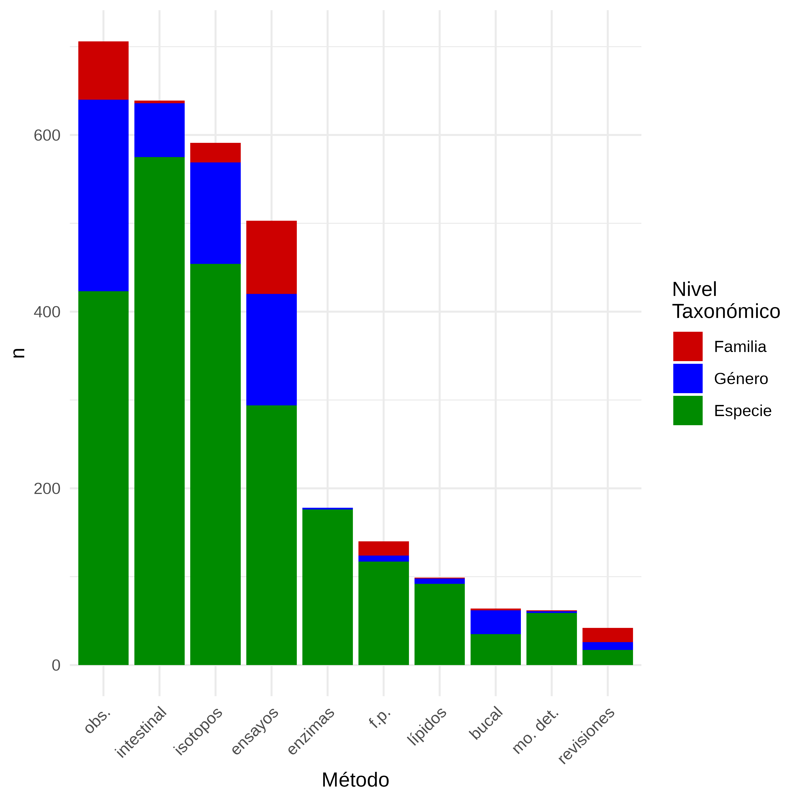
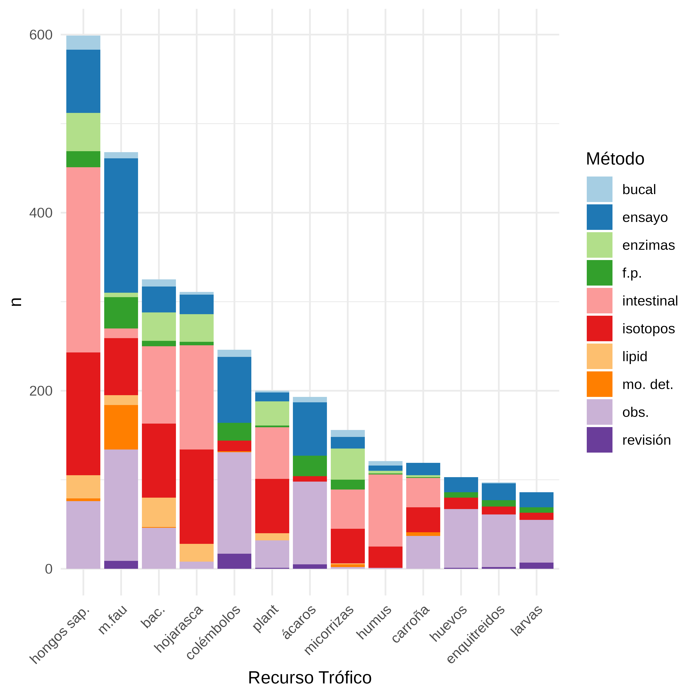
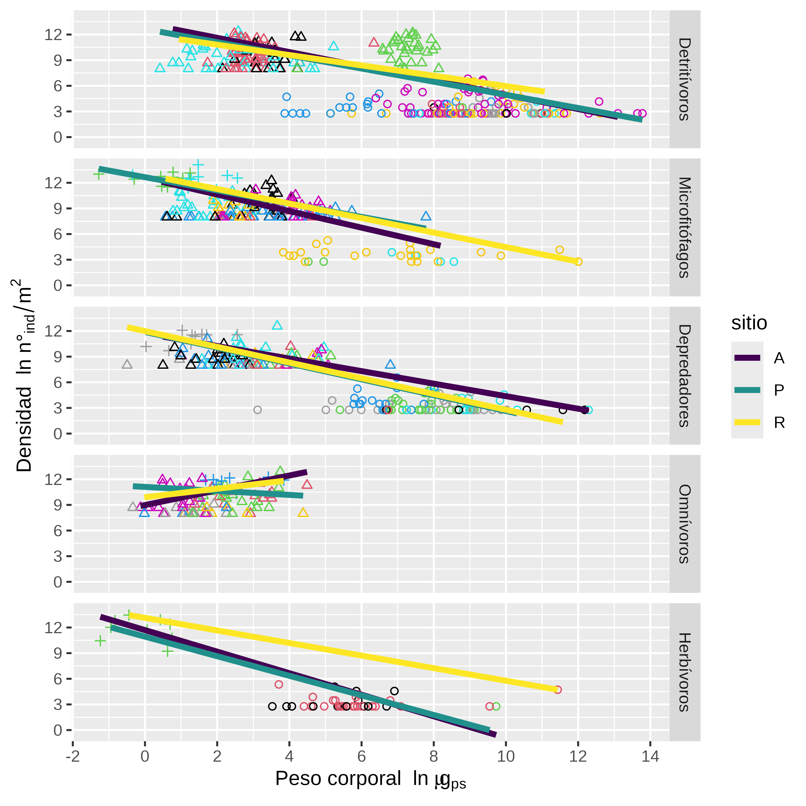
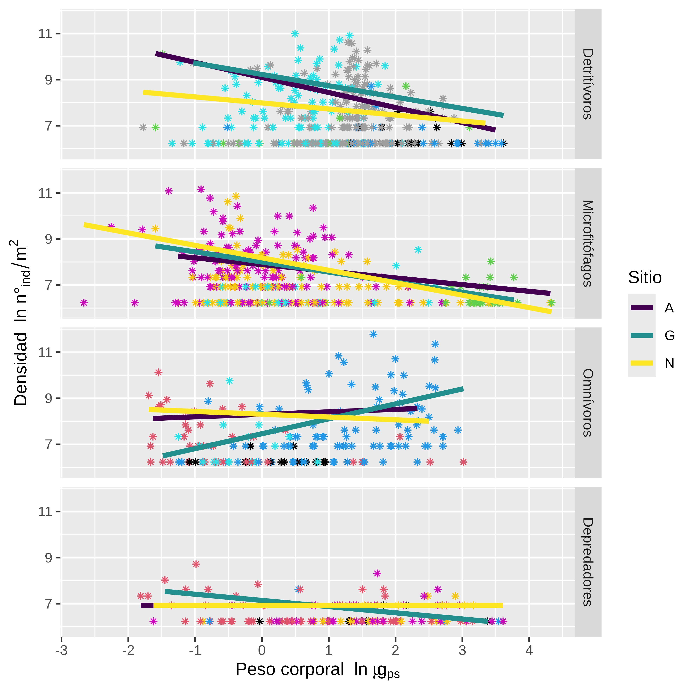

---
output:
  pdf_document:
    latex_engine: xelatex
    toc: false
    includes:
      in_header: referencias/header.tex
      
  html_document:
    css: referencias/estilos.css
  word_document:
    toc: false
bibliography: referencias/Tesisfinal.bib
csl: referencias/apa.csl
lang: es
---

\newpage


\newpage
\begin{center}
\includegraphics[width=3cm,height=3cm]{Figures/logo.png} 
\end{center}

\begin{center}
\Large % Título grande
\text{UNIVERSIDAD NACIONAL DE LUJÁN}
\end{center}

\begin{center}
\Large % Título grande
\text{Tesis para optar al Título de Doctor en Ciencias Aplicadas} 
\end{center}

\vspace{1cm}
\begin{center}
\Huge 
\textbf{Construcción, interpretación y modelado del funcionamiento de la red de
interacciones de la mesofauna edáfica para la evaluación del estado de conservación
del suelo} 
\end{center}
\vspace{2cm}


\begin{center}
\large 
\text{VELAZCO, Víctor Nicolás}
\end{center}
\vspace{1cm}
\begin{center}
\large 
\text{Director: SARAVIA, Leonardo Ariel} 
\end{center}

\begin{center}
\large 
\text{Director: COVIELLA, Carlos Eduardo} 
\end{center}


\vspace{3cm}
\begin{center}
\large % Título grande
\text{2024} % Título en negrita
\end{center}


\newpage


\newpage

\newpage

```{r setup, include=FALSE}

knitr::opts_chunk$set(echo = TRUE)
knitr::opts_chunk$set(comment = NA)
loadNamespace('printr')
set.seed(167)
options("digits"=3)
options(knitr.table.format = "latex")
```

```{r lib, include=FALSE, warning=FALSE}
#Carga paquetes
{library("tidyverse");library("readxl");library("ade4");library("Hmisc");
library("vegan");library("cluster");#library("BiodiversityR") 
library("FactoMineR");library("factoextra"); library("kableExtra");require(tidyverse); require(kableExtra); require(quantreg);require(lubridate);
  require(kSamples);require(ggridges);require(gridExtra);require(emmeans);
  library(statnet);library(network);
  library(igraph);library(intergraph);library(multiweb);library(fluxweb);
  library(kSamples);library(modeest)}
set.seed(167)

```


# Resumen

La Pampa Ondulada es una región de gran importancia para la producción agropecuaria en Argentina, caracterizada por su clima templado, topografía plana, suelos ricos en materia orgánica y bien drenados que consolidan a esta región cómo un pilar fundamental en la economía del país. Sin embargo, desde el siglo pasado diversos autores ya advierten sobre la degradación de la fertilidad de estos suelos debido a las prácticas agrícolas intensivas que afectan tanto a la estructura física como a la fertilidad química y biológica del suelo.

Aunque existe un conocimiento integrado sobre los componentes físicos y químicos de los suelos, el conocimiento sobre la biodiversidad edáfica es todavía limitado. Se estima que en los suelos se encuentra el 59% de la biodiversidad global, pero de esta solo se conoce una minúscula fracción.

Es importante conocer la vida “bajo nuestros pies”, es decir la diversidad biológica que ocurre en la intrincada matriz orgánico mineral del suelo, para comprender cómo la biodiversidad se ve afectada por los disturbios, derivados de la actividad antrópica, que alteran el hábitat y la disponibilidad de recursos.

La biodiversidad interviene tanto en la formación del suelo y su estructura como en el mantenimiento y el funcionamiento de los mismos mediante las interacciones entre los organismos y el medio ambiente edáfico.

Por lo tanto es esencial avanzar en la investigación sobre la biología y ecología del suelo para comprender mejor los procesos que sustentan la funcionalidad de estos ecosistemas.

La comunidad de la fauna edáfica ocupa los espacios que se forman entre la hojarasca, troncos, piedras, que se acumula sobre la superficie del suelo y los poros de la matriz órgano-mineral del suelo. Estos animales ocupan principalmente los primeros centímetros del suelo y son clasificados tradicionalmente según un rango de tamaño corporal en microfauna, mesofauna y macrofauna.

La fauna edáfica desempeña un papel fundamental en el funcionamiento del suelo a diferentes escalas espacio temporales mediante el consumo de materia orgánica, el transporte de propágulos de bacterias y hongos, el control de poblaciones, son los recursos tróficos de la fauna zoofaga y tienen la capacidad de modificar la estructura órgano-mineral del suelo. Sus funciones están interrelacionadas con la ecología trófica. A su vez, estas interacciones contribuyen con servicios ecosistémicos más amplios afectando la dinámica del ciclo del carbono, de los nutrientes y el agua, la regulación de la materia orgánica del suelo y la fertilidad química y física del suelo.

Entender la complejidad de estos sistemas ecológicos edáficos es una cuestión clave para mantener características que aseguren y aumenten los beneficios ecosistémicos provistos por el suelo, tales como el mantenimiento de la fertilidad, el aumento de la captura de carbono, la reducción de insumos externos para la producción agropecuaria, la protección de la biodiversidad que podría resultar clave en la obtención de nuevos compuestos de interés medicinal e industrial o en procedimientos de remediación ambiental, entre otros.

La comunidad de la fauna edáfica responde al efecto de las perturbaciones naturales y antrópicas mediante cambios en los rasgos funcionales, cambios en la estructura poblacional, en la composición taxonómica o en atributos de la comunidad. Por lo que conocer esta respuesta nos permitirá entender sobre el funcionamiento de las redes tróficas de las comunidades edáficas que habitan estos suelos  de la Pampa Ondulada.

En esta tesis se aborda el estudio de las redes de interacciones, en particular de las redes tróficas que mediante herramientas matemáticas permite entender la complejidad de los sistemas ecológicos. Así, se busca entender el funcionamiento de las comunidades de la fauna edáfica de suelos  de la Pampa Ondulada bajo diferentes intensidades de impacto antrópico del suelo.

El análisis de las redes tróficas permite integrar la diversidad de la comunidad, interacciones interespecíficas, rasgos funcionales, características topológicas, características funcionales vinculados con la multiplicidad de canales de materia y energía e inferir sobre el valor de estabilidad de la comunidad.

El objetivo de la tesis es construir la red trófica de la fauna edáfica que ocurren en suelos  bajo diferentes intensidades de uso en la Pampa Ondulada Argentina, para analizar las características funcionales de las comunidades edáficas e inferir sobre la estabilidad y el estado de conservación de los suelos.

Para construir y modelar de la red de interacciones tróficas de la fauna del suelo es necesario:

a)  Conocer sobre los recursos tróficos de la fauna edáfica para modelar la matriz de interacciones. Por ello, el capítulo 2 es una revisión bibliográfica global sobre este tópico, centrada en jerarquías taxonómicas de especies, géneros o familias como una aproximación a la dieta potencial de la fauna edáfica. Esto permite agrupar la fauna edáfica en gremios tróficos. Los principales recursos tróficos son los hongos saprófitos, las bacterias y los nemátodos. Resalta que la información a nivel global es escasa y fragmentaria, centrada principalmente en suelos europeos.

b)  Conocer la diversidad de las comunidades de la fauna edáfica que habitan los suelos de interés y de manera complementaria caracterizar el ambiente edáfico en el cuál habitan. Se tomaron muestras de suelos  en el campo experimental de la Universidad de Luján bajo diferentes intensidades en el uso del suelo, uso “nulo”, uso “leve”, uso “intensivo”. Se determinaron variables químicas del suelo y la respiración heterotrófica, se extrajeron, se clasificaron taxonómicamente y se midieron rasgos morfológicos corporales de la microfauna, la mesofauna y la macrofauna. De manera complementaria se utilizó un set de datos de suelos  con parámetros similares que incluyen microartrópodos y lombrices solamente. Se observó que, a pesar de las distancias geográficas entre los conjuntos de datos, el uso intensivo del suelo provocó acidificación del medio. Además, aunque las comunidades entre los diferentes sistemas de uso del suelo fueron disímiles, la diversidad entre ellos resultó ser similar. El Capítulo 3 de esta tesis presenta esa información y análisis.

c)  Obtener información sobre el peso corporal de los taxones que componen la fauna del suelo, objeto del Capítulo 4. Para ello cada uno de los 11880 individuos previamente clasificados fueron fotografiados y medidos para estimar su peso corporal individual. Esto permitió analizar el espectro de tamaños y su respuesta ante las perturbaciones en ambos conjuntos de datos. Se encontró que las comunidades de la fauna edáfica mantienen la relación entre las densidades, los pesos corporales y las biomasas en valores similares entre los diferentes sistemas de uso del suelo. A través de los gremios tróficos se describió una pirámide de biomasa donde los detritívoros forman la base luego los microfitófagos, omnívoros, depredadores y herbívoros.

d)  En el Capítulo 5 se construyen las redes de interacciones en los diferentes usos del suelo y su análisis. Se utilizó la información bibliográfica sobre las dietas potenciales de la edafofauna, el peso corporal, la densidad y la biomasa de los taxones en las comunidades analizadas. Con esta información fue factible calcular las características topológicas de la red trófica, los flujos de energía, las fuerzas de interacciones y se estimó el valor de estabilidad de las comunidades de la edafofauna bajo diferentes usos del suelo. Se observó que las redes tróficas de la fauna del suelo a través de los diferentes sistemas de uso del suelo compartieron valores cercanos en sus métricas topológicas tales como el número de niveles tróficos, el porcentaje de omnivoría, valores de generalidad y vulnerabilidad, entre otros. Con respecto a los flujos de energía, se estimó en el sistema agrícola un descenso significativo del flujo total de energía. Funcionalmente, en estas redes tróficas, la mayor cantidad del flujo de energía llega a la microflora, lo que explica porqué el sistema agrícola mostró los menores valores. Por otro lado, la mayor cantidad de energía fluye desde la materia orgánica del suelo (humus), canal de energía vinculado con la formación de agregados y con el ciclo de los nutrientes. Sigue en importancia la microfitofagia, con el consumo de microflora por parte de la fauna, la detritivoría con flujos de energía por debajo del 5% y la zoofagia en el cual los omnívoros participan con mayor importancia relativa. Por último, se estimó que la red más estable, aquella que requiere de una menor autoregulación, ocurrió en las redes tróficas de la fauna detritívora en suelos bajo agricultura intensiva, luego en pastizales y por último en el suelo sin impacto antrópico apreciable.

El estudio de las redes tróficas de la edafofauna que habita suelos con diferentes intensidades de uso antrópico en los suelos  de la Pampa Ondulada, nos indica que las comunidades analizadas son resilientes ante el efecto de las perturbaciones que resultan del uso del suelo. Se mantienen cercanos los valores de la diversidad, la relación del espectro de tamaños y la topología de las redes. Si interpretamos las diferencias en estabilidad como diferencias en autorregulación, las redes tróficas sin impacto requieren una alta autorregulación para mantener sus poblaciones. En cambio, en las redes afectadas por disturbios antrópicos, dicho disturbio sustituye la autorregulación, lo que permite cuantificar el impacto del manejo agrícola. Además, el manejo agrícola del suelo lleva a la acidificación del suelo y la disminución de la actividad respiratoria y como respuesta la comunidad muestra cambios en la composición de los taxones de la edafofauna y una disminución marcada del flujo de energía. Esta disminución  puede afectar a la funcionalidad del sistema y derivar en cambios en los procesos ecosistémicos afectando los ciclos biogeoquímicos en el suelo.

Por lo tanto, si bien las comunidades de la fauna edáfica configuran un sistema biológico relativamente robusto, hay que advertir que es necesario mantener y desarrollar prácticas de manejo sostenibles para conservar la funcionalidad del ecosistema edáfico de los suelos  de nuestra Nación.

## Abstract

Although the physical and chemical properties of soils are well-documented, knowledge about soil biodiversity, which represents approximately 59% of global biodiversity, remains limited. Soil biodiversity plays a fundamental role in the formation, structure, maintenance, and functioning of soils through interactions between organisms and their environment. These processes are crucial for understanding the impacts of anthropogenic disturbances on soil sustainability, ecosystem services, and resource availability.

Soil fauna, occupying the intricate matrix of soil pores, primarily live in the uppermost centimeters and are classified into micro-, meso-, and macro-fauna based on size. They contribute significantly to soil functioning at various spatial and temporal scales by processing organic matter, transporting bacteria and fungi, and regulating populations. These functions are essential for broader ecosystem services, including carbon, nutrient, and water cycling, organic matter dynamics, and maintaining soil fertility.

The responses of soil fauna to both natural and anthropogenic disturbances manifest as structural and functional changes, which are critical for understanding the behavior of food webs. This understanding is particularly relevant to the Pampa Ondulada of Argentina. With more than 54 million hectáreas, the central plains of Argentina are among the most extensive and fertile agricultural soils in the world, of which the Pampa Ondulada covers around 6.6 million hectáreas. Ensuring the sustainability of these ecological systems is vital for preserving ecosystem services such as soil fertility, carbon sequestration, agricultural productivity, and biodiversity.

This thesis investigates the food webs of edaphic fauna in  soils under varying levels of anthropogenic impact in the Pampa Ondulada. The objective was to construct food webs to analyze the influence of diversity, interactions, and functional traits on the topology, energy flows, and stability of the detritivore system. This allows inferences about the soil's functionality and conservation status.

The study revealed that despite anthropogenic disturbances, the soil fauna communities exhibited resilience. Across different levels of soil use intensity, the communities maintained similar diversity indices, size spectra, and topological and stability measures. However, intensive agricultural practices caused soil acidification, reduced respiration rates, and altered the taxonomic composition of the communities, resulting in a marked reduction in energy flow through the food webs.

In conclusion, the evaluated attributes demonstrate that soil fauna communities form a robust biological system. It is likely that these ecosystems have adapted to current management practices, maintaining a stable regime. Nevertheless, decreased energy flows through the food web may compromise ecosystem processes, particularly biogeochemical cycles. Therefore, it is imperative to implement and promote sustainable management practices to preserve the functionality of the  soil ecosystem.

## Palabras claves

FAUNA EDÁFICA; EDAFOFAUNA; ESTABILIDAD; ESPECTRO DE TAMAÑOS; MULTIFUNCIONALIDAD; GREMIOS TROFICOS; FLUJOS DE ENERGIA; SUSTENTABILIDAD

\newpage

\newpage


\tableofcontents

\newpage

\newpage

# Capítulo 1

# La biodiversidad del suelo, sus interacciones y el vínculo con el funcionamiento del ecosistema del suelo

Los bienes y servicios que la humanidad aprovecha de los ecosistemas terrestres dependen en su gran mayoría de los procesos naturales que ocurren en el ecosistema edáfico (Figura 1.1). Estos procesos son el resultado de complejas interacciones entre la fracción biológica y la matriz física y química que componen los suelos. Sobre los componentes físicos y químicos del suelo, se ha desarrollado un amplio conocimiento, lo que permite una clasificación y caracterización estandarizada de los diferentes suelos del mundo. Por otra parte, el cuerpo de conocimiento sobre el componente biológico aún está en proceso de desarrollo, se estima que alrededor del 59% de la biodiversidad global está adaptada a la vida en los suelos y de esta biodiversidad solo se conoce una pequeña fracción [@anthony2023; @barrios2007] lo que subraya la importancia de avanzar en el conocimiento del componente biológico de los suelos [@culliney2013; @lavelle2006; @orgiazzi2016].

La biodiversidad del suelo incluye a organismos de la microbiota, la fauna y a las plantas [@lavelle2003]. Estos intervienen en funciones ecosistémicas como el ciclo de los nutrientes, la regulación del ciclo del agua y su purificación, la regulación del ciclo del carbono y del clima y la regulación de poblaciones, pestes y enfermedades [@creamer2022]. De estas funciones dependen los servicios ecosistémicos de provisión, regulación y mantenimiento de los que la humanidad hace uso "gratuitamente" y que en términos monetarios a nivel global representa trillones de dólares anuales [@fonte2023; @coleman2004].

Si bien la complejidad en el ecosistema edáfico es enorme, este puede ser entendido como un sistema auto-organizado [@lavelle2006], característica que es una propiedad emergente de los ecosistemas [@oneill1986; @coleman2011]. En términos prácticos esto implica que los procesos mediados por la diversidad biológica y sus interacciones ocurren simultáneamente de manera jerárquica a diferentes escalas espaciales y temporales afectando las funciones ecosistémicas [@lavelle2012; @barrios2007; @brussaard1997]. Entender la complejidad de estos sistemas ecológicos es clave para mantener las características que aseguren los beneficios ecosistémicos provistos por el suelo, por ejemplo, la obtención de alimentos, fibra, medicina, la regulación del clima, la purificación del agua, el mantenimiento de la biodiversidad, la remediación ambiental, entre otros [@zotero-1438].


{heigth=800 width=600}

**Figura 1.1.** Esquema conceptual que estructura las relaciones entre los factores climáticos y el efecto de la actividad antrópica sobre la estructura y el funcionamiento del ecosistema del suelo y el vínculo con los bienes y servicios de los que depende la humanidad [@wall2012]

En el suelo existe una intrincada red de poros e intersticios que se forman entre la matriz órgano-mineral y la hojarasca que se acumula sobre este. La red de poros del suelo (Fig. 1.2) es un entorno anfibio, compacto, discontinuo y de diámetro variable. Sus características físicas y químicas heterogéneas permiten el desarrollo y mantenimiento de una gran cantidad de microclimas que soportan una compleja y diversa comunidad biológica [@lavelle2012; @bardgett2002]. Adaptados a vivir en los poros del suelo, los organismos edáficos desarrollaron diferentes estrategias en sus formas de vida, fisiología y de alimentación, además desarrollaron relaciones mutualistas y poseen la capacidad de modificar las características de su entorno, lo que les permite evitar la competencia interespecífica y mantener sus poblaciones [@lavelle2012; @lavelle2006; @briones2014;@Potapov2022].

{heigth=800 width=600}


**Figura 1.2.** Representación de las diferentes zonas de actividad biológica que ocurren a lo largo del perfil del suelo. Estas zonas de actividad biológica se denominan "esferas" en función de la estructura biogénica considerada, a saber: **drilidrósfera**, vinculados a las cavidades formadas por las lombrices de tierra; **detritósfera**, vinculados con la acumulación de hojarasca; **rizósfera**, vinculado al área en íntima relación con las raíces de plantas; **porósfera**, vinculado con los poros orgánicos minerales del suelo; **agregatósfera**, vinculado con los agregados que se forman entre la materia orgánica y la fracción mineral del suelo [@coleman2004]

El estudio de las comunidades del suelo hasta niveles especie-específicos se dificulta porque el suelo es un hábitat críptico, el tamaño de los organismos dificulta las caracterizaciones anatómicas - morfológicas y por el bajo desarrollo a nivel global del conocimiento taxonómico [@wurst2012]. Pero, se han desarrollado clasificaciones funcionales para agrupar a los organismos edáficos que contribuyen con papeles similares en ciertos procesos ecosistémicos, de esta manera se conectan la diversidad biológica con el funcionamiento del ecosistema del suelo [@creamer2022;@brussaard1998].

Los organismos edáficos son clasificados tradicionalmente en función del ancho corporal (Fig. 1.3): los organismos \<100 μm incluyen la **microbiota** (bacterias, arqueas y hongos), organismos \<200 μm se denominan **microfauna** (protozoa, nematoda, etc.), siguen a estos la **mesofauna** con anchos corporales \< 2mm (microartrópodos y enquitreidos) y la **macrofauna** que son aquellos animales con un ancho corporal mayor a los 2 mm, estos incluyen artrópodos, lombrices de tierra y otros invertebrados y algunos autores incluyen la megafauna aquellos animales con un ancho corporal mayor a 5 cm [@wurst2012] por ej. *Amphisbaena*. 

{heigth=800 width=600}

**Figura 1.3.** A) Clases de tamaños de los organismos que habitan el ecosistema del suelo clasificados en función del ancho corporal [@swift1979]. B) Relación entre la densidad y el tamaño del individuo de los grandes grupos taxonómicos hallados en los suelos, además se marca con líneas quebradas las relaciones de biomasa alcanzadas por la biota edáfica [@deluca2019]

En particular, en la fauna edáfica fragmenta e ingiere la materia orgánica, además consume la microbiota y transporta sus propágulos. Esto les confiere un papel fundamental, en el ciclo del carbono y los nutrientes, al estimular la actividad microbiana, regular sus poblaciones y facilitar el transporte hacia nuevas fuentes potenciales de recursos para la microbiota. También median transformaciones biológicas sobre la estructura órgano-mineral del suelo, modificando las características físicas y químicas del medio con el que interactúan y la disponibilidad de recursos. Y los depredadores al alimentarse de sus presas son esenciales en el regulación de poblaciones [@briones2014; @lavelle2006;@Potapov2022].

Las actividades productivas modifican las comunidades vegetales originales y alteran las características físicas y químicas de la matriz del suelo [@Bloor2021;@Smith2016]. Los disturbios generados por la actividad productiva afectan al hábitat y a la disponibilidad de recursos ante lo cuál la comunidad de la fauna edáfica responde con cambios en las poblaciones o con cambios en los flujos de materia y energía [@Phillips2024;@Chiappero2024]. Los suelos en la Pampa Ondulada son destinados casi exclusivamente a la producción de cultivos [@morello2000; @oyarzabal2018; @cabrera1973;@alvarez2006], sobre estos suelos hace más de 20 años ya se advertía que las actividades productivas conducían al deterioro de la fertilidad [@urricariet1999; @casas1998], sin embargo, poco se estudió sobre la respuesta de la fauna edáfica en estos suelos, 
por lo que todavía no se comprende como se afectan las funciones ecosistémicas [@Bedano2016],
la sustentabilidad del suelo y la sostenibilidad de la producción agropecuaria. 

El enfoque que integra la diversidad en una comunidad, las interacciones interespecíficas, las relaciones con el ambiente, la redundancia funcional, el papel de las especies clave y los canales de materia y energía en los ecosistemas es el estudio de las redes de interacciones [@creamer2022; @briones2014; @potapov2022; @barrios2007], de las cuáles las
**redes tróficas** (Fig. 1.4) son las interacciones comúnmente modeladas [@kefi2012; @bascompte2009]. 
Los elementos que conforman las redes son los nodos y sus enlaces. En las redes tróficas de la fauna edáfica
los nodos representan taxones o gremios tróficos (taxones que comparten recursos similares), y los enlaces representan las interacciones tróficas, es decir "quién come a quién" [@pimm1991;@delmas2019]. A los nodos se pueden asociar diferentes atributos como el peso corporal, la abundancia, la biomasa, etc. lo que posibilita incluir tanto parámetros fisiológicos como el metabolismo y el uso de los recursos, como parámetros ecológicos y las adaptaciones de estos organismos ante cambios en el ambiente [@white2007; @pey2014; @turnbull2014]. Sobre los enlaces también pueden asociarse atributos, aquellas características que modifican las tasas de consumo y las relaciones depredador-presa son de interés ya que determinan las fuerzas de las interacciones [@potapov2022; @moore2012; @pawar2012]. 


{heigth=600 width=400}

**Figura 1.4.** Representación del entramado de relaciones tróficas que ocurren en redes tróficas edáficas [@digel2014]


Por el potencial para integrar las características antes mencionadas, -@potapov2022 declara que el uso de las redes tróficas es una herramienta esencial que debe ser utilizada en los ecosistemas terrestres para comprender el funcionamiento del ecosistema del suelo. Las redes modelan cientos de interacciones tróficas y enlazan propiedades emergentes de las comunidades y de los ecosistemas [@delmas2019; @zotero-1438; @Hooper2005] que permiten analizar relaciones entre la dinámica, la estabilidad y la resiliencia de las comunidades [@Pimm1982]. En las comunidades de la fauna edáfica vinculan los procesos tróficos con el funcionamiento del suelo [@potapov2022;@sabatte2011; @kardol2016] y particularmente en los suelos  de la Pampa Ondulada, que soportan una alta presión productiva [@hall1992; @lavado2009] permitirá evaluar cómo responde las redes tróficas ante los disturbios. 

Para construir y modelar las reded tróficas de la fauna del suelo es necesario, identificar las comunidades que habitan los ecosistemas de interés y construir la matriz de interacciones a partir de la información sobre los recursos tróficos que conforman la dieta de la fauna [@delmas2019]. Luego, para estimar las fuerzas de interacción y calcular los flujos de energía se deben obtener datos sobre el peso corporal y las abundancias de los taxones involucrados [@laigle2018;@deruiter1995;@potapov2022; @barnes2018]. Con esta información es posible calcular la resiliencia y estabilidad de las redes tróficas en los sistemas estudiados [@moore2012; @allesina2008; @gauzens2019].

En este contexto, el objetivo de esta tesis es construir y modelar las redes de interacciones tróficas la fauna del suelo y  analizar sus métricas para evaluar el estado de conservación del suelo. En particular, busca caracterizar la diversidad de las comunidades edáficas, las variaciones del peso corporal y de la densidad de los taxones que definen al espectro de tamaños [@petchey2010], y comparar la estructura de las redes tróficas en suelos  de la Pampa Ondulada bajo diferentes intensidades de uso. El estudio se centra en comunidades de la fauna que habita suelos sometidos a distintas estrategias de uso, como una aproximación a las diferentes intensidades de perturbación: a) suelos sin uso agropecuario, como pastizales naturalizados sin intervención por más de 50 años o lotes clausurados por más de 30 años, que servirán como sistemas de *referencia*; b) suelos de uso pastoril destinados al forraje para ganado, considerados de uso *intermedio* o leve; y c) suelos con actividad agrícola continua, caracterizados por una *alta* intensidad de uso.

Como las prácticas de manejo producen disturbios en los primeros centímetros del suelo órgano-mineral, hábitat de la mayor biodiversidad edáfica, la hipótesis es que el impacto de las prácticas de manejo afectarán diferencialmente propiedades de la comunidad relacionadas con el funcionamiento ecosistémico, el efecto sobre estas propiedades será mayor en función de la intensidad de uso. En particular, los suelos a) serán menos diversos, b) el valor de la pendiente del espectro del tamaño será menor
indicando que los disturbios afectan a las comunidades edáficas y a sus gremios tróficos. d) La estructura de la red trófica será menos compleja por el menor tamaño y número de enlaces y e) los flujos de energía disminuirán en toda la red y en los canales de energía. El estado de conservación del suelo estará en función de la multiplicidad de
factores evaluados al considerar la diversidad y de la capacidad de mantener los procesos en la red trófica.


CAP3: Bajo este contexto, este capítulo describe las diferencias ambientales y las diferencias en la diversidad biológica de las comunidades edáficas halladas en suelos de la Pampa Ondulada bajo diferentes intensidades de uso. 
Se espera suelos bajo diferente intensidades de uso tengan características ambientales diferentes entre sí y que la diversidad de la fauna edáfica disminuya con la intensidad
de uso.

CAP 4: Se espera que en función de la intensidad de uso del suelo tanto la comunidad
como los gremios tróficos responda con disminuciones en la biomasa y 
con pendientes del espectro de tamaño menores. Entonces sistemas de referencia donde la intensidad
de uso del suelo es nula, las comunidades y sus gremios tróficos tendrán biomasas medias mayores
y la pendiente del espectro de tamaños, con valores más cercanos a cero.

CAP: 5 Por ello se plantea para este capítulo, la hipótesis que las redes tróficas de la fauna edáfica en
los suelos sometidos a gran intensidad de uso 
tendrán diferencias estructurales tornándolas menos complejas con un
menor tamaño y número de enlaces, los flujos de energía disminuirán en toda la red
y en los canales de energía y se modificarán las fuerzas de interacciones 
afectando el valor de estabilidad intrínseca de la red trófica indicando de manera 
integral el efecto de la intensidad de uso del suelo en relación con suelos sin uso.


\newpage

\newpage

# Capítulo 2

# Análisis de los recursos tróficos de la fauna del suelo. Primera Parte

# Recursos tróficos de los microartrópodos edáficos: un revisión global de la evidencia empírica

En las últimas décadas, el uso sostenible del suelo se ha convertido en el centro de atención tanto para la comunida científica como para los tomadores de decisiones. El informe sobre Biodiversidad Global y Servicios Ecosistémicos [@IPBES2019], y el reciente Estado del Conocimiento de la Biodiversidad del Suelo [@FAO2020] indican claramente la importancia del ecosistema del suelo y el papel central que la biodiversidad del suelo desempeña en los servicios ecosistémicos. Sin embargo, falta información crítica sobre la biodiversidad edáfica y las redes de interacción de la mayoría de los suelos [@potapov2023].

La visión sobre la biota edáfica ha cambiado en los últimos años. La mayoría de los trabajos sobre descripciones taxonómicas, riqueza, estimación de la biodiversidad y microambientes [@anderson1978; @Petersen1982], destacan la fragilidad y necesidad de conservación de los suelos y de la biodiversidad edáfica [@FAO2020; @walker1992]. El enfoque se ha desplazado gradualmente hacia el estudio del funcionamiento del ecosistema edáfico, ya que las interacciones entre la biota y el medio edáfico afectan jerárquicamente a su estructura y funcionamiento [@barrios2007; @Behan-Pelletier1999; @brussaard1997; @lavelle2006]. Las relaciones de la riqueza de especies con la dinámica de los ecosistemas permiten establecer relaciones causales entre las características de los organismos presentes y los procesos y servicios del ecosistema [@Hooper2005; @martin-lopez2007] tanto en ambientes naturales como controlados [@wall2012].

Los microartrópodos del suelo están representados principalmente por especies pertenecientes a las subclases Acari y Collembola (siguiendo a @krantz2009 y @Hopkin1997) que habitan en los horizontes superiores del suelo [@Martinez2009], donde se desarrollan y mantienen comunidades complejas. Estas comunidades están influenciadas por una elevada heterogeneidad de microhábitats y el número de recursos tróficos disponibles [@anderson1977; @anderson1978; @lavelle2003], que proporcionan un amplio y variado conjunto de nichos ecológicos [@Nielsen2010; @Wallwork1958]. A través de sus relaciones tróficas los microartrópodos contribuyen al funcionamiento edáfico mediante la fragmentación de la materia orgánica, la dinámica del ciclo de nutrientes, el transporte de propágulos de microflora y la regulación de las poblaciones de microflora y microfauna que afectan a la producción primaria [@brussaard1997; @Cragg2001; @Lavelle1996; @wall2012; @FAO2020].

Determinar los recursos tróficos utilizados por los grupos de microartrópodos es complejo debido a su tamaño y a su entorno críptico. La caracterización de su dieta debe basarse en pruebas empíricas, lo que constituye el primer paso para establecer las interacciones entre las especies y los recursos que describen las redes tróficas [@Briand1984; @vanStraalen1998; @Walter1991]. La información sobre las relaciones tróficas de los diferentes grupos taxonómicos de microartrópodos es todavía bastante escasa. Estos datos son necesarios para construir y analizar redes tróficas que, a su vez, puedan ser utilizadas para evaluar la estabilidad y el estado de conservación de estos ecosistemas [@barrios2007; @briones2014; @Thakur2020]. La caracterización empírica de las interacciones tróficas es un reto debido a la complejidad espacial y temporal de los patrones de alimentación y a las limitaciones de los métodos para identificar y cuantificar los componentes de la dieta [@Nielsen2018; @pankhurst1997; @Walter1991].

Este capítulo es una revisión que recoge la información actualmente disponible sobre el uso de los recursos tróficos por parte de los microartrópodos edáficos [@velazco2023b]. Esta información, junto con otros rasgos característicos de los microartrópodos edáficos, permitirá construir una red de interacciones tróficas que podría resultar en una mejor comprensión de la estructura y funcionamiento de la biota edáfica [@FAO2020]. Las redes tróficas permitirán, a su vez, comparar el estado de diferentes suelos, o de los mismos suelos bajo diferentes intensidades de impacto antrópico [@Thompson2012].

Así, los objetivos de esta revisión son: 1) recopilar toda la información actualmente disponible sobre los recursos tróficos utilizados por los microartrópodos del suelo, 2) describir las relaciones tróficas conocidas y las dietas potenciales de estos microartrópodos del suelo a diferentes niveles taxonómicos (de familia a especie), y 3) establecer el estado actual de los sesgos de conocimiento en la información disponible.

## Metodología

### Generalidades de las pruebas empíricas consideradas para la búsqueda sistemática

Las relaciones tróficas entre organismos y sus recursos son documentadas a través de diferentes 
métodos que constituyen la evidencia empírica. Aquí se describen brevemente las principales pruebas empíricas
que documentan relaciones tróficas entre los organismos y los recursos. Estos se utilizaron para
determinar los registros de alimentación:

-   Las pruebas empíricas aportadas mediante estudios realizados en condiciones de laboratorio pueden basarse en **observaciones** del comportamiento alimentario de los animales estudiados, en el estudio de las **preferencias alimentarias** o en **pruebas** para estudiar otras interacciones o fenómenos biológicos relacionados con la dieta. En general, las pruebas se realizan en microcosmos [@Saur1988; @Hubert2001; @Schneider2005; @Schneider2009].

-   La observación del **contenido intestinal** se basa en considerar que lo que se encuentra en el tracto es evidencia de lo que realmente se consume [@Hartenstein1962; @Schneider2004; @Wallwork1958]. Este método requiere la preparación de especímenes para su observación mediante técnicas de microscopía.

-   La morfología y el funcionamiento de las **piezas bucales** están relacionados con la manipulación, adquisición y procesamiento que los microartrópodos realizan del alimento y podrían utilizarse para determinar gremios tróficos [@Buryn1992; @Kaneko1988; @Macnamara1924]. Estas pruebas también requieren técnicas de microscopía para obtener información.

-   Las herramientas **moleculares**, como la secuenciación del ADN podrían utilizarse para determinar la presencia de una especie o un grupo taxonómico dentro del tracto intestinal y permite establecer relaciones tróficas u otros tipos de interacciones [@Heidemann2014; @King2008; @Read2006].

-   El estudio de las **enzimas digestivas** en invertebrados puede explicar las porciones de alimento digeridas [@Siepel1993; @Berg2004], y aquellas enzimas que hidrolizan polisacáridos estructurales están relacionadas con la dieta [@Nielsen1962]. Permiten la diferenciación de gremios tróficos [@Berg2004; @Siepel1993].

-   El uso de la variación natural de los **isótopos estables** como evidencia empírica del uso de los recursos tróficos se basa en el estudio de las firmas isotópicas. La firma isotópica de $\delta\text{15N}$ informa sobre el nivel trófico del invertebrado y la de $\delta\text{13C}$ indicará la proporción de recursos tróficos consumidos, pero los recursos tróficos potenciales necesitan ser elegidos previamente al análisis isotópico [@Tiunov2007; @Maraun2011; @Potapov2019]. Además, esta herramienta tiene el potencial de inferir las rutas metabólicas de las biomoléculas [@Pollierer2019; @Chamberlain2006].

-   El estudio del **perfil lipídico** se basa en utilizar los ácidos grasos del tejido del recurso como marcadores biológicos a través de la identificación de ácidos grasos en el animal. Esto se debe a que el animal o bien no puede sintetizarlos (marcadores absolutos) o bien su síntesis supone un alto coste metabólico (marcadores relativos) [@Kuhn2019; @Ruess2010; @Sechi2014; @Chamberlain2005; @Pollierer2010].

### Búsqueda bibliográfica

Se realizó una búsqueda sistemática de evidencias empíricas relacionadas con el uso de al menos un recurso trófico por parte de los microartrópodos del suelo. La bibliografía se seleccionó de publicaciones con palabras clave relacionadas con los grupos taxonómicos de interés, las relaciones tróficas y los métodos que proporcionan evidencia del consumo. A partir de estas palabras clave, se formuló la cadena de búsqueda para aplicar en los motores de búsqueda de las bases de datos Scopus y Google Scholar.

Se utilizó la siguiente cadena de búsqueda en Scopus:

"ALL((microarthropods OR springtails OR mites OR oribatida OR mesostigmata OR prostigmata OR astigmata) AND (trophic OR diet OR feeding) AND soil AND ("gut content" OR "stable isotope" OR "food preference" OR "fatty acid" OR lipids OR metabarcoding) AND (family OR genus OR species)) AND (LIMIT-TO (SUBJAREA, "AGRI") OR LIMIT-TO (SUBJAREA, "ENVI") OR LIMIT-TO (SUBJAREA, "MULT") OR LIMIT-TO (SUBJAREA, "EART")) AND (LIMIT-TO (EXACTKEYWORD, "Collembola") OR LIMIT-TO (EXACTKEYWORD, "Acari") OR LIMIT-TO (EXACTKEYWORD, "Soil Fauna")) AND (LIMIT-TO (LANGUAGE, "English") OR LIMIT-TO (LANGUAGE, "Spanish"))", que devolvió 838 títulos (Septiembre 3, 2021).

Para la búsqueda en Google Scholar se utilizó:

"(microarthropods OR springtails OR mites) AND ("oribatida" OR "mesostigmata" OR "prostigmata" OR "astigmata") AND (trophic OR diet OR feeding) AND soil AND ("gut content" OR "stable isotope" OR "food preference" OR "fatty acid" OR metabarcoding)". Esta búsqueda arrojó 2170 títulos (Septiembre 3, 2021).

También se incluyeron publicaciones de revisión general y libros de texto para proporcionar información sobre el uso de los recursos tróficos a partir de fuentes que pueden no estar fácilmente disponibles, lo que dio como resultado 97 títulos más.

El primer criterio de elegibilidad para reducir el número de registros fue seleccionar aquellos trabajos cuyos títulos y resúmenes relacionaran los microartrópodos del suelo con los recursos tróficos (425 títulos). De ellos, se seleccionaron los trabajos que mencionaban efectivamente familias, géneros o especies de ácaros y colémbolos del suelo y los relacionaban con al menos un recurso trófico.

El resultado fueron 200 publicaciones, que pueden consultarse en el Material Suplementario Electrónico I (ESM I). Todos los microartrópodos registrados en las publicaciones citadas pueden consultarse en el Material Suplementario Electrónico II, que contiene referencias cruzadas con el Material Suplementario Electrónico I. El diagrama de flujo del procedimiento de búsqueda y selección de bibliografía se desarrolla en el Material Suplementario Electrónico III. Los materiales suplementarios pueden descargarse en los enlaces indicados en el Apéndice 2.1.

### Construcción de la base de datos

La evidencia empírica proporciona información sobre las relaciones tróficas de estos animales de diferentes maneras: algunas publicaciones relacionan los taxones con los elementos tróficos y otras los agrupan en gremios o categorías tróficas. Para hacer frente a esta heterogeneidad, fue necesario definir los recursos tróficos (Tabla 2.1) que resumen sus características tróficas y ecológicas en el ecosistema edáfico [@Berg2008; @Clark1971; @Warcup1971; @Ponge1991; @persson1980; @krantz2009; @Chernova2007; @Rusek1998; @Schneider2005].

Se asociaron los taxones y los recursos de modo que: a) si la publicación indicaba un ítem alimenticio, se asignó a un recurso trófico en el que está definido, b) o si los taxones están agrupados en algún gremio o categoría trófica, entonces a cada taxón se le asignaron los recursos típicos consumidos por esa categoría.

A partir de esta estrategia de asignación, se desarrolló una base de datos que se presenta en el material suplementario II. La información taxonómica y los recursos tróficos se obtuvieron de las diferentes secciones de las publicaciones y sus apéndices [@Thakur2020]. De forma complementaria, cada taxón de ácaros y colémbolos encontrado tiene todos los niveles de clasificación taxonómica según @krantz2009 y @Hopkin1997.

### Análisis de datos

Se analizaron los registros contabilizando las asociaciones entre los taxones, los métodos utilizados y los recursos tróficos identificados. Se identificaron los recursos tróficos, el número de registros y su relación con los diferentes niveles taxonómicos. A continuación, se realizó el desglose de cada taxón dentro de las categorías taxonómicas y su relación con los recursos tróficos. Se calcularon las proporciones de los distintos métodos y su relación con el nivel taxonómico y los recursos tróficos.

Por último, se estimó la importancia de los recursos en la dieta potencial para los principales órdenes de ácaros (Acari) y colémbolos (Collembola) utilizando la proporción de menciones entre recursos tróficos y taxones incluidos en dichos órdenes. Por ejemplo, si una especie tiene diez registros sobre el consumo del mismo recurso trófico, es probable que la selección de este alimento sea un reflejo de la preferencia por el uso del recurso. Entonces, si reuniéramos la información disponible de distintas especies del mismo género y los alimentos consumidos por ellas, podríamos asignarla a la dieta potencial del género. Del mismo modo, el uso de los recursos de los géneros de una familia puede considerarse un reflejo de la dieta potencial de la familia. Es decir, la dieta de las jerarquías taxonómicas superiores estará constituida por la suma de los recursos utilizados por los niveles taxonómicos inferiores.

Los cálculos, gráficos y tablas se prepararon utilizando Microsoft Excel y el software estadístico R versión 4.1.2 [@RCoreTeam2021]. El código fuente está disponible en [GitHub](https://github.com/EcoComplex/TrophicResources) y [Zenodo](https://doi.org/10.5281/zenodo.6508661) (Los enlaces se encuentran en el apéndice).


<!--está disponible en el repositorio de [GitHub](https://github.com/EcoComplex/TrophicResources) y [Zenodo](https://doi.org/10.5281/zenodo.6508661) -->

**Tabla 2.1.** Descripción básica de los recursos tróficos. Total de asignaciones por recurso con valores absolutos y porcentajes y número de registros por resolución taxonómica. 

+------------------------------+------------------------------------------------------------------------------------------------------------+-------------------------------------------+---------+---------+---------+
| **Recurso trófico**          | **Descripción**                                                                                            | **Total de asignaciones (%)** | Familia | Género  | Especie |
+:=============================+:==========================================================================================================:+:=========================================:+:=======:+:=======:+:=======:+
| **Hongos saprófitos**        | Son hongos ubicuos en el suelo que descomponen la materia orgánica.^c^                                     | **599 (19.8)**                            | **16**  | **105** | **478** |
+------------------------------+------------------------------------------------------------------------------------------------------------+-------------------------------------------+---------+---------+---------+
| **Microfauna**               | Nemátodos de vida libre del suelo, protozoos, tardígrados, rotíferos y otra microfauna edáfica^e^          | **468 (15.5)**                            | **34**  | **140** | **294** |
+------------------------------+------------------------------------------------------------------------------------------------------------+-------------------------------------------+---------+---------+---------+
| **Bacteria**                 | Incluyen bacterias heterótrofas y autótrofas^b^                                    | **325 (10.7)**                            | **7**   | **63**  | **255** |
+------------------------------+------------------------------------------------------------------------------------------------------------+-------------------------------------------+---------+---------+---------+
| **Hojarasca**                | Tejido vegetal muerto acumulado en el suelo con diferentes grados de fragmentación y descomposición^a^     | **311 (10.3)**                            | **4**   | **30**  | **277** |
+------------------------------+------------------------------------------------------------------------------------------------------------+-------------------------------------------+---------+---------+---------+
| **Colémbolos**               | Colémbolos juveniles y adultos.                                                                            | **246 (8.1)**                             | **50**  | **58**  | **138** |
+------------------------------+------------------------------------------------------------------------------------------------------------+-------------------------------------------+---------+---------+---------+
| **Tejidos vegetales**        | Incluye plantas no vasculares (musgos, líquenes, etc.), raíces vivas y plántulas                           | **200 (6.6)**                             | **2**   | **25**  | **173** |
+------------------------------+------------------------------------------------------------------------------------------------------------+-------------------------------------------+---------+---------+---------+
| **Ácaros**                   | Ácaros juveniles y adultos^f^                                                                              | **193 (6.4)**                             | **40**  | **37**  | **116** |
+------------------------------+------------------------------------------------------------------------------------------------------------+-------------------------------------------+---------+---------+---------+
| **Hongos micorrícicos**      | Hifas fúngicas simbióticas con raíces de plantas^i^                                                        | **156 (5.2)**                             | **6**   | **19**  | **131** |
+------------------------------+------------------------------------------------------------------------------------------------------------+-------------------------------------------+---------+---------+---------+
| **Humus**                    | Materia orgánica compleja y amorfa con un alto grado de descomposición: detritos, pellets fecales, etc.^d^ | **121 (4)**                               | **2**   | **8**   | **111** |
+------------------------------+------------------------------------------------------------------------------------------------------------+-------------------------------------------+---------+---------+---------+
| **Carroña de invertebrados** | Tejidos animales, mudas, cadáveres de invertebrados, etc.^h^                                               | **119 (3.9)**                             | **10**  | **13**  | **96**  |
+------------------------------+------------------------------------------------------------------------------------------------------------+-------------------------------------------+---------+---------+---------+
| **Huevos de invertebrados**  | Huevos de invertebrados^g^                                                     | **103 (3.4)**                             | **13**  | **24**  | **66**  |
+------------------------------+------------------------------------------------------------------------------------------------------------+-------------------------------------------+---------+---------+---------+
| **Enquitreidos**             | Anélidos oligoquetos de cuerpo blando anatómicamente homogéneos^c^                                         | **97 (3.2)**                              | **11**  | **30**  | **56**  |
+------------------------------+------------------------------------------------------------------------------------------------------------+-------------------------------------------+---------+---------+---------+
| **Larvas**                   | Larvas de invertebrados de cuerpo blando                                                                   | **86 (2.9)**                              | **15**  | **20**  | **51**  |
+------------------------------+------------------------------------------------------------------------------------------------------------+-------------------------------------------+---------+---------+---------+

\scriptsize 
\textsuperscript{a} Berg \& McClaugherty 2008 \textsuperscript{b}Clark 1971 \textsuperscript{c}Warcup 1971 \textsuperscript{d}Ponge 1991 \textsuperscript{e}Persson et al. 1980 \textsuperscript{f}Krantz \& Walter 2009 \textsuperscript{g}Chernova et al. 2007 \textsuperscript{h}Rusek 1998 \textsuperscript{i}Schneider et al. 2005

\normalsize
\newpage

## Resultados

De los 3208 documentos de investigación recuperados inicialmente, 200 cumplían con los criterios preestablecidos (véase ESM III). Un total de 133 artículos de las 200 publicaciones seleccionadas (ESM I) mencionaron los países en los que se realizaron los estudios. De ellos, 1 artículo se ubicó en la región Etíope, 3 en la región Neotropical, 3 en la región Oriental, 7 en la región Australiana, 34 en la región Neártica, 75 en la región Paleártica y los 10 restantes fueron de la región Antártica (Figura 2.1). Esto es importante destacar porque las especies varían en función de la región biogeográfica. Fueron 106 publicaciones las que mencionaron los ambientes en los que se realizaron los estudios, de ellos 59 eran bosques templados, 3 bosques tropicales, 21 praderas, 23 agroecosistemas y 11 desiertos.


{width=600 heigth=800}

**Figura 2.1.** Distribución global de las publicaciones que asignan recursos tróficos a los microartrópodos del suelo, en gran parte inexplorados fuera de Europa y América del Norte.

Se obtuvo un total de 3024 registros sobre relaciones tróficas (ESM II), Acari aportó 2218 registros (73,34%), y dentro de este número, la mayoría (50,86%) corresponde a Sarcoptiformes. Según la resolución taxonómica, se obtuvieron datos de 170 especies, 30 géneros y 2 familias de Collembola y 412 especies, 131 géneros y 49 familias de Acari.

### Métodos utilizados para la identificación de recursos tróficos

#### Métodos de asignación de recursos

El método de observaciones en pruebas de laboratorio proporciona la principal prueba empírica, con 706 registros (Figura 2.2). Los microartrópodos a nivel de familia constituyen el 9,3 por ciento de las observaciones en pruebas de laboratorio, correspondiendo el 63,6 por ciento del total al suborden Prostigmata, dentro del cual se mencionan 10 familias diferentes. Las pruebas ofrecidas por las observaciones en pruebas de laboratorio suman un 90,7 por ciento en el caso de las especies y los géneros. Los órdenes Mesostigmata (62,5%), Sarcoptiformes (23,8%), Trombidiformes (9%) y Arthropleona (4%) son los de mayor presencia en la bibliografía.

{width=600 heigth=800}
**Figura 2.2.** Métodos utilizados en la literatura para asignar recursos tróficos a microartrópodos del suelo. Los colores dentro de las columnas se refieren al número de registros en los diferentes niveles taxonómicos para los cuales cada método asignó al menos un recurso. assay: pruebas y observaciones de laboratorio. isotopes: isótopos estables. gut: contenido intestinal. enzymes: enzimas digestivas. mouth: morfología de las piezas bucales. lipid: perfil lipídico. mo. det: detección molecular del contenido intestinal, f.p.: ensayos de preferencia alimentaria. obs.: observaciones directas en laboratorio sobre la actividad alimenticia. review: revisiones generales de otros autores.

El método de contenido intestinal alcanza el 21,3% de los registros, en el que el nivel taxonómico de especie corresponde al 89,9% del total de registros y el de género al 9,5%. Le siguen en importancia los isótopos estables, de ellos, el 76,9% de los registros mencionan especies, los géneros y familias suman el 23,1% de los registros.

La actividad de las enzimas digestivas (178 registros) informa en todos los casos hasta el nivel de especie. Para esta evidencia empírica, los autores trabajaron con el orden Sarcoptiforme (Acari) con 38 especies diferentes y Arthropleona y Symphypleona (Collembola) con 17 especies diferentes. Otros tres métodos acumulan el 9,75 por ciento de los registros, siendo éstos las pruebas de preferencia alimentaria (131 registros), el estudio de ácidos grasos (99 registros) y el uso de estructuras bucales (64 registros). El análisis del contenido intestinal con técnicas moleculares para la detección de ADN es una herramienta de reciente desarrollo y representa el 2 por ciento del total de registros.

#### Recursos tróficos identificados por la evidencia empírica

El principal recurso mencionado corresponde a hongos saprófitos (19,8%) seguido de microfauna (15,5%), bacterias (10,7%), y hojarasca (10,3%), los recursos ácaros, colémbolos, enquitreidos, larvas y huevos acumulan 725 menciones (24%) (Tabla 2.1). Cabe destacar que el mayor número de registros se corresponden con el nivel de especie. Por ejemplo, de los 592 registros tróficos asociados al consumo de hongos saprófitos, 16 se asociaron al nivel taxonómico de familia, 105 al de género y 474 al de especie.


{width=600 heigth=800}

**Figura 2.3.** El número de registros en la literatura que asignan cada uno de los 13 recursos tróficos a un taxón de microartrópodos, como se muestra en la Tabla 2.1. Los colores en las columnas se refieren al método utilizado para asignar esos recursos tróficos a un taxón en particular, como se muestra en la Fig. 2.2. Las abreviaturas de los recursos son: hongos saprófitos (sap. fun.), microfauna (m. fau), bacterias (bac), hojarasca, colémbolos (coll), tejido vegetal (plant), ácaros, hongos micorrícicos (myco), humus, carroña de invertebrados (carrion), huevos de invertebrados (eggs), enquitreidos (enchy) y larvas

Las observaciones de laboratorio (el método más utilizado), mencionan el uso de los trece recursos tróficos (Figura 2.3) en los que el orden de importancia según el número de menciones es microfauna \> colémbolos \> ácaros \> hongos saprófitos \> huevos de invertebrados \> enquitreidos \> larvas de invertebrados que acumulan el 82,3%. Para este método empírico, los recursos mencionados, con excepción de los hongos saprófitos, corresponden a recursos típicos de animales depredadores mencionando con mayor frecuencia a taxones de Mesostigmata. Las barras apiladas (Figura 2.3) muestran las diferentes proporciones en que los métodos aportan pruebas del uso de un recurso, si se considera la contribución de cada método según el número de citas en la bibliografía, se cuentan en orden decreciente: observaciones directas (706 registros) \> contenido intestinal (639) \> isótopos (591) \> pruebas de laboratorio (503) \> enzimas (178) \> pruebas de preferencia alimentaria (140 registros).

Las metodologías utilizadas en los estudios de laboratorio, es decir, las pruebas de laboratorio, las observaciones de laboratorio y las pruebas de preferencia alimentaria, aportan pruebas directas de la utilización de los recursos tróficos, constituyendo en conjunto el 44,5% de las pruebas empíricas analizadas (ESM II). Estos métodos de laboratorio son los que mencionan con mayor frecuencia el uso de recursos animales, colémbolos - ácaros - larvas de invertebrados - huevos de invertebrados - enquitreidos, como recursos alimentarios. Estos métodos mencionan raramente el consumo de hongos micorrícicos y raramente el uso de humus.

\newpage

```{=tex}
\scriptsize
\begin{longtable}[]{@{}lccccccccccccccccccccc@{}}
\caption*{Tabla 2.2. Número de familias, géneros y especies asociados a los recursos tróficos. Las letras representan los principales órdenes de Acari y Collembola: M, Mesostigmata; S, Sarcoptiformes; T, Trombidiformes; O, Opilioacarida; A, Arthropleona; N, Neelipleona; Sy, Symphypleona. }\\
\toprule
\textbf{Recurso Trófico} & \multicolumn{7}{l}{FAMILIA} & \multicolumn{7}{l}{GÉNERO} & \multicolumn{7}{l}{ESPECIE} \\ \addlinespace
& M & S & T & O & A & N & Sy & M & S & T & O & A & N & Sy & M & S & T & O & A & N &
Sy \\ \addlinespace
\midrule \endhead 
\textbf{Total} & 34 & 82 & 32 & 5 & 9 & 1 & 3 & 89 & 157 & 28 & 1 & 58 & 2 & 10 & 136 & 264 & 22 & 0 & 154 & 1 & 13 \\ \addlinespace 
\textbf{Hongos Saprófitos} & 7 & 68 & 10 & 0 & 9 & 1 & 2 & 11 & 120 & 10 & 1 & 54 & 1 & 7 & 7 & 160 & 3 & 0 & 119 & 1 & 8 \\ \addlinespace 
\textbf{Microfauna} & 32 & 26 & 23 & 1 & 8 & 0 & 0 & 80 & 40 & 4 & 0& 33& 0& 0& 106& 47& 0& 0 & 39& 0& 0 \\ \addlinespace 
\textbf{Bacteria} & 4& 55& 6& 0& 9& 1& 2& 4& 91& 7& 0& 38& 2& 5& 3& 109& 7& 0 &67& 1& 5 \\ \addlinespace 
\textbf{Hojarasca} & 0& 43& 0& 0& 8& 1& 3& 0& 79& 0& 0& 35& 1& 6& 0& 124& 0& 0 &59& 1& 5 \\ \addlinespace 
\textbf{Hongos micorrícicos} & 2& 31& 3& 0& 7& 0& 1& 1& 44& 0& 0& 28& 0& 2& 0& 54& 0& 0 &46& 0& 2 \\ \addlinespace 
\textbf{Tejidos vegetales} & 0& 42& 5& 0& 7& 0& 2& 0& 72& 4& 0& 20& 0& 7& 0& 100& 3& 0&26& 0& 7 \\ \addlinespace 
\textbf{Colémbolos} & 24& 0& 27& 3 & 2& 0& 0& 53& 0& 13& 0& 3& 0& 0& 80& 0& 9& 0 &4& 0& 0 \\ \addlinespace 
\textbf{Ácaros} & 21 & 0 & 26 & 2 & 0 & 0 & 0 & 54 & 0 & 10 & 0 & 0 & 0 & 0 & 81 & 0 & 7 & 0 &0 & 0 & 0  \\ \addlinespace 
\textbf{Larvas} & 12 & 0 & 9 & 2 & 0 & 0 & 0 & 32 & 0 & 0 & 0 & 0 & 0 & 0 & 41 & 0 & 0 & 0 &0 & 0 & 0 \\ \addlinespace
\textbf{Humus}             & 0  & 24 & 2 & 0 & 8 & 1 & 2 & 0 & 27 & 0 & 0 & 26 & 1 & 3 & 0 & 28 & 0 & 0 &49 & 1 & 3 \\ \addlinespace
\textbf{Huevos de invertebrados} & 15 & 0 & 10 & 2 & 3 & 0 & 0 & 33 & 0 & 2 & 0 & 5 & 0 & 0 & 52 & 0 & 1 & 0 &4 & 0 & 0 \\ \addlinespace
\textbf{Enquitreidos}        & 17 & 0 & 7  & 2 & 4 & 0 & 0 & 41 & 0 & 0 & 0 & 4 & 0 & 0 & 46 & 0 & 0 & 0 &3 & 0 & 0 \\ \addlinespace
\textbf{Carroña de invertebrados} & 5 & 22 & 2 & 0 & 6 & 1 & 2 & 9 & 30 & 0 & 0 & 28 & 1 & 3 & 11 & 31 & 0 & 0 &40 & 1 & 4 \\ \addlinespace
\bottomrule
\end{longtable}
\normalsize
```

\scriptsize Dado que la dieta se presenta a distintos niveles taxonómicos, en algunos casos puede haber más familias o géneros que especies. Por ejemplo, hay 10 familias de Trombidiformes (T) que consumen huevos de invertebrados, pero sólo hay 2 géneros y 1 especie.
\normalsize

### Uso de los recursos tróficos por parte de los microartrópodos del suelo

Es interesante observar que a nivel de familia, los registros más numerosos corresponden a recursos tróficos como colémbolos, ácaros, microfauna, larvas, huevos de invertebrados y enquitreidos, recursos típicos de microartrópodos depredadores (Tabla 2.2). Del mismo modo, a nivel de género, los recursos típicos de los depredadores representan el 54% de los registros. A nivel de especie, el principal recurso mencionado son los hongos saprófitos.

El uso de los recursos tróficos en los siete órdenes principales mencionados en la bibliografía (3 órdenes de Collembola y 4 órdenes de Acari) se divide en sus familias, géneros y especies de forma anidada (Tabla 2.2). Por ejemplo, para el orden Symphypleona (Sy), la evidencia empírica estudia 13 especies incluidas en 10 géneros dentro de 3 familias. De esta forma, la Tabla 2.2 muestra también para Symphypleona (Sy), que 8 de las 13 especies mencionadas, dentro de 7 de los 10 géneros, dentro de 2 de las 3 familias en la bibliografía disponible, se mencionan consumiendo hongos saprófitos. Para conocer la identidad e información sobre familias, géneros y especies, véase ESM II.

En todas las jerarquías taxonómicas consideradas, el orden Sarcoptiformes (Acari) consume principalmente hongos saprófitos, bacterias, hojarasca, tejidos vegetales y hongos micorrícicos. El orden Trombidiformes (Acari), se presentan principalmente como depredadores.

En cuanto a los Collembola, la diversidad de especies abordada por las pruebas empíricas se agrupa en sólo 13 familias, 3 de las cuales pertenecen a Symphypleona y una familia de Neelipleona.

Las pruebas empíricas que abordan el estudio trófico de Arthropleona (Collembola) están representadas por 154 especies diferentes, éstas se asociaron principalmente a hongos saprófitos (119 especies), seguidas en importancia por bacterias, hojarasca y humus. La microfauna se menciona como recurso para 39 especies.

La figura 2.4 representa la proporción de menciones de los recursos utilizados por los 4 principales órdenes de ácaros y los 3 órdenes de Collembola, según se desprende de la bibliografía. Por ejemplo, el recurso de los hongos saprófitos es el principal constituyente de la dieta de los Arthropleona, siendo las bacterias, la hojarasca, el humus, y la microfauna recursos mencionados en menor proporción. Los Trombidiformes tienen una dieta basada principalmente en microartrópodos y nematodos y en menor medida en hongos saprófitos y bacterias.


{width=600 heigth=800}

**Figura 2.4.** Gráfico bipartito que muestra el uso de los recursos tróficos por los principales órdenes de Acari y Collembola. Nodos superiores: Órdenes Acari y Collembola como en la Tabla 2. Nodos inferiores: recursos tróficos. El grosor y la intensidad de las líneas dan una idea de la proporción de menciones en la literatura disponible sobre su uso de recursos tróficos. Las abreviaturas de los recursos son: hongos saprófitos (sap. fun.), microfauna (m. fau), bacterias (bac), hojarasca, colémbolos (coll), tejido vegetal (plant), ácaros (mite), hongos micorrícicos (myco), humus, carroña de invertebrados (carrion), huevos de invertebrados (eggs), enquitreidos (enchy) y larvas


## Discusión

Hasta la década de 1960, la fauna del suelo se consideraba constituida principalmente por las lombrices de tierra y los ecólogos terrestres consideraban la mayor parte de la fauna del suelo como una «caja negra» de descomponedores y detritívoros [@briones2014]. La información sobre los microartrópodos edáficos que se ha ido recopilando en las últimas décadas ha llegado a un punto en el que es necesario centrarse en trabajos integradores <!--[@Pautasso2013]-->. Sin embargo, la información disponible sigue siendo escasa y se limita sobre todo a los grupos más numerosos o conspicuos de los microartrópodos del suelo, y principalmente de suelos europeos. También hay que señalar que la información disponible para Acari y Collembola es fuertemente asimétrica, correspondiendo principalmente al orden Sarcoptiformes en Acari y a Arthropleona en Collembola. A pesar de la creciente cantidad de obras descriptivas y listas de grupos taxonómicos, la información disponible en todo el mundo sigue siendo en gran medida fragmentaria e incompleta, y la resolución taxonómica varía considerablemente entre las obras publicadas y dentro de ellas.

En el caso de los microartrópodos del suelo, las pruebas aportadas por el trabajo de laboratorio resultaron el método tradicional directo más utilizado para determinar cómo utilizan estos animales los recursos tróficos, su comportamiento alimentario, sus preferencias alimentarias y su desarrollo y crecimiento en entornos controlados. Pero, los vínculos alimentarios observados en el laboratorio no son necesariamente relevantes para el campo [@Nielsen2018; @Potapov2022]. El método indirecto más utilizado fue aquel que relaciona la firma isotópica de los organismos con sus recursos. Esta herramienta desarrollada recientemente para estudiar las relaciones tróficas en el suelo resulta útil para detectar la importancia y los cambios en el tiempo o en el espacio de las supuestas relaciones tróficas, aunque implica la necesidad de establecer de antemano las relaciónes tróficas existentes. El principal inconveniente del método asignar erróneamente una relación trófica lo que distorsionaría las proporciones de las dietas con respecto a las relaciones tróficas reales. Por otro lado, este método tiene varias ventajas: 1) puede analizar un gran número de especies y una importante variedad de recursos [@Potapov2019], 2) puede aportar pruebas de interacciones reales ocurridas en el "campo", 3) puede proporcionar datos cuantitativos, que podrían ser considerados como fuerza de interacción, 4) puede proporcionar información sobre la asimilación y no sólo sobre la ingestión [@Nielsen2018]. Si bien, los diferentes métodos tienen distintas fuentes de error, los recursos tróficos utilizados por los microartrópodos del suelo pudieron deducirse por varios métodos debido a la complementariedad entre ellos [@Potapov2020; @Walter1991].

Los recursos más utilizados fueron los hongos saprófitos, la microfauna y las bacterias. Si los asociamos a sus características nutricionales, estos recursos tróficos son ricos en moléculas de gran valor nutritivo según se determina en las rutas alimentarias etiquetadas por ácidos grasos, isótopos estables, o los métodos enzimáticos [@Nielsen1962; @Potapov2019; @Ruess2010].

La información disponible para niveles taxonómicos bajos podría utilizarse como referencia para abordar el problema de cómo será el uso de los recursos del suelo por parte de grupos taxonómicos de nivel superior [@Bedano2007; @Potapov2020].
En esta revisión, se encontró que una gran proporción de los recursos se trabajaron con categorías taxonómicas de especies, géneros y familias, y esto es importante para estimar las dietas de grupos taxonómicos superiores. 
Sin embargo, esta información debe interpretarse con cautela, ya que dentro de una misma categoría taxonómica, cada especie podría aplicar diferentes estrategias a la hora de explotar los recursos tróficos [@lavelle2003; @Moore1988]. Aunque los taxones aquí tratados se consideran consumidores generalistas, recientemente se ha sugerido el término «generalista selectivo» como el comportamiento que caracteriza a los consumidores que habitan en suelos [@Potapov2022].

Estos resultados abordan el estado actual de los conocimientos sobre el uso de los recursos tróficos por parte de los microartrópodos del suelo. Aportan nueva y valiosa información sobre las diferentes estrategias de alimentación de los principales grupos de microartrópodos del suelo y también sobre la calidad y utilidad de los distintos métodos utilizados para asignar recursos tróficos a los taxones. Además, pone de relieve la todavía escasa información disponible al respecto.

Por último, hay que llamar la atención sobre la necesidad de realizar más estudios sobre las relaciones tróficas de los microartrópodos del suelo. De un total aproximado de 9000 especies descritas de Collembola [@Bellinger2023], sólo fue posible encontrar información trófica para 127 especies que habitan en el suelo. En el caso de los Acari, con más de 58 mil especies descritas hasta el momento [@Schmidt2020], sólo se han encontrado referencias de relaciones tróficas para 307 especies del suelo.

Es evidente que es necesario llenar importantes vacíos en la información disponible para avanzar en el conocimiento sobre la estructura y el funcionamiento de las redes tróficas del suelo. No sólo hay varios grupos de microartrópodos poco explorados, sino que además la cobertura geográfica sigue siendo bastante reducida. Casi el 52% de los estudios publicados sobre los recursos tróficos de Acari y Collembola se desarrollaron en países europeos y América del Norte. Una mayor profundización en el conocimiento de las relaciones funcionales y tróficas de la fauna del suelo permitiría una evaluación precisa sobre el funcionamiento del ecosistema edáfico, la protección de los servicios ecosistémicos que proporcionan los microartrópodos del suelo y el uso sostenible del suelo.

\newpage

\newpage


# Análisis de los recursos tróficos de la fauna del suelo. Segunda Parte

# Biología trófica y uso de los recursos de los principales taxones de la fauna edáfica que habita los suelos de la Pampa Ondulada.

En el suelo se encuentra aproximadamente la mitad de la biomasa total de animales que habitan la Tierra [@anthony2023]. La mayoría de estos animales se relacionan con la hojarasca y con el suelo, estos contribuyen con diversas funciones del ecosistema relacionadas con la descomposición del material orgánico [@briones2014]. Estos organismos son piezas clave en los servicios ecosistémicos. Participan en el ciclo de los nutrientes por lo tanto influyen en la fertilidad de los suelos y su productividad en términos económicos. Son importantes en el ciclo del carbono, por lo que participan en la regulación del clima a gran escala. Su contribución los hace parte de los factores formadores del suelo, a través de sus actividades a microescala, influyen sobre la composición química y en la estructura física del suelo, vinculándose con la regulación del ciclo del agua y con la fertilidad física del suelo. La red trófica y el entramado de interacciones entre los miembros de la comunidad se relaciona estrechamente con el control de poblaciones [@barrios2007; @lavelle2006; @wall2012; @creamer2022]. Esto último puede resultar crítico para la actividad agrícola entendiendo que una comunidad edáfica podría ser incapaz de regular poblaciones de patógenos si la red trófica que esta conforma no regula al patógeno.

La fauna edáfica es un componente clave en el sistema detritívoro del suelo, interviniendo directamente en el fraccionamiento de la hojarasca que se acumula sobre el suelo y de las raíces muertas en la matriz del suelo o indirectamente, a través de sus interacciones tróficas, influyen sobre las tasas de descomposición de los detritos [@frouz2015;@Verhoef1990]. La diversidad de taxones implica una diversidad de recursos tróficos conocerlos es 
necesarios para entender como se estructura la red trófica de la fauna edáfica. Esta sección es un compendio sobre 
la ecología trófica que se basa en libros de biología y ecología del suelo de: a) Soil Biology Guide [@dindal1990], b) Soil Biology [@burges1967], c) Atlas on the Biology of Soil Arthropods [@eisenbeis1987] que corresponden a bibliografía clásica sobre el aspecto trófico de la fauna edáfica. Estas publicaciones se basan en el estudio de la evidencia empírica de la época, es decir en observaciones directas del comportamiento alimenticio de los animales en mesocosmos y microcosmos, ensayos de alimentación, análisis de contenido intestinal y observación de las partes anatómicas bucales. Se utilizó además, la revisión de Potapov et al.[-@Potapov2022] en la que un compendio de 18 autores expertos en diferentes taxones utilizan las herramientas actuales, tales como isótopos estables, análisis de ácidos grasos, y análisis del ADN a nivel del contenido intestinal para dilucidar la dieta de estos animales. Este trabajo resume la evidencia empírica sobre
la dieta de los taxones que habitan el suelo con la mención de algunos aspectos que indican por ejemplo la preferencia de hábitats y otras características.

## Microfauna

### Eukariota: Protozoa

Los protozoos de vida libre viven principalmente en los primeros centímetros de profundidad del suelo en íntima relación con el tejido vegetal en descomposición. Estos organismos son los principales depredadores de las bacterias del suelo, regulan las poblaciones y estructuran las comunidades de las bacterias. Los protozoos utilizan
dos mecanismos de alimentación, enguillir su alimento (fagotróficos) o la absorción de alimento desde el exterior celular (osmotrópicos). Algunos protozoos consumen, de manera facultativa, materia orgánica en un estado avanzado de descomposición cuando las poblaciones bacterianas que forman parte de su dieta son escasas. Los protozoos además
consumen otros protozoos y levaduras e hifas de hongos. Los protozoos intervienen en el ciclo de la materia orgánica y de los nutrientes de manera indirecta mediante la depredación sobre las bacterias y otra microflora, a su vez, estos son presas de otros organismos.

### Ecdysozoa: Tardigrada

Los tardígrados son metazoos microscópicos que se encuentran en hábitats marinos, acuáticos y terrestres. Aquellos 
que habitan los suelos son de un largo corporal entre los 200 a 700 μm. Su coloración en general es pálida blancuzca
aunque pueden tomar otros colores. Además de habitar la hojarasca y los primeros centímetros del suelo pueden encontrarse asociados a musgos, líquenes y helechos, en toos estos hábitats requieren de una película de agua para permanecer activos y desarrollar sus actividades.

El mecanismo de alimentación de los tardígrados involucra el uso del estilete bucal para perforar el alimento y succionar el contenido del mismo. Los tardígrados de gran tamaño son depredadores capturan protozoos, nemátodos y otros tardígrados. Los tardígrados de menor tamaño consumen material vegetal descompuesto, bacterias y hongos. Otros tardígrados son herbívoros y consumen plantas no vasculares.

### Ecdysozoa: Nematoda

Los nemátodos son animales ubicuos, se encuentran en una amplia diversidad de hábitats 
que contengan una película de agua. Son gusanos cilíndricos y 
elongados con simetría bilateral y no segmentados. Son los metazoos más abundantes del suelo, en general son 
animales con largos corporales menores a 7 mm. Su caracterización anatomo-morfológica 
está desarrollada y permite la clasificación taxonómica de estos hasta el nivel de género [@chaves2019]. 

La caracterización de la porción anterior del tracto digestivo en estos animales, 
permite clasificarlos en grupos tróficos como fungívoros, bacteriófagos, depredadores, omnívoros y fitófagos.
Estos grupos tróficos regulan las comunidades de la microflora y de la microfauna. En particular,
los nemátodos fitófagos pueden ser de vida libre o parásitos de raíces y tejidos vegetales, estos intervienen
entonces en la regulación de poblaciones de plantas y resultan de interés económico por su efecto sobre especies de interés agronómico [@yeates1971; @momo2009; @yeates1993].

## Mesofauna

### Oligochaeta: Enchytraeidae

Los enquitreidos son una familia de anélidos oligoquetos que se encuentran en hábitat terrestres, litorales y acuáticos. Son gusanos segmentados cuyo largo no supera los 15 mm y en general su cuerpo es de color pálido blancuzco. Estos animales se relacionan con la formación del suelo mediante la fragmentación de la materia orgánica, su mezcla con la fracción mineral del suelo y la deposición de bolos fecales (“pellets fecales”) sobre el suelo a medida que van abriendo canales a través del mismo [@oconnor1967]. Dash [-@dash1990] comenta que los enquitreidos consumen remanentes vegetales, sílice, grandes cantidades de hifas de hongos, algas unicelulares, bacterias y nemátodos fitófagos. Estos muestran preferencia por los hongos y por material vegetal en descomposición con una gran cantidad de hifas de hongos. También consumen las heces de los colémbolos junto con la hojarasca fragmentada.

### Myriapoda: Pauropoda

Los paurópodos son pequeños miriápodos blanquecinos y ciegos 
su cuerpo es cilíndrico, poseen entre 8 y 11 pares de patas, y alcanzan largos de hasta 1,5 mm. 
Habitan principalmente en los poros del suelo mineral y orgánico [@raw1967], entre la hojarasca, entre los troncos en descomposición y lugares donde permanece oscuro, con altos porcentajes de humedad y temperaturas moderadas.
Su movilidad es reducida, sus partes bucales son poco desarrolladas. Consumen hifas de hongos principalmente y fluidos provenientes del material vegetal descompuesto [@scheller1990] también se han registrado el consumo de humus y 
de carroña de microartrópodos [@starling1944].

### Myriapoda: Symphyla

Los sínfilos son animales elongados, blanquecinos, con hasta 12 pares de patas y pueden alcanzar 
largos de hasta 1,5 cm, debido a su forma corporal pueden recorrer a lo largo de los poros del 
suelo orgánico mineral [@edwards1990]. Edwards (1990) menciona que los sínfilos son animales voraces que consumen hasta 20 veces su peso. Son importantes en el fraccionamiento de la materia orgánica del cual obtienen sus nutrientes, además se alimentan de raíces. Algunos de ellos pueden causar daños en especies de interés productivo, pero en general se alimentan de material vegetal en descomposición, microorganismos, nemátodos y carroña de otros invertebrados.

### Hexapoda: Protura

Los proturos son hexápodos delgados, aplanados y ciegos que se encuentran en la hojarasca y el suelo orgánico, debajo de troncos y piedras en lugares donde se mantiene la humedad, también se hallan a profundidades mayores a los 5 cm en el suelo mineral [@copeland1990]. Sobre los ítems alimenticios de estos animales poco se conoce, sus piezas bucales incluyen un estilete que le permite alimentarse mediante succión. Se sabe que se alimentan de las hifas de hongos y específicamente han sido documentados alimentándose sobre ectomicorrizas [@bluhm2019].

### Hexapoda: Diplura

Los dipluros son hexápodos alargados, de pequeño tamaño, adaptados a la vida en los poros del suelo, su característica es el apéndice caudal que puede ser del tipo *pinzas de fuerza* (Japygidos) o de tipo *filamento* (Campodeidos). Ambas clases de animales son omnívoros con preferencia por ítems alimenticios animales que incluyen colémbolos, ácaros, dipluros, sínfilos, larvas de insectos, enquitreidos y en menor grado consumen detritos y micelios y esporas de hongos [@ferguson1990].

### Arachnida: Acari y Hexapoda: Collembola

Los ácaros y colémbolos constituyen los miembros más abundante del grupo de la mesofauna en el sistema edáfico. Estos animales poseen una gran diversidad de hábitos tróficos que incluyen: a) depredadores de nemátodos, colémbolos, ácaros, otros microartrópodos, larvas de invertebrados, enquitreidos, huevos de invertebrados; b) detritívoros que consumen hojarasca y material vegetal en descomposición; c) microfitófagos que incluye a organismos que consumen la microflora del suelo es decir protistas, bacterias y hongos; y los d) omnívoros. Esta diversidad de hábitos tróficos varía según la familia taxonómica considerada y fue tratada en profundidad en la sección anterior.

## Macrofauna

### Oligochaeta: Crassiclitellata

Las lombrices de tierra son gusanos que pertenecen a los Oligochaeta, se encuentran en una amplia variedad de ecosistemas terrestres [@satchell1967] con excepción de lugares áridos o zonas desérticas debido a sus requerimientos de humedad para poder llevar adelante sus actividades [@schwert1990]. Son importantes en el funcionamiento del ecosistema del suelo debido a su capacidad para cavar galerías a través del suelo mineral, para mezclar la hojarasca con el suelo y con bacterias intestinales y transportar y relocalizar la materia orgánica que deposita como heces blandas (“casts”) en cuya composición se encuentran nutrientes asimilables por las plantas [@schwert1990; @momo2009]. Su mecanismo de alimentación 
consiste en engullir el suelo, porciones de hojarasca y materia orgánica o una combinación de ambas. Pueden encontrarse viviendo entre los intersticios que se forman entre la hojarasca y la superficie del suelo o pueden habitar en el suelo orgánico-mineral a través del cual construyen túneles y galerías. Por su mecanismo de alimentación son saprófagas, alimentándose de la materia orgánica en descomposición aunque al mismo tiempo consumen organismos de la microflora, de la microfauna, humus y partículas de suelo mineral.

### Arachnida: Araneae

Las arañas de la hojarasca habitan sobre la hojarasca que se acumula sobre el suelo y entre los intersticios y espacios que puedan formarse entre el suelo, la hojarasca, troncos y rocas. En su gran mayoría son solitarios. Son importantes depredadores [@dondal1990],  se ha cuantificado que a nivel global las arañas en todos los niveles espaciales consumen entre 400 y 800 millones de toneladas anuales en términos de biomasa de presas [@Potapov2022]. Para estos animales 
se describen dos estrategias de captura de presas, la búsqueda activa y “sentarse a esperar” que la presa caiga en la trampa. Una vez la presa ha sido capturada la inmovilizan, pre-digieren el contenido interno a través de enzimas que inyectan mediante sus estructuras bucales y finalmente succionan los fluidos corporales. Sus ítems alimenticios incluyen una amplia variedad de artrópodos como dípteros, himenópteros, coleópteros, hemípteros, miriápodos, isópodos y colémbolos.

### Arachnida: Pseudoscorpionida

Los pseudoscorpiones son pequeños arácnidos similares a los escorpiones. Se distinguen de los escorpiones por
la ausencia del apéndice caudal con la glándula venenosa en su extremo. En el suelo son artrópodos depredadores, sus presas incluyen a los ácaros, colémbolos, trips, dípteros, pequeños artrópodos y larvas de coleópteros. Muchmore [-@muchmore1990] comenta que la estrategia de caza es esperar a que la presa pase y luego capturarla. De manera similar a las arañas, los psudoescoprpiones al atrapar a la presa inyectan enzimas y se alimentan de sus fluidos. Debido a su pequeño tamaño sus hábitos de vida son crípticos ocupando los pequeños espacios que se forman entre la hojarasca, el suelo, troncos, rocas, moviéndose fácilmente a través de ellos y hacia otros espacios sobre el suelo, tales como, los troncos de árboles, o superficies de grandes piedras.

### Myriapoda: Chilopoda

Conocidos como ciénpies, son depredadores, por su forma corporal buscan las presas sobre y entre la hojarasca, a través de los poros del suelo orgánico mineral y en los espacios que se forman entre piedras o troncos que se mantienen húmedos y oscuros. Las estructuras anatómicas relacionadas con la región anterior, que permiten procesar a la presa, tienen formas de pinzas en la cual se encuentran las glándulas que liberan toxinas para matar a su presa. Su alimentación incluye colémbolos, ácaros, arañas, otros cienpies, lombrices de tierra y gasteropodos  [@mundel1990].

### Myriapoda: Diplopoda

Conocidos como milpiés son comunes de hallar en la hojarasca y sobre el suelo orgánico, cuando son encontrados algunos se enrollan sobre si mismos formando una espiral. Su cuerpo se encuentra protegido por su rígida estructura, sumando además la capacidad de liberar sustancias repelentes que les permiten evitar o protegerse del ataque de los depredadores. Los diplópodos son detritívoros, se alimentan principalmente de hojarasca, también de materia orgánica en descomposición y ocasionalmente de la carroña de invertebrados. Para procesar el alimento utilizan sus piezas bucales para cortar el tejido vegetal e ingerirlo, a su paso bolos fecales con la hojarasca fragmentada y embebida con la microbiota [@hoffman1990].

### Isopoda: Oniscoidea

Conocidos comúnmente como "bichos bolita" estos animales son crustáceos terrestres cuya morfología corporal 
les permite enrrollarse sobre sí mismos formando una "bolita" ante una amenaza. Los oniscoideos son 
gregarios y detritívoros, consumen hojarasca, hifas de hongos, heces y carroña de invertebrados y en algunos casos raíces y plántulas. Requieren de humedad alta para llevar adelante sus actividades, poseen estructuras rígidas y glándulas repelentes que lo protegen de los depredadores. 

### Insecta: Blattodea

El orden Blattodea incluye a los animales comúnmente conocidos como cucarachas y a las termitas que serán tratados en el siguiente apartado. Estos animales, son importantes detritívoros porque poseen en su tracto intestinal una microbiota especializada para la alimentación basada en celulosa y compuestos recalcitrantes provenientes de la hojarasca y la madera en descomposición. Son hallados en lugares húmedos y oscuros como ser en la hojarasca, debajo de troncos y piedras.

### Insecta: Isoptera

Las termitas son insectos sociales. Son importantes en el suelo debido a los cambios que realizan en la estructura de éste al construir sus nidos. Sus modos tróficos incluyen: la herbivoría, consumen raíces y las estructuras vegetales que se encuentra sobre el suelo y la detritivoría, alimentándose de tejidos ricos en celulosa. Nutting [-@nutting1990] menciona que los isópteros consumen vegetación muerta tanto hojarasca como troncos y ramas en descomposición, bosta, hifas de hongos y humus. Por su forma de alimentación, las características de su tracto gastrointesinal y su forma de vida las termitas son importantes agentes liberadores de metano y dióxido de carbono.

### Insecta: Psocoptera

Son insectos con un largo corporal de hasta 12mm, según su categoría ecológica cumplen todo su ciclo de vida en la hojarasca ó son transitorios. Se alimentan con preferencia de las hifas de hongos y de partículas de material orgánico en avanzado estado de descomposición, además se incluye también el consumo de algas y líquenes.

### Insecta: Carabidae

Los carábidos pertenecen a una familia de coleópteros que habitan la superficie de los suelos en el que se halla la hojarasca. Tienen la capacidad de formar espacios a través del suelo orgánico en el que se resguardan, pero su efecto sobre la estructura es puntual. Estos escarabajos son carnívoros y se alimentan de todo tipo de presas que puedan capturar entre sus apéndices también de carroña de invertebrados. Entre estos depredadores existen especialistas con adaptaciones bucales que le permiten consumir gastrópodos, diplododos, colémbolos y microartrópodos, coleópteros estafilínidos y huevos de insectos. Su mecanismo de alimentación se basa en la pre-digestión *extra-oral*: fragmentan a sus presas, las enrollan y las almacenan un tiempo para permitir que el cultivo se digiera. Se asume que las larvas de los carábidos 
se alimentan de ítems similares [@bell1990].

### Insecta: Staphylinidae

Los escarabajos estafilinidos son una especiosa familia de coleópteros, se caracterizan por su élitros cortos y truncados, el abdomen expuesto y el cuerpo elongado, alcanzan largos de hasta 3,5 cm. Son depredadores ágiles de la hojarasca y los poros del suelo orgánico. Sus presas incluyen a los colémbolos, ácaros oribátidos, larvas y adultos de escarabajos, insectos de pequeño tamaño y nemátodos. Similar a los carábidos, hacen uso de la estrategia de digestión extra-oral de sus presas. Las excepciones a este modo alimenticio incluyen su alimentación sobre material orgánico descompuesto y hongos [@newton1990].

### Insecta: Ptiliidae

La familia de Ptiliidae son escarabajos depredadores con largos de hasta 1mm. Habitan en la hojarasca y sitios en el cual exista una alta humedad [@raw1967].

### Insecta: Scarabaeidae

Las larvas de los escarabajos escarabeidos, conocidos como “gusanos blancos”, cavan túneles a través del suelo. Son características de esta larva su gran tamaño, la posición que toman naturalmente en forma de “C”, la cabeza definida oscura y los espiráculos visibles a lo largo de los laterales del cuerpo, poseen partes bucales bien definidas que le permiten masticar el alimento. Algunas de estas larvas son reconocidas por su impacto económico al alimentarse de las raíces de plantas cultivadas, pero en la mayoría de las especies la alimentación de estas larvas se basa en el consumo de material vegetal en descomposición, hojarasca, humus, estiércol y carroña. Los adultos de esta familia pueden ser coprófagos, carroñeros, herbívoros o no se alimentan [@tashiro1990].

### Insecta: Diptera

Los dípteros viven en el suelo durante su estadios de larvas y pupas. Muchas especies de dípteros depositan sus huevos en el material orgánico en descomposición o directamente sobre el suelo, en zonas donde la humedad es alta y constante y la materia orgánica es abundante, posteriormente los huevos eclosionan y sus larvas y pupas se alimentan de las hifas de hongos, hojarasca en descomposición, suelo orgánico, humus, estiércol, carroña y en fluidos ricos en compuestos orgánicos [@mcalpine1990; @teskey1990].

### Insecta: Formicidae

Las hormigas son insectos sociales. Al construir sus nidos modifican la estructura del suelo desde unos pocos cm² hasta varios m². Son animales cuya alimentación amplia sugiere clasificarlos como omnívoros ya que hacen uso de partes vegetales como de partes animales para abastecer la demanda nutricional del hongo del cual se alimentan. En el suelo los formícidos son principalmente depredadores generalistas capturando, con relación a su tamaño corporal, tanto a presas más pequeñas, tales como colémbolos ácaros y demás microartrópodos, como a presas de mayor tamaño a las cuales atacan en grupos, tales como lombrices de tierra, caracoles, miriápodos, arañas, larvas de invertebrados, termitas, coleópteros y otros insectos. Potapov et al. [-@Potapov2022] mencionan que las hormigas se encargan de remover hasta el 60% de los artrópodos que se encuentran sobre los suelos de bosques templados. 

### Molusca: Gastropoda

Los moluscos terrestres, caracoles y babosas, prefieren hábitats húmedos, con abundante cantidad de alimento y una fuente de calcio. Estos animales requieren de la presencia de humedad constante y tanto adultos como huevos no resisten la desecación extrema por lo que recurren a estrategias de evitación para tolerar condiciones de sequía. En general se define a los gastrópodos como herbívoros generalistas, pero estos son aquellos que viven y se alimentan en el sistema que se forma sobre el suelo, en el sistema detritívoro del suelo ellos consumen hongos, bacterias, tejido vegetal senescente y humus por lo que son considerados principalmente como microbívoros [@burch1990].

\newpage

\newpage

# Capítulo 3

# Análisis de la comunidad de la edafofauna en suelos con distinta intensidad de uso antrópico

La Pampa argentina (Fig. 3.1) es una llanura, topográficamente plana, con una extensión de más de 39,7 millones de hectáreas, de las cuales se estima que la Pampa Ondulada ocupa 6,7 millones de hectáreas. Fitogeográficamente, la Pampa Ondulada, se ubica en la Región Neotropical, dominio Chaqueño, distrito Oriental de la provincia Pampeana y en ella la vegetación dominante es la estepa o pseudoestepa de gramíneas [@cabrera1973; @oyarzabal2018]. Ocupa la parte centro-oriental de la provincia de Córdoba, el suroeste de Santa Fé, el oriente, centro y sur de Entre Ríos 
y el norte de Buenos Aires [@morello2000]. El clima es templado, las precipitaciones varían entre los 850 
a 1000 mm anuales y la temperatura media anual es de 17 ºC. La distribución de las lluvias es casi uniforme, 
interrumpida periódicamente por sequías derivadas principalmente de los fenómenos meteorológicos El Niño y La Niña. 

La Pampa Ondulada es la zona más fértil y productiva de la región Pampeana, donde más del 80% de la tierra se dedica a la producción de cultivos agrícolas. Los suelos son profundos, bien drenados, con un buen contenido de materia orgánica tienen pocas limitaciones para la producción de cultivos y son aptos para la ganadería [@cabrera1973].
Un estrecho periodo de probabilidad de heladas e inviernos sin nieve permiten el cultivo de especies invernales,
de esta manera al año pueden realizarse hasta tres cosechas. Además cuenta con importantes acuíferos cuya explotación se realiza para proporcionar riego a los cultivos [@morello2000]. Sin embargo, las prácticas agrícolas intensivas, motivadas por las grandes ventajas productivas provistas por las características del ecosistema del suelo de esta región, llevaron a la erosión del suelo, a la extracción de nutrientes y a alteraciones de procesos biológicos. 
Estos fenómenos condicionan la pérdida de fertilidad del suelo en sus tres 
dimensiones: física, química y biológica [@urricariet1999]. 

{width=500 heigth=500}

**Figura 3.1.** La región Pampeana argentina y sus principales divisiones [@morello1997]

La diversidad biológica en los suelos se vincula estrechamente con el mantenimiento de la fertilidad, la estabilidad física y biológica y con la productividad ecológica (productividad primaria) y económica (rendimiento de los cultivos y producción de proteína animal) de los suelos. En sistemas productivos 
la biodiversidad es afectada por los impactos relacionados con las prácticas de manejo, tales como: el establecimiento de especies vegetales diferentes a la vegetación original, la fragmentación del hábitat, el cambio de uso del suelo, la compactación, y el uso de insumos como fertilizantes y biocidas. Estos disturbios alteran la estructura y las 
funciones de los ecosistemas terrestres [@colombo2014; @Hooper2005; @brussaard2007; @barrios2007]. 

La fauna edáfica interviene en la descomposición de la materia orgánica y la dinámica del ciclo de los nutrientes. 
Además, por su diversidad trófica y funcional, se relacionan con el control de las poblaciones y con
la distribución y transporte de esporas y propágulos de la microflora del suelo. Contribuyen a la formación de microagregados, mediante la deposición de sus excretas líquidas o sólidas, que son almacén de carbono en el suelo. 
Así mismo, sus actividades de búsqueda de alimento y sus movimientos en búsqueda de mejores condiciones ambientales
los tornan organismos que contribuyen, a diferentes escalas, a la formación del suelo [@wall1999; @barrios2007; @bardgett2002; @potapov2022; @zotero-1438; @creamer2022]. La fauna edáfica, mediante cambios en la composición de especies y sus abundancia, refleja el efecto de las perturbaciones naturales y antrópicas [@Chiappero2024]. Las perturbaciones,
según su intensidad, lleva a la disminución de las abundancias y a la desaparición de especies, 
y en consecuencia se afectarán la estabilidad y fertilidad de los suelos.

Cruz y et al. [-@cruz2004] en su síntesis sobre los indicadores que dan cuenta sobre la calidad del suelo, 
entendida como *"la utilidad del suelo para un propósito específico en una escala amplia de tiempo"*, 
mencionan que los indicadores biológicos integran a la gran cantidad de factores que afectan al suelo 
y su calidad. Por ello es que Socarras [-@socarras2013] menciona que conocer el número de los diferentes taxones, su abundancia y el balance entre estos permite evaluar y predecir el impacto de los diferentes métodos de producción ocurridos en sistemas con condiciones edáficas y climáticas similares.

Bajo este contexto, este capítulo describe las diferencias ambientales y las diferencias en la diversidad biológica de las comunidades edáficas halladas en suelos de la Pampa Ondulada bajo diferentes intensidades de uso. 
Se espera suelos bajo diferente intensidades de uso tengan características ambientales diferentes entre sí y que la diversidad de la fauna edáfica disminuya con la intensidad
de uso. 

## Materiales y métodos

### Sitios de estudio y diseño de muestreo

Las comunidades de la fauna del suelo estudiadas en esta tesis provienen de dos conjuntos de datos, 
a saber, fauna edáfica tomada en suelos del partido de Luján y fauna edáfica pertenecientes 
a suelos de los partidos de Chivilcoy - Navarro (Tabla 3.1). 
En ambos casos se tomaron muestras en suelos con diferentes formas de uso y se consideraron estas 
como diferentes grados en la intensidad de perturbación sobre el suelo.

Los suelos de  de Luján fueron muestreados en el año 2022. El muestreo se llevó adelante en el campo experimental de la Universidad Nacional de Luján, se eligieron suelos con características edáficas similares basados en el trabajo de Sfeir [-@sfeir1998]. Se colectaron los nemátodos, la mesofauna y la macrofauna. De manera complementaria se obtuvieron, a través del servicio del Laboratorio del Campo de la Universidad Nacional de Luján, los valores para el porcentaje de materia orgánica, el porcentaje de nitrógeno, la cantidad de fósforo extractable en partes por millón y el valor del potencial de hidrogeniones en escala de pH.

Para los muestreos de Luján, se eligieron 3 sitios (Tabla 3.1) con diferentes usos del suelo: a) un lote agrícola (A) sobre el cuál se practica la agricultura convencional con labranza para la producción forrajera de alfalfa *Medicago sativa* para pastoreo de bovinos en producción lechera; b) un área de pastizal (P) con dominancia de Sorgo de Alepo *Sorghum halepense* y Cardo mariano *Silybum marianum*, áreas que reciben baja presión de pastoreo por los bovinos lecheros con descanso semanales entre pastoreos y c) un área clausurada por más de 30 años considerada 
como reserva (R) cuya vegetación característica es de tipo arbórea dominada 
por Ligustro *Ligustrum lucidum* y Acacia *Acacia melanoxylon*.

Los suelos ubicados en los partidos de Chivilcoy - Navarro fueron muestreados por Sandler [-@sandler2019]. Los sitios de muestreo se corresponden con suelos con intervención agrícola intensiva (A) durante más de 50 años, suelos con sistema de producción mixto con actividad agrícola y ganadera (G) y suelos con pastizales naturalizados (N) sin intervención antrópica por más de 50 años.
Para cada intensidad de uso se tomaron muestras en tres réplicas en cada estación del año durante 2 años. 
Este conjunto de datos incluye a) la clasificación y el conteo de los taxones de Arachnida: Acari, Hexapoda: Collembola, extraídas mediante la técnica de tamizado y flotación, b) la clasificación y contéo
de Oligochaetta: Crassiclitelata colectadas a campo a ojo desnudo, c) la respiración heterotrófica en mg CO~2~.g suelo^-1^.día^-1^ y d) la determinación de variables ambientales [@duhour2023; @velazco2023a].


<!--con respecto al hecho de tmar reeticiones en un mismo lugar: En cada lote se tomaron varias muestras distantes entre sí al menos diez metros por lo que pueden considerarse estadísticamente independientes (es decir que no presentan pseudorreplicación) ya que, como está ampliamente demostrado en el caso de estos suelos, las distancias entre muestras exceden ampliamente las distancias de autocorrelación, con lo cual los datos son estadísticamente independientes aunque estén tomados en el mismo campo (Conti et al. 1980; Giuffré et al. 1998; M. Massobrio, comunicación personal, tomado del paper de monica | Artrópodos del suelo: Relaciones entre la composición faunística y la intensificación agropecuaria-->


**Tabla 3.1.** Ubicación de los puntos de muestreo en los sitios con diferentes intensidades de uso en suelos  de la Pampa Ondulada. Coordenadas geográficas en el sistema de referencia WGS84 expresadas en grados, minutos y segundos

| Sitio                       | Latitud       | Longitud      | Localidad  |
|-----------------------------|---------------|---------------|------------|
| Reserva (R)                 | 34°35'34"S    | 59°04'16"O    | Luján      |
|                             | 34°35'35"S    | 59°04'18"O    |            |
|                             | 34°35'36"S    | 59°04'20"O    |            |
| Pastizal (P)                | 34°35'38"S    | 59°04'22"O    |            |
|                             | 34°35'38"S    | 59°04'23"O    |            |
|                             | 34°35'38"S    | 59°04'25"O    |            |
| Agrícola (A)                | 34°35'22"S    | 59°04'05"O    |            |
|                             | 34°35'22"S    | 59°04'09"O    |            |
|                             | 34°35'22"S    | 59°04'12"O    |            |
| Pastizal naturalizado (N)   | 35°03'18,84"S | 59°41'00,25"O | Chivilcoy- |
|                             | 35°03'02,63"S | 59°41'02,63"O | Navarro    |
|                             | 34°51'08,68"S | 60°01'43,05"O |            |
| Mixto agrícola-ganadero (G) | 34°49'27,40"S | 59°10'30,53"O |            |
|                             | 34°49'29,20"S | 59°10'26,33"O |            |
|                             | 34°49'21,27"S | 59°10'34,01"O |            |
| Agrícola intensivo (A)      | 35°03'58,41"S | 59°38'31,43"O |            |
|                             | 35°03'07,43"S | 59°41'05,85"O |            |
|                             | 35°03'13,65"S | 59°41'11,88"O |            |


### Métodos de muestreo y extracción de la fauna edáfica

En cada sitio se ubicaron 3 parcelas de un metro cuadrado de superficie separadas 50 metros entre sí y separadas 10 metros de los límites del lote [@moreira2012; @potapov2022a].

Para muestrear los nemátodos de vida libre del suelo se tomaron 4 submuestras
con sacabocados de 5 cm diámetro y 10 cm de profundidad, 
en puntos al azar dentro de un área muestral de un metro cuadrado previamente delimitado. 
Las submuestras fueron almacenadas evitando la compactación, la pérdida de humedad y el sobrecalentamiento. Luego,
en el laboratorio, fueron homogeneizadas y pesadas, y se procedió a la extracción de los nemátodos 
mediante el método de flotación y tamizado [@jenkins1964; @moreira2012; @mondino2010]. 
Para ello, la muestra de suelo se desagregó suavemente con la mano y se mezcló con agua 
en relación 1:6 suelo:agua p/v, se agitó la solución enérgicamente durante 2 minutos aproximadamente y se dejó
reposar entre 1 y 2 minutos. Luego de que la fracción más pesada del suelo decantó, la solución se pasó
a través de tamices con diferente diámetro de apertura de malla y los nemátodos se colectaron
en las mallas con diámetro de apertura de 170 y 53 micrones. Seguidamente se colectaron
los nemátodos atrapados por las mallas y se conservaron en formalina 4% [@moreira2012] o alcohol 96º [@potapov2022a].
Posteriormente, se procedió al conteo bajo lupa binocular, se seleccionaron
100 nemátodos al azar y se identificaron los grupos tróficos siguiendo la morfología del aparato bucal [@momo2009; @yeates1971; @mondino2010] con ayuda de montajes temporales y observación bajo microscopio óptico.

Para muestrear la macrofauna del suelo se trabajó en 2 etapas: una a campo y otra en el laboratorio. 
En ambos casos los animales se capturaron "a ojo desnudo", utilizando pinzas y pinceles y se los almacenó directamente en alcohol de 96º, hasta su posterior conteo e identificación [@potapov2022a]). En el campo se delimitó dentro del área de muestreo de un metro cuadrado una sub-parcela, ubicada al azar, de 25 x 25 cm y se excavó el suelo hasta los 20 cm de profundidad, obteniendo así un monolito de 625 cm^2^. Esta muestra se trabajó de manera estratificada para facilitar la exploración y captura de la fauna, separando en hojarasca, suelo hasta los 10 cm y suelo hasta los 20 cm de profundidad. Luego, las muestras de suelo fueron trasladadas al laboratorio, manteniendo el suelo intacto y cuidando que no pierda la humedad natural para evitar la deshidratación de la macrofauna hasta que culmine el proceso de exploración y extracción de los animales. Cada muestra de suelo fue desagregada minuciosamente, sobre un fondo blanco bajo luz blanca y con el apoyo de lupa, prestando atención al movimiento de los animales de la macrofauna. Esto permitió capturar más animales que los que permite la exploración a campo donde solo es factible observar aquellos animales ágiles o de gran tamaño, tales como, lombrices de tierra, arañas lobo, bichos bolita, milpies, cienpies, entre otros [@moreira2012; @potapov2022a]. Los animales capturados fueron almacenados en alcohol 96º hasta su identificación taxonómica. Para la identificación se utilizaron claves taxonómicas que separan en grandes grupos taxonómicos [@vargas2014]. Las lombrices de tierra (Oligochaeta: Crassiclitellata) fueron identificadas hasta especies [@reynolds1996; @satchell1983; @demichis1999] y la macrofauna restante fue separada en diferentes rangos taxonómicos desde órdenes hasta familias [@choate1999; @claps2020; @klimaszewiski1997; @dindal1990; @zhang2011; @vargas2014].

Para muestrear la mesofauna del suelo, se tomaron la hojarasca y el suelo hasta 10 cm de profundidad. Se tomó toda la hojarasca que se encontraba sobre la superficie que cubría el monolito de 625 cm^2^, para luego extraer la mesofauna. Además los primeros 10 centímetros del monolito fueron desagregados y homogeneizados y se tomaron tres submuestras de suelo con un volumen de 100 cm³. Previo a la toma de las submuestras el suelo fue disminuido en volumen mediante la técnica del cuarteo, lo que asegura la representatividad de las fracciones submuestreadas. Las submuestras de la mesofauna edáfica fueron sometidas al método de flotación y tamizado [@vargas2007]. Estas se desagregaron en agua en relación 1:6 de suelo:agua p/v, se agitaron enérgicamente durante 2 min, se dejo reposar la solución durante unos minutos y luego se vuelca la mezcla a través del juego de tamices de 4 mm, 2mm, 1mm, 500 μm, 250 μm y 170 μm; la mesofauna se colectó de los tamices desde los 1000 μm hasta las 170 μm. Los animales colectados se almacenaron en alcohol 96º, luego se contaron e identificaron hasta familias utilizando claves taxonómicas de: @krantz2009; @momo2009; @janssens; @balogh1988; @burges1967; @evans1979; @dindal1990.

### Determinación de la respiración heterotrófica del suelo.

Adicionalmente se estimó la respiración heterotrófica de la microbiota con el suelo de los primeros 10 cm de profundidad [@frioni1999;@pankhurst1997]. Esta técnica consistío en homogeneizar y pesar 10 g de suelo por submuestra, se colocaron en frascos de incubación, se humedeció el suelo con agua destilada y se colocó la trampa de álcali (NaOH 0,1 M).
Luego con el frasco bien cerrado se colocó en estufa para incubar el suelo durante 10 días a temperatura de 30ºC. Pasado el tiempo se tituló la trampa de álcali con una solución ácida (HCl 0,1M) apoyado con fenolftaleína como indicador de la reacción de neutralización. Este procedimiento se realizó para frascos de incubación sin suelo que fueron los "blancos" (dan cuenta del CO~2~ contenido en el aire). La respiración heterotrófica se calculó
como la diferencia en mililitros de ácido consumido de las submuestras descontadas de los blancos. La respiración heterotrófica se expresa en mg CO~2~.g suelo^-1^.día^-1^.

Además, se realizó la técnica de respiración inducida por sustrato cuyo resultado es la aproximación del total de bacterias y hongos hallados en el suelo [@west1986; @zabala2010; @beare1990]. El procedimiento consistió en aplicar diferentes soluciones con tratamientos antibióticos, a razón 1:1 suelo:solución, para estimular la respiración del grupo de interés. Las soluciones utilizadas fueron *a)* sustrato para estimar la respiración heterotrófica inducida total 150 mg glucosa / mm solución; la solución que *b)* inhibe la respiración de procariotas y que por lo tanto mide la respiración de los *eucariotas* contiene 11 mg cloranfenicol + 150 mg glucosa / mm sn.; *c)* la respiración de *procariotas* se midió
con la solución de 2,3 mg cicloheximia + 150 mg glucosa / mm sn. y finalmente la solución que contiene *d)* ambos antibióticos, en las mismas concentraciones, para estimar la respiración *residual*, es decir, la respiración de aquellos organismos que respiran a pesar de la presencia de los antibióticos en el medio líquido. Se colocó un gramo de suelo / réplica / muestra en recipientes que se cierran herméticamente y que funcionan como cámaras de incubación. Luego el suelo se hidrató con alguna de las soluciones descrita arriba y se colocó en el interior del recipiente con la trampa de álcali, un frasco de menor volumen con 5 ml de solución de hidróxido de sodio NaOH O,1 M. Los recipientes se colocaron en estufa a 30ºC durante 48h para incubar el suelo y estimular la actividad biológica. Como controles (blancos) de la reacción se utilizaron frascos sin suelo con la trampa de álcali para medir el contenido de CO~2~ presente en el aire al momento del procedimiento. El CO~2~ liberado por la respiración biológica se recuperó en la trampa de álcali y se determinó por titulación con ácido clorhídrico HCl 0,1 M y fenolftaleína como indicador [@frioni1999; @coleman2004]. Luego para la determinación de las proporciones de los grupos involucrados en la respiración se consideraron 
las diferencias observadas entre los grupos tratados con antibióticos en relación con la respiración total [@zabala2010].


### Análisis de datos

Las variables químicas y biológicas se analizaron con estadística descriptiva. Para ello se calcularon las correlaciones de Spearman entre variables, las medidas de tendencia central y de dispersión para cada sitio. Para conocer si existieron diferencias estadísticas se recurrió a la prueba no paramétrica de Kruskal-Wallis y a la prueba de a pares de rangos del signo de Wilcoxon con los valores de probabilidad corregidas con Benjamini-Hochberg. Se asumió un nivel de significancia con el valor de probabilidad del estadístico H:p~valor~ menor al 0,1, considerado como el nivel mínimo para explorar tendencias en las variables de interés [@kim2015]. Luego se procedió al análisis multivariado mediante el uso de componentes principales (PCA) para identificar las relaciones existentes entre las variables ambientales y los sistemas de uso bajo estudio [@legendre2012].
<!--En campos donde el costo de perder un descubrimiento potencial es alto, como en la investigación en etapas iniciales o en el análisis exploratorio de datos, un valor p de 0,1 permite una mayor flexibilidad y puede fomentar la identificación de tendencias que merecen un estudio más profundo. En la investigación exploratoria, donde el objetivo es generar hipótesis en lugar de probarlas definitivamente, un valor p de 0,1 puede ser apropiado para identificar áreas potenciales de interés para un estudio más profundo-->
Para describir la estructura de las comunidades edáficas se realizó el análisis de la diversidad, contabilizando el número de unidades taxonómicas y calculando el índice de diversidad de Shanon-Wiener (**H'**).

$$
H' = -\sum_{i=1}^{S} p_i \ln(p_i)
$$

-   $H'$ es el índice de Shannon-Wiener.
-   $S$ es el número total de unidades taxonómicas en la comunidad.
-   $p_i$ es la proporción del i-ésima unidad taxonómica en la comunidad.

Se utilizó el análisis multivariado de las similitudes (ANOSIM) para determinar las diferencias en la similitud de las comunidades halladas en los diferentes sistemas de uso del suelo. Para este análisis asumimos 
que las comunidades entre sitios son diferentes cuando el p~valor~ \< 0,1. 
Además, se utilizó el valor del estadístico R para indicar el grado de separación que existe entre las comunidades comparadas, si el estadístico se aproxima al valor 1 el grado de separación es mayor entre comunidades. Este análisis 
de similitud se complementó con el cálculo del agrupamiento jerárquico con el método de enlace promedio. Este permitió describir las similitudes entre sitios mediante el dendrograma. Para ambos análisis se utilizó el coeficiente de disimilitud de Bray-Curtis cuyo valor indica mayor disimilitud (separación) cuando el valor es más cercano a uno [@legendre2012; @koleff2003].

$$ BC = \frac{\sum |x_i - y_i|}{\sum (x_i + y_i)} $$

-   $BC$ es el coeficiente de distancia de Bray-Curtis.
-   $x_i$ y $y_i$ son los valores de las unidades taxonómicas en los sitios $i$.

Para describir las relación entre los taxones y los sitios de muestreo se realizó el análisis de los componentes principales (PCA) de las comunidades en modo R (esto es, los sitios muestrales como columnas en la matriz de entrada de datos) con los valores de la abundancia de los taxones previamente transformados con $\log_bx + 1$ [@legendre2012]. El modo de análisis R se eligió porque permite observar a los sitios en función de los taxones. Entonces, en el gráfico biplót los sitios son vectores y los taxones son puntos en el espacio de ordenamiento de los componentes principales resumidos a través de centroides. Para los centroides se agruparon de manera arbitraria para indicar taxones con características taxonómicas y biológicas similares.

\newpage

## Resultados

### Caracterización química - biológica de los suelos de la Pampa Ondulada bajo diferentes intensidades de uso

#### Correlaciones entre características químicas y biológicas

En los suelos de Luján las variables (Tabla 3.2.A) estuvieron poco correlacionadas entre si, con excepción del nitrógeno que se correlacionó negativamente con la respiración heterotrófica ($\rho$: p~valor~ \< 0,1).

También el fósforo se correlacionó negativamente con la respiración heterotrófica aunque representó una situación marginal ($\rho$: p~valor~ = 0,1). Se observó correlación positiva entre el fośforo y el nitrógeno $\rho$ = 0,57 pero el nivel de significancia estuvo un punto por arriba de la situación marginal $\rho$: p~valor~ = 0,11.

En los suelos de Chivilcoy - Navarro (Tabla 3.2.B) el pH se correlacionó significativamente con el nitrógeno, el fósforo y con la respiración heterotrófica. Las correlaciones fueron negativas entre el pH y el nitrógeno y el fósforo. En cambio, la correlación fue positiva entre el pH y la respiración heterotrófica, por lo que la actividad biológica aumenta cuando el medio es más alcalino.

La materia orgánica, se relacionó significativamente con el nitrógeno, el fósforo y la respiración heterotrófica. Con el fósforo la correlación fue negativa. En cambio con la respiración heterotrófica y el nitrógeno las correlaciones fueron positivas.

El nitrógeno se correlacionó además con el fósforo y la respiración heterotrófica en ambos casos de manera positiva.

El fósforo no muestra correlación significativa con la respiración heterotrófica, con las demás variables mostró relaciones significativas pero con ninguna de las variables las correlaciones fueron $\rho$ \> 0,75.

\newpage
**Tabla 3.2.** Matriz de correlaciones de Spearman en suelos A) de Luján, B) de Chivilcoy - Navarro. 
Valores de significancia en el triángulo superior, valor de correlación $\rho$ de Spearman 
en triángulo inferior de la matriz.

**A)**

| Parámetro | pH    | MO    | N     | P     | Resp. | H:B   | Hojarasca |
|-----------|-------|-------|-------|-------|-------|-------|-----------|
| pH        | \-    | 0,8   | 0,12  | 0,19  | 0,27  | 0,38  | 0,43      |
| MO        | -0,1  | \-    | 0,83  | 0,7   | 0,24  | 0,39  | 0,58      |
| N         | -0,55 | -0,08 | \-    | 0,11  | 0,02  | 0,31  | 0,29      |
| P         | -0,48 | 0,15  | 0,57  | \-    | 0,1   | 1     | 0,86      |
| Resp.     | 0,41  | 0,44  | -0,74 | -0,58 | \-    | 0,36  | 0,28      |
| H:B       | 0,33  | 0,33  | -0,38 | 0     | 0,35  | \-    | 0,44      |
| Hojarasca | 0,3   | -0,22 | 0,4   | 0,07  | -0,4  | -0,29 | \-        |

**B)**

| Parámetro | pH    | MO    | N    | P    | Resp. |
|-----------|-------|-------|------|------|-------|
| pH        | \-    | 0,37  | 0,03 | 0    | 0,02  |
| MO        | 0,09  | \-    | 0,08 | 0,01 | 0     |
| N         | -0,22 | 0,18  | \-   | 0,07 | 0     |
| P         | -0,32 | -0,26 | 0,19 | \-   | 0,58  |
| Resp.     | 0,25  | 0,35  | 0,29 | 0,06 | \-    |

\scriptsize
MO y N = porcentajes de materia orgánica y nitrógeno, respectivamente. P = fósforo disponible en partes por millón.
Resp. = Respiración heterotrófica. H:B = relación hongos bacterias. Hojarasca = biomasa de la hojarasca acumulada en supeficie.
\normalsize


#### Relaciones de las variables químicas y biológicas en las diferentes intensidades de uso del suelo 

En los suelos de Luján, los valores del pH (Tabla 3.3), no mostraron diferencias significativas (K-W p:H\<0.1) entre los sitios. En los suelos de Chivilcoy - Navarro existieron, para esta variables, diferencias significativas entre sitios (K-W p:H\<0.1) de los cuáles el pastizal naturalizado se diferenció de los demás sistemas de usos, 
con un suelo más alcalino.


**Tabla 3.3.** Variables químicas. Valores promedio y desvío estándar del pH, el porcentaje de materia orgánica (%MO), el porcentaje de nitrógeno (%N) y el fósforo asimilable (P~ppm~). Las letras representan diferencias significativas
mediante la prueba de Kruskall-Wallis para la variable evaluada entre intensidades de uso del suelo 
en la misma localidad. Los sitios se corresponden con las intensidades de uso del suelo, en Luján: R = reserva, P = pastizal, A = agrícola; en Chivilcoy - Navarro: N = pastizal naturalizado, G = sistema mixto agrícola ganadero, A = agrícola intensivo


| Localidad | Sitio | pH            | %MO         | %N          | P ~ppm~               |
|-----------|-------|---------------|------------|------------|-----------------|
| Luján     | R     | 7,1 ± 2,28    | 2,6 ± 1,17 | 0,2 ± 0,07 | 4,7 ± 3,75^b^   |
|           | P     | 6,4 ± 0,32    | 2,6 ± 0,76 | 0,3 ± 0,05 | 4,4 ± 2,44^b^   |
|           | A     | 6,2 ± 0,12    | 2,4 ± 0,69 | 0,3 ± 0,05 | 31,2 ± 20,25^a^ |
|           |       |               |            |            |                 |
| Chivilcoy\- | N     | 7,5 ± 0,97^a^ | 4 ± 1,35   | 0,3 ± 0,06 | 10,5 ± 8,02     |
| Navarro   | G     | 6 ± 0,47^b^   | 4,3 ± 1,29 | 0,3 ± 0,06 | 15,5 ± 12       |
|           | A     | 5,8 ± 0,44^b^ | 4,3 ± 1,53 | 0,3 ± 0,05 | 15,6 ± 12,33    |
\scriptsize
Las valores sin letras indican que no se observaron diferencias significativas
para la variable entre intensidades de usos del suelo.
\normalsize

Los porcentajes de materia orgánica y de nitrógeno no fueron diferentes significativamente (K-W H:p\<0.1), entre
intensidades de usos del suelo dentro de una misma localidad, 
aunque si se reportan porcentajes de materia orgánica 1,6 veces mayores en Chivilcoy Navarro.

En los suelos de Luján con respecto al la cantidad de fósforo, el pastizal y la reserva fueron similares
y el sistema agrícola difirió significativamente (K-W H: p\<0.1) con valores 6,7 veces mayores.
Por su parte, en los suelos  de Chivilcoy - Navarro, la variación del fósforo entre los sistemas de uso del suelo no mostraron diferencias significativas (K-W H:p\>0.05).

Se observaron (Tabla 3.4) diferencias significativas (K-W H:p\<0.1) en la respiración heterotrófica en las diferentes intensidades de uso del suelo. En suelos de Luján, se observó un gradiente con una mayor actividad 
respiratoria en suelos de la Reserva y la menor actividad respiratoria en los suelos agrícolas. En los  de Chivilcoy - Navarro, la respiración heterotrófica fue menor en el sistema agrícola y en los sistemas de pastizal naturalizado y mixto fueron similares entre sí. En suelos de Luján no se encontraron diferencias entre los sistemas de uso del suelo, ni en la relación de hongos/bacterias ni en la cantidad de hojarasca en superficie.


**Tabla 3.4** Variables biológicas. Valores promedio y desvío estándar de: la respiración heterotrófica edáfica en mg C-CO~2~/gr~suelo~.día, la relación hongos:bacterias y la biomasa de la hojarasca en gramos. Las letras representan diferencias significativas evaluadas mediante la prueba de Kruskall-Wallis, entre intensidades de usos de suelo
para las mismas localidades. Los sitios se corresponden con los sistemas de uso del suelo, en Luján: R = reserva, P = pastizal, A = agrícola; en Chivilcoy - Navarro: N = pastizal naturalizado, G = mixto agrícola ganadero, A = agrícola intensivo


| Lodalidad | Sitio | Respiración heterotrófica | Hongo:Bacteria | Hojarasca       |
|-----------|-------|---------------------------|----------------|-----------------|
| Luján     | R     | 0,17 ± 0,018^a^           | 2,59 ± 0,84    | 363,71 ± 161,92 |
|           | P     | 0,143 ± 0,009^b^          | 1,46 ± 0,34    | 362,1 ± 20,53   |
|           | A     | 0,082 ± 0,014^c^          | 2,92 ± 1,94    | 247,24 ± 128,47 |
| Chivilcoy\- | N     | 0,086 ± 0,049^a^          | \-             | \-              |
| Navarro   | G     | 0,07 ± 0,038 ^a^          | \-             | \-              |
|           | A     | 0,051 ± 0,038^b^          | \-             | \-              |
\scriptsize
Las valores sin letras indican que no se observaron diferencias significativas
para las mismas entre intensidades de usos del suelo.
\normalsize

#### Análisis de Componentes Principales (PCA) de las variables químicas y biológicas de suelos bajo diferentes intensidades de uso

El análisis multidimensional entre las variables químicas y biológicas observadas en los sitios de estudios
en los suelos de Luján indicó que las primeras tres dimensiones poseen autovalores mayores a 1 y
representaron el 80% de la variabilidad acumulada.

Las primeras 2 dimensiones del ordenamiento de componentes principales (Fig. 3.2) resumieron
el 64,77 % de la variabilidad entre las variables ambientales abordadas y los sitios de estudio.

Sobre la dimensión 1 el centroide del sistema agrícola se separó claramente de los centroides 
de los sistemas del pastizal y la reserva. Sobre la dimensión 2 se separaron los 
centroides del sistema del pastizal del sistema de la reserva, ubicándose en el lado negativo y 
en el lado positivo respectivamente.

{width=600 heigth=800}

**Figura 3.2.** Biplot de componentes principales de las variables químicas y biológicas en suelos de Luján. 
Los vectores representan las variables químicas y biológicas: pH = potencial de hidrogeniones. MO = porcentaje de materia orgánica. N = porcentaje de nitrógeno. P = fósforo asimilable en partes por millón. R-H = respiración heterotrófica en mg C-CO~2~/gr~suelo~.día. H/B = relación hongos/bacterias. Hoj = biomasa de hojarasca en g/m^2^. Los puntos indican los sitios de muestreos, los puntos de mayor tamaño indican el centroide que resume las características de los sistemas de uso del suelo. R: reserva, P: pastizal, L: agrícola


El fósforo, el nitrógeno y la cantidad de hojarasca tuvieron fuertes correlaciones positivas con la primera dimensión con r \> 0,7, mientras que con la segunda dimensión las correlaciones fueron positivas pero de menor valor (r \< 0,5). 
Por otra parte se observa a los vectores de estas variables relacionados con el centroide del sistema agrícola.

El pH y la relación de Hongos:Bacterias se observaron superpuestas indicando relaciones similares entre vectores.
Se correlacionaron positivamente con la segunda dimensión (r \< 0,6) 
y negativamente con la primera dimensión. La materia orgánica, aunque ubicada en el mismo cuadrante, se separó del centroide de la reserva y de los vectores de que representan al pH y a la relación Hongos:Bacterias, su correlación es medianamente fuerte (r \< 0,7) con la segunda dimensión y con la primera dimensión la correlación es negativa pero menor (r \< \|-0,4\|).

La respiración heterotrófica tuvo una fuerte correlación negativa con la primera dimensión (r \< -0,9) y una correlación mediana (r \< 0,5) con la tercera dimensión, el vector de esta variable se encuentra entre los centroides del sistema de la reserva y del pastizal aunque más cercano con el centroide de la reserva.

Para los suelos de Chivilcoy - Navarro las primeras dos dimensiones de los componentes principales tuvieron
autovalores mayores a 1 a la vez que resumieron el 60% de la variabilidad multidimensional. En el biplot (Fig. 3.3) se observó, a lo largo de la primera dimensión, una separación del pastizal naturalizado con respecto a los sistemas manejados. Los centroides de los sistemas antropizados se ubicaron en posiciones similares sobre primer eje dimensional
pero opuestos con relación al segundo eje dimensional. 

{width=600 heigth=800}

**Figura 3.3.** Biplot de componentes principales de las variables químicas y biológicas en suelos de Chivilcoy - Navarro. Los vectores representan las variables químicas y biológicas: pH = potencial de hidrogeniones. MO = porcentaje de materia orgánica. N = porcentaje de nitrógeno. P = fósforo asimilable en partes por millón. rH = respiración heterotrófica en mg C-CO~2~/gr~suelo~.día. Los puntos indican los sitios de muestreos, los puntos de mayor tamaño indican que centroide que resume las características de los sistemas de uso del suelo. N: pastizal naturalizado, G: Mixto agrícola ganadero, A: agrícola intensivo

El pH tuvo con la primera dimensión una correlación r \> 0,8 y una correlación media r \< 0,4 con la 3 ra. dimensión. 
En el biplot el vector se dirige hacia el centroide del sistema pastizal naturalizado. 
El fósforo asimilable se dirige en sentido opuesto al pH con una importante relación con la primera dimensión y su vector se posiciona entre los centroides de los sistemas antropizados. 
El porcentaje de nitrógeno presentó correlaciones medianamente fuertes con las dimensiones 1 y 2 (r \< \|0,65\|) y se relacionó con el centroide del sistema mixto.

Los vectores que resumen la variabilidad de la materia orgánica y la respiración heterotrófica mostraron
relaciones cercanas en el plano de componentes principales. Sus correlaciones son mayores con el segundo eje de coordenadas (r \< \|0,8\|) y menores con el primer eje (r \< \|0,3\|). Estos vectores 
no estuvieron próximos a ninguno de los centroides sino que sus relaciones estuvieron relacionados a diferentes puntos en las tres intensidades de uso.

### Diversidad de las comunidades de la fauna edáfica que habitan los suelos de la Pampa Ondulada bajo diferente formas de uso

#### Diversidad alfa (α) en suelos : Riqueza de unidades taxonómicas

En los suelos de Luján el máximo valor de la riqueza en unidades taxonómicas se halló en suelos del pastizal. 
En suelos de Chivilcoy - Navarro la máxima riqueza de unidades taxonómicas fue mayor y similar 
en los sistemas antropizados (Tabla 3.5). El número de taxones de colémbolos en los suelos de Luján fue menor que lo hallado en suelos de Chivilcoy - Navarro.

Las lombrices de tierra expresaron una mayor riqueza en los suelos de Chivilcoy - Navarro, con el valor máximo en el sistema del pastizal naturalizado. De manera similar, en suelos de Luján el 
pastizal tuvo la mayor riqueza.

**Tabla 3.5.** Número de unidades taxonómicas ocurridas en suelos  en suelos con diferentes formas de uso. Sitios:  de Luján R = reserva, P = pastizal, A = agrícola;  de Chivilcoy - Navarro N = pastizal naturalizado, G = mixto agrícola ganadero, A = agrícola intensivo. Las columnas indican el número de taxones diferentes como riqueza total (S) y por grupo taxonómico


```{r Tab3.5,echo=FALSE, warning=FALSE}
Tab3.5 <- read.csv("database/Tab3-5.txt", sep="")
colnames(Tab3.5)<-c("Localidad","Sitios", "S", "Lombrices", "Colémbolos", "Sarcoptiformes", "Mesostigmatas", "Prostigmatas",
               "Mesofauna, otra", "Macrofauna")
#Tab3.5%>% kbl() %>%kable_classic(full_width = F, html_font = "Times New Roman")

Tab3.5 %>%
  kbl(booktabs = TRUE) %>%  # Activar booktabs para PDF
  kable_classic(full_width = F, latex_options = "scale_down") %>%  # Opción específica para PDF
   kable_styling(latex_options = c("hold_position", "basic"))


```


Con respecto a los ácaros, en suelos de Luján se identificaron más unidades taxonómicas en comparación 
con lo observado en Chivilcoy - Navarro. En Luján, tanto para sarcoptiformes como para mesostigmatas 
se observaron en la reserva y en el pastizal los mayores valores. En el pastizal de Luján los prostigmatas tuvieron los
mayores valores. En suelos de Chivilcoy - Navarro bajo sistemas antropizados los taxones de ácaros hallados fueron similares y mayores que el pastizal naturalizado.

En suelos de la reserva se observó la mayor riqueza de macrofauna, seguida del pastizal y luego el sistema agrícola.

#### Diversidad alfa (α) en suelos : Índice de Shannon-Wiener

El índice de diversidad de Shanon-Wiener 
no mostró diferencias significativas ($H : p_{_{valor}} < 0.1$) 
entre las comunidades halladas en suelos bajo diferentes intensidades de uso,
ni en suelos de Luján ni en suelos de Chivilcoy - Navarro (Tabla 3.6).

El índice de diversidad observado a través de la composición de los taxones según su clasificación 
en diferentes clases de tamaño (microfauna, mesofauna, macrofauna) en comparación con los diferentes sistemas de uso del suelo, no mostró diferencias significativas ($H : p_{_{valor}} < 0.1$), ni en suelos  de Luján ni en suelos  de Chivilcoy - Navarro.


**Tabla 3.6.** Índice de Diversidad de Shannon (H') en suelos  con diferentes formas de uso. Sitios:  de Luján R = reserva, P = pastizal, A = agrícola;  de Chivilcoy - Navarro N = pastizal naturalizado, G = mixto agrícola ganadero, A = agrícola intensivo. Total: refiere al índice de diversidad de toda la comunidad de la fauna edáfica; Lombrices, Mesofauna, Macrofauna, Microfauna, refiere a la diversidad calculada para grupos de la fauna edáfica clasificados según su rango de tamaños.

```{r Tab3.6,echo=FALSE, warning=FALSE}
Tab3.6 <- read.csv("database/Tab3-6.txt", sep="")
colnames(Tab3.6)<-c("Localidad","Sitios", "Total"," ", "Lombrices"," ", "Mesofauna"," ", "Macrofauna"," ","Microfauna"," ")
#Tab3.6%>% kbl() %>%kable_classic(full_width = F, html_font = "Times New Roman")
Tab3.6 %>%
  kbl(booktabs = TRUE) %>%  # Activar booktabs para PDF
  kable_classic(full_width = F, latex_options = "scale_down") %>%  # Opción específica para PDF
   kable_styling(latex_options = c("hold_position", "basic"))
```
\scriptsize
Cada columna indica el valor promedio más el desvío estándar de la diversidad del componente y el  valor de la mediana de la diversidad del componente
\normalsize


#### Análisis de similitudes de las comunidades que ocurren en suelos con diferentes intensidades de uso

El análisis de similitudes (ANOSIM) indicó que, en ambas localidades, existieron disimilaridades 
estadísticamente significativas ($R: p_{valor}<0.05$) entre las comunidades que habitan suelos 
bajo diferente intensidades de uso. Los valores del estadístico que indican la proporción de disimilitud existente entre los grupos, es decir el grado de separación en la estructura de las comunidades halladas en los diferentes sistemas de uso del suelo en cada región de estudio, fueron 0,786 (Luján) y 0,11 (Chivilcoy - Navarro). Estos valores del estadístico
indican que en suelos de Luján las comunidades de la fauna edáfica muestran importantes separaciones entre los sistemas de uso del suelo. Por su parte, las comunidades de microartrópodos y lombrices de suelos de Chivilcoy - Navarro fueron
diferentes pero su estructura difiere en menor grado.

En los dendrogramas (Fig 3.4) se observó que: **a)** en los suelos de Luján existió un claro agrupamiento para el uso agrícola,
a la vez, se formaron dos grupos separados entre el sistema del pastizal y el sistema de la reserva 
y una situación de proximidad entre sitios del pastizal y la reserva; **b)** en los suelos de Chivilcoy - Navarro no se observaron asociaciones claras entre sistemas de uso el suelo, lo que explicaría el bajo valor del estadístico R del análisis de similitudes (0,11). Un cierto grado de similitud existío entre dos de los sitios del sistema del pastizal naturalizado. Por otra parte, el valor del grado de similitud del sistema agrícola intensivo tuvo los menores valores y aunque estos no se agrupen jerárquicamente resultan en comunidades más similares que aquellas que se encuentran en el sistema mixto agrícola ganadero.

{width=600 heigth=800}

**Figura 3.4.** Dendrogramas de similitud entre sistemas de usos de suelos que ocurren en suelos . En el eje vertical se indica el valor del índice de Bray-Curtis. Las letras representan a los sistemas de uso: de Luján R = reserva, P = pastizal, A = agrícola;  de Chivilcoy - Navarro N = pastizal naturalizado, G = mixto agrícola ganadero, A = agrícola intensivo. Los números que acompañan a las letras indican la réplica.


#### Análisis de Componentes Principales (PCA) de las comunidades que ocurren en suelos  bajo diferentes sistemas de uso

La reducción de la variabilidad multidimensional entre la composición de las comunidades edáficas y los diferentes sistemas de uso del suelo, se resumío con las primeras dos dimensiones del análisis de componentes principales. Estas dos dimensiones resumieron respectivamente el 74,8 y el 77,1 por ciento de la variabilidad en suelos de Luján como en suelos de Chivilcoy - Navarro.

Para ambas zonas de estudio, a lo largo del primer eje se resumió la diversidad de taxones que se hallan en las comunidades edáficas se parándose con relación a sus abundancias, más hacia la izquierda los taxones menos abundantes y viceversa, por ej, en suelos de Luján la macrofauna se ubica en el extremo izquierdo y hacia el extremo derecho los nemátodos. A través del segundo eje de los componentes se ordenaron los sistemas con diferente intensidad en el uso del suelo, representando la similitud entre
sistemas en términos de la composición de la comunidad.

En los suelos de Luján (Fig 3.5) la separación del sistema agrícola de los demás sistemas de uso del suelo es clara dirigiéndose hacia el lado negativo del segundo eje de coordenadas. El sistema de la reserva se posiciona en el nivel superior del segundo eje y el sistema del pastizal se muestra entre ambos. Estos resultados indican la situación de un gradiente en la composición de las comunidades del suelo respecto de la intensidad de uso.

{width=600 heigth=800}

**Figura 3.5.** Biplot de componentes principales de las unidades taxonómicas de la comunidad de la fauna edáfica ocurridas en suelos de Luján bajo diferentes intensides de uso del suelo. Los vectores representan los sistemas de uso del suelo R = reserva, P = pastizal, A = agrícola, los números que los acompañan indican la réplica. Los puntos claros indican cada uno de los diferentes taxones hallados en estos suelos, los puntos fuertes representa el centroide de los grupos taxonómicos cuyo símbolo y color representa a un grupo particular en función de una clasificación que refiere al tamaño, al taxón y a hábitos tróficos característicos. ast = astigmatas, col = colémbolos, enchy= enquitreidos, lom= lombrices de tierra, macro_det= macrofauna detritívora, macro_fun= macrofauna microfitófaga, macro_herb= macrofauna herbívora, macro_omn= macrofauna omnívora, macro_pred= macrofauna depredadora, meso= mesostigmatas, mesof= mesofauna diferente de ácaros y colémbolos, nem_bac= nemátodos bacterívoros, nem_fit= nemátodos fitófagos, nem_fung= nemátdos fungívoros, nem_omn= nemátodos omnívoros, nem_pre= nemátodos depredadores, orib= sarcoptiformes, pros= prostigmatas, tardi= tardígrados

En el extremo positivo de la primera dimensión se agruparon  los nemátodos, los enquitreidos y los astigmatas,
en el extremo opuesto, se agruparon los taxones que corresponden principalmente a la macrofauna que 
de menor a mayor se ubican las lombrices de tierra, herbívoros, detritívoros, depredadores y fungívoros.

Entre los dos grupos conformados en los extremos del primer eje, descritos anteriormente, se dieron situaciones particulares.
Los ácaros prostigmatas se ubicaron sobre el brazo negativo del segundo eje 
correlacionándose con los sistemas de uso del suelo agrícola. 
Los ácaros mesostigmatas, ácaros depredadores del suelo, se encontraron en una situación 
cercana al centro de los ejes (0,0) lo que indica que su variabilidad 
no se encuentra bien representada por estas dimensiones. 
Los ácaros sarcoptiformes mostraron una correlación con los vectores del suelo de la reserva, 
en esta situación también se hallan los macroartrópodos omnívoros y
los tardígrados. Los colémbolos se correlacionan con el sistema del pastizal.


En los suelos de Chivilcoy - Navarro se observó el sistema mixto separado de los demás sistemas, 
ubicándose en el nivel superior del hemisferio derecho del plano de componentes principales,
en el cuadrante inferior se ubicó al sistema del pastizal naturalizado y el sistema agrícola intensivo
entre ambos sistemas pero con una proximidad aparente con el sistema del pastizal naturalizado (Fig 3.6).

Observando los centroides de los taxones estudiados en los suelos de Chivilcoy - Navarro de menor a mayor a lo largo de la primera dimensión, se ubicaron las lombrices de tierra, estas a la vez se correlacionaron levemente con el lado negativo del segundo eje de coordenadas lado que explica el agrupamiento del pastizal naturalizado. Luego se ubicaron los ácaros 
mesostigmata sin una relación aparente con algún sistema de uso del suelo. Los ácaros prostigmatas y los ácaros sarcoptiformes
se ubican cercanos con un valor similar en primer eje pero separándose sobre el sentido positivo del segundo. Con el sistema
agrícola intensivo se correlacionaron los ácaros Prostigmata y los ácaros Sarcoptiformes con el sistema mixto agrícola ganadero. Más alejado se ubica el centroide que corresponde a los colémbolos, en una situación cercana al sistema agrícola.


{width=500 heigth=700}

**Figura 3.6.** Biplot de coordenadas principales de las unidades taxonómicas de la comunidad de la fauna edáfica ocurridas en suelos  de Chivilcoy - Navarro bajo diferentes sistemas de uso del suelo. Los vectores representan los sistemas de uso del suelo N = pastizal naturalizado, G = mixto agrícola-ganadero, A = agrícola intensivo, los números que los acompañan marcan la réplica. Los puntos claros indican cada uno de los taxones diferentes hallados en estos suelos, los puntos fuertes representa el centroide de los grupos taxonómicos cuyo símbolo y color representa a un grupo particular en función de una clasificación que refiere al tamaño, al taxón y a hábitos tróficos característicos. col = colémbolos, lom = lombrices de tierra, mes = mesostigmatas, ori = sarcoptiformes, pros = prostigmatas


## Discusión

Las características químicas y biológicas de estos
suelos muestran que los suelos antropizados 
difieren de los suelos sin uso directo. Las principales variables
que diferencian a estos ambientes son el pH y la respiración heterotrófica,
con valores bajos en suelos bajo uso intensivo y viceversa. 
Las variables antes mencionadas se relacionan inversamente 
con los contenidos de nitrógeno y fósforo del suelo,
en suelos bajo producción existe el aporte externo 
de esos nutrientes y en estos es donde el suelo tiende a acidificarse. 
Con relación a la actividad respiratoria del suelo, en ambientes 
con usos agrícolas su valor fue más bajo y esto parece reflejar, ya sea, una respuesta fisiológica por parte de la microbiota del suelo al aumento de la acidez o es el resultado de un mecanismo de retroalimentación negativa en el que el aumento de la disponibilidad de nutrientes implica la disminución de la actividad de los descomponedores y mineralizadores de esos macronutrientes [@Dinc2022; @zhang2018; @solis2004; @ramirez2010; @Chen2022; @sabir2021].

<!-- In a virtuous circle, low levels of nitrogen and phosphorus stimulate biological activity in order to recirculate more organic matter. Therefore, care must be taken when providing "easy nutrition" with fertilizers, because they can inhibit interactions. Soil health ultimately determines the quality of food generated from plants. "Men, therefore, is responsible for recovering, caring for and managing the resource with intensification, crop diversification and monitoring its biology along the way," he summarized. Luis Wall en un blog de Apresid https://www.aapresid.org.ar/blog/soil-biology-why-is-it-important-and-how-do-we-take-care-of-it -->

Las comunidades de la fauna edáfica resultaron similares en 
suelos bajo la misma intensidad de uso   
diferenciándose de los suelos bajo otras intensidades de uso. 
Esta separación entre comunidades también fue 
registrada por Nicosia et al. [-@nicosia2020] y 
Cassanni et al. [-@cassani2020] para comunidades de la mesofauna del suelo,
mostrando la separación entre suelos sin uso y suelos bajo
diferentes intensidades de uso. Esta disimilitud entre comunidades
refleja la adaptación de la fauna edáfica a las características del suelo
en el que habitan. 


Estudios globales indican que las prácticas intensivas de manejo tienen 
efectos negativos sobre las diversidad de la fauna del suelo principalmente 
afectando a las abundancias [@Yin2020; @Chiappero2024]. Esta reducción 
en las abundancias de los taxones de la fauna ante la intensidad 
de uso del suelo también parece ser una respuesta general 
de la fauna edáfica en los suelos de la región Pampeana [@Bedano2016]. 
Aunque, en este capítulo, no se analizaron los cambios en la 
abundancia de los taxones bajo diferentes intensidades de uso, si se comparó el índice de diversidad entre estos.
Sin embargo, contrario a lo esperado, no se observaron diferencias 
en la diversidad ni en toda la fauna ni en sus clases de tamaños.
El hecho de que no existan diferencias claras en la diversidad del 
índice de Shannon, entre intensidades de uso,
podría estar relacionado con la redundancia funcional 
que caracteriza al sistema edáfico [@Van1997]. La redundancia funcional
implica que las funciones ecológicas, como el control de poblaciones, la fragmentación de la hojarasca o la bioturbación del suelo, 
ante la pérdida de especies se mantendría mediada a través del 
reemplazo de especies que participan en el funcionamiento
ecosistémico con procesos similares. 
Este fenómeno confiere a las comunidades edáficas resiliencia ante 
los cambios en el ambiente 
preservando las funciones ecológicas [@walker1992; @ganin2012]. 
Aunque, en este punto hay que considerar 
que las comparaciones se realizaron con categorías taxonómicas 
heterogéneas, vinculadas más con sus características tróficas y de tamaño,
por lo cuál sería interesante explorar la diversidad especie-específica para 
determinar el efecto de las prácticas de manejo sobre la diversidad de las comunidades.


En resumen, en estos suelos de la Pampa Ondulada las prácticas productivas
condujeron a la acidificación, a la disminución de la actividad respiratoria, y a la 
estructuración de comunidades adaptadas a las perturbaciones. 
Si bien las comunidades mantuvieron valores de diversidad similares 
entre los diferentes usos del suelo, 
desde el punto de vista de las redes tróficas [@Vries2013],  
las comunidades de la fauna edáfica al diferir en su composición 
pero no en su diversidad, podrían cambiar en la estructura y complejidad de las redes
cuyos efectos alterarían los flujos de materia y energía y la estabilidad de las
comunidades que intervienen en los procesos y las funciones del ecosistema.


<!--Desde el punto de vista de las redes de interacciones tróficas la comunidad de la fauna edáfica al diferir en su composición pero no en su diversidad mantendría las funciones ecológicas pero a la vez podría observarse diferencias relacionadas con la estructura de la red trófica como con las vías por las cuales discurre la materia y la energía, que en última instancia podría relacionarse a los diferentes procesos ecológicos vinculados con el ecosistema del suelo, es decir con cambios en los ciclos de los nutrientes y la energía.-->

<!-- The reason for this lack of definite conclusions is that this area has been given less attention
than in other parts of the world; the response of soil fauna to agricultural practices is complex and
taxa-dependent; and there is a wide variety of practices in the main types of agricultural systems,
making generalizations difficult. A review of the existing studies on soil meso- and macrofauna
in agroecosystems, revealed that (a) agricultural soils, regardless of farming system, are strongly
modified in biological aspects compared to the same soils without human interventions; (b) there
are no conclusive results about no-till benefits compared to reduced tillage or conventional tillage;
(c) agricultural managements that are alternative to the traditional conventional systems are very
poorly represented in research. Bedano et al 2006-->

<!--The high species richness of individual taxocenes in combination with a high topic association in the distribution of closely related and ecologically similar species suggests the absence of competitive exclusion. It has been demonstrated that this phenomenon is determined, on the one hand, by rich resource reserves and their spatial differentiation in the soil-litter stratum and, on the other, by spatial-temporal segregation and dense packing of ecological niches, decreasing competition. [@ganin2012]-->
<!--Indicator Value of Species in Communities
The species composition of a community may be summarized using various
statistical parameters, often expressed as diversity indices. Sheehan et al. (1984)
provided a list of 18 parametric and non-parametric diversity indices, and discus-
sed their application in studies of pollution. Despite their obvious appeal, divers-
ity indices of microarthropod communities have not proven to be very useful.
An example is the study of Siepel and Van de Bund (1988), who studied the
influence of various management practices (fertilization, mowing, grazing) on
the community structure of Collembola and Oribatida in grasslands. An effect
of management on the microarthropod community could not be detected by
means of the diversity indices of Simpson and Shannon-Wiener, while more
sophisticated multivariate analysis revealed clear effects. Kuznetzova (1994)
also criticized the use of the Shannon-Wiener diversity index, which did not
give a good picture of Collembola communities in disturbed urban habitats in
Moscow city, compared to natural forests.
The main reason for the failure of diversity indices to indicate disturbance
seems to be that they are not sensitive to the nature of the species; if species A
is replaced by an equal number of individuals of species B, there is no change
of diversity. The following sections will therefore attempt to analyse how
information on the ecology of the species can be exploited to optimize the indic-
ator value of the microarthropod community. Pankurrst1997 Biological soil indicator -->

\newpage

\newpage

# Capítulo 4

# Análisis de la distribución de tamaños y de la biomasa de la edafofauna de los suelos  de la Pampa Ondulada

Los organismos que viven en el suelo ocupan los espacios 
formados entre la hojarasca que se acumula sobre la superficie 
y los poros de la matriz órgano-mineral del suelo [@wallwork1970; @ritz2012]. 
En comparación con la microbiota, la fauna edáfica aunque muy diversa y abundante, 
representa una pequeña fracción de la biomasa total en el suelo [@hale1971]. 
Sin embargo, debido a su amplio rango de pesos corporales, a sus mecanismos de alimentación 
y al uso que hacen de los recursos en el ecosistema edáfico 
la fauna desempeña un papel fundamental en el funcionamiento 
del suelo [@bardgett2002; @culliney2013; @lavelle2006]. 
La edafofauna consume y fracciona la materia orgánica, 
consume la microbiota y transporta sus propágulos, por lo que cumplen un papel 
crucial en la estimulación de la actividad microbiana a través 
el control de poblaciones y el transporte hacia potenciales 
nuevas fuentes de recursos para la microbiota [@briones2014; @creamer2022]. 
Además en la red trófica, la fauna edáfica consume otra fauna edáfica 
y son los recursos tróficos de otros organismos zoófagos [@Potapov2022]. 
También, la fauna edáfica media transformaciones biológicas 
sobre la estructura órgano-mineral del suelo (**bioturbación o biotransformación**), 
modificando las características físicas y químicas del microambiente con el cual están 
interactuando [@culliney2013]. Estos procesos que ocurren simultáneamente contribuyen con funciones ecosistémicas que intervienen en el ciclo del carbono, de los nutrientes y el agua, la regulación
de poblaciones y en la formación del suelo [@creamer2022;@brussaard2012; @wurst2012].

El hábitat y las interacciones biológicas configuran las características 
del nicho ecológico de los organismos [@vandermeer1972]. 
En particular adaptados a la vida en la red de poros del suelo [@lavelle2012],
la fauna conforma comunidades con una 
importante abundancia y redundancia funcional debido a la disponibilidad de microhábitats 
y a sus hábitos tróficos generalistas [@hattenschwiler2005; @walker1992]. 
Por ello, para avanzar en la comprensión de las relaciones entre 
la diversidad, las funciones ecológicas y factores de interés bajo estudio (p. ej. intensidad de 
las perturbaciones, efectos de la contaminación, etc.), se utilizan
clasificaciones en grupos funcionales [@wallwork1970; @brussaard1998] 
y así eludir de momento la difícil tarea de la identificación a nivel especie específico
que representa un enorme desafío debido a la gran diversidad taxonómica, en constante actualización y 
revisión, y al pequeño tamaño corporal de la criptofauna [@briones2014]. 
En este sentido, la clasificación funcional que se utiliza aquí es la 
clasificación en **gremios tróficos**, esta permite agrupar diferentes unidades taxonómicas con 
estrategias de alimentación similares. Basado en la revisión sobre 
la biología trófica (desarrollada en el capítulo anterior),
los gremios tróficos son: **detritívoros** animales cuya dieta se basa en el consumo de
tejido vegetal en descomposición, **microfitófagos** animales que consumen preferentemente 
bacterias y hongos del suelo, **depredadores** que son los animales que se alimentan de otros animales de la fauna edáfica denominados también como zoofagos, **omnívoros** consumen animales,
microflora, materia orgánica, etc. y los **herbívoros** que basan su dieta en las raíces y sus exudados.

La fauna edáfica es sensible a los disturbios que ocurren sobre el suelo, las actividades de manejo alteran el hábitat y la fuente de los recursos que estos organismos utilizan [@lavelle2006; @phillips2024]. Por ejemplo, las actividades de manejo modifican los ingresos y salidas de materia orgánica y nutrientes a través del cambio en la composición vegetal y los pulsos derivados de la aplicación de fertilizantes y pesticidas; también modifican el microclima poroso, ya sea, 
exponiendo el suelo desnudo en periodos de barbecho a la desecación y la erosión, o, 
por el efecto de la compactación que afecta la distribución y el tamaño de los poros.
Todos los organismos responden a las perturbaciones ambientales y a los 
cambios que ocurren en las condiciones del nicho. Las respuestas a estos factores se traducen, a nivel del organismo, como cambios en los **rasgos** morfológicos, fisiológicos, fenológicos o de comportamiento, y como cambios en la estructura poblacional de los taxones en la comunidad. Estas
respuestas anidadas a nivel de la comunidad facilita la comprensión del efecto de los cambios ambientales sobre los procesos que ocurren en las comunidades ecológicas[@sechi2017; @mittelbach2019; @moretti2017; @leguillarme2023; @brussaard2012; @petchey2010].

El rasgo funcional que permite relacionar la respuesta fisiológica de los organismos 
con la adaptación a los cambios en el ambiente es el tamaño corporal
que se puede estimar mediante el peso corporal [@pey2014; @white2007; @turnbull2014].
La distribución del peso corporal y su relación con la densidad 
configuran el **espectro de tamaños**
y su análisis permite determinar la respuesta de la comunidad ante los cambios
en el ambiente integrando las variaciones de ambas variables 
a través de los taxones o grupos funcionales [@white2007; @allen2006].
El enfoque conocido como "Relaciones Peso-Densidad a nivel Local" (**LSDR**, en inglés *Local Size-Density Relationships*) modela el espectro de tamaños y mediante el pueden relacionarse 
diferentes aspectos de importancia ecológica, tales como, las variaciones que ocurren en los gremios tróficos, en grupos funcionales, en (micro-) hábitats o en las posiciones la red trófica, 
entre otras [@edwards2020]. El análisis del modelo LSDR implica identificar 
cómo cambian las pendientes de regresión, si las pendientes son más pronunciadas, 
es decir, se tornan más negativas, entonces existe un impacto fuerte del 
factor analizado sobre el taxón o grupo funcional bajo estudio. Entonces, si establecen factores ambientales como el uso del suelo los cambios en la pendiente estarán asociados a los disturbios por el uso del suelo, en cambio si el análisis se realiza dentro de grupos funcionales cambios en las pendientes indican el efecto de la competencia entre estos [@white2007].

Los cambios en la distribución del tamaño corporal de los organismos en una comunidad reflejan variaciones en los procesos ecológicos, ya sea por cambios en el ambiente o en la red de interacciones biológicas [@pey2014; @white2007]. Estos cambios, junto con la biomasa media, que mide la cantidad de materia orgánica retenida y se vincula con el metabolismo y el flujo de energía en la red [@gauzens2019], conectan la historia de vida de los organismos y sus respuestas individuales con las presiones ambientales, la estructura y dinámica de las comunidades y el funcionamiento del ecosistema [@sechi2017; @moretti2017; @blanchard2017; @jonsson2005; @peters1986]. Observar estas variables permite conocer los efectos diferenciales de las perturbaciones, especialmente aquellas asociadas al uso antrópico del suelo.
El objetivo de este capítulo es conocer cómo varían la biomasa media y el espectro de tamaños de 
la fauna edáfica que habitan suelos de la Pampa Ondulada sometidos a diferentes sistemas de manejo.
Para conocer la respuesta diferencial de las comunidades edáficas de estos suelos es necesario determinar la variabilidad en la distribución de los pesos corporales debida a la escasez de datos sobre pesos corporales de la criptofauna en la región. Con esta estrategia construir el espectro de tamaños de la comunidad de la edafofauna y sus gremios tróficos permitirá analizar los efectos de la intensidad 
de uso del suelo debidas al manejo antrópico debidas. 

Se espera que en función de la intensidad de uso del suelo tanto la comunidad
como los gremios tróficos responda con disminuciones en la biomasa y 
con pendientes del espectro de tamaño menores. Entonces sistemas de referencia donde la intensidad
de uso del suelo es nula, las comunidades y sus gremios tróficos tendrán biomasas medias mayores
y la pendiente del espectro de tamaños, con valores más cercanos a cero.

## Metodología

### Sitios de estudio y diseño de muestreo

Las comunidades de la fauna del suelo fueron muestreadas en suelos  bajo diferentes intensidades de uso antrópico en la Pampa Ondulada. Se tomaron muestras de la comunidad de la fauna edáfica en el partido de Luján durante el año 2022, en suelos con manejo agrícola intensivo, un sistema de pastizal con pastoreo poco frecuente y una clausura de más de 30 años sin uso antrópico, y de ella se obtuvieron la microfauna, la mesofauna y la macrofauna. Además se utilizó el set de datos y los microartrópodos de la mesofauna obtenidos de suelos de Chivilcoy - Navarro durante los años 2008 y 2009, en suelos con manejo agrícola intensivo, manejo mixto agrícola ganadero y pastizales naturalizados sin uso antrópico por más de 50 años. Más detalles sobre los sitios de estudios y sus características, sobre el diseño de muestreo y sobre la extracción de la fauna edáfica se desarrollaron en el capítulo 3 de esta tesis.

### Estimación del peso corporal individual de los organismos de la fauna edáfica

La fauna edáfica fue separada e identificada en taxones y posteriormente fue estimado el peso corporal en base seca de las diferentes unidades taxonómicas. El peso corporal se estimó a partir de los
organismos colectados en suelos de Luján que incluyó microfauna, mesofauna y macrofauna. También se cuantificó el peso corporal de los microartrópodos edáficos encontrados en suelos de Chivilcoy - Navarro [@velazco2023; @velazco2023a]. Una vez identificados los taxones se ubicaron en alguno de los 
cinco gremios tróficos (detritívoros, microfitófagos, depredadores, omnívoros o herbívoros) con información proveniente del al capítulo 2 de la tesis por lo tanto en función del uso que hacen de los recursos tróficos [@velazco2023b; @simberloff2022].

La macrofauna edáfica, con tamaños superiores a 1 cm de longitud, se secó en estufa a 60 ºC hasta alcanzar un peso constante, que se estimó mediante una balanza analítica con una precisión de 1 mg. Para la fauna edáfica con longitudes corporales menores a 1 cm, se tomaron fotografías de cada individuo colectado, los cuales fueron montados temporalmente. Se fotografiaron y midieron
en total 11468 individuos. La fauna edáfica fotografiada proveniente de los suelos de Luján incluyó 4260 individuos, de los cuales 775 eran nemátodos y 3485 mesofauna. En los suelos de Chivilcoy - Navarro, se fotografiaron y midieron 7208 ácaros y colémbolos.

Las fotografías se realizaron con un esteroscopio Leica (S8AP0) con cámara fotográfica incluida y escala de referencia integrada (Leica Application Suite V4.4). Mediante el software ImageJ se tomaron las longitudes del largo y ancho corporal, medidas utilizadas para estimar el peso corporal mediante ecuaciones morfométricas [@rasband2018; @newton2013] estas son ecuaciones lineales que además del largo y ancho corporal consideran la forma general del taxón [@velazco2023]. Las ecuaciones utilizadas son presentadas en el Apéndice 4.1.

A partir de los pesos corporales, expresados en logaritmo natural del peso seco en microgramos ($\mu g_ {\;p.s.}$), se realizaron gráficos de la distribución de los mismos, teniendo en cuenta a qué taxón pertenecían. Se calcularon los valores de densidad de cada taxón ($no. ind/m^{2}$) a partir
de la extrapolación de las abundancias absolutas en función del marco de muestreo. Además se calculó la biomasa total media expresada en $\mu g_{p.s.}/m^{2}$.

### Análisis de datos

#### Análisis descriptivo

Se graficaron las distribuciones de los pesos corporales 
y se tabularon los valores medios del peso corporal, 
la densidad y la biomasa para cada taxón en cada sistema de manejo, para 
observar las diferencias los diversos 
taxones que integran la fauna edáfica según el sistema de uso de suelo.
También, se analizó la curva de acumulación inversa 
de cada uno de los pesos corporales (datos empíricos)
que ocurren en las diferentes comunidades edáficas en contraste 
con distribuciones teóricas para determinar
la distribución a la cuál ajusta. 
Se determinó que la distribución de los pesos corporales 
siguen una distribución logarítmica normal (Apéndice 4.2).


#### Análisis de la biomasa media

Para el análisis de la respuesta de la **biomasa media** de cada gremio trófico en relación con los sistemas de manejo, se utilizó un modelo lineal multifactorial. El análisis siguió estos pasos: 
Para el análisis de la respuesta de la **biomasa media** de cada gremio trófico en relación con los sistemas de manejo, se utilizó un modelo lineal multifactorial. El análisis siguió estos pasos:

1.  Se aplicó el algoritmo “step” para simplificar el modelo completo, eliminando interacciones hasta obtener un modelo parsimonioso, seleccionando el de menor valor según el criterio de Akaike (AIC; Apéndice 4.3).

El modelo completo fue:

$$B_{ij} = \mu_0 + \text{S}_i + \text{G}_j + \text({S x G})_{ij} + \epsilon_i$$

-   $B_{ij}$ representa el logaritmo natural de la Biomasa total media.

-   $\text{S}$ representa el efecto del i-esimo sistema de uso del suelo.

-   $\text{G}$ captura el efecto del j-esimo gremio trófico en la biomasa.

-   $\text{S x G}$ representan las interacciones entre sistema de uso y gremios tróficos.

-   $\epsilon$ error aleatorio.

Los modelos obtenidos fueron para Luján:

$$B_i = \mu_0 +  \text{G}_i + \epsilon_i$$

para Chivilcoy - Navarro:

$$B_{ij} = \mu_0 + \text{S}_i + \text{G}_j + \text({S x G})_{ij} + \epsilon_i$$

2.  Se contrastaron las interacciones relevantes, es decir, comparaciones de un mismo gremio entre diferentes sistemas de uso. Por ejemplo, los cambios en la biomasa de los detritívoros en sistemas de mayor intensidad de uso en comparación con los de intensidad de uso nulo

3.  Se realizaron pruebas a pares, corregidas mediante el método de Benjamini-Hochberg, para determinar el nivel de significancia de las interacciones, considerando un p~valor~ menor a 0.1.

#### Análisis del espectro de tamaños

Las relaciones entre los pesos corporales medios y las densidades 
se analizaron mediante  **regresión de cuantiles** [@white2007], 
ya que este enfoque permite modelar la relación sin hacer 
supuestos sobre la distribución de las variables. Además, es especialmente
útil cuando múltiples factores pueden estar influyendo 
en la relación, permitiendo una evaluación más robusta de los patrones subyacentes.

Se utilizó la regresión sobre el tercer cuantil ($\tau$ = 0,75) porque disminuye el efecto de las especies raras y permite centrarse en los valores más probables del peso adulto de los invertebrados edáficos [@cade2003; @turnbull2014]. Se relacionó el peso corporal medio (eje x) versus la densidad (eje y) bajo el efecto de dos factores: los gremios tróficos y los sistemas de uso del suelo.
Se realizaron comparaciones entre los interceptos y las pendientes
para evaluar la existencia de diferencias. Como factores 
se consideraron las intensidades de uso del suelo y los gremiso tróficos,
y sus interacciones, lo que permite establecer relaciones de entre las características ecológicas y el impacto de las actividades antrópicas sobre las comunidades de la fauna edáfica [@cade2003]. Se utilizó el paquete ["quantreg"](https://cran.r-project.org/package=quantreg) [@koenker2024] que permite realizar modelos de regresión de cuantiles y utilizar técnicas de remuestreo no paramétricas (en inglés: *bootstraping*) para evaluar las diferencias, además, se contrastaron las interacciones relevantes, mediante pruebas de a pares corregidas por Benjamini-Hochberg para determinar el nivel de significancia de las interacciones considerando p~valor~ menores a 0,1 (Apéndice 4.5)

Se redujo el modelo completo de regresión de cuantiles mediante el algoritmo "step" (Apéndice 4.5), el cuál va quitando interacciones hasta lograr un modelo parsimonioso, para ello se selecciona el modelo con el menor valor según el criterio Akaike (AIC).

El modelo completo fué:


$$ D_{ijk}^{\;\;\tau} = \beta_0^{\;\;\tau} +  \beta_1^{\;\;\tau}m_i + \beta_0S_j^{\;\;\tau} + \beta_0G_k^{\;\;\tau}  +\beta_1m_iS_j^{\;\;\tau}  +  \beta_1m_iG_k^{\;\;\tau}  + \beta_0(S\,x\,G)_{jk}^{\;\;\tau} + \beta_1m_1(S\,x\,G)_{jk}^{\;\;\tau}    +  \epsilon^{\;\;\tau} $$

-   $\tau$: refiere al quartil ($\tau \; = 0.75$) sobre el cual se realiza la regresión lineal no paramétrica.
-   $D_{jk}^{\;\;\tau}$: Densidad del taxón en función del i-ésimo peso corporal en el j-ésimo sistema de uso del suelo y el k-ésimo gremio trófico.
-   $m_i$:  Peso corporal medio del i-ésimo taxón.
-   $\beta_0^{\;\;\tau}$: Intercepto sobre el tercer cuantil del modelo.
-   $\beta_1^{\;\;\tau}$: Pendiente de regresión del modelo.
-   $\beta_1S_j^{\;\;\tau}$: Efecto del j-ésimo sistema de uso del suelo sobre la pendiente de regresión.
-   $\beta_1G_k^{\;\;\tau}$: Efecto del k-ésimo gremio trófico sobre la pendiente de regresión.
-   $\beta_0S_j^{\;\;\tau}$: Efecto del j-ésimo sistema de uso del suelo sobre el intercepto del modelo.
-   $\beta_0G_k^{\;\;\tau}$: Efecto del k-ésimo gremio trófico sobre el intercepto del modelo.
-   $\beta_0(S\,x\,G)_{jk}^{\;\;\tau}$: Efecto del j-ésimo sistema de uso del suelo y del k-ésimo gremio trófico sobre el intercepto del modelo.
-   $\beta_1(S\,x\,G)_{jk}^{\;\;\tau}$: Efecto del j-ésimo sistema de uso del suelo y del k-ésimo gremio trófico sobre la pendiente de regresión.
-   $\epsilon^{\;\;\tau}$: error aleatorio del modelo de regresión de cuantiles.

El modelo final para Luján fue:


$$ D_{ijk}^{\;\;\tau} = \beta_0^{\;\;\tau} + \beta_1^{\;\;\tau} + \beta_0S_j^{\;\;\tau} + \beta_0G_k^{\;\;\tau} + \beta_0\text(SxG)_{jk}^{\;\;\tau}  + \beta_1G_j^{\;\;\tau} + \epsilon^{\;\;\tau} $$

El modelo para Chivilcoy - Navarro resultó igual al modelo completo. Todos los análisis se realizaron con R 4.2.1 [@clauset2009; @crawley2013].

## Resultados

### Distribución de los pesos corporales, pesos corporales medios, densidad y biomasa de los taxones de la fauna edáfica en suelos  de la Pampa Ondulada.

### Suelos de Luján

#### Nemátodos edáficos de vida libre

Los nemátodos de vida libre del suelo, hallados en los suelos de Luján, mostraron un rango de pesos corporales (Fig 4.1) de 9 órdenes de magnitud, estos van desde pesos mínimos de $e^{-4}\,= 0,02\,\mu g$ hasta pesos máximos de $e^{5,7}\,= 299\,\mu g$. En las distribuciones se observaron dos grupos con relación a las modas. Los nemátodos omnívoros, fungivoros y depredadores tuvieron las modas en valores de pesos corporales más altos que los bacterívoros y fitófagos. La distribución de tamaños de los depredadores estuvo menos dispersa que la distribuciones de los demás gremios tróficos. 
Se observaron distribuciones bimodales para 
los omnívoros de la reserva y el pastizal, lo que implica dos tamaños de importancia en la misma categoría trófica. 


{width=600 heigth=800}

**Figura 4.1.** Distribución del peso corporal de nemátodos edáficos de vida libre presentes en suelos  de Luján, según los distintos sistemas de uso del suelo. Se muestra sobre el eje horizontal la escala en logaritmo natural del peso corporal en microgramos de peso seco. Sobre el eje vertical se indica el gremio trófico

El peso medio de estos nemátodos siempre fue más bajo en el sistema del pastizal
y mayores en la reserva con excepción de los fungívoros encontrados en el sistema agrícola.
Los omnívoros de la reserva (Tabla 4.1) mostraron el mayor valor de peso corporal y la mayor biomasa media, con relación a todas las categorías tróficas de nemátodos. La mayor abundancia de 
omnívoros se observó en el sistema del pastizal. En la reserva se observaron a los 
depredadores más pesados y con la mayor biomasa media aunque
la mayor abundancia de estos se observó en el sistema del pastizal. 
Los nemátodos fungívoros mostraron la mayor densidad y la mayor biomasa en la reserva, pero 
el mayor peso se registró en el sistema agrícola. En la reserva valores medios para cada 
variable fueron máximos tanto para bacterívoros como para fitófagos.

**Tabla 4.1.** Valores de peso corporal promedio ($ug_{p.s.}$), densidad ($no. ind/m^2$) y biomasa total media ($mg_{p.s.}/m^2$) para las categorías tróficas de nematodos edáficos de vida libre hallados en suelos  de Luján

```{r Tab.4.1,echo=FALSE,warning=FALSE,message=FALSE}
Tab4.1 <- read.csv("database/Tab4-1.txt", sep="")
colnames(Tab4.1)<-c("Taxón", "Sistema", "Peso corporal medio", "Densidad", "Biomasa")
#Tab4.1%>% kbl() %>%kable_classic(full_width = F, html_font = "Times New Roman")
Tab4.1 %>%
  kbl(booktabs = TRUE, longtable = TRUE) %>%  # Activar booktabs para PDF
  kable_classic(full_width = F, latex_options = "scale_down") %>%  # Opción específica para PDF
   kable_styling(latex_options = c("hold_position", "basic"))
```


#### Mesofauna edáfica no depredadora

Los pesos corporales en esta categoría estuvieron entre los $0,4\mu g$ y los $4 \;mg$,
la distribución de la mayoría de estos taxones se mostraron con 
distribuciones unimodales y con una forma en general de tipo campana  (Fig. 4.2).

Entre los detritívoros, los enquitreidos fueron los de mayor tamaño 
con un rango de peso corporal entre los 350 y los 4400 $\mu g$ (Fig. 4.2). 
Los enquitreidos son animales con función ecológica similar 
a las lombrices de tierra pero debido a su tamaño corporal operan a menor escala, 
tanto en la modificación de la estructura del suelo como en la cantidad de 
hojarasca que ellos procesan. Este taxón muestra los mayores valores del peso corporal, 
la densidad y la biomasa en el suelo agrícola (Tabla 4.2).

{width=600 heigth=800}

**Figura 4.2.** Distribución del peso corporal de la mesofauna edáfica excluyendo a depredadores encontrados en suelos de Luján. Se muestra sobre el eje horizontal la escala en logaritmo natural del peso corporal en microgramos de peso seco. Sobre el eje vertical se indica el taxón. Los colores de las distribuciones indican el gremio al que pertenecen

Los ácaros oribátidos detritívoros: Oripodidae, 
Ceratozetoidea, Scheloribates, Eupthiracaroidea y Epilomannioidea
mostraron valores de densidad y biomasa mayores en suelos del pastizal y 
en la reserva. Además Eupthiracaroidea y Epilomannioidea no estuvieron presentes en 
el sistema agrícola (Tabla 4.2). 

Los ácaros oribátidos microfitófagos: Oppioidea, Oribatulidae, Galumnidae y
Eremobelbidae. En general, se mostraron similares a los detritívoros,
es decir, con mayores densidades y biomasas en los suelos de la reserva o el pastizal, 
la excepción fue Oribatulide que destacó con valores más altos en el 
sistema agrícola (Tabla 4.2).

Los ácaros Astigmatas omnívoros tuvieron el mayor peso corporal medio, 
la mayor densidad y biomasa en el suelo con uso agrícola, estos ácaros por sus estrategias de vida y modos de alimentación son considerados ácaros 
oportunistas que ocurren en ambientes perturbados con alta disponibilidad de recursos. 

**Tabla 4.2.** Valores de peso corporal medio ($ug_{p.s.}$), densidad ($no. ind/m^2$) y biomasa total media ($mg_{p.s.}/m^2$) para la mesofauna no depredadora de suelos  de Luján


```{r Tab4.2,echo=FALSE,warning=FALSE,message=FALSE}
Tab4.2 <- read.csv("database/Tab4-2.txt", sep="")
colnames(Tab4.2)<-c("Taxón", "Sistema", "Peso corporal medio", "Densidad", "Biomasa")
#Tab4.2%>% kbl() %>%kable_classic(full_width = F, html_font = "Times New Roman")
Tab4.2 %>%
  kbl(booktabs = TRUE, longtable = TRUE) %>%  # Activar booktabs para PDF
  kable_classic(full_width = F, latex_options = "scale_down") %>%  # Opción específica para PDF
   kable_styling(latex_options = c("hold_position", "basic"))
```

Entre los colémbolos, se hallaron a) detritívoros: Isotomidae y Symphypleona, b) 
microfitófagos: Entomobryoidea y Onichiuridae c) omnívoros: Hipogastruridae.
Los detritívoros y omnívoros tuvieron mayores valores de densidad y 
biomasa media en el sistema agrícola, por contra parte, los microfitófagos
fueron más abundantes en la reserva (Tabla 4.2).

#### Mesofauna edáfica depredadora

La mesofauna depredadora se conformó de dipluros, tardígrados, ácaros mesostigmatas y prostigmatas,
su distribución varió en el rango de pesos corporales 
entre 0,7 $\mu g$ hasta los 250 $\mu g$. Estos animales con excepción de los tardígrados son poco abundantes en comparación con la mesofauna "no-depredadora", por ello la distribución de sus pesos corporales se observa en muchos casos multimodal. Estas distribuciones con
más de una moda, podría deberse tanto a las diferencias en tamaños que ocurren dentro de la jerarquía taxonómica considerada aquí (familias) como a la ocurrencia de individuos en diferentes etapas de vida, es decir, ninfas y adultos (Fig. 4.3).


{width=600 heigth=800}


**Figura 4.3.** Distribución del peso corporal de los depredadores de la mesofauna edáfica encontrados
en suelos  de Luján. Se muestra sobre el eje horizontal la escala en logaritmo natural del peso corporal en microgramos de peso seco. Sobre el eje vertical se indica el taxón

Las respuestas de estos depredadores al considerar las tres
variables fueron heterogéneas. De los 21 taxones, 
7 taxones tuvieron las mayores biomasas en el sistema agrícola y
2 de estos taxones solo se encontraron en dicho uso del suelo. 
Con biomasas medias mayores en el pastizal se observaron 9 taxones. 
Los dipluros solo se observaron en la reserva (Tabla 4.3).

**Tabla 4.3.** Valores de peso corporal promedio ($ug_{p.s.}$), densidad ($no. ind/m^2$) y biomasa total media ($mg_{p.s.}/m^2$) para la mesofauna depredadora de suelos  de Luján


```{r Tab4.3,echo=FALSE,warning=FALSE,message=FALSE}
Tab4.3 <- read.csv("database/Tab4-3.txt", sep="")
colnames(Tab4.3)<-c("Taxón", "Sistema", "Peso corporal medio", "Densidad", "Biomasa")
#Tab4.3%>% kbl() %>%kable_classic(full_width = F, html_font = "Times New Roman")
Tab4.3 %>%
  kbl(booktabs = TRUE, longtable = TRUE) %>%  # Activar booktabs para PDF
  kable_classic(full_width = F, latex_options = "scale_down") %>%  # Opción específica para PDF
   kable_styling(latex_options = c("hold_position", "basic"))
```

#### Macrofauna edáfica

La macrofauna tuvo una distribución de tamaños de 10 órdenes de magnitud con pesos corporales en un rango entre los $12 \mu g$ hasta los $270 \;mg$. La forma de las distribuciones de este grupo de la fauna edáfica no es unimodal y esto está relacionado con la baja abundancia de la mayoría de los taxones observados y con la jerarquía taxonómica considerada (Fig 4.5).


{width=600 heigth=800}

**Figura 4.5.** Distribución del peso corporal de la macrofauna edáfica encontrados en suelos de Luján. Se muestra sobre el eje horizontal la escala en logaritmo natural del peso corporal en microgramos de peso seco. Sobre el eje vertical se indica el taxón. Los colores representan al gremio trófico al cual pertenece el taxón

Las lombrices de tierra del género *Aporrectodea* tuvieron pesos corporales medios en un rango de 22,5 mg hasta los 119 mg (Tabla 4.5). La mayor biomasa media del género se observó en el sistema agrícola con la especie *A. caliginosa*. El mayor peso corporal medio ocurrió en el sistema agrícola representado
por *A. trapezoides*, esta especie también registró la mayor densidad del género en la reserva. 
Los demás géneros y especies solo estuvieron presente en uno de los tres sistemas, *Octolasion cyaneum* 
en el sistema agrícola, *Bimastus* en la reserva y *Eukerria*, *Microscolex* 
y *Octolasion tyrtaeum* en el pastizal. Fue importante la contribución numérica de las lombrices juveniles en los tres sistemas de uso del suelo, la mayor densidad de estas se observó en la reserva donde también se observó la mayor biomasa pero con el menor peso corporal en promedio.

Se observaron biomasas medias mayores en 16, 13 y 9 taxones para los suelos 
de la reserva, el pastizal y el agrícola respectivamente. Entre ellos,
se pueden mencionar: Carabidae, Geophylomorpha, Sciaridae, Oniscoidea y Gasteropoda en la reserva. Hemiptera, Thysanoptera, Blattodea, Scarabaeidae, Staphyliniidae y Lyniphidae en el pastizal. Y,
los áfidos, dípteros, Diplopoda y Lycosidae en el agrícola. A demás se observaron 6, 5 y 3 taxones con ocurrencias únicas en la reserva, el pastizal y el agrícola respectivamente (Tabla 4.5).

**Tabla 4.5.** Valores de peso corporal promedio ($ug_{p.s.}$), densidad ($no. ind/m^2$) y biomasa total media ($mg_{p.s.}/m^2$) de la macrofauna de suelos  de Luján


```{r Tab4.5,echo=FALSE,warning=FALSE,message=FALSE}
Tab4.5 <- read.csv("database/Tab4-5.txt", sep="")
colnames(Tab4.5)<-c("Taxón", "Sistema", "Peso corporal medio", "Densidad", "Biomasa")
#Tab4.5%>% kbl() %>%kable_classic(full_width = F, html_font = "Times New Roman")
Tab4.5 %>%
  kbl(booktabs = TRUE, longtable = TRUE) %>%  # Activar booktabs para PDF
  kable_classic(full_width = F, latex_options = "scale_down") %>%  # Opción específica para PDF
   kable_styling(latex_options = c("hold_position", "basic"))
```


### Suelos de Chivilcoy - Navaroo

#### Microartrópodos edáficos

En los suelos de Chivilcoy - Navarro los microartrópodos tuvieron un espectro de tamaños 
corporales de 8 órdenes de magnitud, con pesos corporales desde $0,05 \mu g$ hasta $\approx 60 \mu g$.
Los microartrópodos depredadores mostraron distribuciones de tamaños con más de una moda. 
También se observó este fenómeno en algunos taxones de detritívoros y microfitófagos (Fig 4.4).


{width=600 heigth=800}
**Figura 4.4.** Distribución del peso corporal de los microartrópodos edáficos ocurridos en suelos  de Chivilcoy y Navarro. Se muestra sobre el eje horizontal la escala en logaritmo natural del peso corporal en microgramos de peso seco. Sobre el eje vertical se indica el taxón. Los colores representan al gremio trófico al cual pertenece el taxón

Los ácaros de la familia Acaroidea no se observaron en el sistema del pastizal naturalizado, esta familia muestra la mayor biomasa en el sistema mixto agrícola ganadero (Tabla 4.4).

Entre los ácaros oribátidos detritívoros Euphtiracaroidea y Oripodoidea,
fueron más abundantes y con una mayor biomasa en suelos bajo prácticas intensivas, por otra parte Epilohmannioidea y Ceratozetoidea, participaron con mayores valores en el sistema mixto agrícola ganadero. Entre los ácaros oribátidos microfitófagos representados por Brachychthonioidea, Galumnioidea y Crotonioidea mostraron los mayores valores de biomasa y densidad en los suelos del pastizal naturalizado, el mixto agrícola ganadero y el agrícola intensivo respectivamente (Tabla 4.4).


**Tabla 4.4.** Valores de peso corporal promedio ($ug_{p.s.}$), densidad ($no. ind/m^2$) y biomasa total media ($mg_{p.s.}/m^2$) para los microartrópodos de suelos  de Chivilcoy - Navarro


```{r Tab4.4,echo=FALSE,warning=FALSE,message=FALSE}
Tab4.4 <- read.csv("database/Tab4-4.txt", sep="")
colnames(Tab4.4)<-c("Taxón", "Sistema", "Peso corporal medio", "Densidad", "Biomasa")
#Tab4.4%>% kbl() %>%kable_classic(full_width = F, html_font = "Times New Roman")
Tab4.4 %>%
  kbl(booktabs = TRUE, longtable = TRUE) %>%  # Activar booktabs para PDF
  kable_classic(full_width = F, latex_options = "scale_down") %>%  # Opción específica para PDF
   kable_styling(latex_options = c("hold_position", "basic"))
```


Los colémbolos omnívoros Hipogastruridae tuvieron los mayores valores de biomasa en los sistemas antropizados. Los colémbolos detritívoros Symphypleona e Isotomidae tuvieron las mayores biomasas en el sistema mixto, aunque sus densidades fueron mayores en el sistema agrícola y en el pastizal naturalizado, respectivamente. Los colémbolos microfitófagos Entomobroidea y Onychiuridae presentaron sus mayores biomasas en suelos del sistema mixto, aunque los oniquiúridos fueron más abundantes en el pastizal naturalizado (Tabla 4.4).

La superfamilia de ácaros mesostigmata mostraron las mayores biomasas en 
el sistema agrícola intensivo en 3 de los 5 taxones, Rhoacaroidea tuvo la mayor biomasa en el 
pastizal naturalizado. Los ácaros prostigmatas no superaron los 14 $mg_{p.s.}/m^2$ (Tabla 4.4) 
en la contribución de la biomasa, los mayores valores se observaron 
en el sistema agrícola intensivo, sin embargo las densidades más altas 
ocurrieron en el pastizal naturalizado.


### Análisis de la Biomasa Media de los gremios tróficos de las comunidades de la fauna edáfica de suelos  de la Pampa Ondulada

#### Suelos de Luján


En los suelos de Luján las diferencias de la biomasa media en la comunidad 
de la fauna edáfica se 
explicaron por las diferencias que ocurrieron debidas al efecto de cada gremio trófico. 
Los gremios tróficos (Fig 4.6) fueron diferentes significativamente entre sí ($p_{valor}<0.05$). 
Se conformaron 3 grupos con biomasas medias diferentes significativamente. 
Entonces los detritívoros son el gremio con la mayor biomasa media (≈4,6x10^5^ µg~p.s.~.m^-2^), luego los microfitófagos, omnívoros y depredadores con su valor de biomasa (≈1,1x10^5^ µg~p.s.~.m^-2^) similar entre sí y por último los herbívoros (≈1,4x10^4^ µg~p.s.~.m^-2^) con el menor valor de biomasa media.
El sistema de uso del suelo, no representó un factor 
de importancia en la variación de la biomasa media  
aunque estas comunidades se encontraban bajo diferentes intensidades, por lo que,
en estos suelos la biomasa media se estimó alrededor de ≈163 mg~p.s.~.m^-2^ (Apéndice 4.3).


{width=600 heigth=800}

**Figura 4.6.** Diagrama de violines de la distribución de la biomasa media de los gremios tróficos de la fauna edáfica hallados en suelos de Luján. El eje vertical expresa el valor de biomasa media en logaritmo natural. Sobre los violines se dibuja el promedio como un punto amarillo y la mediana como una línea horizontal. Los puntos pequeños representan la biomasa media de los taxones hallados en diferentes muestras, los colores de los puntos indican los sistemas de uso del suelo. La distribución de los puntos es aleatoria (tipo ruido blanco, en inglés: *"jitter"*) no indica frecuencia y su valor sólo expresa la biomasa media ubicada sobre el eje vertical


#### Suelos de Chivilcoy - Navarro

En los suelos de Chivilcoy - Navarro la biomasa media de los microartrópodos edáficos se explicaron por los efectos del sistema de uso del suelo, por el efecto de los gremios tróficos y por interacciones entre los gremios tróficos y los sistemas de uso (algoritmo *step* Apéndice 4.3).

Al nivel de las interacciones (Fig 4.7), analizando las diferencias 
dentro de un mismo gremio trófico en comparación con diferentes sistemas 
de uso del suelo, se observó
que la biomasa media de los detritívoros fué menor significativamente
en suelos del pastizal naturalizado (≈3,6x10^4^ µg~p.s.~.m^-2^),
por su parte los sistemas antropizados compartienron 
valores de biomasas similares (≈5,4x10^4^ µg~p.s.~.m^-2^; Apendice 4.3).
Los omnívoros, fueron significativamente diferentes y con 
la mayor biomasa en el sistema mixto agrícola ganadero (≈3,6x10^4^ µg~p.s.~.m^-2^),
el sistema del pastizal naturalizado y el 
sistema agrícola tuvieron valoes de biomasas similares (≈1,6x10^4^ µg~p.s.~.m^-2^).
El gremio de los microfitófagos fue similar en todos los sistemas de uso del suelo al igual que lo fue la biomasa media del gremio de los depredadores, ambos con biomasas medias alrededor de 2,4x10^4^ µg~p.s.~.m^-2^.

La biomasa media del gremio de los detritívoros fue significativamente mayor que la de los microfitófagos, depredadores y omnívoros, gremios tróficos que compartieron un valor de biomasa media similar. Entre los sistemas de uso del suelo la biomasa media de la comunidad de microartrópodos edáficos no mostró diferencias significativas, es decir, la biomasa media en los diferentes sistemas de uso del suelo se estimó alrededor de 3,1x10^4^ µg~p.s.~.m^-2^.


{width=600 heigth=800}

**Figura 4.7.** Diagrama de violines de la distribución de la biomasa media de los gremios tróficos de microartrópodos edáficos hallados en los diferentes sistemas de uso del suelo en los suelos  de Chivilcoy y Navarro. El eje vertical expresa el valor de biomasa media en logaritmo natural. El eje horizontal indica el sistema de uso del suelo, A= agrícola intensivo, G= mixto agrícola-ganadero, N= pastizal naturalizado. Sobre los violines se dibuja el promedio como un punto amarillo y la mediana como una línea horizontal. Los puntos pequeños representan el valor puntual de biomasa media de diferentes taxones en diferentes muestras. La distribución de los puntos es aleatoria (tipo ruido blanco, en inglés: *"jitter"*) no indica frecuencia y su valor sólo expresa la biomasa media ubicada sobre el eje vertical


### Relaciones entre el peso corporal medio y la densidad de los taxones de los gremios tróficos de las comunidades edáficas que habitan suelos con diferentes intensidades de uso en suelos  de la Pampa Ondulada


#### Suelos de Luján

En los suelos de Luján el modelo indicó que existe un efecto significativo 
entre los gremios tróficos y los sistemas de uso del suelo sobre el intercepto. 
También indicó que existe efecto de los gremios tróficos sobre la variación de las pendientes de regresión. En cambio los sistemas de uso del suelo no tuvieron efecto sobre cambios en la pendiente (Apéndice 4.4).

Los omnívoros fueron la categoría trófica con el menor rango de distribución del peso corporal medio.
Los detritívoros mostraron los mayores pesos corporales medios, en este grupo se encontraron lombrices de tierra y los coleópteros scarabeidos. Los microfitófagos y herbívoros fueron los gremios con los menores pesos corporales en estos se encontraron a los nemátodos. Además, se observó que tanto los nemátodos omnívoros como los microartrópodos omnívoros tienen relaciones de densidad y de pesos corporales solapadas entre sí (Fig 4.8).

En el gremio de los detritívoros se observó que las densidades de la mesofauna y de la macrofauna se separan a lo largo del eje y indicando mayores densidades para la categoría de la mesofauna. En términos de pesos corporales promedios (eje x) se observaron pesos superpuestos entre organismos de la mesofauna de mayor peso corporal y la macrofauna de menor peso corporal. El gremio de los microfitófagos, a lo largo del eje y mostró una estructura escalonada, con los nemátodos siendo los de mayor abundancia, seguidos por la mesofauna y luego de una "brecha" en los valores de la densidad
siguieron la macrofauna. Los depredadores tuvieron un rango de tamaños similar al de los microfitófagos, se observaron entre los depredadores de menor peso corporal animales de la mesofauna con pesos corporales menores al de la microfauna, esto pudo deberse a las formas juveniles de la mesofauna depredadora que solapan su peso corporal con el peso corporal de los nemátodos depredadores. Por otra parte, los depredadores de la macrofauna y los depredadores de la mesofauna no se solaparon,
estableciéndose así, una separación clara de la macrofauna depredadora respecto de las categorías de menor tamaño. Los herbívoros solo tuvieron taxones en la microfauna y en la macrofauna (Fig 4.8).


{width=600 heigth=800}

**Figura 4.8.** Regresión de cuantiles ($\tau = 0,75$) entre el peso corporal y la densidad de los taxones de gremios tróficos ocurridos en diferentes sistemas de uso en suelos de Luján. Los ejes de coordenadas expresan los valores de peso corporal (µg~peso seco~) y de la densidad (nº individuos/m^2^) en logaritmo natural. Se grafica un plano de coordenadas (cada subdivisión del gráfico) para cada gremio trófico. Se grafica una línea de regresión por cada sistema de uso del suelo, A: agrícola, P: pastizal, R: reserva. La forma de los puntos indica la categoría de tamaños al que pertenece el taxón: cruces = microfauna, triángulos = mesofauna, círculos = macrofauna. Los colores de los puntos indican diferentes taxas


La interacción entre el sistema de uso del suelo y los gremios tróficos marcan un efecto sobre el intercepto del modelo. Los herbívoros de la reserva difirieron significativamente, con un mayor valor del intercepto, de los demás sistemas. Los microfitófagos de la sistema agrícola difirieron significativamente y con el menor valor del intercepto de los demás sistemas. Por otra parte, ni los detritívoros, ni los depredadores, ni los omnívoros, difirieron en su efecto sobre el intercepto entre diferentes sistemas de uso del suelo (Apéndice 4.4).


Las pendientes de los gremios tróficos en general tuvieron valores negativos, 
correspondiéndose con el hecho de que los organismos más abundantes 
son aquellos taxones con el menor peso corporal medio. Sin embargo, 
la categoría del gremio de los omnívoros presentó valores de pendientes 
positivos esto implica que los omnívoros tienen mayores densidades a mayor peso, 
aunque esta relación se encuentra truncada a valores de peso corporal por debajo de $\approx 150 \mu g$.
Todos los gremios difirieron significativamente entre sí sobre la pendiente 
(Apéndice 4.4). Los valores de las pendientes para cada gremio trófico 
conforman un gradiente, de mayor a menor, resulta en: omnívoros con pendiente positiva ($m \approx 0.73$), detritívoros ($m \approx -0.77$), microfitófagos ($m \approx -0.85$), depredadores ($m \approx -0.87$) y los herbívoros ($m \approx-1.15$) con las pendientes más pronunciadas.

Las pendientes dentro de los gremios tróficos en comparación con los diferentes sistemas de uso del suelo
no difirieron en los gremios de omnínoros, detritívoros ni depredadores. Sí se encontraron diferencias para los microfitófagos y los herbívoros. En el caso de los microfitófagos las pendientes de los sistemas reserva y pastizal no difirieron, pero sí hubo diferencias con la pendiente del sistema agrícola que resultó ser menor. Para el caso de los herbívoros las pendientes del sistema agrícola y el pastizal fueron similares y de menor valor difiriendo de la reserva que resultó en un mayor valor (Apéndice 4.4).

#### Suelos de Chivilcoy - Navarro

La regresión de cuantiles indicó que existen interacciones con efecto sobre la pendiente debidas al sistema de uso del suelo y a los gremios tróficos. Además existen interacciones sobre el intercepto debidas a los sistemas de uso del suelo y a los gremios tróficos (Apéndice 4.4).


Los microartrópodos microfitófagos mostraron el mayor rango de tamaños corporales 
de al menos 6 órdenes de magnitud, en esta categoría se observaron en el sistema del pastizal naturalizado los taxones con el menor peso corporal medio. Los detritívoros y depredadores mostraron
un rango de pesos corporales similar entre $\approx0,15\,\mu g$ y $\approx35\,\mu g$.
Con excepción de los depredadores cuya densidad es baja ($8100\,ind/m^2$) en todos los sistemas de uso del suelo la densidad de los gremios tróficos se movió alrededor de 6 órdenes de magnitud entre $\approx405\,ind/m^2$ y $\approx163000\,ind/m^2$ (Fig. 4.9).

{width=600 heigth=800}

**Figura 4.9.** Regresión de cuantiles ($\tau$ = 0,75) entre el peso corporal y la densidad de los taxones de gremios tróficos de microartrópodos ocurridos en diferentes intensidades
de uso en suelos de Chivilcoy - Navarro. Los ejes de coordenadas expresan los valores de peso corporal (ug~peso seco~) y de la densidad (nº individuos/m^2^) en logaritmo natural. Se dibuja un plano de coordenadas (cada subdivisión del gráfico) por gremio trófico. Se dibuja una línea de regresión por cada sistema de uso del suelo, A: agrícola, G: mixto agrícola-ganadero, N: pastizal naturalizado. Los colores de los puntos indican diferentes taxones

La variación de cada gremio trófico sobre el intercepto fue diferente significativamente. Con el mayor valor, los detritívoros y omnívoros compartieron valores de interceptos similares, siguen a estos los microfitófagos y los depredadores. La variación de los sistemas de uso del suelo sobre el intercepto no resultó diferente significativamente. Al nivel de las interacciones sobre el intercepto, esto es combinaciones sistemas de uso del suelo - gremios, y considerando variaciones dentro de los gremios tróficos entre sitios, solo se reportan diferencias estadísticamente significativas para el gremio de los detritívoros. Los microartrópodos detritívoros del sistema agrícola y del sistema mixto compartieron interceptos similares ($\approx 9414\,ind/m^2$) y se diferenciaron del sistema del pastizal naturalizado cuyo intercepto resultó menor en ($dif \approx\,1,16$) órdenes de magnitud (Apéndice 4.4).

Entre los sistemas de uso del suelo no se observaron efectos significativos sobre la pendiente de la regresión de cuantiles. Con respecto a los gremios tróficos existieron diferencias significativas sobre las pendientes que de menor a mayor se ordenó como omnívoros, detritívoros, microfitófagos y depredadores. Al nivel de las interacciones, tomando en consideración solo aquellas que ocurren dentro de los gremios tróficos de microartrópodos edáficos entre los diferentes sistemas de uso del suelo, se observó que los detritívoros del sistema agrícola y del sistema mixto no se diferenciaron entre sí 
con un valor de la pendiente de ($m = -0.55$). Los detritívoros observados
en el pastizal naturalizado no se diferenciaron de la constante ($m=0$). 
Las pendientes de los microfitófagos fueron negativas pero no se diferenciaron significativamente
entre usos del suelo, el valor de la pendiente fué $m \approx-0.4$. 
Los omnívoros observaos en el sistema mixto agrícola-ganadero (Fig. 4.9) tuvieron una pendiente positiva ($m = 0.65$), por lo que omnívoros de mayor peso son más abundantes en el sistema mixto, para los demás sistemas de uso las pendientes no se diferenciaron de la constante por lo que a
diferentes pesos corporales comparten densidades similares. Los depredadores en cada sistema de uso del suelo no mostraron pendientes diferentes significativamente de cero, lo que implica que las abundancias de los depredadores es similar para cada peso corporal medio en cada sistema de uso del suelo (Apéndice 4.4).

## Discusión

El espectro de pesos corporales de la comunidad edáfica abarcó
desde pequeños organismos como los nemátodos fitófagos hasta 
las grandes larvas de coleópteros Scarabeidos por 
lo que el rango del espectro alcanzó aproximadamente 13 órdenes de magnitud.

Se observaron distribuciones de los peso corporal individuales unimodales y multimodales
que variaron con relación a los taxones. En general, la unimodalidad se observó 
en taxones abundantes y los taxones poco abundantes se mostraron multimodales.
Los taxones con distribuciones unimodales muestran 
la frecuencia de los pesos corporales
alrededor de un valor particular que podría ser relacionado con la dominancia 
de especies o estadíos de desarrollo dentro el taxón. En cambio, 
las distribuciones multimodales indican que existen varios pesos 
corporales con una frecuencia importante, indicando la presencia de diferentes 
especies o estadíos de desarrollo.

Los disturbios asociados con las prácticas de manejo en los diferentes sistemas de uso del suelo, se relacionan con cambios en las condiciones ambientales y ante cambios en el ambiente los taxones 
responden mediante cambios en la densidad, mediante disminuciones o aumentos en los pesos corporales, o mediante variaciones en la biomasa media [@Yin2020; @pey2014; @white2007]. 
Se esperaba que los pesos corporales medios, 
las densidades y las biomasa medias de cada taxón tengan los valores más bajos
en suelos bajo alta intensidad de uso
como respuesta a los disturbios sobre el hábitat. Sin embargo, 
aquí se encontraron respuestas heterogéneas de estas variables entre sistemas de uso del suelo. 

Algunos taxones tuvieron los valores más altos de pesos corporales medios, densidades y biomasas medias 
mayores en suelos bajo un mismo sistema de uso, por lo tanto esto es una respuesta integral del 
taxón que indica condiciones ambientales que favorecen al mismo.
Por un lado, en suelos de Luján este fenómeno se observó en la mayoría de los taxones 
encontrados en suelos de la reserva o el pastizal en el cuál la intensidad de uso del suelo fue leve o nula, de acuerdo a lo esperado. Por otra parte, los suelos en Chivilcoy - Navarro 
tuvieron taxones con valores más altos de estas tres variables principalente en el 
sistema mixto agrícola-ganadero que representa suelos cuyas intensidades de uso 
fueron intermedio-alto. Este hallazgo podría estar relacionado con
dos factores: los pastizales naturalizados considerados en este set de datos se 
corresponde con relictos y lugares sin interés productivo como comenta @sandler2019 y que en general son parches de pequeño tamaño en comparación con las áreas productivas [@Bedano2016; @Bedano2007], ó, al enriquecimiento en nutrientes y la disponibilidad de hojarasca en estos sistemas con labranza cero [@sandler2019; @Hendrix1986; @tabaglio2009].

En general para que un taxón llegue a valores de pesos corporales medios más altos, 
requerirá tanto de la disponibilidad de recursos tróficos que cubra sus requerimientos
como de condiciones ambientales cercanas al rango óptimo.
Además para que un taxón sea numéricamente más abundante requerirá de condiciones
que disminuyan la competencia por los recursos 
y de la disponibilidad disponibilidad de refugios 
o estrategias para escapar de la depredación. Si bién estas características
no se midieron, se observaron taxones con abundancias y biomasas mayores 
en suelos bajo un determinado uso pero no acompañado de los mayores pesos corporales promedios 
en los mismos suelos. Entonces, existió un incremento numérico de organismos 
pequeños dentro del taxón en un suelo en particular, pero a la vez nos dice que
el peso corporal podría ser más alto y tal vez existen
restricciones para que ello suceda. 

Las variaciones en la biomasa media no reflejó un efecto vinculado con los sistemas de uso del suelo,
aunque se esperaba que en suelos bajo manejo intensivo muestren disminuciones en los valores de biomasa en toda la comunidad. En el capítulo anterior se observó que las prácticas de manejo 
modificaban las condiciones del medio, principalmente, aumentaban la acidez y 
disminuían la respiración de los heterótrofos, ante el hecho de que no
se asocien cambios significativos en la biomasas debidos a la intensidad de uso 
parece estar indicando la resiliencia de la comunidad edáfica conservando la cantidad de materia que es capaz de regular y retener el sistema de la red trófica de detritívoros del suelo [@pollierer2021].

Estas comunidades edáficas sí fueron diferentes en sus biomasas media 
a través de los gremios tróficos y sus valores se estructuraron formando 
una pirámide de biomasa, en el cuál los organismos detritívoros forman la base con los mayores valores de biomasa, siguen los microfitófagos, omnívoros y depredadores, que con valores de biomasas próximos conforman el nivel intermedio de la pirámide y finalmente los herbívoros con la menor biomasa. Esta pirámide de biomasa ajusta a lo esperado para el sistema detritívoro 
del ecosistema edáfico en el cuál los recursos tróficos bases son el tejido vegetal en proceso de fragmentación y descomposición, la materia orgánica del suelo y la microbiota saprótrofa [@lavelle2006; @lavelle2003]. Por su parte, los microartrópodos omnívoros y detritívoros mostraron
incrementos en la biomasa media en sistemas antropizados, tal vez, como respuesta al enriquecimiento debidas al aumento de nutrientes en el suelo, sean estos por la fertilización, por la mineralización de la materia orgánica del suelo u otras fuentes de nutrientes como las excretas del ganado. El enriquecimiento de nutrientes en el suelo se ha relacionado con el aumento del flujo de energía a través del canal de los bacterívoros en la red trófica edáfica [@kardol2016; @potapov2019; @zhou2022].

Al evaluar la pendiente del espectro de tamaño 
de estas comunidades de la fauna edáfica, no se observó que la intensidad de uso del suelo 
sea un factor que influya estadísticamente sobre las pendientes de regresión. 
Se esperaba que el valor de la pendiente disminuya al aumentar la intensidad de uso
debida a las consecuencias de los disturbios sobre las características del hábitat 
y la disponibilidad de los recursos. 
Sin embargo, esta falta de evidencia de un efecto directo podría deberse a combinaciones de factores que enmascaran estas diferencias. A pesar de haber utilizado regresiones de cuantiles, diseñadas específicamente para estos casos, sería recomendable verificar los resultados con más estudios para confirmar esta conclusión en suelos.

Al analizar los espectros por gremios la pendiente de los omnívoros edáficos 
fue positiva indicando, por un lado, la presencia de taxones de mayor peso con 
una densidad importante en relación a los omnívoros de menor tamaño y por el otro 
la disponibilidad de recursos y características ambientales para omnívoros de mayor tamaño.
Sin embargo, en comparación con los demás gremios tróficos el rango de pesos corporales en el que se distribuyen estos omnívoros es estrecho, por lo tanto
al no observar omnivoros de gran peso corporal no se 
puede inferir que la relación positiva se mantenga. 

```{=html}
<!--  Esta tendencia positiva puede estar relacionada con su capacidad para consumir una amplia variedad de recursos, lo que les permite adaptarse mejor a diferentes condiciones ambientales y aprovechar diversas fuentes de alimento 
Los omnívoros tienden a aprovechar una mayor diversidad de recursos tróficos, lo que les permite crecer y mantener mayores densidades poblacionales a diferentes tamaños corporales. Esto sugiere que estos organismos pueden tener una flexibilidad trófica que les permite adaptarse mejor a fluctuaciones en los recursos del suelo.-->
```

Los demás gremios tróficos mostraron sus pendientes negativas, ajustándose a lo esperado,
de mayor a menor se ubicaron los detritívoros, los microfitófagos, los depredadores y los herbívoros. Las pendientes menos negativas, en los detritívoros y microfitófagos, indican la mayor probabilidad de encontrar organismos con gran peso corporal en comparación con aquellos gremios con pendientes más negativas. Como el sistema detritívoro del suelo depende de la materia orgánica como recurso trófico base, entonces observar pendientes menos pronunciadas en gremios que aprovechan este recurso refleja la capacidad del sistema subsidiado de mantener una mayor abundancia de organismos de mayor peso corporal. Viceversa, los depredadores que dependen de la disponibilidad de sus presas en este ambiente críptico,
con refugios y con presas con diferentes estrategias de evasión de consumo (p.e. colémbolos que saltan, ácaros que liberan repelentes, etc.), tienen menos chances de sostener una mayor abundancia de depredadores de gran tamaño [@hohberg2005; @Potapov2022; @quevreux2023].


Resultados que apoyan las relaciones teóricas fueron hallados para la segunda por Sechi et al [-@sechi2017] quienes encontraron diferencias en las relaciones de biomasas y del espectro de tamaños de la fauna edáfica en suelos bajo agricultura convencional en contraste con los bordes que funcionan como corredores biológicos, las respuestas de la comunidad edáfica reflejaron los efectos del enriquecimiento en los suelos manejados y por el otro las diferencias en la estructura de los gremios tróficos asociados con los suelos de los bordes relacionándolo con la estabilidad en los sitios no perturbados. También Zhao et al. [-@zhao2015] quienes evaluaron la aplicabilidad del análisis de la pendiente del espectro de tamaños sobre la comunidad de la microfauna del suelo encontraron pendientes del espectros más negativas en suelos con mayor nivel de intensidad de manejo. Mulder et al. [-@mulder2009] quiénes investigaron, con un enfoque estequiométrico, comunidades del suelo bajo diferentes prácticas de manejo, encontraron una respuesta de tipo "bottom-up" en la que la pendiente del espectro de tamaño es mayor en sistemas con mayor disponibilidad de fósforo. Particularmente, se presentó una disyuntiva al observar las pendientes de los gremios tróficos entre los sistemas de uso del suelo. Por un lado, en suelos de Chivilcoy - Navarro los detritívoros en los sistemas antropizados tuvieron pendientes más cercanas a cero, lo que implica que los animales detritívoros más pesados pueden sobrevivir en estos ambientes perturbados.  Por otro lado, en suelos de Luján, los gremios microfitófagos y herbívoros tuvieron valores de pendientes más alejados de cero en el sistema agrícola lo que implica la mayor abundancia de animales de menor peso corporal y la menor chance de encontrar animales de gran peso en estos gremios, coincidiendo con lo esperado de que ambientes perturbados se relacionan con pendientes más negativas. 

En estos suelos la biomasa media y las relaciones de pendientes para toda la 
comunidad se mantuvieron similares entre sistemas de uso lo cuál podría estar reflejando 
comunidades resilientes ante los disturbios producidos por las prácticas de manejo. Sin
embargo, los gremios tróficos si responden a las prácticas de manejo mostrando
respuestas en ambos sentidos, lo cuál debe ser analizado en mayor profundidad, 
para comprender hasta qué punto estas relaciones en toda la comunidad se
mantendrán similares entre diferentes intensidades de uso del suelo y 
como se afectarán los procesos ecosistémicos mediados por la fauna edáfica.

\newpage

\newpage

# Capítulo 5

# Análisis comparativo de la estructura, topología y estabilidad de las redes tróficas de la edafofauna bajo distinta intensidad de uso


En los ecosistemas los organismos se relacionan entre sí y 
con el ambiente de múltiples maneras y estas relaciones configuran complejas redes 
de interacciones [@sole2001]. Las redes de interacciones se apoyan en la teoría de grafos, 
la que permite representar los elementos de cualquier sistema como nodos y
a sus interacciones como enlaces, de este modo es factible representar 
matemáticamente al mismo tiempo múltiples características de los nodos y de
sus enlaces brindando así un marco para el estudio de la complejidad que subyace al sistema [@newman2010].

Ecológicamente, este enfoque permite integrar la diversidad de las comunidades ecológicas, las interacciones interespecíficas, las interacciones con el ambiente, la redundancia funcional, el papel de las especies clave, los cambios en el tiempo y la multiplicidad de canales de materia y energía, por lo que brinda un marco para el estudio de la complejidad de las interacciones y conecta con diferentes parámetros emergentes del estudio de los ecosistemas [@potapov2022; @barrios2007; @briones2014; @Hooper2005; @delmas2019].

Es posible simplificar las diferentes formas en las que los organismos pueden interactuar al representar las redes en función de los diferentes tipos de interacciones, describiendo así redes tróficas, redes de competidores, redes mutualistas, entre otras [@delmas2019; @kefi2012; @sole2001; @labrador2008].

Las redes tróficas en particular analizan las interacciones de alimentación entre los nodos, en estas las interacciones son dirigidas desde los nodos que representan el recurso hacia los nodos que lo consumen. Las redes tróficas son ampliamente utilizadas en ecología porque describen los canales a través de los cuales se mueve la materia y la energía [@barnes2018]. Además, permiten comprender el efecto de los consumidores sobre sus recursos, y facilitan la asignación de parámetros y variables tanto a los nodos como a sus enlaces. El análisis topológico de estas redes, que estudia la disposición y organización de nodos (especies o taxones) e interacciones tróficas (enlaces), permite identificar el papel de nodos o estructuras clave en relación con el funcionamiento, la dinámica y la estabilidad del ecosistema [@gitay1997; @quevreux2023; @sole2001; @labrador2008].


En los suelos las comunidades edáficas están influenciadas por **factores de largo plazo** tales como el clima, las características edáficas regionales y locales, la disponibilidad de recursos para los organismos que en él habitan, las influencias biogeográficas sobre las comunidades y por **factores de corto plazo** como las perturbaciones antrópicas [@kardol2016] por ejemplo aquellas que ocurren debidas al manejo del suelo con fines agropecuarios, por lo que resulta de particular interés describir la respuesta de la estructura de las redes ante los distintos tipos de disturbios y su relación con el funcionamiento del ecosistema del suelo [@sabatte2021].

Como la estructura de las redes ecológicas condiciona el funcionamiento intrínseco de un ecosistema [@labrador2008; @martin-lopez2007], la complejidad del entramado de la red trófica edáfica es un factor clave en la estabilidad de los procesos del suelo [@wardle1995; @sabatte2021]. Si bien el concepto de estabilidad en los sistemas ecológicos presenta múltiples dimensiones, puede entenderse como la capacidad del sistema edáfico para, después de una perturbación, mantener sus funciones dentro de un régimen de procesos que conserva el equilibrio del sistema [@landi2018]. Esta capacidad depende de la estructura de las comunidades, sus interacciones, y los flujos de materia y energía que atraviesan el ecosistema edáfico.

En el ecosistema del suelo los organismos pueden agruparse en grupos funcionales [@martin-lopez2007], con hábitos tróficos generalistas y que ocupan diferentes microhábitats configurados a través de la red de poros en el suelo [@digel2014]. Estos grupos funcionales proporcionan una mayor capacidad de respuesta ante perturbaciones, asegurando el mantenimiento de la estructura, el funcionamiento y los mecanismos de autorregulación del ecosistema [@martin-lopez2007; @delmas2019; @pimm1991; @sole2001]. Sin embargo, la desaparición de especies puede desencadenar extinciones secundarias, fragmentación de la red [@sole2001] o reducciones en el flujo de energía, afectando la dinámica de la descomposición de la materia orgánica, el ciclo de nutrientes, el control de poblaciones, y la formación de estructuras biogénicas. Estos efectos pueden estar relacionados con la intensidad de las perturbaciones, como el uso del suelo [@delmas2019; @maggiotto2019].


Digel et al. [-@digel2014] y Maggioto et al. [-@maggiotto2019] utilizaron el análisis de las redes tróficas para estudiar la estructura y la topología de las redes tróficas detritívoras de los suelos. Digel et al. [-@digel2014] hipotetizaron que las redes de los suelos serían estructuralmente diferentes a las redes de otros sistemas ecológicos como por ej. aquellas que ocurren sobre el suelo, sustrato de arroyos o de sistemas marinos, y también aseguraban que las redes tróficas de los suelos de bosques serían diferentes de las que ocurren en suelos bajo sistemas productivos. Estos autores comprobaron la primera hipótesis pero no hallaron diferencias consistentes con su segunda hipótesis. Maggioto et al. [-@maggiotto2019] sugirieron que la estructura de las redes tróficas edáficas cambiarían debido a cambios en la composición de la hojarasca que forma la base energética de las redes tróficas detritívoras del suelo pero encontraron que la respuesta de estas redes tróficas fue resistente a los cambios en la estructura de la red trófica. En ambos casos el análisis de la estructura de las redes fue realizado comparando diferentes comunidades y manejos del suelo, hallando características particulares para cada comunidad y coinciden en que la estructura general de las redes no varía considerablemente según el uso del suelo, aunque en estos estudios no realizaron análisis sobre los flujos de energía o cálculo de métricas de estabilidad de las redes tróficas.

Es posible mediante las redes tróficas modelar los flujos de energía para cada interacción, asumiendo que el sistema se encuentra en equilibrio. A partir de los flujos 
de energía desde los recursos hacia los consumidores se pueden identificar compartimientos 
de interés, denominados como canales de energía, que se relacionan con diferentes 
las funciones ecológicas en la comunidad [@barnes2018; @moore2012]. 
A través de los flujos de energía es posible determinar la cantidad 
de energía que circula entre los diferentes gremios tróficos, 
otorgando así un sentido funcional a la magnitud de dichos flujos. 
De manera indirecta, estos flujos reflejan los procesos ecológicos 
relacionados con diversas formas de alimentación, tales como la microbivoría, que regula la biomasa de bacterias y hongos; la detritivoría, que está vinculada con los procesos de fragmentación y 
descomposición de materia orgánica; 
la zoofagia, que regula las poblaciones de la fauna edáfica; 
y la biotransformación, que implica el uso del humus como fuente de alimento, 
afectando tanto la estructura física como química del suelo orgánico-mineral. 
Mediante este enfoque se pueden determinar los 
efectos que tienen las perturbaciones sobre diferentes grupos en las comunidades en el ecosistema 
edáfico, relacionar cuantitativamente la magnitud de los flujos de energía con cambios 
debidos a las perturbaciones o también determinar la importancia de los grupos sobre determinadas 
funciones ecológicas [@barnes2018; @potapov2022].

Una aproximación alternativa para evaluar la importancia de las interacciones 
en las redes tróficas es la estimación de las fuerzas de interacción. 
Las fuerzas de interacción representan la intensidad 
con la que un organismo (por ejemplo, un depredador) 
afecta a otro (su presa). Estas fuerzas describen cuán fuerte es 
el impacto de una especie sobre la tasa de crecimiento poblacional de otra, y son claves para entender la estabilidad y dinámica de los ecosistemas. En términos 
generales, las fuerzas de interacción se cuantifican como las tasas 
de consumo de presas o las tasas de cambio de biomasa entre 
depredadores y presas [@paine1980; @berlow2004]. 

Para estimar estas fuerzas, se utilizan modelos alométricos que relacionan características fisiológicas de los organismos, como el tamaño corporal y las tasas metabólicas, con sus interacciones tróficas. El tamaño corporal es un determinante crucial de la ecología trófica porque influye en las tasas de captura, el tiempo de manejo de presas y las tasas de consumo energético.
El enfoque propuesto por Pawar et al. [-@pawar2012] es particularmente relevante para estimar estas fuerzas, ya que introduce la dimensionalidad del espacio de búsqueda del consumidor como un factor clave. El modelo plantea que los depredadores y las presas interactúan 
con diferentes dimensionalidades en relación con su entorno 
y que esta dimensionalidad afecta la tasa de encuentros entre ellos. El modelo de Pawar utiliza ecuaciones alométricas para vincular el tamaño corporal con la velocidad de búsqueda y captura de las presas.

A partir de las fuerzas de interacción, se puede estimar la estabilidad local de un sistema, que mide su capacidad para amplificar o disminuir pequeñas perturbaciones. Este cálculo involucra la matriz de la comunidad o Jacobiano, que describe cómo los cambios en la densidad de una especie afectan a otra. El máximo autovalor de esta matriz indica si la desviación del estado normal ante una perturbación se amplifica o se disipa, siendo este un indicador clave de la estabilidad local [@may1972]. Utilizando los valores de la intensidad de interacción, se pueden estimar los componentes del Jacobiano y, por ende, la estabilidad local. Dado que los valores de la matriz pueden fluctuar debido a condiciones ambientales, al realizarse aleatorizaciones de la intensidad de interacción permite calcular una distribución del máximo autovalor, conocida como estabilidad de cuasi-signo (QSS) [@allesina2008], que captura la variabilidad de la estabilidad local.

Los suelos de la Pampa Ondulada tienen una importante historia de uso 
con fines de producción agrícola y ganadera debido
a sus bondades climáticas, pedológicas y de fertilidad edáfica [@morello2000]. 
Estudiar las redes tróficas de la fauna de estos suelos permitirá comprender
la complejidad de estos sistemas, conocer como son los flujos de energía 
ligados a funciones del ecosistema e inferir sobre la estabilidad de las comunidades ante
los disturbios generados por el manejo del suelo [@delmas2019; @maggiotto2019]. 
Por ello se plantea para este capítulo, la hipótesis que las redes tróficas de la fauna edáfica en
los suelos sometidos a gran intensidad de uso 
tendrán diferencias estructurales tornándolas menos complejas con un
menor tamaño y número de enlaces, los flujos de energía disminuirán en toda la red
y en los canales de energía y se modificarán las fuerzas de interacciones 
afectando el valor de estabilidad intrínseca de la red trófica indicando de manera 
integral el efecto de la intensidad de uso del suelo en relación con suelos sin uso.


El objetivo de este capítulo es utilizar la teoría de las redes tróficas para describir la estructura y la topología, calcular la magnitud de los flujos de energía con sentido funcional 
y determinar el valor de la estabilidad estructural intrínseca 
de las redes tróficas de las comunidades edáficas halladas en suelos
de la Pampa Ondulada bajo diferentes intensidades en el uso.

## Metodología

Se muestrearon comunidades de la fauna del suelo en suelos  de la Pampa Ondulada, provenientes de dos conjuntos de datos:

1.  Fauna edáfica de suelos del partido de Luján, incluyendo nemátodos, mesofauna y macrofauna.
2.  Fauna edáfica de suelos de los partidos de Chivilcoy - Navarro, incluyendo microartrópodos y lombrices.

En ambos casos, se tomaron muestras en suelos bajo diferentes formas de uso, considerados como diferentes grados de intensidad de perturbación:

Suelos de Luján: 
  -    Sistema de referencia (R): Área clausurada por más de 30 años. 
  -    Sistema con baja intensidad de uso (P): Pastizal con baja presión de pastoreo. 
  -    Sistema con alta intensidad de uso (A): Área agrícola con labranza mínima y aplicación de fertilizantes.

Suelos de Chivilcoy - Navarro: 
  -    Sistema sin uso (N): Relictos de pastizal naturalizado. 
  -    Sistema con intensidad de uso intermedio (G): Sistemas mixtos de producción de forraje y pastoreo. 
  -    Sistema con alta intensidad de uso (A): Áreas con cultivos agrícolas por más de 50 años.

De esta manera, se contó con un gradiente de intensidad de uso del suelo, desde sistemas de referencia sin uso, hasta sistemas con uso agrícola intensivo, que permitió analizar el efecto de la perturbación sobre la estructura y estabilidad de las redes tróficas de la edafofauna. Para más detalles de las zonas de estudio y métodos de muestreo ver el capítulo 3.

Para construir y modelar la red de interacciones tróficas de la fauna del suelo, es necesario conocer las comunidades que habitan los diferentes ambientes, los recursos tróficos que forman la base energética de la red, y los hábitos tróficos de los nodos que la componen, con el fin de modelar la matriz de interacciones tróficas [@delmas2019]. A esta matriz se le pueden añadir atributos a los nodos, estos atributos son variables numéricas, nominales o categóricas, tales como el peso corporal y la densidad de los taxones involucrados [@laigle2018], lo que permite calcular las fuerzas de interacción [@deruiter1995] o los flujos de energía entre nodos (enlaces). Con esta información, es posible entender qué sucede a través de la red trófica [@potapov2022; @barnes2018] y determinar un valor de estabilidad de los sistemas estudiados [@moore2012; @gauzens2019; @allesina2008].


### Construcción de la red trófica: definición de la matriz de interacciones y de los atributos de nodos

A partir de las comunidades encontradas en los suelos de Luján, Chivilcoy - Navarro, 
y considerando los distintos usos del suelo, se construyó una matriz de adyacencia 
para representar las interacciones tróficas. En esta matriz, las filas y columnas (nodos) corresponden a la identidad de los taxones de la fauna edáfica hallados en los muestreos (n=105). Además, se incluyeron como nodos a las bacterias, hongos, protozoos y a los recursos tróficos base: hojarasca, humus (materia orgánica del suelo), carroña de invertebrados y tejido vegetal (raíces y sus exudados). 


La matriz de adyacencia (Apéndice 5.1) contiene todos los nodos de la red trófica edáfica (n=112). Si los elementos de la matriz son distintos de cero, indican una interacción trófica potencial, donde el nodo en la columna (consumidor) se alimenta del nodo en la fila (recurso). A cada interacción se le asignaron preferencias de consumo de acuerdo con la siguiente escala: alta - moderada alta - moderada - moderada baja - baja - muy baja, con valores de 0.9 - 0.7 - 0.5 - 0.4 - 0.25 - 0.1, respectivamente [@moore2012]. Estas interacciones tróficas y sus valores fueron tomadas de la revisión bibliográfica desarrollada en el capítulo 2 de esta tesis. A partir de la matriz de interacciones, se seleccionaron los nodos correspondientes a cada comunidad en particular, definiendo de esta manera las redes tróficas presentes en cada localidad y uso del suelo.

Se utilizaron como atributos de los nodos los pesos corporales medios, 
las biomasas medias y las densidades medias correspondientes a cada nodo. Para la fauna edáfica las variables para estos atributos fueron tratados en detalle en el capítulo 4. Por otra parte, se asumieron algunos atributos para los nodos que corresponden a recursos tróficos base, basados en evidencia bibliográfica, dado que estos atributos no han sido medidos en algunos casos, como en los datos de comunidades edáficas de los suelos  de Chivilcoy - Navarro, o debido a su complejidad, son difíciles de cuantificar.

En cuanto al nodo "humus", se consideró que el 50% de la materia orgánica es un valor aproximado del atributo de biomasa media para suelos de la Pampa Ondulada [@alvarez2006; @pankhurst1997; @kononova1975]. Para calcular su biomasa, se refiere a la superficie en metros cuadrados, utilizando una densidad aparente promedio de los suelos (DAP = 1,2 g.cm^-2^), hasta los 10 centímetros de profundidad, zona en la que se encuentra la mayor proporción de materia orgánica y la mayor actividad biológica. 

Para los nodos de "bacterias" se tomaron los pesos corporales medios obtenidos por Digel [-@digel2014], quien evaluó las características topológicas de decenas de redes de diferentes ecosistemas y las comparó con redes tróficas de los suelos de bosques de la región Paleártica. Este autor indica que el peso promedio de las bacterias del suelo es 9,5x10^-16^ g. Digel [-@digel2014] indica también el peso promedio de cada uno de los principales grupos de la microfauna no nematoda del suelo, estos son, protozoos, tardígrados, rotíferos y otra microfauna y de los cuáles consideramos el valor promedio 1,1121x10^-10^ g como el valor para el nodo "protozoos". El peso promedio de los hongos por metro lineal de hifas se tomó de Pilar et al. [-@andres2016] resultando en un valor de 2,3x10^-7^ g.m^-1^.

Las biomasas medias de los nodos de bacterias, hongos y "protozoos", son aproximadas a partir de la respiración de los heterótrofos (Capítulo 3. Tabla 3.4). Esta se aproximó considerando que 1 mgCO~2~/g~suelo~.h = 0.206 mgC~biomasa~/g~suelo~ [@zabala2010; @west1986], de esta biomasa media se considera que el 50% es el recurso efectivamente disponible para los consumidores debido a las restricciones de accesibilidad y palatabilidad que existen en el sistema poroso del suelo [@erktan2020]. 
Entonces, para ambos suelos  se consideró que el 2 % de la biomasa media
estimada por la respiración de los heterótrofos corresponde al valor 
de la biomasa media del nodo "protozoos" [@persson1980; @persson1977; @hale1971]. 
Para suelos de Luján se utilizó la relación de hongos y bacterias (Capítulo 3. Tabla 3.4) para estimar la biomasa media de dichos nodos sobre el 45% de la biomasa media estimada a partir de la respiración de los heterótrofos. En los suelos de Chivilcoy - Navarro se consideró el 45% de la biomasa media estimada a partir de la respiración de los heterótrofos para calcular las biomasas medias de bacterias y hongos, a partir de esta se consideró que el 35 - 30 - 25 % corresponde a la biomasa medias de bacterias en los sistemas agrícola intensivo, mixto agrícola ganadero y pastizal naturalizado respectivamente [@pankhurst1997; @hunt1987; @lavelle2003; @moore2012]. El 3% de la biomasa media de la respiración de heterótrofos se utilizó para estimar la biomasa media de los nemátodos.

Los nemátodos de vida libre del suelo conforman 5 nodos: bacterívoros, fungívoros, depredadores, omnívoros y fitófagos. Para el conjunto de datos de los suelos  de Luján se utilizaron los valores de densidad y peso medio a partir de los muestreos realizados. En cambio, para los  de Chivilcoy - Navarro se utilizaron las relaciones de proporción promedio de nemátodos observados en los suelos de Luján. Por lo tanto, fungívoros, bacteríofagos, fitófagos, omnívoros y depredadores, fueron referidos al 40 - 30 - 14 - 8 y 8 % respectivamente, a la vez se consideró el peso medio de los nemátodos de cada categoría trófica a partir del peso medio general obtenidos en suelos de Luján, por lo tanto, fungívoros, bacteríofagos, fitófagos, omnívoros y depredadores, pesaron 3,2 - 1,8 - 1,02 - 8 - 6 microgramos respectivamente.

En cuanto a la biomasa de los recursos tróficos base se estimó la biomasa para el humus que fue calculado para ambas localidades como se ha descrito más arriba. La biomasa para la carroña fue estimada a partir del peso de todos los invertebrados presente en los diferentes sistemas de uso y que pueden dejar carroña, considerando que el 5% de la biomasa de estos invertebrados es igual a la biomasa media de la carroña. Para la biomasa de la hojarasca se tienen valores para suelos de Luján pero no para Chivilcoy - Navarro y la biomasa del tejido vegetal que incluye raíces y exudados no fue determinado en ninguno de los suelos.

<!--
Los valores de la densidad y el peso para el humus, hojarasca, carroña y tejido vegetal fueron asignados con el valor 1, también se asigno el valor 1 para la biomasa de la hojarasca de los suelos de Chivilcoy - Navarro y para la biomasa del tejido vegetal de manera de poder realizar cálculos de fuerzas de interacción y flujos de energía [@allesina2008; @pawar2009; @gauzens2019]  densidad y peso 1 g/m2??? habria que hacer una tabla para ver todos los "nodos" que se 
midieron y los que se asumieron -->

### Métricas de la red trófica: índices topológicos, flujos de energía y valor de estabilidad

A partir de la matriz de interacciones, se calcularon los índices topológicos para cada red trófica. Estos índices, que describen la red tanto matemática como ecológicamente, se refieren a medidas calculadas a partir de la arquitectura de la red, ya sea como características globales de la red o como propiedades específicas de los nodos [@bersier2002; @pimm1984; @may1983; @martinez1992; @warren1994; @solow1998; @saravia2022].

Como medidas de complejidad del sistema se calculó el **tamaño de la red** que indica el número de nodos que conforman la red. El **número de enlaces** es la cantidad de interacciones tróficas que ocurren en la red. La **densidad de enlaces** indica el número medio de interacciones por nodo referidas al total y da una idea del nivel de especialización entre los nodos de la red trófica. La **conectancia** es la proporción de enlaces reales en la red trófica en relación con el número total de conexiones potenciales para un sistema de ese tamaño. Este valor indica la probabilidad de que dos nodos en la red interactúen tróficamente, es decir, que exista una relación de consumidor-recurso entre ellos. La conectancia proporciona una visión sobre la complejidad y la redundancia de las interacciones, influyendo en la estabilidad y resiliencia del ecosistema frente a perturbaciones. Como medidas de estructura de la red trófica tenemos el valor de **agrupamiento** que cuantifica el grado de cohesión local en la red, indicando la tendencia de los nodos a formar triadas o grupos fuertemente interconectados. Matemáticamente, el coeficiente de agrupamiento se define como la proporción de triángulos presentes en la red respecto al número total de triángulos posibles, reflejando la densidad de conexiones en los vecindarios locales de los nodos .

Entre las métricas que atienden a las características tróficas de los nodos dentro de una red trófica se encuentra el **nivel o posición trófica**, que define la posición de un nodo en la red en función de los nodos de los cuales se alimenta. Como valores de resumen, se considera el **nivel trófico medio** que es el promedio de los niveles tróficos de todos los nodos de la red y el **nivel trófico máximo** que representa el nivel más alto alcanzado por algún nodo en la red.

Por su posición en la red, se calculan el número de nodos **basales**, que corresponde a aquellos nodos que no consumen a otros, es decir, no dependen de otros recursos tróficos, en estas redes por su construcción es igual a 4 (humus, hojarasca, tejido vegetal, carroña) y el número de nodos **tope**, que son aquellos que no son consumidos por otros nodos en la red trófica. Además, se calcula la **omnivoría**, definida como la proporción de nodos omnívoros, es decir, nodos que se alimentan de recursos ubicados en más de un nivel trófico. Estas métricas calculadas para las redes tróficas de suelos bajo diferentes intensidades de uso permitirá ver diferencias estructurales tanto a nivel de la red como en promedio al nivel de los nodos que constituyen la red. 

Se calcularon los flujos de energía entre los nodos de la red asumiendo que el balance energético es cero [@barnes2018; @gauzens2019], es decir, que las pérdidas energéticas son compensadas con las ganancias energéticas. Para el cálculo es necesario conocer los pesos corporales medios y las biomasas medias de los nodos de la red trófica. Se debe estimar la tasa metabólica en función del peso corporal, utilizando la fórmula: tasa metabólica = 17.17 peso^-0.29^ [@gauzens2019]. Además, es necesario establecer los coeficientes de asimilación para diferentes grupos tróficos: detritívoros, microfitófago, depredadores, omnívoros y herbívoros, con valores de 0,35-0,25-0,4-0,7-0,25-0,125, respectivamente [@coleman2004; @moore2012].

Con los flujos de energía entre los nodos y considerando la clasificación por formas de alimentación se determinó un sentido funcional que indirectamente da cuenta de los cambios en procesos ecológicos relacionados con el efecto de las perturbaciones en los diferentes sistemas de uso, se observaron las formas de alimentación tales como la microbivoría que implica la regulación de la biomasa de bacterias y hongos, la detritivoría que se relaciona con los procesos de descomposición de la materia orgánica, la zoofagia que es la regulación de poblaciones de la fauna edáfica y la biotransformación que es el uso del humus como fuente de alimento y que se relaciona con la estructura física y química del suelo orgánico mineral. Estos flujos de energía son expresados en Joules/año y son comparados de manera relativa entre sistemas con relación al flujo total de energía que es el valor de todos los flujos de energía entre los nodos [@gauzens2019; @moore2012; @potapov2022].

Con el fin de comparar las diferencias en los flujos de energía entre redes tróficas, se simplificaron las redes de los suelos de Luján para incluir nodos similares a los encontrados en los suelos de Chivilcoy-Navarro. Esto permite identificar variaciones en los flujos energéticos y vincular dichas variaciones con los efectos de los diferentes usos del suelo. Las redes parciales así generadas incluyen taxones como ácaros, colémbolos, lombrices, microfauna, microflora y recursos base. Se calcularon los flujos para las redes completas y parciales.

También se calcularon las fuerzas de interacción entre los nodos de la red trófica utilizando el método de Pawar [-@pawar2012], para posteriormente emplearlas en el cálculo de la estabilidad de la red trófica (Apéndice 5.3). Para ello, se consideraron los pesos corporales y las densidades de los recursos. Es necesario tener en cuenta la dimensionalidad del espacio de búsqueda de los predadores; siguiendo la clasificación de Pawar [-@pawar2012] esto corresponde a una dimensionalidad "2D" en el sistema detritívoro del suelo, donde el depredador busca y captura a la presa directamente sobre la superficie. En este caso, el área de búsqueda abarca la superficie entre los agregados, los poros y los canales en el suelo orgánico-mineral [@erktan2020]. El valor de la fuerza de interacción cuantifica el efecto de los consumidores (depredadores) sobre la biomasa de los recursos (presas) y se expresa como el efecto por unidad de biomasa del consumidor Pawar [-@pawar2012].

Para calcular el valor de **estabilidad de Cuasi-signo** [@allesina2008] (*Quasi
Sign-Stability Index* QSS), se sigue el siguiente procedimiento:

-   Cálculo de la matriz Jacobiana: Se construye la matriz Jacobiana, que representa el efecto neto de las interacciones entre pares de nodos, utilizando las fuerzas de interacción previamente calculadas.

-   Aleatorización de fuerzas de interacción: Dado que asumimos que la fuerza de interacción no es constante, se elige al azar un valor para cada interacción, con una distribución uniforme entre 0 y el valor calculado de la intensidad de la interacción.

-   Cálculo de autovalores: Se calculan los autovalores de la matriz Jacobiana obtenida con los valores aleatorios.

-   Determinación del Máximo Autovalor: Se identifica el máximo valor de la parte real de los autovalores de la matriz Jacobiana. 

-   Repetición del Procedimiento: Este proceso se repite 1000 veces para obtener una distribución de autovalores.


El valor de estabilidad del sistema se determina a partir de la distribución de los autovalores, siendo estables aquellas distribuciones centradas en valores menores a cero. Como no se conocen los valores de la diagonal de la matriz jacobiana, que representan el efecto de cada especie sobre sí misma (autorregulación), se espera que todos los valores sean positivos, lo que sugiere inestabilidad. No obstante, para fines de interpretación, suponemos que estas redes tróficas, al existir en la naturaleza en el estado en que fueron muestreadas, son estables. Si el valor del índice QSS es positivo, indica la cantidad de autorregulación necesaria para que la red trófica alcance estabilidad local. Por otro lado, si el valor del índice del QSS fuera negativo, indicaría redes tróficas estables sin autorregulación, lo cual no es imposible pero tendría una probabilidad muy baja de ocurrencia [@barabas2017].


Para determinar si las diferencias en las distribuciones del índice de estabilidad son significativas se comparan las distribuciones del máximo autovalor mediante la prueba de Anderson-Darling [@scholz2023].
Se utilizó el paquete ["multiweb"](https://github.com/lsaravia/multiweb) [@saravia2022] para calcular las métricas de topología, las fuerzas de interacciones y el la distribución del QSS de las redes tróficas, además se utilizó el paquete ["fluxweb"](https://bit.ly/2OC0uKF) [@gauzens2018a] para calcular los flujos de energía y también se utilizaron paquetes complementarios para manejo de datos y la comparación estadística de los parámetros calculados, todos ellos implementados en R. 

## Resultados

### Representación 

Fueron representadas las redes tróficas, tanto completas (Luján) como parciales
(Chivilcoy - Navarro),
con una gran cantidad de conexiones entre taxones (nodos) y
estas redes, además, comparten niveles tróficos similares 
a pesar de estar constituidas por diferentes clases de tamaños (Fig. 5.1 y 5.2). 


\newpage

```{r FIG 5.1, include=FALSE,warning=FALSE,message=FALSE}
L <- read.csv("database/L.txt", sep="")
P <- read.csv("database/P.txt", sep="")
R <- read.csv("database/R.txt", sep="")
N <- read.csv("database/N.txt", sep="")
G <- read.csv("database/G.txt", sep="")
A <- read.csv("database/A.txt", sep="")
mG <- read.csv("database/mG1.txt", sep="")

T_net<-graph_from_adjacency_matrix(t(as.matrix(mG)),mode=c("directed"),weighted = TRUE )
V(T_net)$id <- seq_along(V(T_net))

L_net <- induced_subgraph(T_net, vids = c(L$taxa,"litter","carrion","tej_veg","hummus"))
P_net <- induced_subgraph(T_net, vids = c(P$taxa,"litter","carrion","tej_veg","hummus"))
R_net <- induced_subgraph(T_net, vids = c(R$taxa,"litter","carrion","tej_veg","hummus"))

A_net <- induced_subgraph(T_net, vids = c(A$specie,"litter","carrion","tej_veg","hummus"))
G_net <- induced_subgraph(T_net, vids = c(G$specie,"litter","carrion","tej_veg","hummus"))
N_net <- induced_subgraph(T_net, vids = c(N$specie,"litter","carrion","tej_veg","hummus"))
```

```{r plot_redes, echo=FALSE, warning=FALSE,message=FALSE, fig.align='center',fig.height=8,fig.width=8}
V(R_net)$nameid <- V(R_net)$name
V(R_net)$name<-V(R_net)$id
plot_troph_level(R_net,modules=FALSE,vertexLabel = TRUE, tk = FALSE,main="reserva",ylab="Nivel Trófico")

V(P_net)$nameid <- V(P_net)$name
V(P_net)$name<-V(P_net)$id
plot_troph_level(P_net,modules=FALSE,vertexLabel = TRUE, tk = FALSE,main="pastizal",ylab="Nivel Trófico")

V(L_net)$nameid <- V(L_net)$name
V(L_net)$name<-V(L_net)$id
plot_troph_level(L_net,modules=FALSE,vertexLabel = TRUE, tk = FALSE,main="agrícola",ylab="Nivel Trófico")
```


**Figura 5.1** Representación de las redes tróficas de la fauna edáfica de suelos de Luján
para cada sistema de uso del suelo. El tamaño de los nodos representa el grado del nodo, los colores forman un gradiente desde el verde hacia el rojo para indicar desde los 
nodos base hacia los nodos tope respectivamente. La distribución de los nodos a lo largo del eje horizontal sigue un patrón aleatorio por lo tanto no se vincula a características del nodo en particular. Sobre el eje vertical se indica el nivel trófico. La numeración de los nodos
se corresponde con los taxones para consultas ver Apéndice 5.2.


\newpage


```{r r plot_redes2, echo=FALSE, message=FALSE, warning=FALSE, fig.align='center',fig.height=8,fig.width=8}

V(N_net)$nameid <- V(N_net)$name
V(N_net)$name<-V(N_net)$id
plot_troph_level(N_net,modules=FALSE,vertexLabel = TRUE, tk = FALSE,main="pastizal",ylab="Nivel Trófico")

V(G_net)$nameid <- V(G_net)$name
V(G_net)$name<-V(G_net)$id
plot_troph_level(G_net,modules=FALSE,vertexLabel = TRUE, tk = FALSE,main="Mixto",ylab="Nivel Trófico")


V(A_net)$nameid <- V(A_net)$name
V(A_net)$name<-V(A_net)$id
plot_troph_level(A_net,modules=FALSE,vertexLabel = TRUE, tk = FALSE,main="agrícola",ylab="Nivel Trófico")

```


**Figura 5.2** Representación de las redes tróficas de suelos de Chivilcoy - Navarro para cada sistema de uso del suelo. El tamaño de los nodos representa al grado del nodo, los colores forman un gradiente desde el verde hacia el rojo para indicar desde las especies base hacia las especies tope respectivamente. La distribución de los nodos a lo largo del eje horizontal sigue un patrón aleatorio por lo tanto no se vincula a características del nodo en particular. Sobre el eje vertical se indica el nivel trófico. La numeración de los nodos se corresponde con los taxones para consultas ver Apéndice 5.2.


\newpage

### Índices topológicos

En suelos de Luján (Tabla 5.1), las redes tróficas con un impacto leve en 
el uso del suelo (pastizal)
tuvieron los mayores valores en el tamaño de la red y 
en el número y densidad de los enlaces, estos fueron menores en suelos bajo uso intensivo.
La conectancia y 
el coeficiente de *agrupamiento* fue menor en la red trófica para suelos
sin impacto antrópico (reserva), 
lo que implica una menor complejidad en la estructura de la red
en comparación con las redes tróficas de sistemas antropizados.

A pesar del mayor número de nodos en el pastizal, una mayor presión de depredadores 
sobre sus presas y una mayor complejidad trófica mediada por los 
omnívoros fueron observados en la estructura de la red sin uso antrópico del suelo.
Con respecto a la ecología trófica de estas redes
los valores del nivel trófico medio y máximo fueron próximos entre sistemas de uso del suelo, 
aunque los valores en el sistema del pastizal fueron más altos. El porcentaje de 
de omnivoría, que indica sobre la amplitud de la dieta, 
mostró valores próximos entre usos del suelo (Tabla 5.1).


**Tabla 5.1.** Índices topológicos de las redes tróficas bajo diferentes intensidades
de uso en suelos de Luján.


```{r tab5.1, echo=FALSE, message=FALSE, warning=FALSE}
tabla5.1 <- read.csv("database/tabla5.1.txt", sep="")
names(tabla5.1)<-c("Sistema","Tamaño","nº enlaces","Tope","% Omnivoría","Nivel de Omnivoría",
                   "Nivel trófico máximo","Nivel trófico promedio","Conectancia","Densidad de enlaces",
                   "Clustering","Vulnerabilidad","Generalidad")

#tabla5.1[,c("Sistema","Conectancia","Densidad de enlaces",
 #                  "Clustering","Vulnerabilidad","Generalidad")]%>%kbl() %>%kable_classic(full_width = F, #html_font = "Times New Roman")

tabla5.1[,c("Sistema","Tamaño","nº enlaces","Conectancia","Densidad de enlaces","Clustering")] %>%
  kbl(booktabs = TRUE) %>%  # Activar booktabs para PDF
  kable_classic(full_width = F, latex_options = "scale_down") %>%  # Opción específica para PDF
   kable_styling(latex_options = c("hold_position", "basic"))

tabla5.1[,c("Sistema","Tope","Nivel trófico promedio","Nivel trófico máximo",
            "% Omnivoría")] %>%
  kbl(booktabs = TRUE) %>%  # Activar booktabs para PDF
  kable_classic(full_width = F, latex_options = "scale_down") %>%  # Opción específica para PDF
   kable_styling(latex_options = c("hold_position", "basic"))


```


En los suelos de Chivilcoy - Navarro
tanto el tamaño de la red como el número y densidad de enlaces fue mayor en el sistema con
alto impacto en el uso del suelo. La complejidad de las redes 
fue menor en el sistema sin uso antrópico en relación con los suelos antropizados, 
tal como se observa por sus valores de conectancia y el coeficiente de agrupamiento (Tabla 5.2).

En suelos sin intensidad de uso, se observó una mayor presión de depredadores 
sobre sus presas y una mayor complejidad trófica mediada por los 
omnívoros. Con respecto a la ecología trófica de estas redes
los valores del nivel trófico medio y máximo fueron próximos entre sistemas de uso del suelo,
pero el suelo sin uso tuvo los menores valores de estos. El porcentaje de 
de omnivoría, que indica sobre la amplitud de la dieta, 
mostró valores próximos entre usos del suelo, 
pero fué mayor en el suelo sin intensidad de uso (Tabla 5.2).


**Tabla 5.2.** Índices topológicos de las redes tróficas bajo diferentes intensidades
de uso en suelos de Chivilcoy - Navarro


```{r tab5.2, echo=FALSE, message=FALSE, warning=FALSE}
tabla5.2 <- read.csv("database/tabla5.2.txt", sep="")
names(tabla5.2)<-c("Sistema","Tamaño","nº enlaces","Tope","% Omnivoría","Nivel de Omnivoría",
                   "Nivel trófico máximo","Nivel trófico promedio","Conectancia","Densidad de enlaces","Clustering","Vulnerabilidad","Generalidad")
#tabla5.2[,c("Sistema","Tamaño","nº enlaces","Tope","% Omnivoría","Nivel de Omnivoría",
 #                  "Nivel trófico","Nivel trófico promedio")]%>%kbl() %>%kable_classic(full_width = F, html_font = "Times New Roman")
tabla5.2[,c("Sistema","Tamaño","nº enlaces","Conectancia","Densidad de enlaces","Clustering")]%>%
  kbl(booktabs = TRUE) %>%  # Activar booktabs para PDF
  kable_classic(full_width = F, latex_options = "scale_down") %>%  # Opción específica para PDF
   kable_styling(latex_options = c("hold_position", "basic"))

tabla5.2[,c("Sistema","Tope","Nivel trófico promedio","Nivel trófico máximo","% Omnivoría")]%>%
  kbl(booktabs = TRUE) %>%  # Activar booktabs para PDF
  kable_classic(full_width = F, latex_options = "scale_down") %>%  # Opción específica para PDF
   kable_styling(latex_options = c("hold_position", "basic"))
```


### Flujos de energía a través de las redes tróficas

El flujo de energía total, que atraviesa las redes tróficas en suelos 
de Luján fue mayor en el suelo sin uso antrópico, además se observó
una importante caída del mismo
en suelos bajo alta intensidad de uso. Esta disminución estuvo 
mediada principalmente por la 
disminución de la biomasa media en los nodos de la microflora 
y su efecto se mantuvo a lo largo de los diferentes canales de energía (Tabla 5.3).

El canal de energía relacionado con el consumo de la materia orgánica 
humificada del suelo ("humifagia"), canal relacionado con la biotransformación, 
representó el ≈ 69% del total de la energía en la reserva y el pastizal 
y el ≈ 63% en el sistema con alto impacto en el uso del suelo. 
La participación de la fauna edáfica en la biotransformación 
fué del ≈ 25% en suelos con alto impacto,
esta participación fué mayor en comparación con los sistemas de bajo y nulo
donde la contribución de la fauna fué ≈ 19,5%. 


**Tabla 5.3** Flujos de energía en kJ/año que atraviesan los diferentes canales de energía vinculados a funciones biológicas que ocurren en las redes tróficas de la comunidades de suelos 
de Luján. Entre paréntesis el porcentaje del flujo de energía con el que participa la microflora


```{r flujos_multicnl_print, echo=FALSE, message=FALSE,warning=FALSE}
tabla5.3 <- read.csv("database/tabla5.3.txt", sep="")
#tabla5.3%>%kbl() %>%kable_classic(full_width = F, html_font = "Times New Roman")
tabla5.3%>%
  kbl(booktabs = TRUE) %>%  # Activar booktabs para PDF
  kable_classic(full_width = F, latex_options = "scale_down") %>%  # Opción específica para PDF
   kable_styling(latex_options = c("hold_position", "basic"))
```

La detritivoría es el segundo canal de energía en importancia 
en las redes tróficas "completas". Este canal de energía fue más importante en el sistema 
agrícola contribuyendo con el ≈ 31,5% del flujo total de la energía,
en comparación con los sistemas con uso leve
y sin uso donde la contribución fue del ≈ 25,5%. 
La microflora en este 
canal de energía es el principal consumidor contribuyendo con más del 80% 
del proceso trófico, su importancia fué mayor en el uso leve del suelo (Tabla 5.3).

La herbivoría, en relación al flujo total de energía fué más alto en el sistema 
agrícola intensivo y la importancia de la microflora en este sistema fue la más baja
en comparación con los demás sistemas de uso del suelo. Por lo tanto, nos da una 
idea de una mayor participación (≈ 97%) de animales herbívoros en el sistema con 
alto impacto en el uso del suelo. 
Se observa entonces que cuando disminuye la contribución de la microflora en 
el flujo de energía total la fauna edáfica crece en importancia relativa en los diferentes canales 
de energía (Tabla 5.3).


La microfitofagia, que es el consumo de bacterias y 
hongos, fue el tercer canal de energía en importancia 
con relación al flujo total de energía.
Su importancia relativa fue de ≈ 5; 4,3 y 4,1 % en los suelos sin uso, uso leve y uso intensivo 
respectivamente. Esto muestra una disminución de la participación de la fauna microfitófaga
a lo largo del gradiente de impacto sobre el suelo (Tabla 5.3). 

La zoofagia, que integra los flujos de energía desde las 
presas hacia los depredadores "verdaderos" y omnívoros, contabilizó 
en promedio el ≈ 0,64% del flujo total de energía. 
En términos absolutos (Tabla 5.3), fue mayor en el pastizal (≈ 15,3 kJ.año^-1^) y
menor en el sistema agrícola (≈ 9 kJ.año^-1^). 
Relativas al total la importancia de la zoofagia
entre el pastizal y el sistema agrícola fué mayor alrededor del 0,69%.
Los depredares contribuyeron menos a la zoofagia que los omnívoros en
todos los usos del suelo, pero en los suelos sin uso
la cantidad de energía mediada por los omnívoros fue mayor, en los demás sistemas 
la conribución se aproximó a una relación 1:1.
Estos resultados sobre la zoofagia marcan la importancia de los omnívoros 
en los sistemas edáficos para el control de poblaciones de la fauna edáfica
y destacaron la participación de los omnívoros en el sistema de la reserva (Tabla 5.3). 


<!--0.5374R;0,7057P;0,6718A-->

**Tabla 5.4** Flujos de energía de redes tróficas "parciales". El flujo total de energía 
en kJ/año. Para los canales de energía se indica el porcentaje de la contribución 
del canal en relación al flujo total y entre paréntesis la participación 
de la microflora. Las columnas corresponden a los diferentes canales de energía vinculados a las funciones biológicas que ocurren en las redes tróficas de Chivilcoy - Navarro y Luján.


```{r flujos_multicanal_show, echo=FALSE, message=FALSE,warning=FALSE}
tabla5.4 <- read.csv("database/tabla5.4.txt", sep="")
#tabla5.4%>%kbl() %>%kable_classic(full_width = F, html_font = "Times New Roman")

tabla5.4%>%
  kbl(booktabs = TRUE) %>%  # Activar booktabs para PDF
  kable_classic(full_width = F, latex_options = "scale_down") %>%  # Opción específica para PDF
   kable_styling(latex_options = c("hold_position", "basic"))
```

En los suelos de Chivilcoy - Navarro, el flujo total de energía
fue cercano entre sistemas de uso del suelo con valores alrededor de 37,5kJ.año^-1^.
En comparación, en la red trófica parcial en los suelos de Luján 
se estimó un flujo total de la energía 46 veces mayor.
Esta diferencia puede deberse a los valores de biomasa en los recursos tróficos base 
estimados entre localidades. Además, en suelos de Luján,
se mantuvo el efecto de la disminución de la biomasa media 
de la microflora en el sistema con alto impacto en el uso del suelo (Tabla 5.4).

La biotransformación, fue el canal de mayor 
importancia superando el 95% de la contribución al flujo total de energía en las redes tróficas 
parciales. En términos relativos la contribución de la microflora a este canal de energía
fue mayor al 80% y se mantuvieron con valores cercanos entre sistemas en las diferentes localidades.
Particularmente, la contribución relativa 
de la fauna edáfica fue ligeramente mayor en los suelos de Chivilcoy - Navarro
en comparación 
con los suelos de Luján.

La detritivoría en las redes tróficas parciales estuvo en
el tercer lugar de importancia en la contribución del flujo total de la energía,
lo cuál difiere de las redes tróficas totales, donde la detritivoría
tuvo el segundo lugar. 
Esto muestra la contribución energética
de la macrofauna en el proceso de la fragmentación y consumo de los detritos del suelo. 
Se observaron además variaciones porcentuales importantes en la contribución 
del canal de la 
detritivoría entre localidades y sistemas de uso del suelo. 
A la vez,
una mayor valor porcentual en la detritivoría se acompaña de 
una menor contribución porcentual de la microflora,
es decir, donde la detritivoría fue relativamente más importante esta fue mediada por 
la fauna edáfica. 

La microfitofagia, se posicionó 
como el segundo canal de energía en importancia relativa en estas redes tróficas parciales,
indicando la importante contribución de los microartrópodos edáficos en la
regulación de las poblaciones de bacterias y hongos y a la vez 
con el transporte de sus propágulos a través de la matriz 
porosa del suelo orgánico-mineral. Se observó
una diferencia de hasta 3 puntos porcentuales en la contribución
relativa de la microfitofagia entre diferentes localidades. 
En suelos de Luján la contribución fue en promedio del ≈ 3,8 % con valores entre sistemas de uso
próximos entre sí. En suelos de Chivilcoy - Navarro el canal de la microfitofagia 
fue en promedio solo del ≈ 0,8 %, a la vez que en el suelo sin uso antrópico
la fauna edáfica tuvo una menor participación en este canal de energía. 

La zoofagia fue porcentualmente diferente entre localidades,
fueron como máximo 0,09% y 0,6%, en los suelos de Chivilcoy - Navarro 
y Luján, respectivamente. En los suelos de Luján se mantuvieron las relaciones entre depredadores "verdaderos" y omnívoros, esto es, los omnívoros contribuyeron más con la zoofagia.
En cambio en los suelos de Chivilcoy - Navarro fueron los depredadores "verdaderos" 
quienes participaron más en la zoofagia. Además, en el sistema con alto impacto la 
importancia de los omnívoros aumentó. Entonces, fueron
los microartrópodos zoófagos
quienes estructuraron el canal de la zoofagia.
Por otra parte, al comparar las contribuciones porcentuales 
entre redes tróficas completas y parciales, 
al considerar los zoófagos de la micro- y macro- fauna edáfica las relaciones variaron.


### Estabilidad de las redes tróficas en suelos 

```{r resumenQSS, include=FALSE}
QSS.final <- read.csv("database/QSS.txt", sep="")
#promedi
Q_med_L<-mean(log(QSS.final$maxreL))
Q_med_R<-mean(log(QSS.final$maxreR))
Q_med_P<-mean(log(QSS.final$maxreP))
#moda
Q_moda_L<-mlv(log(QSS.final$maxreL), method = "naive",bw=0.09)
Q_moda_R<-mlv(log(QSS.final$maxreR), method = "naive",bw=0.09)
Q_moda_P<-mlv(log(QSS.final$maxreP), method = "naive",bw=0.09)
#mediana
Q_median_R<-median(log(QSS.final$maxreR))
Q_median_P<-median(log(QSS.final$maxreP))
Q_median_L<-median(log(QSS.final$maxreL))

```

La distribución del índice de estabilidad QSS (la parte real del máximo autovalor, λ ) 
fue diferente, según la prueba del Anderson-Darling ($p_{\,valor} < 0.05$),
en cada sistema de uso del suelo. Indicando que cada suelo tuvo distribuciones 
del índice QSS independientes. 

<!-- En la figura 5.3 se observa que estas distribuciones son simétricas, 
que sus modas y valores de centralidad se encuentran dentro del rango intercuantílico y
que los valores de tendencia central se hallan alrededor de e^-1^ ≈ 0,368. -->


```{r plot_QSS_IS,echo=FALSE,message=FALSE,warning=FALSE,fig.align='center'}
par(mfrow=c(1,3))
hist(log(QSS.final$maxreR),border =  "blue4",col=NULL,breaks=40,freq = FALSE,main = "reserva", sub= "Estabilidad de cuasi-signo", xlab = "ln qss",ylab=NULL)
axis(1, at = seq(-6, 3, by = 1))
abline(v=mean(log(QSS.final$maxreR)),col="yellow",lty=3,lwd=3)
abline(v=median(log(QSS.final$maxreR)),col="red",lty=3,lwd=2.5)
abline(v=c(quantile(log(QSS.final$maxreR),probs = 0.25),quantile(log(QSS.final$maxreR),probs = 0.75)),col="skyblue",lty=3,lwd=1.5)

hist(log(QSS.final$maxreP), border =  "green4",col=NULL,breaks=40,freq = FALSE,main = "pastizal", sub= "Estabilidad de cuasi-signo", xlab = "ln qss",ylab=NULL)
axis(1, at = seq(-6, 3, by = 1)) 
abline(v=mean(log(QSS.final$maxreP)),col="yellow",lty=3,lwd=3)
abline(v=median(log(QSS.final$maxreP)),col="red",lty=3,lwd=2.5)
abline(v=c(quantile(log(QSS.final$maxreP),probs = 0.25),quantile(log(QSS.final$maxreP),probs = 0.75)),col="skyblue",lty=3,lwd=1.5)

hist(log(QSS.final$maxreL), border =  "orange3",col=NULL,breaks=40,freq = FALSE,main = "agrícola", sub= "Estabilidad de cuasi-signo", xlab = "ln qss",ylab=NULL)
axis(1, at = seq(-6, 3, by = 1)) 
abline(v=mean(log(QSS.final$maxreL)),col="yellow",lty=3,lwd=3)
abline(v=median(log(QSS.final$maxreL)),col="red",lty=3,lwd=2.5)
abline(v=c(quantile(log(QSS.final$maxreL),probs = 0.25),quantile(log(QSS.final$maxreL),probs = 0.75)),col="skyblue",lty=3,lwd=1.5)

par(mfrow=c(1,1))


```


**Figura 5.3** Distribución del autovalor del índice *Cuasi-Signo (QSS)*. En el eje horizontal,
se muestran mil iteraciones del máximo autovalor de la matriz Jacobiana obtenidas a partir del algoritmo del índice *Cuasi-Signo (QSS)* [@allesina2008] expresado en \underline{logaritmo natural}. Eje vertical se muestran los valores de frecuencia. Como líneas verticales se dibujan, el promedio en color amarillo, la mediana en color rojo y los cuantiles primero y tercero en celeste y scomo líneas más finas.


El promedio e intervalo de confianza del 95% de la parte real del máximo autovalor
(λ del QSS) en los suelos de la comunidad de la reserva fue de 0,445 
(0,419 - 0,472)<!-- `r exp(Q_med_R)`-->, en el sistema del pastizal fue de 0,373 
(0,349 - 0,398)<!--r exp(Q_med_P)`--> y el sistema agrícola agrícola fue de 0,334
(0,31 - 0,361) <!--`r exp(Q_med_L)`-->.


En los diferentes sistemas de uso del suelo la mediana y la moda fueron
0,481-0,432; 0,404-0,396; 0,347-0,404 para los sistemas de uso del suelo de 
con intensidad nula (reserva), intensidad leve (pastizal) e intensidad alta 
(agrícola intensivo) respectivamente.

Teóricamente, las redes tróficas con el índice QSS más cercano a cero 
indican que las comunidades edáficas requieren de una menor autoregulación
para llegar a la situación de estabilidad local. 
Estos datos nos muestran para las tres intensidades de uso
valores cercanos a cero. Pero, en los sistemas antropizados con intervalos de 
confianza superpuestos, los valores 
del λ del índice *Quasi-Sing* estuvieron más cercanos a cero, por lo tanto indicando 
sistemas más estables que los que ocurren en el suelo sin uso.

<!--
Por otra parte, considerando que los valores centrales de estas distribuciones son próximos 
a cero en los tres sistemas, las diferencias observadas pueden relacionarse más con la cobertura 
vegetal que con el impacto debido al uso del suelo. 
Dado que los suelos antropizados son pastizales, asemejándose con aquellas de la 
vegetación original de la Pampa Ondulada, mientras que el suelo en la reserva 
soporta vegetación arbórea, por lo tanto con dinámicas en la autoregulación de las comunidades diferentes. 
-->


## Discusión

Se ha construido las redes tróficas de la fauna edáfica en 
suelos de la Pampa Ondulada sometidos a diferentes intensidades de uso.
Estas al ser modeladas con la participación de cada uno 
de los taxones encontrados en los diferentes suelos
mostraron la multiplicidad de interacciones potenciales 
revelando un entramado complejo de 
interacciones que aparentemente no varió entre sistemas de uso del suelo.

Un aspecto destacado es el alto porcentaje de omnivoría, lo que indica que muchos taxones se alimentan de más de un nivel trófico, tal como lo describen Digel et al. [-@digel2014] quienes caracterizan a la fauna edáfica como consumidores oportunistas con un bajo nivel de especialización dietaria. En este contexto, un porcentaje más alto de omnivoría indica una mayor diversidad en las fuentes alimenticias de los organismos, lo que contribuye a la estabilidad de la red trófica al proporcionar redundancia funcional y permitir la adaptación a fluctuaciones en la disponibilidad de recursos [@thompson2007; @stouffer2011]. Comparados con otras redes, estos valores son relativamente altos. En redes marinas y de agua dulce, los niveles de omnivoría suelen rondar entre el 50% y el 60% [@williams2004]. En ecosistemas terrestres, el porcentaje es más variable, pero niveles similares se encuentran en sistemas agrícolas o pastoriles, donde la omnivoría está relacionada con la diversidad de recursos [@polis1996]. El mayor porcentaje de omnivoría en sistemas sin uso antrópico sugiere una mayor diversidad de interacciones tróficas, asociada con mayor estabilidad frente a perturbaciones externas, como se observa en redes naturales [@thompson2007]. Por otro lado, el elevado porcentaje de omnivoría (>70%) en redes detritívoras está vinculado a la alimentación oportunista y a la redundancia funcional de la fauna edáfica. Por ejemplo, los omnívoros zoófagos pueden alimentarse de microfauna, descomponedores secundarios o microflora. Los depredadores generalistas también consumen recursos en más de un nivel trófico [@Heidemann2014a]; por ejemplo, algunos miriápodos pueden depredar tanto nemátodos grandes como mesofauna y macrofauna más pequeña.\footnote{se refiere a los sínfilos y los geofilomorfos para más detalles y ejemplos ver Capítulo 2}.

En las redes tróficas del suelo 
se identifican hasta cuatro niveles tróficos, este patrón
fue observado en estos suelos de la Pampa Ondulada como 
también fue observado en otros sistemas ecológicos [@pimm1991; @quevreux2023]. 
Las redes edáficas se estructuran
en función de los recursos base, que son principalmente consumidos 
por bacterias y hongos, los cuales poseen un aparato enzimático 
especializado para descomponer la materia orgánica y 
son los descomponedores primarios. 
Luego, se encuentra la fauna edáfica, 
que utiliza la microflora como principal recurso por su  
calidad nutritiva [@Nielsen2018], estos  constituyen
los descomponedores secundarios. Como tal, estos 
fragmentan la materia orgánica y transportan propágulos 
de microflora a través de la matriz de poros del suelo, regulando la dinámica 
poblacional y espacial de la de microflora y por tanto 
la dinámica en el ciclo de los nutrientes [@coleman2004].
Para los niveles tróficos superiores, la separación es difusa debido 
al alto porcentaje de omnivoría, que caracteriza a la fauna del suelo [@Hendrix1986; @williams2004].
En las redes construidas en suelos de la Pampa Ondulada
el valor del nivel trófico promedio fue cercano a tres, valor que se 
ajusta con lo antedicho. 

Las redes tróficas del suelo se estructuran como redes reticulares, 
en las cuáles la energía no fluye de manera jerárquica hacia consumidores de 
mayor tamaño a medida que aumenta el nivel trófico. Sino que
se estructuran múltiples canales de energía donde la fauna edáfica 
de mayor tamaño utilizan recursos en niveles tróficos similares a aquellos de menor tamaño pertenecientes a la "micro-red trófica" (*microfood web*), como ocurre por ejemplo
con las lombrices que como los ácaros oribátidos consumen la hojarasca [@quevreux2023; @potapov2021a; @wolkovich2016]. Esta característica se observó también  
entre redes tróficas totales y parciales 
modeladas para los suelos de la Pampa Ondulada, que compartieron valores de 
los niveles tróficos medios y máximos similares. 

El valor de la conectancia observado en las redes construidas para estos suelos,
fue ligeramente mayor que la observada en redes tróficas de otros ecosistemas terrestres o acuáticos. A pesar de ello, el valor de conectancia 
se corresponde con los valores hallados en suelos de bosques templados [@digel2014],
lo que sugiere que se encuentra dentro de los rangos esperados para redes tróficas ecológicas. 
Este valor de conectancia refleja las conexiones realizadas sobre todas las posibles en una red de interacciones y es un indicativo de la complejidad de estas redes [@warren1994]. 
Las redes tróficas parciales en comparación con las totales
mostraron un incremento en este valor, resaltando la gran cantidad de conexiones 
tróficas potenciales por parte de los microartrópodos y lombrices. En contraposición,
indican que en la macrofauna se dieron un menor número de interacciones potenciales.

El coeficiente de agrupamiento, que indica la probabilidad de que diferentes especies tróficas estén cercanamente interconectadas debido al solapamiento de sus dietas o depredadores, fue moderado en las redes tróficas modeladas para los suelos de la Pampa Ondulada (C.C. > 0.4). Según Digel et al. [-@digel2014], en las redes tróficas de la fauna del suelo
se registró un valor del coeficiente de agrupamiento más alto que el de 
otras redes ecológicas, como aquellas que ocurren en ecosistemas 
terrestres basados en plantas o en ecosistemas acuáticos. Sin embargo, 
el valor calculado para estos suelos de la Pampa Ondulada fue más del 
doble que el estimado por esos autores, esto podría estar relacionado 
con el nivel de detalle utilizado para construir las redes [@bersier200].

Los valores de los índices topológicos calculados para las redes tróficas
construidas para la fauna en suelos bajo diferentes intensidades de uso
se mantuvieron en valores próximos entre sí. 
Contrario a la primera hipótesis,
se observó que en los suelos sin intensidad de uso 
las redes tuvieron un menor tamaño y una menor complejidad.
Pero estas redes mostaron una mayor amplitud en la dieta y un mayor número 
de nodos tope, lo cuál indica una mayor capacidad de enfrentar 
las perturbaciones externas vinculadas con la mayor diversidad de 
interacciones tróficas [@thompson2007].

Particularmente, se observaron redes de mayor tamaño y más complejas 
en intensidades de uso diferentes que variaron con la localidad.
En Chivilcoy - Navarro los suelos antropizados 
fueron más complejos y esto podría estar relacionado tanto con 
la labranza cero como con el enriquecimiento en nutrientes que
aumentan la disponibilidad de recursos y como plantea Moore [-@moore1994]
mantiene la contribución de las bacterias y hongos en la red a la vez que 
se alteran la dinámica de los nutrientes. En Luján, los suelos del pastizal 
fueron los más complejos, esto podría estar mediado por la actividad de pastoreo, 
que podría aumentar la disponibilidad de recursos para los 
descomponedores através de las heces, la vegetación pisoteada en contacto
con el suelo y las raíces muertas que los pastos dejan al rebrotar [@bardgett1998; @wootton1998].

El flujo de energía en las redes tróficas construidas para estos suelos
circuló predominantemente 
a través del canal vinculado a la materia orgánica del suelo, 
con la microflora como principal usuaria 
de este recurso. 
El canal de la detritivoría, 
ocupó el segundo lugar en importancia con respecto al flujo energético 
total. Aunque esta importancia cambió al considerar las redes tróficas parciales
donde la detritivoría se ubicó en el tercer lugar.
Esto muestra la contribución energética
de la macrofauna en el proceso de la fragmentación y consumo de los detritos del suelo.
La participación de la fauna en la detritivoría fue variable 
en relación a los usos del suelo y fue mayor en sistemas antropizados.
Resaltan dos relaciones a partir de estos hallazgos, 
el primero es, al asumir el balance energético el no incluir
un compartimento los flujos relativos cambian, el segundo es 
que en los suelos sometidos a altas intensidades de uso 
disminuye la contribución de los descomponedores primarios y dependen
más de la fauna edáfica para procesar la hojarasca. 

En las redes parciales, el segundo canal en 
términos de flujo energético estuvo relacionado con el consumo de bacterias y hongos, recurso clave 
para los descomponedores de segundo nivel, quienes influyen indirectamente en la descomposición al 
ejercer presión de consumo sobre los descomponedores primarios [@coleman2004; @hunt1987]. Este 
patrón se alinea con la composición de las redes tróficas parciales, dominadas principalmente por 
microartrópodos edáficos que se alimentan mayoritariamente de hongos y bacterias. 

La zoofagia en las redes tróficas edáficas aquí modeladas tuvieron
un flujo energético relativamente bajo, lo cual está ligado 
a la baja eficiencia en la transferencia de energía hacia 
los niveles tróficos superiores [@odum1968].
Además, los omnívoros fueron relativamente 
los que más contribuyeron con la zoofagia en redes tróficas totales,
lo que subraya, una vez más, la tendencia 
hacia la alimentación generalista en estas redes [@thompson2007; @Potapov2022]. 
Sin embargo, en las redes tróficas reducidas de 
Chivilcoy - Navarro, en contraste, con las de Luján, la 
zoofagia ocurrío mayoritariamente 
a través de verdaderos depredadores. Con diferencia a lo observado en el canal de la 
detritivoría, no haber considerado algunos de los componentes no influyó
en la respuesta, sino que la respuesta fue diferente para cada localidad.
Estudiar las relaciones en los patrones de 
las distibuciones de la energía en la zoofagia podría ser interesante 
para dirigir preguntas con respecto al servicio ecosistémico de supresividad
en las redes tróficas del suelo [@sanchez2007; @sanchez2016]

Aunque la fracción de energía que circula através de la fauna edáfica representa solo un pequeño porcentaje del metabolismo total del suelo [@persson1980; @persson1977; @hale1971], esta fauna desempeña un papel crucial en los mecanismos que afectan la distribución espacial y temporal de la microflora edáfica [@butcher1971]. Con respecto a la segunda hipótesis
esta fue parcialmente comprobada. Los canales de energía variaron en función 
del flujo total de la energía. El flujo total de la energía 
se mantuvo en valores próximos en las redes tróficas de los suelos de Chivilcoy - Navarro,
pero varió consistentemente y como lo esperado en suelos de Luján,
donde el suelo con alta intensidad de uso recibió los menores flujos de energía.
Por lo tanto, los cambios en la comunidad de la fauna edáfica pueden derivar en alteraciones significativas en los procesos ecológicos y biogeoquímicos del suelo [@potapov2023; @potapov2022], ya que la disminución del flujo de energía se relaciona con la menor contribución a 
los procesos tróficos ligados a las funciones ecosistémicas [@barnes2018; @maggiotto2019; @potapov2022] 

<!--El análisis de estas redes tróficas edáficas muestra que las diferentes prácticas de manejo
influyen sobre la topología, los flujos de energía y la estabilidad de las redes que configuran las comunidades del suelo bajo distintos usos del suelo.--> 


El valor de estabilidad en las redes con uso intensivo
estuvo más cerca de la estabilidad local, 
esto probablemente se relacione con comunidades adaptadas a las prácticas de manejo 
allí implementadas (p.e. al ingreso de nutrientes, sustancias exógenas 
como metabolitos secundarios derivados del insumos agrícolas)
que procesan a la vez una menor cantidad de energía.
La red trófica del pastizal bajo pastoreo periódico poco frecuente, que
podría asumirse como un ambiente con cobertura similar a las de una comunidad
vegetal prístina de la Pampa Ondulada, topológicamente resultó más diversa y conectada, 
procesó un mayor flujo de energía y mostró un valor de estabilidad próximo a 
la estabilidad local. 
El suelo sin uso, con cobertura vegetal arbórea, en cambio,
mostró un valor de estabilidad ligeramente más lejano que sus contrapartes con vegetación herbácea,
pero con una mayor cantidad de energía total procesada a través de sus redes, esto podría
deberse a una disponibilidad de recursos tróficos base más homogéneamente distribuidos 
a lo largo del año por lo tanto aumentando la cantidad de autoregulación necesaria 
para procesar la materia y energía disponible.

Con relación a la tercera hipótesis, se esperaba que el valor de estabilidad 
se vea afectado por la intensidad en el uso del suelo.
Sin embargo los valores estimados
indican valores próximos a cero, por lo que las comunidades edáficas 
requieren de cierta autoregulación para 
alcanzar la estabilidad local [@deCastro2021,@allesina2008; @pimm1991] 
pero con distribuciones del índice del QSS diferentes que indican que los
tres sistemas están en equilibrio con su propio régimen de perturbación.

Además ante la evidencia de estructuras topológicas 
y flujos en los canales de energía similares, 
estos resultados indican comunidades adaptadas 
tanto a diferentes coberturas vegetales como a 
diferente intensidad de disturbio antrópico. 
Esto configura probablemente 
diferentes estados estables alternativos [@beisner2003],
con una estructura funcional robusta que mantiene los procesos tróficos 
aunque con la potencial pérdida de la capacidad de mantener 
las funciones ecosistémicas ante la alteración de los flujos de energía [@de2012].

<!--
Por otra parte, considerando que los valores centrales de estas distribuciones son próximos 
a cero en los tres sistemas, las diferencias observadas pueden relacionarse más con la cobertura 
vegetal que con el impacto debido al uso del suelo. 
Dado que los suelos antropizados son pastizales, asemejándose con aquellas de la 
vegetación original de la Pampa Ondulada, mientras que el suelo en la reserva 
soporta vegetación arbórea, por lo tanto con dinámicas en la autoregulación de las comunidades diferentes. -->
<!--Real populations can persist also out of a local equilibrium
(e.g., limit cycle and chaotic attractors) and a system that is not stable
in the neighbourhood of a local equilibrium might nevertheless persist
when faced with perturbations over relatively long-­time scales. 10.1002/ece3.8278 de Castro et al (2021)-->
\newpage

\newpage

\newage

# Conclusiones

Entender la complejidad de los sistemas ecológicos es una cuestión clave para mantener las características que aseguren y aumenten los beneficios ecosistémicos.

Los suelos de la Pampa Ondulada son destinados casi exclusivamente a la producción agropecuaria debido al clima templado y la fertilidad edáfica, además son el principal generador de divisas de la Nación. Por esta razón, resulta primordial comprender cómo funcionan estos sistemas ecológicos de modo lograr un uso sustentable del suelo que conserve las características del mismo.

<!--El estudio de las redes tróficas de la fauna edáfica permite diagramar, modelar y entender la complejidad del sistema. Las relaciones de alimentación en la fauna edáfica dirigen importantes procesos ecológicos como el ciclo del carbono, de los nutrientes y el agua y el control de las poblaciones. En las redes tróficas se integran la diversidad de las comunidades ecológicas, las interacciones interespecíficas, las interacciones con el ambiente, la redundancia funcional, la multiplicidad de canales de materia y energía y la dinámica de los sistemas.-->

El conocimiento sobre la biología trófica de los organismos de la fauna edáfica que habitan los diferentes suelos en el mundo es muy escaso y se limita sobre todo a los grupos más numerosos o conspicuos del suelo y principalmente de suelos europeos.

A pesar de la poca información disponible globalmente sobre los hábitos tróficos de los organismos del suelo -idea que refuerza la necesidad de conocer en profundidad la biología de estos organismos a nivel regional- es posible aproximar el uso de los recursos tróficos por parte de la fauna edáfica mediante el estudio de la evidencia empírica de los hábitos tróficos de categorías taxonómicas de familias, géneros o especies de modo que se puedan estimar las dietas de grupos taxonómicos superiores.

En esta tesis fue posible determinar gremios tróficos para agrupar los diferentes taxones de la fauna edáfica en función del uso de los recursos tróficos y establecer las interacciones potenciales ponderadas entre consumidores y recursos con base en el conocimiento bibliográfico disponible.

Los suelos  bajo diferentes formas de uso del suelo que se han estudiado en esta tesis revelan que las prácticas agrícolas configuran características ambientales particulares con un medio más ácido y una menor actividad respiratoria del suelo, esto podríamos relacionar al uso de fertilizantes y otros insumos agrícolas.

Cada uso del suelo analizado en esta tesis presentó una comunidad que difiere de las demás ya sea en los taxones o en la abundancia, esta disimilitud, permite separar las comunidades de la fauna edáfica como asociadas a los diferentes usos del suelo. A pesar de ello, el valor de la diversidad de la comunidad se mantuvo similar entre los diferentes usos estudiados.

Es notable que tanto la diversidad como la biomasa media de las comunidades de la fauna edáfica en estos suelos no presentaran diferencias significativas entre las distintas prácticas de uso del suelo. Sin embargo, la disimilaridad observada en la estructura de las comunidades
ante los sistemas de manejo reflejan las respuestas a intervenciones, lo que sugiere una adaptación funcional a los distintos regímenes de uso. Esta respuesta, a pesar de mantener constantes los valores de diversidad y biomasa, está vinculada con la redundancia funcional característica de la fauna edáfica [@bardgett2002], lo que permite a las comunidades mantener su estructura funcional y capacidad de procesamiento de materia y energía, evidenciando su resiliencia frente a los disturbios derivados de las prácticas de manejo.

La comunidad de la fauna edáfica se estructuró como una pirámide de biomasa, con los detritívoros en
la base, luego microfitofagos, omnivoros y depredadores, con biomasas medias similares y en la 
cúspide los herbívoros.

El análisis del espectro de tamaños mostró también que las comunidades de la fauna del suelo no respondieron con diferencias estadísticamente significativas a las perturbaciones que ocurren en el hábitat ligadas a las prácticas de manejo.

Estos hallazgos, sugiere fuertemente que las comunidades de la edafofauna tienen una alta resiliencia, conservando la cantidad de materia y energía que es capaz de procesar, regular y retener en el sistema detritívoro del suelo.

Se encontraron diferencias en algunas de las pendientes del espectro de tamaños a través de los gremios tróficos entre sistemas. Se encontró que la pendiente de regresión de omnívoros y detritívoros en el sitio con uso agrícola fue más alta, respuesta que podría vincularse con el efecto del enriquecimiento en estos suelos, por otra parte, se encontró pendientes mayores para los microfitófagos y herbívoros en sitios con intensidad de uso bajo y nula, respuesta que indica que en el sistema agrícola el ambiente limita el número de animales de mayor peso. Estos hallazgos 
sugieren que es necesario seguir explorando cómo responden los gremios tróficos 
con las prácticas de manejo lo que potencialmente podría resultar en indicadores 
factibles de indicar el estado de la salud del suelo [@pankhurst1997].

Estos hallazgos refuerzan la idea de una notable resiliencia de las comunidades de edafofauna frente al manejo antrópico en los suelos  de la Pampa Ondulada. No se observó una relación clara entre la intensidad del uso del suelo y efectos significativos en detrimento de la comunidad, lo que se reflejó en la biomasa media y en las pendientes del espectro de tamaños, que se mantuvieron constantes a lo largo de los distintos niveles de manejo.
Los resultados sugieren que la fauna edáfica no es fuertemente afectada por las perturbaciones derivadas de prácticas intensivas. Esta resiliencia asegura la estabilidad de los parámetros energéticos, garantizando que las funciones ecológicas clave, como la descomposición y el reciclaje de nutrientes, se mantengan en un rango funcional, a pesar de la presión antropogénica.


Los valores de diversidad de las comunidades en los diferentes 
usos del suelo se mantuvieron similares, a la vez las comunidades entre
sistemas de uso del suelo fueron disímiles estructuralmente y esto 
configuró la arquitectura topológica de las redes tróficas detritívoras
de la comunidad de la fauna edáfica.

Por un lado, los índices topológicos de las redes tróficas 
de comunidades edáfica sometidas 
a cambios en el ambiente debidas a las prácticas de manejo en los diferentes 
usos del suelo no indican cambios sustanciales en sus valores.
Sin embargo, se observó una particularidad topológica para el uso del suelo con intensidad baja.
Esta red de pastizal bajo pastoreo tuvo un mayor tamaño y número de interacciones, 
es decir, una mayor riqueza 
de taxones de la fauna edáfica y una red estructuralmente más compleja.
Esta estructura topológica
podría estar relacionada con un efecto Bottom-up en los pastizales
con pastoreo de baja frecuencia al aumentar potencialmente
la disponibilidad de recursos tróficos base para los descomponedores. 
El flujo total de la energía del pastizal impacto leve, en comparación con 
el suelo con cobertura vegetal similar (pastizal), pero con alto impacto sobre el 
ambiente edáfico, fue mayor. Además la participación de la microflora 
(descomponedores primarios)
fue más alta que en los tres sistemas estudiados.

La cantidad de energía que atraviesa las redes tróficas da cuenta de los procesos que ocurren en ella. Analizando los canales de energía relacionados con los recursos tróficos, podemos tener una idea general de las diferentes funciones ecológicas que en ella ocurren.

Se observó una clara disminución de la cantidad de energía que circuló a través 
del sistema agrícola en suelos de Luján. Considerando que la fracción de la 
energía que recae sobre la fauna edáfica representa solo un pequeño porcentaje en comparación con la microflora, pero que esta comunidad se sustenta en ella como principal recurso, 
una disminución sustancial en el flujo de energía podría derivar en cambios 
significativos en los procesos ecológicos y biogeoquímicos en el suelo, ya que, sobre la fauna edáfica recaen los mecanismos que afectan la distribución espacial y temporal de la microflora edáfica.

En las redes tróficas de detritívoros edáficos, la mayor cantidad de energía circula a través del canal que inicia en el humus del suelo con la microflora como el principal consumidor. Este canal en la red trófica se relaciona con la dinámica del ciclo del carbono, de los nutrientes y con la formación de estructura a diferentes escalas en el suelo orgánico mineral. Sigue en importancia el canal de energía a través de la detritivoría también principalmente a cargo de la microflora, este forma parte de otro eslabón vinculado con el ciclo del carbono y los nutrientes. Luego sigue la microfitofagia en cantidad del flujo de energía en estas redes tróficas, y por lo tanto vinculado con el control de las poblaciones de la microflora e indirectamente con el transporte de propágulos del mismo. La zoofagia, directamente relacionada con la regulación de poblaciones, en estas redes tróficas de detritívoros mostraron importancias del flujo energético, inferiores al 2%. Entre los zoofagos, los omnívoros participaron con un mayor flujo de energía por sobre la fauna depredadora.


El valor de estabilidad indica que las redes sometidas a un mayor grado de antropización
se encuentran próximos a una situación localmente estable al requerir de una menor autoregulación
para llegar a la estabilidad local. 
Esto sugiere fuertemente que esta comunidad edáfica es el reflejo de una comunidad que parece haber 
alcanzado un equilibrio con las prácticas allí implementadas, esto
podría implicar la aproximación del sistema hacia un estado estable alternativo 
diferente de suelos con cobertura arbórea lo que implica, 
ya sea, la adaptación de las comunidades detritívoras del suelo 
a las prácticas desarrolladas sobre el ambiente edáfico, 
una comunidad más relacionada a los cambios que ocurren 
sobre la composición de la vegetación o ambos.


En cuanto a la conservación del suelo, esta tesis ha estudiado a fondo las comunidades edáficas. El principal hallazgo destaca su resiliencia, ya que el efecto que tienen los disturbios sobre las diferentes comunidades no se tradujo en cambios en parámetros de la comunidad como la diversidad ni en parámetros ecosistémicos como la cantidad de biomasa retenida. Otra característica que surge de estudiar estas comunidades entrelazado con la resistencia al cambio en la diversidad es el efecto de la redundancia funcional en estas comunidades ya que las comunidades entre los diferentes sistemas de uso no son similares entre sí, pero se mantuvieron próximas entre sí características topológicas y energéticas entre sistemas de uso del suelo. 


Cabe destacar, finalmente, que en las comunidades de la fauna edáfica, centrarse únicamente en parámetros como la diversidad o la biomasa podría ocultar los efectos de los disturbios debido a la resiliencia inherente de estas comunidades. En cambio, el análisis de los parámetros topológicos y los flujos de energía a través de las redes tróficas ofrece información más relevante y detallada sobre el comportamiento y funcionamiento de los ecosistemas, permitiendo una evaluación más precisa de los impactos derivados de las diferentes prácticas de manejo.

<!--Ecosystem function refers to the actual functioning of ecosystems, including energy fluxes and nutrient recycling, as well as the benefits obtained by humans from ecosystems.

AI generated definition based on: 
Biological Conservation, 2007 (https://www.sciencedirect.com/topics/earth-and-planetary-sciences/ecosystem-function)-->

\newpage

\newpage

# Bibliografía

::: {#refs}
:::

\newpage

\newpage

# Publicaciones

-   Velazco, V., Saravia, L.A., Coviella, C.E., & Falco, L.B. (2021). Trophic resources of the edaphic microarthropods: A worldwide review of the empirical evidence. Heliyon, 9:10, E20439. <https://doi.org/10.1016/j.heliyon.2023.e20439>

-   Velazco VN, Sandler RV, Sanabria MCV, Falco LB, Coviella CE, Saravia LA (2023) Size spectra of the edaphic fauna of typical Argiuol  soils of the Rolling Pampa Region, Argentina. Biodiversity Data Journal 11: e113074. <https://doi.org/10.3897/BDJ.11.e113074>

-   Sanabria, M.C., Velazco, V.N., Tolosa, G., Falco, L., & Coviella, C. (2023). A georeferenced database of the edaphic biota currently available for Argentina. Biodiversity Data Journal, 11:e113079. <https://doi.org/10.3897/BDJ.11.e113079>

-   Duhour, A.E., de la Vega, H., Falco, L., Coviella, C., Velazco, N., Sandler, R., Rionda, M., Díaz Porres, M. and Saravia, L., 2023. Ecoindicators: An R Package for the Identification of Indicator Taxonomic Units. Journal of Open Research Software, 11(1), p.11.DOI: <https://doi.org/10.5334/jors.452>

-   Velazco V N, Sandler R V, Sanabria M C V, Coviella C E, Falco L B, Saravia L A, Velazco V N (2023). Size Spectra of the edaphic fauna of typical Argiudol soils of the rolling Pampa region, Argentina. Version 1.6. Instituto de Ecologia y Desarrollo Sustentable (INEDES). Occurrence dataset <https://doi.org/10.15468/cmp3ma> accessed via GBIF.org on 2023-12-25.

-   Sanabria M C V, Velazco V N, Tolosa G, Falco L B, Coviella C E (2023). A georeferenced database of the edaphic biota currently available for Argentina. Version 1.12. Instituto de Ecologia y Desarrollo Sustentable (INEDES). Occurrence dataset <https://doi.org/10.15468/4pcmjs> accessed via GBIF.org on 2023-12-25.

-   Velazco, Víctor Nicolás, Leonardo A. Saravia, Carlos E. Coviella, Liliana B. Falco. (2021). Trophic resources of the edaphic mesofauna: a worldwide review of the empirical evidence. PrePrint: <https://biorxiv.org/cgi/content/short/2021.02.06.430061v1>

-   de la Vega, H., Falco, L. B., Saravia, L. A., Sandler, R. V., Duhour, A., Velazco, V. N., & Coviella, C. E. (2022). An algorithm for the identification of indicator taxonomic units and their use in analyses of ecosystem state. Revista de Modelamiento Matemático de Sistemas Biológicos. Volumen 2, n.º 2. <https://revistammsb.utem.cl/?p=437>

-   “Interacciones ecológicas de la fauna del suelo y sus relaciones con los servicios del ecosistema”. Ciclo de charlas del Centro de Ecología y Biodiversidad del Chaco Argentino. “Ecología, conservación de la biodiversidad y producción sustentable: una mirada desde las ingenierías”. Universidad Nacional de Formosa. Diciembre 2023.

-   "Uso del suelo y espectro de tamaños de los microartrópodos edáficos". XXX Reunión Argentina de Ecología. Octubre 2023.

-   “Estimación de la biomasa corporal de los microartrópodos edáficos en suelos pampeanos bajo diferentes intensidades de uso”. VII Congreso Nacional de Ecología y Biología de Suelos. Abril 2022.

-   "Recursos tróficos de la mesofauna edáfica: Una revisión de la evidencia empírica". XXIX Reunión Argentina de Ecología. Agosto 2021.

\newpage

\newpage

# Apéndice

# Apéndice del capítulo 2

## Apéndice 2.1

### Descripción sobre Material Suplementario

Material suplementario electrónico I ([ESM I](https://doi.org/10.1016/j.heliyon.2023.e20439)): Lista completa de las fuentes bibligráficas que relaciona los taxones de microartrópodos edáficos con uno o más recursos tróficos. 


Biblioteca disponible en [Zotero](https://www.zotero.org/groups/4674099/trophicresourcesedaphicmicroarthropods) <https://www.zotero.org/groups/4674099/trophicresourcesedaphicmicroarthropods>


Material suplementario electrónico II ([ESM II](https://doi.org/10.1016/j.heliyon.2023.e20439)): Lista completa con 2717 taxones y los recursos tróficos asignados a ellos.


Material suplementario electrónico III ([ESM III](https://doi.org/10.1016/j.heliyon.2023.e20439)): Diagrama de flujo sobre los criterios utilizados en la búsqueda y selección bibliográfica.


<https://github.com/EcoComplex/TrophicResources.git> 

<https://zenodo.org/records/8086711>

Publcado en Heliyon <https://doi.org/10.1016/j.heliyon.2023.e20439> 

Repositorio CONICET <http://hdl.handle.net/11336/229316> 

Preimpresión <https://doi.org/10.1101/2021.02.06.430061>


\newpage
# Apéndice del capítulo 3

<!--mosaico del muestreo-->

Historia de uso del suelo del Lote Agrícola en Luján. <!--(Resumido con IA.) -->

La historia de uso del suelo del Potrero 2, de 8 hectáreas, muestra una intensa actividad agrícola y ganadera desde 1984 hasta 2022. Durante este período, se realizaron múltiples labores de preparación del suelo, tales como arado, rastra, cincel y disco, a menudo combinadas con fertilización y pulverización con herbicidas. Se sembraron diversos cultivos, incluyendo moha, alfalfa, trébol blanco, trébol rojo, festuca, maíz, avena y raigrás, junto con algunos ciclos de pastoreo intensivo.

Desde 1984, las rotaciones y cultivos fueron variadas, con un enfoque en pasturas, maíz para silo, y avena, con la inclusión de fertilizantes como FDA, urea y SPT para mejorar la productividad. A partir de 1999, se observa la implementación de técnicas de labranza reducida y un manejo más enfocado en cultivos forrajeros como raigrás y alfalfa. Durante los últimos años, se continuó con la fertilización y el uso de herbicidas para controlar malezas y optimizar los rendimientos. La rotación de cultivos y la fertilización con urea y SPT fueron constantes a lo largo de los últimos años, asegurando una adecuada productividad y conservación del suelo.

En resumen, la gestión del suelo incluyó un manejo intensivo que combinó prácticas de cultivo y pastoreo con técnicas de fertilización y control de malezas, con el objetivo de mantener la productividad y la calidad del suelo a largo plazo.

\newpage

\newpage

\newpage

# Apéndice del capítulo 4

```{=html}
<!-- Definición y Concepto
Los rasgos funcionales son atributos morfológicos, fisiológicos o fenológicos de los organismos que afectan su demografía, es decir, su establecimiento, crecimiento, supervivencia y fecundidad 
. Estos rasgos determinan la eficacia biológica de los organismos y su éxito bajo determinadas condiciones ambientales -->
```
## Apéndice 4.1

### Ecuaciones morfométricas para estimar el peso corporal de la fauna edáfica

Ecuaciones morfométricas que relacionan el largo y el ancho corporal para estimar el peso corporal de los taxones de la fauna edáfica según su forma característica. Se aclaran las unidades de medidas de peso, largo y ancho para cada caso en particular, se deja en claro el coeficiente de peso seco utilizado.

+-------------------------+---------------------------------------+----------------------------------------------------+-----------------------------------------+-----------------------------------------------------------------------------+
| Autor                   | Taxón                                 | Ecuación                                           | Coeficiente de peso seco                | Observaciones                                                               |
+=========================+=======================================+====================================================+=========================================+=============================================================================+
| Tanaka (1970)           | Hipogastruridae                       | log P = 2,78 \* log L + 0,71                       | expresado en peso seco                  | P (peso en ug) = 10 ^log P^                                                 |
|                         |                                       |                                                    |                                         |                                                                             |
|                         |                                       |                                                    |                                         | L (largo en mm)                                                             |
+-------------------------+---------------------------------------+----------------------------------------------------+-----------------------------------------+-----------------------------------------------------------------------------+
| Tanaka (1970)           | Isotomidae                            | log P = 2,55 \* log L + 0,99                       | expresado en peso seco                  | P (peso en ug) = 10 ^log P^                                                 |
|                         |                                       |                                                    |                                         |                                                                             |
|                         |                                       |                                                    |                                         | L (largo en mm)                                                             |
+-------------------------+---------------------------------------+----------------------------------------------------+-----------------------------------------+-----------------------------------------------------------------------------+
| Tanaka (1970)           | Onychiuridae                          | log P = 2,75 \* log L + 0,63                       | expresado en peso seco                  | P (peso en ug) = 10 ^log P^                                                 |
|                         |                                       |                                                    |                                         |                                                                             |
|                         |                                       |                                                    |                                         | L (largo en mm)                                                             |
+-------------------------+---------------------------------------+----------------------------------------------------+-----------------------------------------+-----------------------------------------------------------------------------+
| Tanaka (1970)           | Entomobriidae                         | log P = 2,5 \* log L + 1,07                        | expressed as dry biomass                | P (peso en ug) = 10 ^log P^                                                 |
|                         |                                       |                                                    |                                         |                                                                             |
|                         |                                       |                                                    |                                         | L (largo en mm)                                                             |
+-------------------------+---------------------------------------+----------------------------------------------------+-----------------------------------------+-----------------------------------------------------------------------------+
| Petersen (1975)         | Symphypleona                          | log P = log 39,6278 + 0,83 \* log L                | expressed as dry biomass                | P (peso en ug) = 10 ^log P^                                                 |
|                         |                                       |                                                    |                                         |                                                                             |
|                         |                                       |                                                    |                                         | L (largo en mm)                                                             |
+-------------------------+---------------------------------------+----------------------------------------------------+-----------------------------------------+-----------------------------------------------------------------------------+
| Lebrum Philippe (1971)  | Achipteriforme                        | log P = 2,09 log L + 0,93 log l – 6,67             | 0,4                                     | P (peso en ug) = 10 ^log P^                                                 |
|                         |                                       |                                                    |                                         |                                                                             |
|                         |                                       |                                                    |                                         | L (largo en um)                                                             |
|                         |                                       |                                                    |                                         |                                                                             |
|                         |                                       |                                                    |                                         | l (ancho en um)                                                             |
|                         |                                       |                                                    |                                         |                                                                             |
|                         |                                       |                                                    |                                         | \*coef según Persson and Lohm, (1977); Fórmulas Oribátidos según Morfología |
+-------------------------+---------------------------------------+----------------------------------------------------+-----------------------------------------+-----------------------------------------------------------------------------+
| Lebrum Philippe (1971)  | Nothriforme                           | log P = 2,09 log L + 0,84 log l – 6,44             | 0,4                                     | P (peso en ug) = 10 ^log P^                                                 |
|                         |                                       |                                                    |                                         |                                                                             |
|                         |                                       |                                                    |                                         | L (largo en um)                                                             |
|                         |                                       |                                                    |                                         |                                                                             |
|                         |                                       |                                                    |                                         | l (ancho en um)                                                             |
|                         |                                       |                                                    |                                         |                                                                             |
|                         |                                       |                                                    |                                         | \*coef según Persson and Lohm, (1977); Fórmulas Oribátidos según Morfología |
+-------------------------+---------------------------------------+----------------------------------------------------+-----------------------------------------+-----------------------------------------------------------------------------+
| Lebrum Philippe (1971)  | Carabodiforme                         | log P = 1,62 log L + 1,40 log l – 6,56             | 0,4                                     | P (peso en ug) = 10 ^log P^                                                 |
|                         |                                       |                                                    |                                         |                                                                             |
|                         |                                       |                                                    |                                         | L (largo en um)                                                             |
|                         |                                       |                                                    |                                         |                                                                             |
|                         |                                       |                                                    |                                         | l (ancho en um)                                                             |
|                         |                                       |                                                    |                                         |                                                                             |
|                         |                                       |                                                    |                                         | \*coef según Persson and Lohm, (1977); Fórmulas Oribátidos según Morfología |
+-------------------------+---------------------------------------+----------------------------------------------------+-----------------------------------------+-----------------------------------------------------------------------------+
| Lebrum Philippe (1971)  | Forma general utilizada en la tabla 9 | Log P = 1,53 log L + 1,53 log l – 6,67             | 0,4                                     | P (peso en ug) = 10 ^log P^                                                 |
|                         |                                       |                                                    |                                         |                                                                             |
|                         |                                       |                                                    |                                         | L (largo en um)                                                             |
|                         |                                       |                                                    |                                         |                                                                             |
|                         |                                       |                                                    |                                         | l (ancho en um)                                                             |
|                         |                                       |                                                    |                                         |                                                                             |
|                         |                                       |                                                    |                                         | \*coef según Persson and Lohm, (1977); Fórmulas Oribátidos según Morfología |
+-------------------------+---------------------------------------+----------------------------------------------------+-----------------------------------------+-----------------------------------------------------------------------------+
| Persson and Lohm (1977) | Trombidiformes                        | W = (0,00387\* L)^3^                               | 0,4                                     | P (peso en ug)                                                              |
|                         |                                       |                                                    |                                         |                                                                             |
|                         |                                       |                                                    |                                         | L (largo en um)                                                             |
|                         |                                       |                                                    |                                         |                                                                             |
|                         |                                       |                                                    |                                         | l (ancho en um)                                                             |
|                         |                                       |                                                    |                                         |                                                                             |
|                         |                                       |                                                    |                                         | \*coef según Persson and Lohm, (1977)                                       |
+-------------------------+---------------------------------------+----------------------------------------------------+-----------------------------------------+-----------------------------------------------------------------------------+
| Persson and Lohm (1977) | Mesostigmatas                         | P = 0,85 \* ( L ^2,09^ \* l ^0,84^ \* 10 ^-6,44^ ) | 0,4                                     | P (peso en ug)                                                              |
|                         |                                       |                                                    |                                         |                                                                             |
|                         |                                       |                                                    |                                         | L (largo en um)                                                             |
|                         |                                       |                                                    |                                         |                                                                             |
|                         |                                       |                                                    |                                         | l (ancho en um)                                                             |
|                         |                                       |                                                    |                                         |                                                                             |
|                         |                                       |                                                    |                                         | \* coef según Persson and Lohm, (1977)                                      |
+-------------------------+---------------------------------------+----------------------------------------------------+-----------------------------------------+-----------------------------------------------------------------------------+
| Ganihar (1997)          | Aracnida                              | ln P = -3,2105 + 2,4681 \* L                       | expresado en peso seco                  | P (peso en mg) = e ^ln P^                                                   |
|                         |                                       |                                                    |                                         |                                                                             |
|                         |                                       |                                                    |                                         | L (Largo en mm)                                                             |
+-------------------------+---------------------------------------+----------------------------------------------------+-----------------------------------------+-----------------------------------------------------------------------------+
| Ganihar (1997)          | Coleoptera adulto                     | ln P = -3,2689 + 2,4625 \* L                       | expresado en peso seco                  | P (peso en mg) = e ^ln P^                                                   |
|                         |                                       |                                                    |                                         |                                                                             |
|                         |                                       |                                                    |                                         | L (Largo en mm)                                                             |
+-------------------------+---------------------------------------+----------------------------------------------------+-----------------------------------------+-----------------------------------------------------------------------------+
| Ganihar (1997)          | Coleoptera larva                      | ln P = -7,1392 + 0,8095 \* L                       | expresado en peso seco                  | P (peso en mg) = e ^ln P^                                                   |
|                         |                                       |                                                    |                                         |                                                                             |
|                         |                                       |                                                    |                                         | L (Largo en mm)                                                             |
+-------------------------+---------------------------------------+----------------------------------------------------+-----------------------------------------+-----------------------------------------------------------------------------+
| Ganihar (1997)          | Díptera                               | ln P = -3,4294 + 2,5943 \* L                       | expresado en peso seco                  | P (peso en mg) = e ^ln P^                                                   |
|                         |                                       |                                                    |                                         |                                                                             |
|                         |                                       |                                                    |                                         | L (Largo en mm)                                                             |
+-------------------------+---------------------------------------+----------------------------------------------------+-----------------------------------------+-----------------------------------------------------------------------------+
| Ganihar (1997)          | Formicidae                            | ln P = -3,1415 + 2,3441 \* L                       | expresado en peso seco                  | P (peso en mg) = e ^ln P^                                                   |
|                         |                                       |                                                    |                                         |                                                                             |
|                         |                                       |                                                    |                                         | L (Largo en mm)                                                             |
+-------------------------+---------------------------------------+----------------------------------------------------+-----------------------------------------+-----------------------------------------------------------------------------+
| Hawkins et al. (1997)   | Gasterópoda                           | P = 0,172\* L^1,688^                               | expresado en peso seco                  | P (peso en mg)                                                              |
|                         |                                       |                                                    |                                         |                                                                             |
|                         |                                       |                                                    |                                         | L (largo en mm)                                                             |
+-------------------------+---------------------------------------+----------------------------------------------------+-----------------------------------------+-----------------------------------------------------------------------------+
| Ganihar (1997)          | Isopoda                               | ln P = -1,1167 + 0,4762\*L                         | expresado en peso seco                  | P (peso en mg) = e ^ln P^                                                   |
|                         |                                       |                                                    |                                         |                                                                             |
|                         |                                       |                                                    |                                         | L (Largo en mm)                                                             |
+-------------------------+---------------------------------------+----------------------------------------------------+-----------------------------------------+-----------------------------------------------------------------------------+
| Coulis & Joly (2017)    | Diplopoda Miriapoda                   | ln P = 2,38\* ln(L)-2,77                           | 0,45                                    | P (peso en mg) = e ^ln P^                                                   |
|                         |                                       |                                                    |                                         |                                                                             |
|                         |                                       |                                                    |                                         | L (Largo en mm)                                                             |
|                         |                                       |                                                    |                                         |                                                                             |
|                         |                                       |                                                    |                                         | \*Según Edwards 1967 en Lebrum Philippe. (1971)                             |
+-------------------------+---------------------------------------+----------------------------------------------------+-----------------------------------------+-----------------------------------------------------------------------------+
| Ganihar (1997)          | Pauropoda                             | ln P = -1,8749 + 2,3002 \* L                       | expresado en peso seco                  | P (peso en mg) = e ^ln P^                                                   |
|                         |                                       |                                                    |                                         |                                                                             |
|                         |                                       |                                                    |                                         | L (Largo en mm)                                                             |
+-------------------------+---------------------------------------+----------------------------------------------------+-----------------------------------------+-----------------------------------------------------------------------------+
| Ganihar (1997)          | Chilopoda                             | ln P = -6,7041 + 2,8420 \* L                       | expresado en peso seco                  | P (peso en mg) = e ^ln P^                                                   |
|                         |                                       |                                                    |                                         |                                                                             |
|                         |                                       |                                                    |                                         | L (Largo en mm)                                                             |
+-------------------------+---------------------------------------+----------------------------------------------------+-----------------------------------------+-----------------------------------------------------------------------------+
| Persson and Lohm (1977) | Symphyla, Protura, Diplura            | P=(1,20+L)^3^                                      | 0,2                                     | P (peso en um)                                                              |
|                         |                                       |                                                    |                                         |                                                                             |
|                         |                                       |                                                    |                                         | L (Largo en um)                                                             |
+-------------------------+---------------------------------------+----------------------------------------------------+-----------------------------------------+-----------------------------------------------------------------------------+
| Ganihar (1997)          | Ortóptera                             | ln P = -3,5338 + 2,4619 \* L                       | expresado en peso seco                  | P (peso en mg) = e ^ln P^                                                   |
|                         |                                       |                                                    |                                         |                                                                             |
|                         |                                       |                                                    |                                         | L (Largo en mm)                                                             |
+-------------------------+---------------------------------------+----------------------------------------------------+-----------------------------------------+-----------------------------------------------------------------------------+
| Tita et al. (1999)      | Nematoda                              | P = ((530 \* L \* l^2^)\*1,084) \*0.25             | expresado en peso seco                  | P (peso en ug)                                                              |
|                         |                                       |                                                    |                                         |                                                                             |
|                         |                                       |                                                    |                                         | L (Largo en um)                                                             |
|                         |                                       |                                                    |                                         |                                                                             |
|                         |                                       |                                                    |                                         | l (Ancho en um)                                                             |
+-------------------------+---------------------------------------+----------------------------------------------------+-----------------------------------------+-----------------------------------------------------------------------------+
| Hale et al. (1999)      | Crassiclitellata                      | ln (P~af~) = 2.6365\*ln(L)-12,6                    | expresado en peso seco libre de cenizas | P~af~ (Peso en miligramos)                                                  |
|                         |                                       |                                                    |                                         |                                                                             |
|                         |                                       |                                                    |                                         | L (Largo en mm)                                                             |
+-------------------------+---------------------------------------+----------------------------------------------------+-----------------------------------------+-----------------------------------------------------------------------------+
| Greiner et al. (2010)   | Enquitreidos                          | ln (P~af~) = 1.10\*ln(L)-8,22                      | expresado en peso seco libre de cenizas | P~af~ (Peso en miligramos)                                                  |
|                         |                                       |                                                    |                                         |                                                                             |
|                         |                                       |                                                    |                                         | L (Largo en mm)                                                             |
+-------------------------+---------------------------------------+----------------------------------------------------+-----------------------------------------+-----------------------------------------------------------------------------+
| Hallas y Yeates (1972)  | Tardigrado                            | P = L^3^\*9.076x10^-7^                             | expresado en peso seco                  | P (peso en ug)                                                              |
|                         |                                       |                                                    |                                         |                                                                             |
|                         |                                       |                                                    |                                         | L (Largo en um)                                                             |
+-------------------------+---------------------------------------+----------------------------------------------------+-----------------------------------------+-----------------------------------------------------------------------------+

```{r carga_datos, include=FALSE}
baseU<-read.csv("database/baseU.txt", sep="")
base<-read.csv("database/base.txt", sep="")
body_unlu<-read.csv("database/body_unlu.txt", sep="")
meso<-read.csv("database/meso.txt", sep="")

```

\newpage

## Apéndice 4.2

### Distribución de los pesos corporales de la fauna edáfica

La **curva de distribución acumulada inversa** permite comparar la distribución de los datos observados con distribuciones teóricas.

Los datos observados, que se corresponden con cada uno de los pesos corporales, son los puntos que se acumulan desde mayor a menor en función de la frecuencia acumulada, como puede observarse en la figura debajo.

```{r pwrU, include=FALSE}

# Ajuste espectro con paquete Power Law
# Ajuste con paquete poweRlaw con Xmin ajustado

require(poweRlaw)
source("R/functions.r")

# Ajuste a partir del minimo de los datos, esto es, considerando que 
# el valor mínimo se encuentra dentro de los datos

dist_manejoU <- body_unlu %>% group_by(sitio) %>% summarise(evaluate_distr(body_mass,est_xmin=FALSE))

dist_manejoU %>% filter(min(AICc)==AICc) %>% mutate(moda=exp(expo))

# Plots usando ggplot
#
dist_plotU <- body_unlu %>% group_by(sitio) %>% summarise(gplot=list(evaluate_distr(body_mass,est_xmin=FALSE,returnOBJ=TRUE)))

# Estimación para todos los datos

dist_totalU <- evaluate_distr(body_unlu$body_mass,est_xmin=FALSE)
dist_totalU %>% filter(min(AICc)==AICc) %>% mutate(moda=exp(expo))

dist_plot_totU <- evaluate_distr(body_unlu$body_mass,est_xmin=FALSE,returnOBJ = TRUE) 

###########
#ROSANA
# Ajuste a partir del minimo de los datos, esto es, considerando que 
# el valor mínimo se encuentra dentro de los datos

dist_manejo <- meso %>% group_by(system) %>% summarise(evaluate_distr(biomass,est_xmin=FALSE))

dist_manejo %>% filter(min(AICc)==AICc) %>% mutate(moda=exp(expo))

# Plots usando ggplot
#
dist_plot <- meso %>% group_by(system) %>% summarise(gplot=list(evaluate_distr(biomass,est_xmin=FALSE,returnOBJ=TRUE)))

# Estimación para todos los datos

dist_total <- evaluate_distr(meso$biomass,est_xmin=FALSE)
dist_total %>% filter(min(AICc)==AICc) %>% mutate(moda=exp(expo))

dist_plot_tot <- evaluate_distr(meso$biomass,est_xmin=FALSE,returnOBJ = TRUE) 


require(cowplot)

prowU <- plot_grid(
  dist_plotU$gplot[1][[1]] + xlab("Peso corporal")  + theme(legend.position="none")+ theme(axis.text.x = element_text(angle = 50, hjust = 1)) + ylab(NULL), 
  dist_plotU$gplot[2][[1]] + xlab("Peso corporal")  + theme(legend.position="none") + theme(axis.text.x = element_text(angle = 50, hjust = 1)) + ylab(NULL),
  dist_plotU$gplot[3][[1]]  + xlab("Peso corporal") + theme(legend.position="none") + theme(axis.text.x = element_text(angle = 50, hjust = 1)) + ylab(NULL),
  dist_plot_totU  + xlab("Peso corporal") + theme(legend.position="none") + theme(axis.text.x = element_text(angle = 50, hjust = 1)) + ylab(NULL),
  align = 'vh',
  nrow = 2,
  labels = c('A', 'P','R','T' )
  )
legend_b <- get_legend(
  dist_plotU$gplot[3][[1]] +
    guides(color = guide_legend(nrow = 2)) +
    theme(legend.position = "bottom")
)
pgU <- plot_grid(prowU, legend_b, nrow = 2, rel_heights = c(1, .1))

#save_plot("Figures/BodySizeSpectra_Landuses.png",pg,base_width=8,base_height=6,dpi=600)
#dist_plot$gplot[1][[1]] + xlab("Peso corporal")


prow <- plot_grid(
  dist_plot$gplot[1][[1]] + xlab("Peso corporal")  + theme(legend.position="none")+ theme(axis.text.x = element_text(angle = 50, hjust = 1))+ylab(NULL), 
  dist_plot$gplot[2][[1]] + xlab("Peso corporal")  + theme(legend.position="none") + theme(axis.text.x = element_text(angle = 50, hjust = 1)) + ylab(NULL),
  dist_plot$gplot[3][[1]]  + xlab("Peso corporal") + theme(legend.position="none") + theme(axis.text.x = element_text(angle = 50, hjust = 1)) + ylab(NULL),
  dist_plot_tot  + xlab("Peso corporal") + theme(legend.position="none") + theme(axis.text.x = element_text(angle = 50, hjust = 1)) + ylab(NULL),
  align = 'vh',
  nrow = 2,
  labels = c('A', 'G','N','T' )
  )
legend_b <- get_legend(
  dist_plot$gplot[3][[1]] +
    guides(color = guide_legend(nrow = 2)) +
    theme(legend.position = "bottom")
)
pg <- plot_grid(prow, legend_b, nrow = 2, rel_heights = c(1, .1))


```

```{r aj, echo=FALSE, warning=FALSE, message=FALSE}
pgU

pg


```

La distribución teóricas contrastadas mediante la distribución acumulada inversa son la: distribución exponencial, potencial exponencial, potencial exponencial truncada y logarítmica normal.

En ambas localidades y entre los diferentes sistemas de uso los pesos corporales de todo el conjunto de datos ajustan a la distribución logarítmica normal conocida también como log-normal, esto tiene sentido si, se considera que cada especie tiene una distribución aproximadamente normal de sus pesos corporales pero cuyos valores no pueden ser menores o iguales que cero y también si, se considera la contribución multiplicativa de cada especie en el total de la comunidad. 

```{r tab_lg, echo=FALSE,warning=FALSE,message=FALSE}

dist_manejo1<-dist_manejo

names(dist_manejo1)<-c("sitio","type","expo","rate","xmin","AICc","range")
tbl_pln<-rbind(dist_manejoU %>% filter(min(AICc)==AICc) %>% mutate(moda=exp(expo)),dist_manejo1 %>% filter(min(AICc)==AICc) %>% mutate(moda=exp(expo)))

t<-as.data.frame(tbl_pln[,c("sitio","type","AICc","moda","rate","expo","xmin")])

t


```

Esta distribución logarítmica normal ajusta a los datos de distribución empírica en todos los sistemas de uso del suelo.

\newpage

## Apéndice 4.3

### Reducción del modelo y verificación paramétrica de los modelos parsimoniosos de las relaciones entre biomasas medias de los taxones de los gremios en cada sistema de uso del suelo

**Algoritmo "step"**

El algoritmo "step" consiste en quitar secuencialmente el término más complejo del modelo completo, aquél que contiene todas las interacciones, y comparar su valor de Akaike (AIC) con el del modelo original, este procedimiento se realiza quitando los términos complejos uno a la vez y el procedimiento se detiene cuando el modelo ya no baja en su valor de AIC. De esta manera se tienen 3 situaciones, quedarse con el modelo completo (incluye todas las interacciones), llegar al modelo nulo (solo se queda con el intercepto y las pendientes) o quedarse con un modelo intermedio (con algunos términos ya sean interacciones, efectos o covarianzas). Se considera que el modelo parsimonioso es aquel que tiene el menor valor de AIC, y este corresponde a un modelo con la mayor capacidad predictiva y a la vez con el menor número de parámetros.

**Modelo multifactorial, algoritmo "step": Biomasa media de la comunidad edáfica de suelos  de Luján**

```{r step_luján, echo=FALSE, warning=FALSE, message=FALSE}

#B.UNLU######
baseU<-baseU%>%mutate(Tbiomass=D*bio.ind)
#modelo completo
mU_p<-lm(log(Tbiomass) ~ sitio * gremio ,data = baseU)

step(lm(log(Tbiomass) ~ sitio * gremio ,data = baseU))

```

**Resumen de resultados del modelo final. Biomasa media de la comunidad edáfica de suelos  de Luján**


```{r sum_step_luján, echo=FALSE, warning=FALSE, message=FALSE}


summary(lm(formula = log(Tbiomass) ~ gremio, data = baseU)
)


```

**Modelo multifactorial, gráficos de verificación paramétrica: Biomasa media de la comunidad edáfica de suelos  de Luján**

```{r plot_luján, echo=FALSE, warning=FALSE, message=FALSE, fig.align='center'}
par(mfrow=c(2,2))
plot(lm(log(Tbiomass) ~ sitio * gremio ,data = baseU))
par(mfrow=c(1,1))
```

**Modelo multifactorial, algoritmo "step": Biomasa media de la comunidad de microartrópodos edáficos de suelos  de Chivilcoy - Navarro**

```{r step_chivilcoy, echo=FALSE, warning=FALSE, message=FALSE}
step(lm(log(Tbiomass) ~ system * guild, data = base))
mR_c<-lm(log(Tbiomass) ~ system * guild, data = base)
```

**Resumen de resultados del modelo final. Biomasa media de la comunidad edáfica de suelos  de Chivilcoy - Navarro**

```{r sum_step_chivilcoy, echo=FALSE, warning=FALSE, message=FALSE}

summary(lm(formula = log(Tbiomass) ~ system * guild, data = base))

```

**Modelo multifactorial, gráficos de verificación paramétrica: Biomasa media de la comunidad de microartrópodos edáficos de suelos  de Chivilcoy - Navarro**

```{r plot_chivilcoy,echo=FALSE, warning=FALSE, message=FALSE, fig.align='center'}
par(mfrow=c(2,2))
plot(lm(log(Tbiomass) ~ system * guild, data = base))
par(mfrow=c(1,1))

```

\newpage

### Prueba de a pares entre factores del modelo multifactorial que relaciona la respuesta de la biomasa media de la comunidad de la fauna edáfica con los gremios tróficos en diferentes sistemas de uso en suelos  de la Pampa Ondulada.

**Comparación entre pares**

Para las interacciones y los factores en los diferentes modelos se procedió a la comparacion entre pares, "diferencia de medias", se consideraron las medias marginales y los valores de probabilidad fueron corregidos por Benjamini-Hochberg para evitar considerar comparaciones con error tipo I.

**Diferencias de medias, gremios tróficos de la comunidad edáfica en suelos de Luján**

```{r pair_gremio_L,echo=FALSE, warning=FALSE, message=FALSE}
gremio_U<-read.csv("database/sum-pairwise_comparisons_B_U1.txt", sep="")
gremio_U%>%
  kbl(booktabs = TRUE, longtable = TRUE) %>%  # Activar booktabs para PDF
  kable_classic(full_width = F, latex_options = "scale_down") %>%  # Opción específica para PDF
   kable_styling(latex_options = c("hold_position", "basic"))
#gremio_U%>% kbl() %>%kable_classic(full_width = F, html_font = "Times New Roman")
```

**Diferencias de medias, sistemas de uso de la comunidad de microartrópodos edáficos en suelos de Chivilcoy - Navarro**

```{r pair_sistema_CN,echo=FALSE, warning=FALSE, message=FALSE}
pair_sistema_CN<-read.csv("database/sum-pairwise_comparisons_B_RO2.txt", sep="")
#pair_sistema_CN%>% kbl() %>%kable_classic(full_width = F, html_font = "Times New Roman")
pair_sistema_CN%>%
  kbl(booktabs = TRUE, longtable = TRUE) %>%  # Activar booktabs para PDF
  kable_classic(full_width = F, latex_options = "scale_down") %>%  # Opción específica para PDF
   kable_styling(latex_options = c("hold_position", "basic"))

```

**Diferencias de medias, gremios tróficos de la comunidad de microartrópodos edáficos en suelos de Chivilcoy - Navarro**

```{r pair_gremio_CN,echo=FALSE, warning=FALSE, message=FALSE}
pair_gremio_CN<-read.csv("database/sum-pairwise_comparisons_B_RO3.txt", sep="")
#pair_gremio_CN%>% kbl() %>%kable_classic(full_width = F, html_font = "Times New Roman")
pair_gremio_CN%>%
  kbl(booktabs = TRUE, longtable = TRUE) %>%  # Activar booktabs para PDF
  kable_classic(full_width = F, latex_options = "scale_down") %>%  # Opción específica para PDF
   kable_styling(latex_options = c("hold_position", "basic"))
```

**Diferencias de medias, interacción sistemas de uso - gremios tróficos de la comunidad de microartrópodos edáficos en suelos de Chivilcoy - Navarro**

```{r pair_gremio:sistema_CN,echo=FALSE, warning=FALSE, message=FALSE}
pair_gremiosistema_CN<-read.csv("database/sum-pairwise_comparisons_B_RO1.txt", sep="")
#pair_gremiosistema_CN%>% kbl() %>%kable_classic(full_width = F, html_font = "Times New Roman")
pair_gremiosistema_CN%>%
  kbl(booktabs = TRUE, longtable = TRUE) %>%  # Activar booktabs para PDF
  kable_classic(full_width = F, latex_options = "scale_down") %>%  # Opción específica para PDF
   kable_styling(latex_options = c("hold_position", "basic"))
```

\newpage

## Apéndice 4.4

### Reducción del modelo de regresión de quartiles ($\tau=0.75$) que relaciona la densidad media y el peso corporal medio de los gremios tróficos de la comunidad edáfica en diferentes sistemas de uso en suelos  de la Pampa Ondulada.

**Reducción del modelo de regresión de cuantiles, algoritmo "step", de la comunidad edáfica del suelo de Luján**

```{r qq_red_luj, echo=FALSE, warning=FALSE, message=FALSE}
rq0<-rq(log(D) ~ (sitio+gremio+log(bio.ind))^3, tau = .75, data = baseU)
step(rq0)

```

**Resumen del modelo final regresión de cuantiles de la comunidad edáfica del suelo de Luján**

```{r sum_qq_red_luj, echo=FALSE, warning=FALSE, message=FALSE}
summary(rq(formula = log(D) ~ sitio + gremio + log(bio.ind) + sitio:gremio + 
    gremio:log(bio.ind), tau = 0.75, data = baseU))
```


**Reducción del modelo de regresión de cuantiles, algoritmo "step", de la comunidad de microartópodos edáficos de suelos de Chivilcoy - Navarro**

```{r qq_apendice, echo=FALSE, warning=FALSE, message=FALSE}
rq1<-rq(log(abundance) ~ (system+guild+log(bio.ind))^3, tau = .75, data = base)
step(rq1)

```


**Resumen del modelo final regresión de cuantiles de la comunidad edáfica del suelo de Chivilcoy - Navarro**

```{r sum_qq_apendice, echo=FALSE, warning=FALSE, message=FALSE}
summary(rq(formula = log(abundance) ~ (system + guild + log(bio.ind))^3, 
    tau = 0.75, data = base))
```

\newpage


# Apéndice del capítulo 5

## Apéndice 5.1

### Matriz de adyacencia de la fauna del suelo

\vspace{1cm}

Se muestra la lista de enlaces entre los nodos de las redes tróficas de la fauna edáfica
de los suelos  de la Pampa Ondulada, a los fines de claridad en la estructura de datos.


```{r apendice1.1, include=FALSE, message=FALSE,error=FALSE,warning=FALSE}

mG <- read.csv("database/mG.txt", sep="")

mG_adj<-graph_from_adjacency_matrix(t(mG),mode=c("directed"),weighted = TRUE )
edg_mG <- as_data_frame(mG_adj, what = "edges")


#t(mG)%>% kbl() %>%kable_classic(full_width = F, html_font = "Times New Roman")
edg_mG%>%
 kbl(booktabs = TRUE, longtable = TRUE) %>%  # Activar booktabs para PDF
kable_classic(full_width = F, latex_options = "scale_down") %>%  
kable_styling(latex_options = c("hold_position", "basic"))
```

```{r apendice1, echo=FALSE, message=FALSE,error=FALSE,warning=FALSE}

mG <- read.csv("database/mG.txt", sep="")

mG_adj<-graph_from_adjacency_matrix(t(mG),mode=c("directed"),weighted = TRUE )
edg_mG <- as_data_frame(mG_adj, what = "edges")

colnames(edg_mG)<-c("Recurso","Consumidor","Preferencia")


edg_mG%>%
 kbl(booktabs = TRUE, longtable = TRUE) %>%  # Activar booktabs para PDF
kable_classic(full_width = F, latex_options = "scale_down") %>%  
kable_styling(latex_options = c("hold_position", "basic"))


```
\newpage

## Apéndice 5.2

### Lista de identidad de los nodos de las redes tróficas

```{r apendice2, echo=FALSE, message=FALSE,error=FALSE,warning=FALSE}

tabla_nombre <- read.csv("database/tabla_nombre.txt", sep="")

#tabla_nombre%>% kbl() %>%kable_classic(full_width = F, html_font = "Times New Roman")
tabla_nombre%>%
  kbl(booktabs = TRUE, longtable = TRUE) %>%  # Activar booktabs para PDF
  kable_classic(full_width = F, latex_options = "scale_down") %>%  # Opción específica para PDF
   kable_styling(latex_options = c("hold_position", "basic"))
```


## Apéndice 5.3

### Método para determinar la intensidad de interacciones

La fuerza de cada interacción por pares en la red trófica se estima considerando la masa corporal del consumidor (depredador) y del recurso (presa), así como la dimensionalidad de la interacción (DI) [@pawar2012]. Primero, se recopila la información sobre la masa corporal de los recursos y consumidores. Luego, la DI se clasifica en 2D o 3D, según el espacio y hábitat de movimiento de las especies. Se asignó 2D cuando tanto el depredador como la presa se mueven en 2D, o si un depredador se mueve en 3D y la presa en 2D. La DI se clasificó como 3D cuando tanto el depredador como la presa se mueven en 3D o cuando el depredador se mueve en 2D y la presa en 3D [@pawar2012].


La ecuación principal utilizada para estimar la fuerza de interacción (IS) es:

$$ IS = \frac{\alpha . x_R . m_R}{m_C}$$

donde: 
$\alpha$ es la tasa de búsqueda, 
$x_R$ es la densidad del recurso,
$m_R$ es la masa corporal del recurso, 
$m_C$ es la masa corporal del consumidor (Pawar et al., 2012).

Se emplearon las estimaciones de la tasa de búsqueda ($\alpha$) obtenidas por Pawar et al. [-@pawar2012], utilizando diferentes coeficientes para ambos espacios de búsqueda dimensional (2D y 3D), determinados mediante regresión de mínimos cuadrados ordinarios en relación con la masa de los consumidores. Se asumió el escenario en el que los recursos son escasos, ya que refleja mejor las condiciones de campo (ver Figura 3.e y f y Ecuación 3 de Pawar et al., [-@pawar2012]). 

La tasa de búsqueda para interacciones en 2D se calcula como:
$$\alpha = \alpha_{2D} . m_{C}^{0.68\,\pm\,0.12}$$

Para interacciones en 3D, se calcula como:

$$\alpha = \alpha_{3D} . m_{C}^{1.05\pm0.08}$$

Donde: $-\alpha_{2D}=10^{−3.08}$, $-\alpha_{3D}=10^{−1.77}$,
son los interceptos para cada dimensionalidad de las interacciones.
Cuando estuvo disponible, se utilizó el dato empírico de la densidad de los recursos ($x_R$). De lo contrario, se estimó según la ecuación S18 y las figuras complementarias 2.i y j (individuos/m² – m³) de Pawar et al. [-@pawar2012]:


$$x_R=x_0\,.\,m_R^{−p_x}$$
donde $p_x$ es $−0.79\pm0.08$ para 2D y $−0.86\pm0.07$ para 3D.

Para recursos como productores primarios y detritos, donde la masa y/o densidad corporal son independientes del consumidor, se asignó un valor de 1 a mR y mC. De esta manera, la fuerza de la interacción dependía únicamente de la biomasa del consumidor [@pawar2012].


